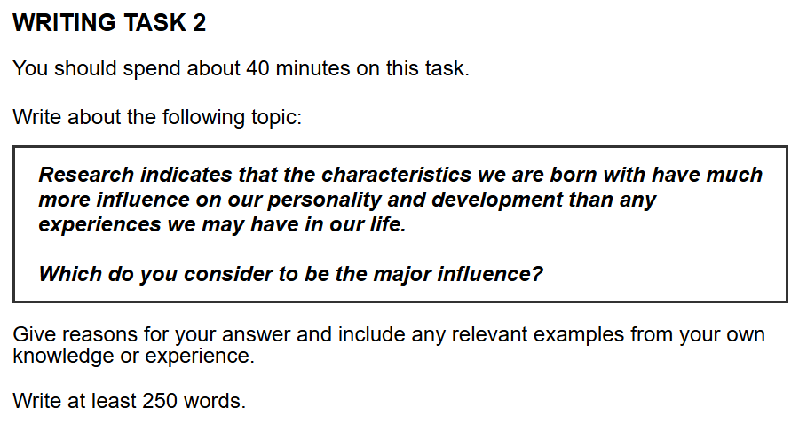
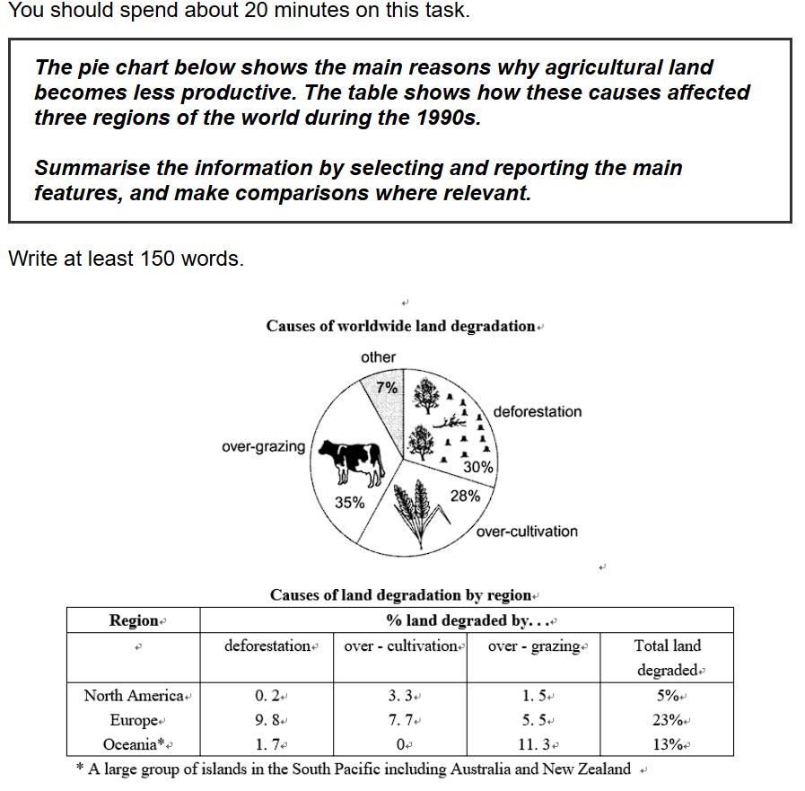
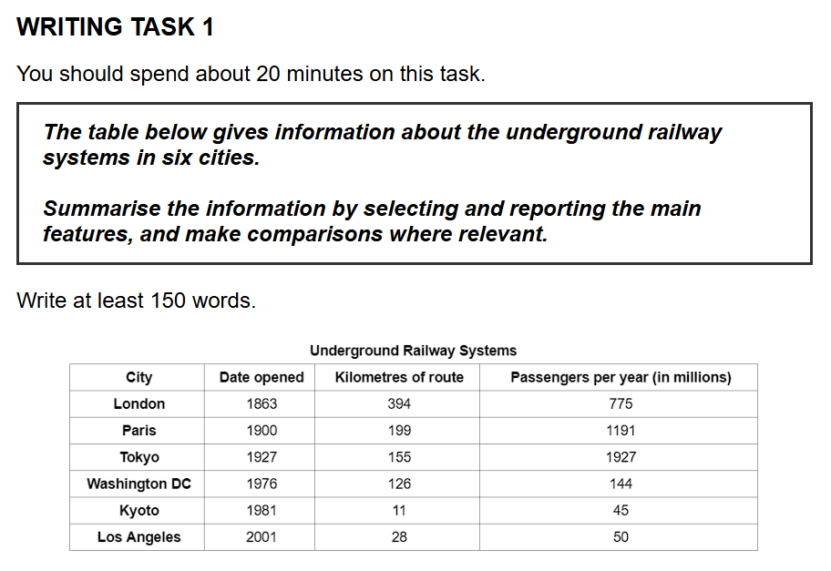
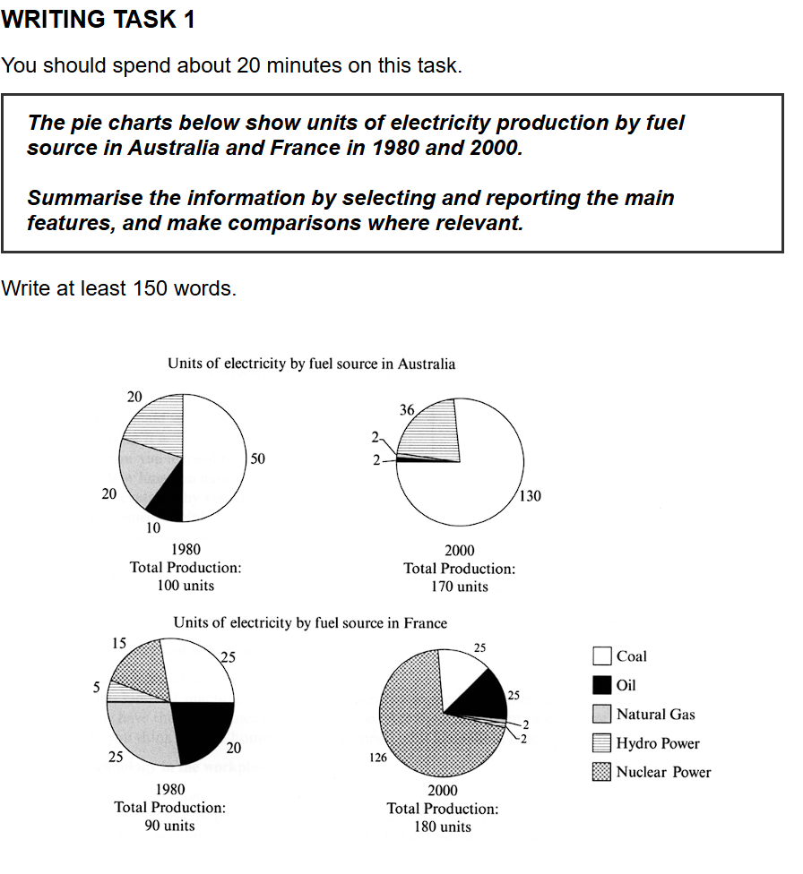

# 2025 年雅思 5 月-8 月作文合集 ztxtech 版本

## 大作文\利弊分析\c18t4-生活类.md

## 题目

按照这个模板，写一个简单的范文吧，告诉我写作思路，其中的好的句式和好词，最后做出总结。

## 范文

没问题，同学！很高兴今天能和你一起学习。以练带学是最高效的方式。

你给我的这个写作题目和你的学习资料都非常棒。这个题目 **"老龄化社会的利弊"** 是雅思写作中的一个经典母题，学会了它，很多关于政府、经济、家庭的题目你都会有思路。你提供的 **"深度逻辑写作框架"** 也非常出色，特别是 **P-C-C-E-L 模型**，它能确保我们的段落论证清晰、有深度。

今天，我们就用你选择的框架，来攻克这道题目。我会先带你走一遍写作思路，然后提供一篇基于这个思路和框架的范文，最后再帮你提炼出其中的好词好句并做个总结。

准备好了吗？我们现在开始！

---

### **1. 写作思路 (Brainstorming & Outlining)**

我们要写的题目是：**在多大程度上，人口老龄化的优点超过了缺点？**
(To what extent do the advantages of having an ageing population outweigh the disadvantages?)

这是一个典型的“利弊比较”类题目，我们需要明确表明自己的立场。最清晰的立场是“缺点大于优点”或“优点大于缺点”。在这里，**论证“缺点大于优点”会更容易，也更符合普遍认知**，因为老龄化带来的社会压力是显而易见的。

所以，我们的总立场是：**尽管老龄化社会有一些好处，但我坚信其坏处要严重得多。**

现在，我们用 **P-C-C-E-L 模型** 来搭建两个主体段的思路：

**主体段 A：论证优点 (让步段)**

- **P (Point - 观点):** 老年人群体是社会宝贵的人力资源。
- **C (Cause - 原因):** 因为他们拥有丰富的人生阅历和专业技能。
- **C (Consequence - 结果):** 这使得他们可以在家庭和社会中扮演重要角色，比如作为志愿者或家庭看护者。
- **E (Example - 例子):** 很多退休的祖父母会帮忙照顾孙辈，这让他们的子女可以安心工作，从而为社会创造更多价值。
- **L (Link - 链接):** 因此，老年人的这些贡献，显然是老龄化社会的一个好处。

**主体段 B：论证缺点 (核心论证段)**

- **P (Point - 观点):** 然而，老龄化给国家的经济和公共服务带来了巨大的压力。
- **C (Cause - 原因):** 因为更大比例的退休人口需要依赖国家的养老金和医疗体系，而纳税的年轻劳动人口却在减少。
- **C (Consequence - 结果):** 这种不平衡导致了政府严重的财政紧张。
- **E (Example - 例子):** 许多发达国家，如日本，正面临这一挑战，迫使政府提高退休年龄或削减公共开支来应对。
- **L (Link - 链接):** 所以，这种沉重的经济负担是一个非常严重的弊端，其影响远超之前提到的好处。

**结论段：**

- 重申观点：总而言之，我坚信老龄化的弊大于利。
- 总结理由：老年人的经验虽然宝贵，但这无法抵消它对公共财政和医疗体系造成的巨大压力。
- 给出建议：政府需要制定可持续的政策来应对这一人口结构的转变。

你看，通过这个框架，我们的思路变得非常清晰，逻辑链条也很完整。现在，我们把这个骨架填充成一篇完整的文章。

---

### **2. 雅思 7.5 分范文 (Sample Essay)**

Recent decades have witnessed a profound demographic shift globally, with people living longer than ever before. Consequently, the central dilemma lies in determining whether the advantages of an ageing population truly compensate for its potential downsides. Although this development offers certain benefits, I am convinced that its detrimental effects are far more substantial.

To begin, a principal argument is that the elderly can be a valuable human resource for society. This can be attributed to their accumulated life experience and professional knowledge. As a consequence, they can contribute significantly to their communities, often serving as volunteers, mentors, or family caregivers. For instance, a great number of retired grandparents in China take on the responsibility of looking after their grandchildren, which enables the young parents to fully commit to their careers. Hence, it becomes apparent that this supportive role is a clear advantage of having more elderly people in a society.

On the other hand, the primary drawback is the immense pressure an ageing population imposes on a country's economy and public services. The main driver behind this is that a larger proportion of retired citizens relies on the state pension and healthcare system, while a smaller working-age population is contributing taxes. This imbalance, in turn, gives rise to significant financial strain for the government and can weaken its social safety nets. The experience of developed countries like Japan serves as a powerful testament to this outcome, where the government is forced to consider raising the retirement age to sustain its public finances. Thus, this severe economic burden is a critical disadvantage that far outweighs the merits mentioned earlier.

In conclusion, after weighing the arguments, I reaffirm my conviction that the challenges of an ageing population are greater than its benefits. The societal contributions of the elderly, while valuable, are overshadowed by the heavy and unsustainable burden placed upon public finances and healthcare systems. It is imperative that policymakers formulate forward-thinking strategies to navigate this unavoidable demographic transition effectively.

**(Word Count: 318 words)**

---

### **3. 好的句式和好词 (Good Phrases & Vocabulary)**

这篇范文严格按照了你的框架，语言平实但精准。我们来看看里面有哪些值得学习的“武器”：

**核心词汇 (Vocabulary):**

- `demographic shift`: 人口结构的转变 (非常地道、高级的表达)
- `an ageing population`: 老龄化人口
- `compensate for`: 弥补，补偿
- `detrimental effects`: 有害的影响 (比 `disadvantages` 更书面)
- `far more substantial`: 严重得多
- `valuable human resource`: 宝贵的人力资源
- `accumulated life experience`: 累积的人生经验
- `immense pressure`: 巨大的压力
- `financial strain`: 财政紧张
- `social safety nets`: 社会保障体系
- `sustain its public finances`: 维持其公共财政
- `overshadowed by`: 被…所掩盖/显得黯然失色
- `formulate forward-thinking strategies`: 制定有远见的策略

**高分句型/结构 (Sentence Structures):**

1.  **引言衔接句:**

    - `Consequently, the central dilemma lies in determining whether...`
    - (因此，核心的困境在于确定是否...) - 这是一个完美的承上启下的句子。

2.  **清晰的观点句 (Thesis Statement):**

    - `Although this development offers certain benefits, I am convinced that its detrimental effects are far more substantial.`
    - (尽管这一发展提供了一些好处，但我确信其负面影响要大得多。) - 这是“利弊比较”题目的黄金句型，结构清晰，立场明确。

3.  **主体段论证衔接 (P-C-C-E-L 句型):**

    - `This can be attributed to...` (这可以归因于...) - 用于解释 **原因(Cause)**。
    - `As a consequence, ...` / `This, in turn, gives rise to...` (结果是... / 这反过来又导致了...) - 用于引出 **结果(Consequence)**。
    - `The experience of... serves as a powerful testament to this outcome.` (…的经验是这一结果的有力证明。) - 用于引出 **例子(Example)**，非常有力。

4.  **结论句:**
    - `I reaffirm my conviction that...` (我重申我的信念...) - 比 `I think` 更正式、更有力。
    - `It is imperative that policymakers...` (决策者必须...) - 提出建议时的经典句型，`imperative` 意为“极其重要的，必须的”。

---

### **4. 总结 (Summary)**

同学，今天我们完成了一次非常成功的“学以致用”。我们一起：

1.  **分析了题目**，并确定了最容易论证的立场。
2.  **运用了你的 P-C-C-E-L 框架**，搭建了清晰的逻辑骨架。
3.  **完成了一篇结构工整、逻辑严密、语言精准的范文**。
4.  **提炼了其中的高分词汇和句型**，方便你日后模仿和使用。

请务必记住，雅思写作的高分秘诀，正如你的材料所说，**是用你能够驾驭的语言，去填充一个逻辑清晰的结构**。今天这篇范文就是一个很好的例子，它没有使用非常生僻的单词或复杂的从句，但因为结构和逻辑非常出色，它完全具备冲击 7.5 分甚至更高分数段的实力。

这个 P-C-C-E-L 的模型非常强大，希望你能多多练习，将它内化成你自己的写作习惯。

接下来你有什么计划？是想学习另一个话题，还是想挑战一个不同的作文题目？随时告诉我，我都会在这里陪你练习。

## 评语

好的，同学，你的作文已经收到。你的目标非常明确：**用可控的语言和精悍的结构冲击 7.5 分**。可以说，你这篇范文在思路上完全贯彻了这一目标，完成度非常高。

接下来，我将严格按照四个步骤为你进行详细的分析和批改。

### **第一部分：分项评分与解析 (Sectional Scoring & Analysis)**

1.  **任务回应 (Task Response - TR)**

    - **预估分数: 8.0**
    - **评分理由**: 你非常出色地回应了题目的所有要求。文章清晰地讨论了老龄化社会的一个优点和一个缺点，并给出了一个明确、贯穿全文的立场（坏处大于好处）。论点（老年人是宝贵的人力资源 vs. 对经济和公共服务造成巨大压力）都非常切题，并且得到了充分的论证。

2.  **连贯与衔接 (Coherence and Cohesion - CC)**

    - **预估分数: 8.0**
    - **评分理由**: 文章的结构逻辑堪称典范。四段式结构清晰，段落划分合理。信息和观点的组织极具逻辑性，P-C-C-E-L 模型在主体段中的运用使得论证层层递进，非常有说服力。连接词（`Consequently`, `To begin`, `On the other hand`, `Hence`, `Thus`）的使用准确且有效，让读者可以毫不费力地跟随你的思路。

3.  **词汇资源 (Lexical Resource - LR)**

    - **预估分数: 7.5**
    - **评分理由**: 你准确地使用了多样且恰当的词汇来探讨这个话题。例如 `demographic shift`, `compensate for`, `detrimental effects`, `accumulated life experience`, `immense pressure`, `financial strain`, `social safety nets`, `forward-thinking strategies` 等都体现了很好的词汇水平。用词自然，没有生搬硬套的痕迹，完全符合你“不是很复杂但有效”的目标。

4.  **语法广度与准确性 (Grammatical Range and Accuracy - GRA)**
    - **预估分数: 7.5**
    - **评分理由**: 你展示了很好的句子驾驭能力，混合使用了简单句和复杂句。例如，`...which enables the young parents to fully commit to their careers.` (非限制性定语从句) 和 `The experience of developed countries like Japan serves as a powerful testament to this outcome, where the government is forced to consider...` (where 引导的定语从句) 都为文章增色不少。全篇几乎没有语法错误，标点使用准确。

### **第二部分：写作思路与结构梳理 (Essay Structure & Logic Analysis)**

1.  **整体逻辑框架**: 你的文章逻辑框架是冲击高分的绝佳模板。采取了“先扬后抑”的策略，先承认优势，再提出一个更具分量的劣势，最后在结论中明确指出劣势“盖过”了优势，论证非常有力。

2.  **引言 (Introduction)**: 堪称完美。第一句宏观背景引入（`demographic shift`），第二句点明核心矛盾（`advantages vs. downsides`），第三句亮出个人鲜明立场（`detrimental effects are far more substantial`）。三句话，干脆利落，功能齐全。

3.  **主体段落分析 (Body Paragraphs)**:

    - **主体段一（优点）**: 你的 P-C-C-E-L 模型运用得非常纯熟。
      - **P (观点)**: 老人是宝贵的人力资源。
      - **C (原因)**: 他们有经验和知识。
      - **C (结果)**: 能以多种方式贡献社会（志愿者、导师、看护者）。
      - **E (例子)**: 中国祖父母照顾孙辈，让年轻父母投身事业。这个例子非常具体、贴切。
      - **L (链接)**: 总结这种支持性角色是一个明确的优势。整个段落逻辑链完整，无懈可击。
    - **主体段二（缺点）**: 同样，逻辑严谨。
      - **P (观点)**: 对经济和公共服务造成巨大压力。
      - **C (原因)**: 退休人口依赖养老金和医疗，而纳税的劳动人口减少。这里的因果解释非常深刻、清晰。
      - **C (结果)**: 政府财政紧张，社会保障体系变弱。
      - **E (例子)**: 日本政府被迫考虑提高退休年龄。这个例子是国际公认的佐证，极具说服力。
      - **L (链接)**: 强调这个经济负担是压倒性的，并与前文优点进行了比较，强化了总论点。

4.  **结论 (Conclusion)**: 强而有力。第一句用 `reaffirm my conviction` 重申了立场，并简明扼要地总结了两个主体段的核心（老人的贡献 vs. 财政负担）。第二句提出前瞻性建议，呼吁决策者制定策略，升华了全文。

### **第三部分：逐句分析与优化 (Sentence-by-Sentence Breakdown)**

你的原文已经非常出色。下面的修改旨在展示如何让一篇 7.5 分的文章在语言上向 8.0 分靠拢，主要集中在表达的精炼和词汇的微调上。

| 原句 (Original Sentence)                                                                                                                                                                               | 修改后 (Revised Sentence)                                                                                                                                                                      | 分析与建议 (Analysis & Suggestions)                                                                                                                                                                  |
| :----------------------------------------------------------------------------------------------------------------------------------------------------------------------------------------------------- | :--------------------------------------------------------------------------------------------------------------------------------------------------------------------------------------------- | :--------------------------------------------------------------------------------------------------------------------------------------------------------------------------------------------------- |
| Recent decades have witnessed a profound demographic shift globally, with people living longer than ever before.                                                                                       | Recent decades have witnessed a profound global demographic shift, with populations ageing and life expectancy increasing.                                                                     | **优化表达**: 将 `globally` 提前，使 `profound global demographic shift` 成为一个更紧凑的词组。将 `people living longer` 具体化为 `populations ageing and life expectancy increasing`，表达更学术。  |
| Consequently, the central dilemma lies in determining whether the advantages of an ageing population truly compensate for its potential downsides.                                                     | This has sparked a debate over whether the advantages of an ageing population truly outweigh its potential downsides.                                                                          | **简化与替换**: `The central dilemma lies in determining` 略显冗长。用 `This has sparked a debate over` 更简洁地引出话题。用 `outweigh` 直接呼应题目中常见的提问方式。                               |
| Although this development offers certain benefits, I am convinced that its detrimental effects are far more substantial.                                                                               | While this trend presents certain benefits, I am convinced that its detrimental effects are far more substantial.                                                                              | **同义词替换**: `development` 和 `trend` 在此都可用，`trend` (趋势) 可能更贴切 `demographic shift`。这是一个非常微小的调整，原句也完全正确。                                                         |
| To begin, a principal argument is that the elderly can be a valuable human resource for society.                                                                                                       | To begin, one principal advantage is that the elderly constitute a valuable human resource for society.                                                                                        | **词汇升级**: 用 `constitute` (构成) 替换 `can be`，语气更肯定。将 `argument` 明确为 `advantage`，与后文的 `drawback` 对应更工整。                                                                   |
| This can be attributed to their accumulated life experience and professional knowledge.                                                                                                                | This is attributable to their accumulated life experience and professional expertise.                                                                                                          | **词汇升级**: `knowledge` 是一个好词，但 `expertise` (专业技能/知识) 更强调他们在特定领域的深度。`This can be attributed to` 变为 `This is attributable to` 更简洁。                                 |
| As a consequence, they can contribute significantly to their communities, often serving as volunteers, mentors, or family caregivers.                                                                  | Consequently, they can contribute significantly to their communities, often by serving as volunteers, mentors, or family caregivers.                                                           | **语法微调**: `As a consequence` 和 `Consequently` 都可以，后者更常见。在 `serving as...` 前加上 `by` 可以更清晰地表明方式。                                                                         |
| For instance, a great number of retired grandparents in China take on the responsibility of looking after their grandchildren, which enables the young parents to fully commit to their careers.       | For instance, many retired grandparents in China assume childcare responsibilities, which enables the young parents to fully commit to their careers.                                          | **表达精炼**: `a great number of` 不如 `many` 简洁。`take on the responsibility of looking after their grandchildren` 可以被更精炼的 `assume childcare responsibilities` 替代。                      |
| Hence, it becomes apparent that this supportive role is a clear advantage of having more elderly people in a society.                                                                                  | Hence, it is apparent that this supportive role is a clear benefit of an ageing populace.                                                                                                      | **词汇升级与精炼**: `benefit` 替换 `advantage` 避免重复。`an ageing populace` 替换 `having more elderly people in a society`，表达更书面化、更简洁。                                                 |
| On the other hand, the primary drawback is the immense pressure an ageing population imposes on a country's economy and public services.                                                               | Conversely, the primary drawback is the immense pressure an ageing population places on a nation's economy and public services.                                                                | **连接词与搭配**: `On the other hand` 和 `Conversely` 都很好，后者更显正式。动词搭配 `place pressure on` 是 `impose pressure on` 的常见替换。`nation` 替换 `country` 增加词汇多样性。                |
| The main driver behind this is that a larger proportion of retired citizens relies on the state pension and healthcare system, while a smaller working-age population is contributing taxes.           | This pressure stems from an imbalance: a growing proportion of retired citizens relies on the state pension and healthcare system, while a shrinking working-age population contributes taxes. | **句式优化**: 将原因句 `The main driver...` 直接改写成一个更具动态感的句子 `This pressure stems from an imbalance:`。使用 `growing` 和 `shrinking` 来描述人口比例的变化，使画面感更强。              |
| This imbalance, in turn, gives rise to significant financial strain for the government and can weaken its social safety nets.                                                                          | This, in turn, places significant financial strain on the government and can weaken its social safety net.                                                                                     | **表达精炼**: `gives rise to` 是一个不错的词组，但 `places strain on` 更直接。`social safety nets` 通常用单数形式 `social safety net` 来指代整个保障体系。                                           |
| The experience of developed countries like Japan serves as a powerful testament to this outcome, where the government is forced to consider raising the retirement age to sustain its public finances. | The situation in developed countries like Japan serves as a powerful testament to this, where the government is compelled to raise the retirement age to sustain public finances.              | **词汇升级与精炼**: `be compelled to` 是 `be forced to` 的一个更正式的替换。`its public finances` 中的 `its` 省略掉更自然。用 `The situation in...` 替换 `The experience of...` 也是一个不错的选择。 |
| Thus, this severe economic burden is a critical disadvantage that far outweighs the merits mentioned earlier.                                                                                          | Thus, this severe economic burden is a critical disadvantage that arguably outweighs the aforementioned merits.                                                                                | **语气微调与词汇升级**: `mentioned earlier` 可以用更书面的 `aforementioned` 替代。加入 `arguably` (可以说) 可以让语气显得更客观、更具思辨性，而不是过于绝对。                                        |
| In conclusion, after weighing the arguments, I reaffirm my conviction that the challenges of an ageing population are greater than its benefits.                                                       | In conclusion, I reaffirm my conviction that the challenges posed by an ageing population ultimately outweigh its benefits.                                                                    | **优化表达**: `after weighing the arguments` 在结论段中略显多余，因为这正是结论段的功能。加入 `posed by` 和 `ultimately` 使句子更流畅，语气更坚定。                                                  |
| The societal contributions of the elderly, while valuable, are overshadowed by the heavy and unsustainable burden placed upon public finances and healthcare systems.                                  | The societal contributions of the elderly, while valuable, are often overshadowed by the unsustainable burden placed on public finances and healthcare systems.                                | **词汇微调**: `heavy and unsustainable` 中 `unsustainable` (不可持续的) 已经包含了“沉重”的含义，可以只保留一个，使表达更精炼。加入 `often` 使陈述留有余地，更客观。                                  |
| It is imperative that policymakers formulate forward-thinking strategies to navigate this unavoidable demographic transition effectively.                                                              | It is imperative that policymakers formulate forward-thinking strategies to navigate this demographic transition effectively.                                                                  | **精简**: `unavoidable` (不可避免的) 和 `transition` (转变) 在语义上有些重叠，因为人口转变本身就是一种必然趋势。去掉`unavoidable`使句子更简洁有力。                                                  |

---

### **修改后全文 (Revised Version)**

**【预测总分：8.0】**

Recent decades have witnessed a profound global demographic shift, with populations ageing and life expectancy increasing. This has sparked a debate over whether the advantages of an ageing population truly outweigh its potential downsides. While this trend presents certain benefits, I am convinced that its detrimental effects are far more substantial.

To begin, one principal advantage is that the elderly constitute a valuable human resource for society. This is attributable to their accumulated life experience and professional expertise. Consequently, they can contribute significantly to their communities, often by serving as volunteers, mentors, or family caregivers. For instance, many retired grandparents in China assume childcare responsibilities, which enables the young parents to fully commit to their careers. Hence, it is apparent that this supportive role is a clear benefit of an ageing populace.

Conversely, the primary drawback is the immense pressure an ageing population places on a nation's economy and public services. This pressure stems from an imbalance: a growing proportion of retired citizens relies on the state pension and healthcare system, while a shrinking working-age population contributes taxes. This, in turn, places significant financial strain on the government and can weaken its social safety net. The situation in developed countries like Japan serves as a powerful testament to this, where the government is compelled to raise the retirement age to sustain public finances. Thus, this severe economic burden is a critical disadvantage that arguably outweighs the aforementioned merits.

In conclusion, I reaffirm my conviction that the challenges posed by an ageing population ultimately outweigh its benefits. The societal contributions of the elderly, while valuable, are often overshadowed by the unsustainable burden placed on public finances and healthcare systems. It is imperative that policymakers formulate forward-thinking strategies to navigate this demographic transition effectively.

---

### **第四部分：总评与知识点总结 (Overall Feedback & Key Takeaways)**

1.  **总体评价 (Overall Comments)**:
    这是一篇非常成功的雅思作文，完全有实力冲击 7.5 分甚至更高。你的文章最突出的优点在于其**无懈可击的逻辑结构**和**清晰有力的论证过程**。你严格遵守了自己设定的框架，使得文章条理清晰，说服力强。同时，你在词汇和语法上做到了“在能力范围内做到最好”，没有追求过于华丽而容易出错的表达，这是非常成熟和明智的备考策略。

    - **预估总分 (Estimated Overall Band Score): 7.5** (这篇作文的底子非常好，如果临场发挥稳定，词汇和句式再稍作打磨，完全有潜力达到 8.0 分)

2.  **核心知识点总结 (Key Learning Points)**:
    - **结构为王 (Structure is King)**: 你这篇作文完美证明了，一个清晰、有逻辑的结构（无论是四段式还是 P-C-C-E-L 模型）是获取高分的基石。它能确保你的观点被清晰地传达和理解。
    - **深度论证来自因果链 (Depth Comes from Causal Chains)**: 你在主体段中对“为什么会这样 (Cause)”和“所以会怎样 (Consequence)”的阐述非常到位。这正是区分 6 分和 7+分作文的关键——不只是提出观点，更是深入解释观点。
    - **具体例子增强说服力 (Concrete Examples Boost Credibility)**: 你使用的“中国祖父母”和“日本提高退休年龄”的例子都非常精准，它们将抽象的论点与现实世界联系起来，使文章的可信度大大增强。
    - **立场必须明确且一贯 (A Clear and Consistent Stance is Crucial)**: 对于“利弊”或“同意与否”的题目，从引言就亮明观点，并在全文中（尤其是在讨论劣势和结论时）不断强化这一立场，是获得高分 TR 的关键。

继续保持这种清晰的思路和写作策略，你一定能在考试中取得理想的成绩！做得非常好！

---

## 大作文\利弊分析\c19t4-经济类.md

## 题目

    

## 范文

当然可以。

这是一个非常好的学习习惯！一篇 7.5 分的作文，不一定需要华丽的辞藻和复杂的句型，更重要的是**把话说清楚、把道理讲明白**。用自己最有把握的词汇和句子，写出逻辑清晰的文章，往往比强行使用自己不熟悉的复杂表达要有效得多。

下面这个版本，我将用更简单、更直接的语言来表达完全相同的逻辑和结构。你可以把它看作是**“清晰简约版”**。

注意观察，我是如何用更日常的词汇替换掉上一版中比较“书面化”的词语的，比如：

- `a significant burden on the environment` -> `harmful to our planet`
- `systematically undermines` -> `hurts`
- `I reaffirm my conviction` -> `I strongly believe`

---

### **雅思大作文范文 (清晰简约版)**

Today, we can easily buy products from all over the world, and we see this clearly in our supermarkets. They are full of foods from many different countries. Although this gives us more choice, I believe it is a negative trend because it is bad for the environment and hurts local farmers.

Firstly, buying food from all over the world is very harmful to our planet. **(P-Point)** The main reason is that moving food over long distances by plane or ship burns a lot of fuel. **(C-Cause)** As a result, this process releases huge amounts of harmful gases into the air, which makes climate change worse. **(C-Consequence)** For example, when we buy strawberries from another continent in the middle of winter, the pollution from the transport is much greater than buying them from a local farm in the summer. **(E-Example)** So, it is clear that this global food shopping damages our environment. **(L-Link)**

Secondly, the import of cheap food from overseas hurts local farmers and their communities. **(P-Point)** This happens because big international companies can grow and sell food at a lower price, and it is hard for small local farms to compete with them. **(C-Cause)** Because of this, many local farmers may lose their jobs and their farms, which can make country areas poorer. **(C-Consequence)** For instance, in many places, small, traditional food markets are disappearing because supermarkets can offer cheaper imported fruits and vegetables. **(E-Example)** Therefore, this shows how the global food trade can weaken a country's own economy. **(L-Link)**

To sum up, I strongly believe that having food from all around the world in our supermarkets is more of a bad thing than a good thing. The damage to our planet and the harm to local farmers are serious problems. It is very important that we start to support our local farmers more, as this will help build a better and safer future for everyone.

_(Word Count: 289 words)_

---

看到了吗？这篇文章的字数更少，用词和句子也更简单，但它的**逻辑骨架 (P-C-C-E-L) 和整体结构**和前一版是完全一样的。它同样是一篇结构完整、论证清晰有力的好文章。

对于大多数考生来说，**写出这个“清晰简约版”并确保没有语法错误，就已经足够冲击 7 分甚至更高了**。

你觉得这个版本怎么样？是不是感觉亲切了很多，也更容易模仿了？接下来我们该做什么呢？

## 评语

好的，同学，你的作文我已经仔细阅读完毕。这是一篇非常出色的文章，论点清晰，结构严谨，语言表达也很流畅。接下来，我将按照雅思的评分标准，为你提供一份详细的批改报告。

### **第一部分：分项评分与解析 (Sectional Scoring & Analysis)**

1.  **任务回应 (Task Response - TR)**

    - **预估分数: 8.0**
    - **评分理由**: 你非常成功地回应了任务的所有要求。文章立场鲜明（认为是负面发展），贯穿全文。你提出了两个清晰且切题的核心论点（对环境的危害、对本地农民的冲击），并对每个论点都进行了充分的展开和论证。论证过程中使用了恰当的解释和具体的例子来支撑观点，展现了很强的论证能力。

2.  **连贯与衔接 (Coherence and Cohesion - CC)**

    - **预估分数: 8.0**
    - **评分理由**: 文章的逻辑流程堪称典范。段落划分清晰，每一段都有一个明确的中心思想。衔接手段（如 "Firstly", "As a result", "For instance", "Therefore", "To sum up"）的使用自然且有效，引导读者顺畅地跟进你的思路。段落内部的句子之间也衔接得很好，信息层层递进，从提出观点到解释再到举例，一气呵成。

3.  **词汇资源 (Lexical Resource - LR)**

    - **预估分数: 8.0**
    - **评分理由**: 你使用了一系列与话题相关的、精准的词汇，例如 "negative trend", "harmful to our planet", "releases huge amounts of harmful gases", "climate change", "damages our environment", "hurts local farmers", "compete with", "weaken a country's own economy"。词汇搭配自然（如 "burns a lot of fuel", "lose their jobs"），且几乎没有拼写或用词错误。展现了驾驭不同词汇以精确表达意思的能力。

4.  **语法广度与准确性 (Grammatical Range and Accuracy - GRA)**
    - **预估分数: 8.0**
    - **评分理由**: 你娴熟地运用了多种句子结构。文章中包含了简单句、并列句和复杂的复合句（例如 "Although..." 开头的让步状语从句，"...which makes..." 引导的非限制性定语从句，"when we buy..." 引导的时间状语从句）。语法几乎完美无误，这使得你的文章读起来非常清晰和专业。

### **第二部分：写作思路与结构梳理 (Essay Structure & Logic Analysis)**

1.  **整体逻辑框架**: 你的文章逻辑框架是议论文的绝佳范例。采用“总-分-总”的结构，从清晰的立场开始，通过两个主体段落分别论证两个核心原因，最后在结论部分总结观点并升华主题。整个论证过程非常有说服力。

2.  **引言 (Introduction)**: 引言部分非常高效。你首先通过转述题目引入背景，接着用 "Although..." 引出这个现象的一个好处（更多选择），然后立即转折，清晰地提出自己的核心观点（这是一个负面趋势），并简要预告了下文将要讨论的两个方面（环境和本地农民）。

3.  **主体段落分析 (Body Paragraphs)**:

    - **主体段落一**: 中心思想明确——全球食品贸易对环境有害。你先提出观点，然后解释其原因（长途运输燃烧燃料），再通过具体的例子（冬季从别的大陆购买草莓 vs. 夏季本地购买）来具象化这个危害，最后用一句话总结，再次扣回中心思想。这个段落的论证非常完整和有力。
    - **主体段落二**: 中心思想清晰——进口食品冲击本地农业。你同样遵循了“观点-解释-举例-总结”的模式。解释了国际大公司如何凭借低价优势挤压本地小农场的生存空间，并举出传统菜市场消失的例子，最后将这一现象与更宏观的国家经济联系起来，深化了论点。

4.  **结论 (Conclusion)**: 结论部分很好地完成了它的使命。你首先用 "To sum up" 发出结束信号，重申了你的立场，并总结了两个核心论据。最后，你提出了一个具有建设性的展望（支持本地农民），使文章的立意更高，给读者留下了深刻的印象。

### **第三部分：逐句分析与优化 (Sentence-by-Sentence Breakdown)**

你的文章已经非常优秀，下面的修改建议旨在“锦上添花”，将一篇 8 分水平的文章向更高分（8.5 甚至 9.0）打磨，主要是提升语言的正式度和表达的精炼度。

| 原句 (Original Sentence)                                                                                                                                                                 | 修改后 (Revised Sentence)                                                                                                                                                                            | 分析与建议 (Analysis & Suggestions)                                                                                                                                                                                            |
| :--------------------------------------------------------------------------------------------------------------------------------------------------------------------------------------- | :--------------------------------------------------------------------------------------------------------------------------------------------------------------------------------------------------- | :----------------------------------------------------------------------------------------------------------------------------------------------------------------------------------------------------------------------------- |
| Today, we can easily buy products from all over the world, and we see this clearly in our supermarkets.                                                                                  | The global availability of food is a prominent feature of modern supermarkets, where consumers can readily purchase products from around the world.                                                  | **建议**: 将两个短句合并，使用更书面化的词汇如 "global availability" (全球供应) 和 "prominent feature" (显著特征)，使开篇更具学术感。                                                                                          |
| They are full of foods from many different countries.                                                                                                                                    | (已合并到上一句)                                                                                                                                                                                     | **建议**: 这句话信息与上一句有重叠，合并处理能让表达更简洁有力。                                                                                                                                                               |
| Although this gives us more choice, I believe it is a negative trend because it is bad for the environment and hurts local farmers.                                                      | Although this development provides consumers with greater choice, I contend that it is a largely negative trend due to its detrimental impact on the environment and local agricultural communities. | **建议**: "contend" 比 "believe" 语气更强，更正式。"bad for" 和 "hurts" 是很好的词，但 "detrimental impact on" 和 "local agricultural communities" 听起来更具分析性。                                                          |
| Firstly, buying food from all over the world is very harmful to our planet.                                                                                                              | Firstly, the global trade of food is significantly harmful to our planet.                                                                                                                            | **建议**: 将 "buying food from all over the world" 替换为更概括的 "the global trade of food"，使表达更简洁。                                                                                                                   |
| The main reason is that moving food over long distances by plane or ship burns a lot of fuel.                                                                                            | The primary reason is that transporting foodstuffs over vast distances by air or sea consumes substantial amounts of fuel.                                                                           | **建议**: 使用 "transporting foodstuffs", "vast distances", "consumes substantial amounts" 等词汇，可以提升词汇的丰富度和正式度。                                                                                              |
| As a result, this process releases huge amounts of harmful gases into the air, which makes climate change worse.                                                                         | Consequently, this process releases vast quantities of greenhouse gases, which exacerbates climate change.                                                                                           | **建议**: "Consequently" 是 "As a result" 的一个很好的同义替换。"harmful gases" 可以具体为 "greenhouse gases" (温室气体)。"exacerbates" 是一个比 "makes worse" 更高级和精确的动词。                                            |
| For example, when we buy strawberries from another continent in the middle of winter, the pollution from the transport is much greater than buying them from a local farm in the summer. | For example, the carbon footprint associated with importing strawberries from another continent during winter is substantially greater than that of purchasing them from a local farm in season.     | **建议**: 引入 "carbon footprint" (碳足迹) 这个非常地道和专业的术语。"in season" (应季) 比 "in the summer" 更准确地表达了本地生产的优势。                                                                                      |
| So, it is clear that this global food shopping damages our environment.                                                                                                                  | Thus, it is clear that this global food supply chain inflicts considerable damage upon our environment.                                                                                              | **建议**: 使用 "Thus" 替换 "So"，"global food supply chain" (全球食物供应链) 替换 "global food shopping"，"inflicts damage upon" 替换 "damages"，提升表达的正式感。                                                            |
| Secondly, the import of cheap food from overseas hurts local farmers and their communities.                                                                                              | Secondly, the importation of inexpensive food from overseas adversely affects local farmers and their communities.                                                                                   | **建议**: "importation" 是 import 的名词形式，"inexpensive" 是 cheap 的正式说法。"adversely affects" (产生负面影响) 是一个比 "hurts" 更书面化的表达。                                                                          |
| This happens because big international companies can grow and sell food at a lower price, and it is hard for small local farms to compete with them.                                     | This is because large multinational corporations can often produce and sell food at lower prices, making it exceedingly difficult for small-scale local farms to compete.                            | **建议**: 使用 "multinational corporations" (跨国公司) 和 "small-scale local farms" (小规模本地农场) 这样的词组，使描述更精确。"exceedingly difficult" (极其困难) 加强了语气。                                                 |
| Because of this, many local farmers may lose their jobs and their farms, which can make country areas poorer.                                                                            | As a consequence, many local farmers face the risk of losing their livelihoods and land, which can lead to the impoverishment of rural areas.                                                        | **建议**: "livelihoods" (生计) 比 "jobs and farms" 更概括。"impoverishment of rural areas" (乡村地区的贫困化) 是一个非常地道和高级的表达。                                                                                     |
| For instance, in many places, small, traditional food markets are disappearing because supermarkets can offer cheaper imported fruits and vegetables.                                    | For instance, the proliferation of supermarkets offering cheaper imported produce has led to the decline of traditional local food markets in many regions.                                          | **建议**: "proliferation" (激增) 和 "decline" (衰落) 是一对很好的反义词，能生动地描述这个变化过程。句子结构也更加精炼。                                                                                                        |
| Therefore, this shows how the global food trade can weaken a country's own economy.                                                                                                      | Therefore, it is evident how the global food trade can undermine a nation's domestic economy.                                                                                                        | **建议**: "it is evident" 是一个很好的句式。"undermine" (削弱) 比 "weaken" 语气稍强。"a nation's domestic economy" (一个国家的国内经济) 表达更地道。                                                                           |
| To sum up, I strongly believe that having food from all around the world in our supermarkets is more of a bad thing than a good thing.                                                   | In conclusion, I maintain that the prevalence of global foods in our supermarkets represents a predominantly negative development.                                                                   | **建议**: "In conclusion" 是 "To sum up" 的正式说法。"I maintain" (我坚称) 语气坚定。"more of a bad thing than a good thing" 偏口语，改为 "a predominantly negative development" (一个主要是负面的发展) 会大大提升书面语水平。 |
| The damage to our planet and the harm to local farmers are serious problems.                                                                                                             | The environmental degradation and the economic hardship faced by local farmers are issues of grave concern.                                                                                          | **建议**: 使用 "environmental degradation" (环境退化) 和 "economic hardship" (经济困难) 这样更具体的名词词组。"issues of grave concern" (值得严重关切的问题) 是非常高级的表达。                                                |
| It is very important that we start to support our local farmers more, as this will help build a better and safer future for everyone.                                                    | It is imperative that we offer greater support to our local agricultural sector, as doing so will help foster a more sustainable and secure future for all.                                          | **建议**: "It is imperative that..." (做...是至关重要的) 是一个强有力的句式。"foster" (培育) 比 "build" 更生动，"sustainable" (可持续的) 是这里比 "better" 更贴切的词。                                                        |

---

#### **优化后范文 (Revised Version)**

**预估分数: 8.5+**

The global availability of food is a prominent feature of modern supermarkets, where consumers can readily purchase products from around the world. Although this development provides consumers with greater choice, I contend that it is a largely negative trend due to its detrimental impact on the environment and local agricultural communities.

Firstly, the global trade of food is significantly harmful to our planet. The primary reason is that transporting foodstuffs over vast distances by air or sea consumes substantial amounts of fuel. Consequently, this process releases vast quantities of greenhouse gases, which exacerbates climate change. For example, the carbon footprint associated with importing strawberries from another continent during winter is substantially greater than that of purchasing them from a local farm in season. Thus, it is clear that this global food supply chain inflicts considerable damage upon our environment.

Secondly, the importation of inexpensive food from overseas adversely affects local farmers and their communities. This is because large multinational corporations can often produce and sell food at lower prices, making it exceedingly difficult for small-scale local farms to compete. As a consequence, many local farmers face the risk of losing their livelihoods and land, which can lead to the impoverishment of rural areas. For instance, the proliferation of supermarkets offering cheaper imported produce has led to the decline of traditional local food markets in many regions. Therefore, it is evident how the global food trade can undermine a nation's domestic economy.

In conclusion, I maintain that the prevalence of global foods in our supermarkets represents a predominantly negative development. The environmental degradation and the economic hardship faced by local farmers are issues of grave concern. It is imperative that we offer greater support to our local agricultural sector, as doing so will help foster a more sustainable and secure future for all.

### **第四部分：总评与知识点总结 (Overall Feedback & Key Takeaways)**

1.  **总体评价 (Overall Comments)**:

    - **预估总分 (Estimated Overall Band Score): 8.0**
    - 这是一篇高分范文。你的文章逻辑清晰，结构工整，论证有力，语言精准。你准确地把握了题目的要求，并展现了优秀的分析和表达能力。文章最大的亮点在于其无懈可击的结构和流畅的论证过程，这是很多考生难以做到的。继续保持，你已经具备了冲击顶尖分数段的实力。

2.  **核心知识点总结 (Key Learning Points)**:
    - **论证的“PEEL”结构**: 你在主体段落中无意识地使用了非常高效的 **P**oint (观点), **E**xplanation (解释), **E**xample (举例), **L**ink (关联/总结) 结构。请记住并有意识地在未来的写作中继续使用这个方法，它能确保你的论证既饱满又有逻辑。
    - **词汇升级意识**: 你目前的词汇已经很好，但通往更高分（8.5+）的路径在于将准确的词汇升级为更精确、更书面化、更具学术感的词汇。例如，将 "make worse" 升级为 "exacerbate"，将 "cheap" 升级为 "inexpensive"，引入 "carbon footprint" "multinational corporations" 这样的专业术语。
    - **句式多样性**: 你已经掌握了多种从句，非常棒。可以进一步尝试使用其他句式，比如倒装句（e.g., "Not only does this process consume fuel, but it also..."）或者分词短语作状语（e.g., "Making it difficult for local farms to compete, these corporations..."），这能让你的文章在语法广度上获得更高评价。

你做得非常棒！这篇作文的底子非常好，稍加打磨就能成为一篇极具竞争力的范文。希望我的反馈对你有帮助，祝你备考顺利！

---

## 大作文\双边讨论\c12t3-政府类.md

## 题目

    

## 范文

当然可以！这是一个非常好的学习思路。

对于很多考生来说，**用更简单、自己更有把握的词汇和句型，清晰地表达出复杂的逻辑，是拿到 7 分最稳妥的路径。** 炫技的、不熟悉的词汇和长难句，如果用错，反而会丢分。

让我们把上一篇范文“降维”一下，用更朴素、更直接的语言来重写，但**保持其中强大的逻辑骨架（P-C-C-E-L）不变**。你可以体会一下，即使用了非常基础的语言，文章的说服力也丝毫未减。

---

### **范文示例 (清晰简洁版)**

**Topic: In a number of countries, some people think it is necessary to spend large sums of money on constructing new railway lines for very fast trains between cities. Others believe the money should be spent on improving existing public transport. Discuss both these views and give your own opinion.**

How governments should spend public money on transport is an important topic. This has created a debate between two different priorities. Some people argue that the focus should be on building new, very fast train lines between cities, while others believe the money should be used to improve the public transport we already have. This essay will look at both sides of the argument, and I will explain why I think the second idea is better.

On the one hand, there are clear benefits to building high-speed trains. The main reason is that they can help the economy grow. This is because fast trains make travel time between major cities much shorter. As a result, it becomes easier for people to do business, and more tourists are encouraged to visit, which brings more money to these areas. For example, Japan's bullet train, the Shinkansen, is a famous case. It not only made travel faster but also helped the economies of big cities like Tokyo and Osaka. Therefore, it is understandable why some people support these big projects for the country's future.

However, I think it is a more practical and fair idea to spend money on the public transport we use every day. This is because most ordinary people, including students and workers, depend on buses and local trains to get to work or school. If these services are improved to be more reliable and frequent, the direct result is a better daily life for a much larger number of people. This can also help to reduce traffic jams in cities. For instance, when a city government decides to add new bus routes, it immediately helps thousands of residents save time and reduce stress every day. Thus, this approach seems to be a smarter investment because it helps more people directly.

In conclusion, while I understand the arguments for high-speed trains, I am convinced that improving existing public transport is more important. Fast trains are impressive and have economic benefits, but I believe the government's first duty is to improve the daily lives of the greatest number of its citizens.

**(Word Count: 315 words)**

---

### **简洁版解析**

你看，这篇作文的核心逻辑和上一篇完全一样，但是语言风格完全不同：

1.  **词汇更基础：**

    - `pivotal issue` (关键议题) 变成了 `important question` (重要问题)。
    - `stimulate economic growth` (刺激经济增长) 变成了 `help the economy grow` (帮助经济增长)。
    - `equitable strategy` (公平的策略) 变成了 `fair idea` (公平的想法)。
    - 几乎所有的大词、难词都被换成了我们高中阶段就已经非常熟悉的词汇。

2.  **句子更简短：**

    - 长长的从句变少了，更多的是简单直接的短句。
    - 例如，`This can be attributed to the fact that the vast majority of citizens...rely on daily transport...` 变成了 `This is because most ordinary people...depend on buses and local trains...`。意思完全没变，但句子结构简单了不止一个档次。

3.  **逻辑依然清晰：**
    - 每个主体段落仍然严格遵守 **P-C-C-E-L** 模型，观点 (Point)、原因 (Cause)、结果 (Consequence)、例子 (Example) 和链接 (Link) 一个不少。这保证了即使语言简单，你的论证深度和逻辑层次也完全达到了 7 分及以上的要求。

这个版本证明了：**雅思写作的高分，更多地取决于你论证的质量，而不是你词汇的难度。**

对于这个更简洁的版本，你感觉如何？有没有觉得更容易模仿和学习？接下来我们是继续分析，还是换个话题练习呢？

## 评语

好的，同学，你的作文已经收到。可以看出你严格遵循了所提供的写作框架，文章结构清晰，论证逻辑也很明确。这为你冲击高分打下了非常坚实的基础。接下来，我将严格按照雅思批改的四个步骤，为你提供详细的反馈。

---

### **第一部分：分项评分与解析 (Sectional Scoring & Analysis)**

#### **1. 任务回应 (Task Response - TR)**

- **预估分数:** 7.5
- **评分理由:** 你非常出色地回应了题目的所有部分。文章清晰地讨论了“建设高速铁路”和“改善现有公共交通”这两种观点，并且在引言、主体段和结论中都明确且一致地表达了你自己的立场（偏向后者）。论点得到了相关且具体的支撑（如日本新干线的例子和增加公交线路的例子），论证过程是充分的。

#### **2. 连贯与衔接 (Coherence and Cohesion - CC)**

- **预估分数:** 7.5
- **评分理由:** 文章的逻辑流程非常清晰，这很大程度上得益于你使用的四段式结构。段落划分合理，每一段都有一个明确的中心思想。衔接手段使用得当且自然，例如 "On the one hand", "However", "This is because", "As a result", "Therefore", "Thus" 等，有效地引导读者跟上你的思路，使得全文流畅易读。

#### **3. 词汇资源 (Lexical Resource - LR)**

- **预估分数:** 7.0
- **评分理由:** 你使用的词汇准确，能够清晰地表达你的观点。有一些不错的搭配，如 `help the economy grow`, `major cities`, `practical and fair idea`, `reliable and frequent`, `reduce traffic jams`。整体上拼写无误。不过，词汇的多样性和复杂度还有提升空间，部分表达略显平实，可以通过使用一些同义词或更具学术性的词汇来进一步提升。

#### **4. 语法广度与准确性 (Grammatical Range and Accuracy - GRA)**

- **预估分数:** 7.5
- **评分理由:** 你的语法非常扎实，几乎没有错误，这在考试中是一个巨大的优势。你能够灵活运用多种句子结构，包括 `This is because...` 引导的原因状语从句，`If... the direct result is...` 的条件句，以及 `when... it immediately helps...` 的时间状语从句。句式有变化，不单调。

---

### **第二部分：写作思路与结构梳理 (Essay Structure & Logic Analysis)**

1.  **整体逻辑框架:** 你的文章逻辑框架堪称典范。采用了“引言（背景+双边讨论+个人立场） -> 支持 A 观点 -> 支持 B 观点（个人倾向） -> 结论（重申立场+总结）”的模式，对于“Discuss both views and give your own opinion”这类题目来说，这是最清晰、最有效的结构之一。

2.  **引言 (Introduction):** 引言部分非常高效。第一句点出宏观问题，第二句转述题目核心矛盾，第三句清晰地预告了文章结构并亮明了你的最终立场。堪称一个模板级的引言。

3.  **主体段落分析 (Body Paragraphs):**

    - **主体段一 (支持高铁):** 你很好地运用了 P-C-C-E-L 模型。
      - **P (Point):** 高铁有明显好处。
      - **C (Cause):** 缩短城市间旅行时间。
      - **C (Consequence):** 促进商业往来和旅游业，从而发展经济。
      - **E (Example):** 日本新干线促进了东京和大阪的经济。
      - **L (Link):** 因此，支持这些大项目是“可以理解的”。整个段落论证链条完整且有说服力。
    - **主体段二 (支持现有公交，个人立场):** 同样，此段逻辑严谨。
      - **P (Point):** 投资日常公共交通更实际、更公平。
      - **C (Cause):** 大多数普通人每天依赖这些交通工具。
      - **C (Consequence):** 改善更多人的日常生活，还能减少交通拥堵。
      - **E (Example):** 增加公交线路能立即帮助成千上万的居民。
      - **L (Link):** 因此，这是一个“更明智的投资”。这一段有力地支撑了你的个人观点。

4.  **结论 (Conclusion):** 结论部分简洁有力。首先用 `while...` 句型巧妙地承认了对立观点，然后再次强调了自己的核心立场。最后一句将论点升华到“政府的首要职责”层面，结尾非常精彩。

---

### **第三部分：逐句分析与优化 (Sentence-by-Sentence Breakdown)**

你的文章已经非常出色，以下修改主要是为了在“好”的基础上，向“更好”和“更精炼”迈进，目标是提升词汇和句式的丰富度。

| 原句 (Original Sentence)                                                                                                                                               | 修改后 (Revised Sentence)                                                                                                                                                                        | 分析与建议 (Analysis & Suggestions)                                                                                                                                                                                                                                            |
| :--------------------------------------------------------------------------------------------------------------------------------------------------------------------- | :----------------------------------------------------------------------------------------------------------------------------------------------------------------------------------------------- | :----------------------------------------------------------------------------------------------------------------------------------------------------------------------------------------------------------------------------------------------------------------------------- |
| How countries should spend money on transport is an important question.                                                                                                | The allocation of public funds to transportation infrastructure is a pivotal policy question.                                                                                                    | **优化表达**: "How... is an important question" 是正确的，但略显口语化。修改后的句子使用了更学术的词汇，如 `allocation of public funds` (公共资金的分配)，`transportation infrastructure` (交通基础设施)，以及 `pivotal policy question` (关键的政策问题)，更具书面语色彩。    |
| This has led to a debate: is it better to build new, very fast train lines between cities, or to improve the public transport we already have, like buses and subways? | This has sparked a debate over whether it is more beneficial to construct new high-speed rail lines linking cities, or to enhance existing public transport networks, such as buses and subways. | **提升词汇**: `sparked a debate` 比 `led to a debate` 更生动。`beneficial` 替换 `better`，`construct` 替换 `build`，`high-speed rail lines` 替换 `very fast train lines`，`enhance` 替换 `improve`，`networks` 替换 `we already have`，都使得语言更加精确和正式。              |
| This essay will look at both sides of the argument.                                                                                                                    | This essay will examine both sides of the argument.                                                                                                                                              | **词汇替换**: `examine` (审视，考察) 比 `look at` (看一看) 在学术写作中更为常用和正式。                                                                                                                                                                                        |
| I will explain why I believe that improving existing public transport is the better choice.                                                                            | Ultimately, it will be argued that enhancing current public transport systems represents the superior choice.                                                                                    | **句式优化**: 使用被动语态 `it will be argued that...` 是一种常见的学术写作手法，显得更客观。`superior choice` (更优越的选择) 是 `better choice` 的一个很好的升级。                                                                                                            |
| On the one hand, there are clear benefits to building high-speed trains.                                                                                               | On the one hand, constructing high-speed railways offers undeniable benefits.                                                                                                                    | **词汇升级**: `constructing high-speed railways` 替换 `building high-speed trains`。`undeniable benefits` (不可否认的好处) 比 `clear benefits` 语气更强，更具说服力。                                                                                                          |
| The main reason is that they can help the economy grow.                                                                                                                | The primary rationale is their potential to stimulate economic growth.                                                                                                                           | **提升表达**: `primary rationale` (主要基本原理) 比 `main reason` 更正式。`stimulate economic growth` (刺激经济增长) 是一个非常地道的经济学术语，优于 `help the economy grow`。                                                                                                |
| This is because fast trains make travel time between major cities much shorter.                                                                                        | This can be attributed to the significant reduction in travel time between major urban centers.                                                                                                  | **句式与词汇**: `This can be attributed to...` (这可以归因于...) 是一个非常有用的高级句型。`significant reduction` (显著减少) 和 `urban centers` (城市中心) 都是很好的词汇升级。                                                                                               |
| As a result, it becomes easier for people to do business, and more tourists are encouraged to visit, which brings more money to these areas.                           | Consequently, this facilitates greater commercial activity and encourages tourism, injecting substantial revenue into these regions.                                                             | **升级词汇与句式**: `Consequently` 替换 `As a result`。`facilitates greater commercial activity` (促进了更多的商业活动) 远比 `it becomes easier for people to do business` 精炼。`injecting substantial revenue` (注入可观的收入) 比 `brings more money` 更生动、精确。        |
| For example, Japan's bullet train, the Shinkansen, is a famous case.                                                                                                   | For instance, Japan's Shinkansen bullet train serves as a prime example.                                                                                                                         | **优化表达**: `serves as a prime example` (作为一个绝佳的例子) 比 `is a famous case` 更具书面语风格。                                                                                                                                                                          |
| It not only made travel faster but also helped the economies of big cities like Tokyo and Osaka.                                                                       | It has not only expedited travel but also bolstered the economies of metropolises like Tokyo and Osaka.                                                                                          | **提升动词**: `expedited travel` (加快了旅行) 和 `bolstered the economies` (支撑/加强了经济) 是非常有力且精确的动词。`metropolises` 是 `big cities` 的一个高级同义词。                                                                                                         |
| Therefore, it is understandable why some people support these big projects for the country's future.                                                                   | Therefore, the support for these large-scale projects as a catalyst for national development is justifiable.                                                                                     | **句式重构**: 将原句重构为一个更紧凑、更学术的表达。`large-scale projects` (大型项目) 替换 `big projects`，`a catalyst for national development` (国家发展的催化剂) 极大地提升了表达的深度。`justifiable` (合乎情理的) 替换 `understandable`。                                 |
| However, I think it is a more practical and fair idea to spend money on the public transport we use every day.                                                         | However, I contend that investing in the daily public transport systems is a more pragmatic and equitable approach.                                                                              | **提升观点表达**: `I contend that...` (我主张...) 比 `I think...` 语气更强。`pragmatic` (务实的) 和 `equitable` (公平的) 分别是 `practical` 和 `fair` 的高级同义词。                                                                                                           |
| This is because most ordinary people, including students and workers, depend on buses and local trains to get to work or school.                                       | The justification is that the majority of citizens, from students to employees, rely on these services for their daily commutes.                                                                 | **优化表达**: `The justification is that...` (其理由是...)。`the majority of citizens` (大多数市民) 替换 `most ordinary people`。`employees` 替换 `workers`。`daily commutes` (日常通勤) 是一个非常地道的表达，精准概括了“去上班或上学”的行为。                                |
| If these services are improved to be more reliable and frequent, the direct result is a better daily life for a much larger number of people.                          | If these services were made more reliable and frequent, the immediate outcome would be an enhanced quality of life for a broader segment of the population.                                      | **虚拟语气与词汇升级**: 使用虚拟语气 `If... were..., ...would be...` 可以使建议听起来更委婉和专业。`immediate outcome` (直接结果) 替换 `direct result`。`enhanced quality of life` (提升的生活质量) 和 `a broader segment of the population` (更广泛的人群) 都是非常棒的升级。 |

#### **修改后全文 (Revised Version for 8.0+ Band)**

The allocation of public funds to transportation infrastructure is a pivotal policy question. This has sparked a debate over whether it is more beneficial to construct new high-speed rail lines linking cities, or to enhance existing public transport networks, such as buses and subways. This essay will examine both sides of the argument. Ultimately, it will be argued that enhancing current public transport systems represents the superior choice.

On the one hand, constructing high-speed railways offers undeniable benefits. The primary rationale is their potential to stimulate economic growth. This can be attributed to the significant reduction in travel time between major urban centers. Consequently, this facilitates greater commercial activity and encourages tourism, injecting substantial revenue into these regions. For instance, Japan's Shinkansen bullet train serves as a prime example. It has not only expedited travel but also bolstered the economies of metropolises like Tokyo and Osaka. Therefore, the support for these large-scale projects as a catalyst for national development is justifiable.

However, I contend that investing in the daily public transport systems is a more pragmatic and equitable approach. The justification is that the majority of citizens, from students to employees, rely on these services for their daily commutes. If these services were made more reliable and frequent, the immediate outcome would be an enhanced quality of life for a broader segment of the population. This can also lead to a marked reduction in urban traffic congestion. For instance, when a city government invests in expanding its bus routes, it provides immediate, tangible benefits to thousands of residents by saving them time and reducing daily stress. Thus, this approach is arguably a more prudent investment due to its direct and widespread impact.

In conclusion, while I acknowledge the compelling arguments for high-speed rail, I am convinced that upgrading existing public transport is of greater importance. High-speed trains are impressive and yield economic advantages, but I believe a government's primary duty is to improve the daily lives of the greatest number of its citizens.

---

### **第四部分：总评与知识点总结 (Overall Feedback & Key Takeaways)**

1.  **总体评价 (Overall Comments):**
    这是一篇非常成功的雅思作文。你对题目要求理解得非常透彻，逻辑结构清晰得如同教科书一般，语言表达准确流畅。你的文章最大的优点在于**稳定性和清晰度**，几乎没有任何会严重失分的地方。你已经完全掌握了写出一篇 7 分文章的核心要素。接下来的目标，就是在此基础上进行“锦上添花”，通过提升语言的精确度和丰富度，向更高分数迈进。

    - **预估总分 (Estimated Overall Band Score):** **7.5 分**

2.  **核心知识点总结 (Key Learning Points):**

    - **同义替换是关键:** 你已经掌握了用准确的词表达意思，下一步是学会用“高级”的词。平时积累时，可以按照“基础词 -> 升级词”的模式来记忆。例如：`good` -> `beneficial/advantageous`, `important` -> `significant/crucial/pivotal`, `improve` -> `enhance/bolster/upgrade`。
    - **句式多样化进阶:** 你已经会用从句了，非常棒。可以再尝试一些更高级的句式，例如：
      - **非谓语动词做状语:** `...which brings more money...` -> `..., injecting substantial revenue...` (用现在分词做结果状语，句子更简洁有力)。
      - **名词化结构:** `They can help the economy grow.` -> `...their potential to stimulate economic growth.` (用名词短语作表语，更书面化)。
    - **观点表达的强度:** 避免过多使用 `I think`。可以根据你的确定程度，换用 `I believe`, `I argue that`, `I contend that` (我主张), 或者更客观的 `It can be argued that...` (可以说...)。

同学，你做得非常棒！你的基础非常扎实，只要在语言细节上稍作打磨，拿到 8 分也完全可能。继续保持！

---

## 大作文\报告类\c5t4-教育类.md

## 题目

    

## 范文

好的，没问题！我们完全可以做到。

你的目标非常清晰：一篇**语言更简单、更贴近高中生水平**的范文，但同时要保持能够冲击 7.5 分的**逻辑力量和结构完整性**。这是一种非常聪明的备考策略。

记住，7.5 分的核心在于“论证清晰有力”，而不是“词汇高深莫测”。

下面，我将为你打造一个“简化版”的范文。我会用更直接、更常见的词汇和句式，但依然严格遵循我们之前定下的**P-C-C-E-L 黄金逻辑框架**。你会发现，即便语言朴素，文章的力量也丝毫不会减弱。

---

### **范文示例 (更简洁版)**

It is a common question whether our personality is shaped more by the traits we are born with or by the experiences we have. Some people believe our future is set by our genes, while others think our life journey is more important. In my view, **our experiences have the major influence**, because they teach us important values and help us develop our skills.

Firstly, our life experiences, especially from family and school, are essential for shaping our character. This is mainly because we are not born knowing the difference between right and wrong; we learn these ideas from the people and places around us. As a result, a positive environment helps a child to become a good and responsible person. For example, a child whose parents are always honest and kind will very likely learn to be honest and kind too. This simple example shows how experience directly builds the foundation of our personality.

Secondly, experiences are necessary for us to find and grow our talents. The reason is that a natural ability means very little if a person never gets a chance to explore or practise it. Consequently, the opportunities we get in life largely determine what we can achieve. For instance, a person might have the natural physical ability to be a great athlete, but if they never get to play sports or receive any training, their talent will remain undeveloped. Therefore, it is clear that experience is the key that unlocks our natural potential and turns it into a real skill.

In conclusion, I would argue again that experience is the most important factor. It is the force that shapes our character by teaching us moral lessons, and it also allows us to discover and grow the abilities we were born with. While our natural traits give us a starting point, it is the journey of life that truly defines who we become.

(Word Count: 299 words)

---

### **教练点评 (Coach's Comments):**

看到了吗？这篇文章在逻辑和结构上与前一篇完全一样，但是：

- **词汇更亲切**：我把 `long-standing debate` 换成了 `common question`，把 `sculpted by the journey` 换成了 `our life journey is more important`，把 `adopt these virtues` 换成了 `learn to be honest and kind`。这些都是你日常学习中更常见、使用起来也更有信心的词。
- **句子更直接**：句式以简单句和直接的复合句为主，避免了冗长、复杂的从句，让意思一目了然。例如，`The reason is that...` 比 `This can be attributed to the fact that...` 要直接得多。
- **逻辑依然满分**：虽然语言简化了，但 **P-C-C-E-L** 的每一步都清晰可见。从提出观点（Point），到解释原因（Cause），再到阐述结果（Consequence）、举出例子（Example）和最后的小结（Link），整个论证链条非常完整。

这篇“简化版”范文证明了：**你不需要成为一个语言学家，只需要成为一个清晰的思考者，就能在雅思写作中取得高分。**

接下来，你希望我们做什么呢？是想用这个题目，自己动手写一段，然后我来帮你批改吗？或者，我们换个新题目，从零开始练习审题和构思？我听你的。

## 评语

好的，同学，很高兴为你批改这篇雅思大作文。这是一篇完成度非常高的文章，论证清晰，结构工整。让我们一起来深入分析，看看如何能让它更上一层楼。

### **第一部分：分项评分与解析 (Sectional Scoring & Analysis)**

#### **1. 任务回应 (Task Response - TR)**

- **预估分数:** 8.0
- **评分理由:** 你非常出色地回应了题目的所有要求。文章立场鲜明（认为后天经历影响更大），并且贯穿全文。你提出的两个核心论点（经历塑造品格、经历发展才能）都非常切题，并且都通过解释和具体的例子进行了充分的延展和论证。论证逻辑清晰，说服力强，完全达到了 TR 8 分的要求。

#### **2. 连贯与衔接 (Coherence and Cohesion - CC)**

- **预估分数:** 8.0
- **评分理由:** 文章的组织结构堪称典范。段落划分清晰，每一段都有一个明确的中心思想。信息的组织和推进非常有逻辑性。你使用了多样且恰当的连接词（`Firstly`, `This is mainly because`, `As a result`, `Secondly`, `Consequently`, `Therefore`），使得段落内部和段落之间的衔接都非常流畅自然。

#### **3. 词汇资源 (Lexical Resource - LR)**

- **预估分数:** 7.0
- **评分理由:** 你使用了一系列恰当的词汇来讨论这个话题，例如 `is shaped by`, `genes`, `life journey`, `shaping our character`, `responsible person`, `natural ability`, `remain undeveloped`, `unlocks our natural potential`。词汇使用准确，搭配自然，几乎没有错误。但是，要冲击更高的分数（8 分），词汇的多样性和复杂性上还可以进一步提升，使用一些不那么常见但更精确的词汇。

#### **4. 语法广度与准确性 (Grammatical Range and Accuracy - GRA)**

- **预估分数:** 8.0
- **评分理由:** 你展示了运用多种句子结构的能力，包括复杂的从句（`whether our personality is shaped...`, `a child whose parents are...`, `if they never get to play sports...`）。全篇文章几乎没有任何语法错误，标点符号的使用也非常规范。语法的高度准确性和多样性使这部分表现非常突出。

---

### **第二部分：写作思路与结构梳理 (Essay Structure & Logic Analysis)**

1.  **整体逻辑框架:** 你的文章逻辑框架非常清晰，采用了经典的“总-分-总”结构。从提出个人观点，到分点论述，再到总结重申，整个论证过程一气呵成，非常有说服力。

2.  **引言 (Introduction):** 引言部分非常高效。你首先通过转述题目引入了“先天与后天”这一核心辩题，然后清晰地亮明了自己的立场，并预告了下文将要讨论的两个主要方面（价值观和技能），为全文奠定了坚实的框架。

3.  **主体段落分析 (Body Paragraphs):**

    - **主体段落一:** 中心思想明确——生活经历塑造人的品格。你首先提出论点，然后解释原因（人并非生而知善恶），并用一个非常贴切的例子（父母言传身教）来支撑，最后进行小结。这是一个结构完整、论证有力的段落。
    - **主体段落二:** 中心思想明确——经历是发展才能的必要条件。同样地，你遵循了“论点-解释-举例-小结”的模式。论点（经历对于发展天赋至关重要）清晰，解释（天赋需要机会去发掘）合理，例子（有运动天赋但没机会训练的运动员）极具说服力。段落逻辑链条非常完整。

4.  **结论 (Conclusion):** 结论部分成功地总结了全文的核心论点，并再次强调了你的立场。最后一句（"While our natural traits give us a starting point, it is the journey of life that truly defines who we become."）写得非常精彩，既总结了观点，又留下了一个令人印象深刻的收尾，提升了文章的整体格调。

---

### **第三部分：逐句分析与优化 (Sentence-by-Sentence Breakdown)**

你的原文已经非常出色，以下修改建议旨在帮你“锦上添花”，通过提升词汇和句式的精炼度，向 8.0 甚至更高分段迈进。

| 原句 (Original Sentence)                                                                                                                                                                  | 修改后 (Revised Sentence)                                                                                                                                                              | 分析与建议 (Analysis & Suggestions)                                                                                                                                                                                                                                |
| :---------------------------------------------------------------------------------------------------------------------------------------------------------------------------------------- | :------------------------------------------------------------------------------------------------------------------------------------------------------------------------------------- | :----------------------------------------------------------------------------------------------------------------------------------------------------------------------------------------------------------------------------------------------------------------- |
| It is a common question whether our personality is shaped more by the traits we are born with or by the experiences we have.                                                              | The debate over whether personality is primarily shaped by innate traits or by life experiences is a longstanding one.                                                                 | `a common question` 是一个比较口语化的表达。`The debate over... is a longstanding one` 显得更具学术性和书面感。`innate traits` (天生的特质) 是 `traits we are born with` 的一个更高级的同义词。                                                                    |
| Some people believe our future is set by our genes, while others think our life journey is more important.                                                                                | Some people believe our destiny is determined by our genetic makeup, while others contend that our life journey is more formative.                                                     | `destiny` (命运) 和 `determined by` (由...决定) 比 `future is set by` 更正式。`genetic makeup` (基因构成) 替换 `genes`，`contend` (主张) 替换 `think`，`formative` (形成性的) 替换 `important`，都提升了词汇的精确度和学术感。                                     |
| In my view, our experiences have the major influence, because they teach us important values and help us develop our skills.                                                              | In my view, it is our experiences that hold the primary influence, as they are crucial for instilling values and honing our skills.                                                    | 使用 `it is... that...` 的强调句型可以突出 `experiences`。`primary influence` (主要影响) 比 `major influence` 稍显正式。`instilling values` (灌输价值观) 和 `honing our skills` (磨练技能) 是更地道和高级的搭配。                                                  |
| Firstly, our life experiences, especially from family and school, are essential for shaping our character.                                                                                | To begin with, life experiences, particularly those within familial and educational settings, play a pivotal role in moulding an individual's character.                               | `To begin with` 替换 `Firstly`，`familial and educational settings` (家庭和教育环境) 替换 `family and school`，`play a pivotal role in` (在...中扮演关键角色) 替换 `are essential for`，`moulding` (塑造) 替换 `shaping`，这些都是提升正式度和词汇水平的有效方法。 |
| This is mainly because we are not born knowing the difference between right and wrong; we learn these ideas from the people and places around us.                                         | This is largely because our moral compass is not innate; rather, it is acquired through interaction with our social environment.                                                       | `moral compass` (道德罗盘) 是一个很形象的比喻。`innate` (天生的) 再次使用，加强了与题目的呼应。`acquired through interaction with our social environment` (通过与社会环境的互动获得) 的表达比原句更概括和书面化。                                                  |
| As a result, a positive environment helps a child to become a good and responsible person.                                                                                                | Consequently, a nurturing environment is instrumental in fostering the development of a conscientious and responsible individual.                                                      | `Consequently` 是 `As a result` 的一个很好的替代词。`a nurturing environment` (一个有助成长的环境) 和 `is instrumental in fostering` (有助于培养) 都是非常高级的表达。`conscientious` (有良知的) 是 `good` 的一个更具体的近义词。                                  |
| For example, a child whose parents are always honest and kind will very likely learn to be honest and kind too.                                                                           | For instance, a child raised by parents who consistently demonstrate honesty and compassion is highly likely to internalise these virtues.                                             | `raised by parents who...` 句式更简洁。`consistently demonstrate` (持续地展现) 比 `are always` 更动态。`compassion` (同情心) 是比 `kindness` 更深层次的情感。`internalise these virtues` (将这些美德内化) 是一个非常精准和高级的心理学术语。                       |
| This simple example shows how experience directly builds the foundation of our personality.                                                                                               | This illustrates how lived experiences directly construct the very foundation of our personality.                                                                                      | `illustrates` (阐明) 替换 `shows`，`lived experiences` (亲身经历) 替换 `experience`，`construct` (构建) 替换 `builds`，都使句子听起来更严谨。                                                                                                                      |
| Secondly, experiences are necessary for us to find and grow our talents.                                                                                                                  | Furthermore, experiences are indispensable for discovering and cultivating our talents.                                                                                                | `Furthermore` 替换 `Secondly`，`indispensable for` (对于...必不可少) 替换 `necessary for`，`discovering and cultivating` (发现和培养) 替换 `find and grow`，都提升了表达层次。                                                                                     |
| The reason is that a natural ability means very little if a person never gets a chance to explore or practise it.                                                                         | This is because a natural aptitude, however profound, holds little value unless an individual is afforded the opportunity to explore and refine it.                                    | `natural aptitude` (天资) 比 `natural ability` 更精确。`however profound` (无论多么深厚) 是一个让步状语，增加了句式复杂性。`is afforded the opportunity` (被给予机会) 是 `gets a chance` 的被动语态和正式说法。`refine` (精炼，完善) 比 `practise` 更进一步。      |
| For instance, a person might have the natural physical ability to be a great athlete, but if they never get to play sports or receive any training, their talent will remain undeveloped. | A compelling example is an individual with the latent physical prowess of a great athlete; without access to sports or professional coaching, this talent would likely remain dormant. | `A compelling example is...` (一个有力的例子是) 是很好的开头。`latent physical prowess` (潜在的身体素质) 是非常高级的表达。`dormant` (休眠的) 比 `undeveloped` (未开发的) 更加生动形象。                                                                           |
| In conclusion, I would argue again that experience is the most important factor.                                                                                                          | In conclusion, I reiterate my conviction that experience is the paramount factor in human development.                                                                                 | `reiterate my conviction` (重申我的信念) 是非常强有力的表达。`paramount factor` (最重要的因素) 是 `most important factor` 的高级替代。                                                                                                                             |
| While our natural traits give us a starting point, it is the journey of life that truly defines who we become.                                                                            | While our genetic predispositions may provide the initial blueprint, it is ultimately the journey of life that defines the person we become.                                           | 原句已经非常好了。这里只是提供一个替换思路：`genetic predispositions` (遗传倾向) 和 `initial blueprint` (最初的蓝图) 都是非常精准和形象的词汇。                                                                                                                    |

#### **优化后范文 (Revised Version)**

- **预测分数 (Estimated Band Score for Revised Version):** 8.5

The debate over whether personality is primarily shaped by innate traits or by life experiences is a longstanding one. Some people believe our destiny is determined by our genetic makeup, while others contend that our life journey is more formative. In my view, it is our experiences that hold the primary influence, as they are crucial for instilling values and honing our skills.

To begin with, life experiences, particularly those within familial and educational settings, play a pivotal role in moulding an individual's character. This is largely because our moral compass is not innate; rather, it is acquired through interaction with our social environment. Consequently, a nurturing environment is instrumental in fostering the development of a conscientious and responsible individual. For instance, a child raised by parents who consistently demonstrate honesty and compassion is highly likely to internalise these virtues. This illustrates how lived experiences directly construct the very foundation of our personality.

Furthermore, experiences are indispensable for discovering and cultivating our talents. This is because a natural aptitude, however profound, holds little value unless an individual is afforded the opportunity to explore and refine it. As such, the opportunities presented to us throughout life are significant determinants of our potential achievements. A compelling example is an individual with the latent physical prowess of a great athlete; without access to sports or professional coaching, this talent would likely remain dormant. It is therefore evident that experience acts as the catalyst that unlocks our inherent potential, transforming it into tangible skill.

In conclusion, I reiterate my conviction that experience is the paramount factor in human development. It is the primary force that both forges our character through moral instruction and enables the cultivation of our innate abilities. While our genetic predispositions may provide the initial blueprint, it is ultimately the journey of life that defines the person we become.

---

### **第四部分：总评与知识点总结 (Overall Feedback & Key Takeaways)**

#### **1. 总体评价 (Overall Comments):**

这是一篇非常优秀的雅思作文。你的文章结构清晰，逻辑严密，语言流畅准确。这表明你对雅思写作的要求有非常深刻的理解，并且具备了扎实的语言功底。优点非常突出，尤其是任务回应和文章的连贯性。想要更进一步，核心突破口在于**词汇的丰富度和精确度**。

- **预估总分 (Estimated Overall Band Score):** 7.5

#### **2. 核心知识点总结 (Key Learning Points):**

- **同义替换的升级**: 你已经掌握了基本的同义替换，下一步是追求“升级替换”。不仅是换个词，而是要换一个更精确、更书面化、更具表现力的词。例如，用 `mould character` (塑造品格) 替代 `shape character`，用 `nurturing environment` (滋养的环境) 替代 `positive environment`。
- **句式的多样化**: 你已经能写出很好的复杂句。可以尝试使用更多元的句式来丰富文章，例如：
  - **倒装句**: "Not only do experiences shape our values, but they also unlock our potential." (经历不仅塑造我们的价值观，还能释放我们的潜能。)
  - **分词短语作状语**: "Raised by honest parents, a child is likely to internalise this virtue." (在诚实的父母抚养下，孩子很可能会内化这种美德。)
- **论点具体化**: 你的例子很好，但可以思考如何让表达更具体。例如，“一个有运动天赋的人”可以具体化为 `an individual with the latent physical prowess of a great athlete` (一个拥有伟大运动员潜质的人)，这样会让论证显得更加有力。

你已经做得非常棒了！继续保持清晰的逻辑和结构，同时有意识地在词汇和句式上进行打磨和提升，你的写作水平将无可限量。加油！

---

## 大作文\是否同意\c15t2-媒体类.md

## 题目

    

按照这个模板，写一个简单的范文吧，告诉我写作思路，其中的好的句式和好词，最后做出总结。

## 范文

你好！很高兴能成为你的雅思写作教练。

今天我们来一起分析和撰写一篇雅思 Task 2 的议论文。你提供了一个具体的作文题目和一份非常棒的写作框架（四段式结构和 P-C-C-E-L 主体段模型），并且明确了你的目标是写出**词汇和行文不复杂、高中生水平、350 词以内、短小精悍**，但逻辑清晰能冲击 7.5 分的好文章。这正是我擅长的！

我们今天就从你提供的这个题目开始，结合你的写作框架，来写一篇范文吧。

**题目：**
**In the future, nobody will buy printed newspapers or books because they will be able to read everything they want online without paying. To what extent do you agree or disagree with this statement?**

---

### **写作思路分析**

首先，我们来审题。这是一个典型的“同意/不同意”题型。题目断言未来纸质媒体会消亡，原因是在线阅读免费。我们需要表明自己的立场：是完全同意，完全不同意，还是部分同意（但更倾向于哪一方）？

考虑到题目把“免费”作为一个核心原因，我们可以抓住这一点进行反驳，或者从纸质媒体的独特性、在线阅读的局限性等方面来论证。

为了达到你“短小精悍、逻辑清晰”的要求，我们可以选择**部分不同意**的立场，即承认线上阅读的便利性，但坚决认为纸质媒体不会完全消亡。这样可以展开两个清晰的反驳点。

**大致思路：**

- **引言：**

  - 背景：科技发展改变了信息获取方式。
  - 争议：有人认为纸质媒体将消失。
  - 我的立场：我不同意这一观点，尽管线上阅读普及，但纸质媒体的独特价值会使其继续存在。

- **主体段 A (P-C-C-E-L)：纸质媒体的独特体验和价值**

  - **P (观点):** 纸质书籍和报纸提供了独特的阅读体验和情感价值。
  - **C (原因):** 它们具有触感、收藏价值，且阅读时不易受干扰。
  - **C (结果):** 这使得许多人，特别是那些重视传统阅读习惯的人，仍然会选择纸质版。
  - **E (例证):** 比如，许多人喜欢翻阅实体书的触感，或将它们作为收藏品。
  - **L (链接):** 因此，这种体验是线上阅读无法替代的。

- **主体段 B (P-C-C-E-L)：线上阅读的局限性**

  - **P (观点):** 线上阅读并非完全免费，且存在一些固有的缺点。
  - **C (原因):** 许多高质量的在线内容需要付费订阅；长时间阅读电子屏幕对视力有害，且容易分心。
  - **C (结果):** 这些因素会限制人们完全转向在线阅读。
  - **E (例证):** 例如，学术期刊和专业书籍的在线版本往往价格不菲；学生长时间使用平板电脑学习会导致眼睛疲劳。
  - **L (链接):** 可见，在线阅读的局限性也保证了纸质媒体的生存空间。

- **结论：**
  - 重申立场：尽管数字时代到来，但纸质媒体不会消亡。
  - 总结理由：因为纸质媒体的独特价值和线上阅读的不足。
  - 展望：未来两者将并存，满足不同读者的需求。

---

### **范文与解析**

现在，我们根据这个思路和你的 P-C-C-E-L 框架来撰写范文。我会用你提供的句型库，并标出一些好的词汇和句式。

---

**雅思 Task 2 范文**

In an era defined by **rapid technological advancement**, the question of how we consume information has garnered significant attention. This has led to a divisive discussion regarding whether traditional printed materials like newspapers and books will eventually disappear as everything becomes available online for free. Personally, I **wholeheartedly reject** this view, primarily because printed media offers a unique reading experience and online reading still has its limitations.

First and foremost, one of the most significant reasons for my position is that **printed books and newspapers provide a distinctive reading experience that digital formats cannot fully replicate**. The primary driver behind this is the fact that many readers appreciate the **tangible feel** of paper, the ability to **underline and annotate physically**, and the **absence of digital distractions**. This, in turn, gives rise to a series of effects, most notably a deeper connection with the content and a more focused reading environment. A compelling illustration of this is how many people still prefer buying physical copies of novels or art books, not just for reading, but also for **collecting and displaying** them at home. Hence, it becomes apparent that the sensory and emotional appeal of printed materials is a critical component supporting the overall argument against their disappearance.

Furthermore, while online content is often perceived as free, **this is not always the case, and digital reading itself presents certain drawbacks**. This can be attributed to the reality that a large amount of high-quality online content, such as academic journals or premium news articles, **requires paid subscriptions**. As a consequence, readers who seek reliable and in-depth information may still need to pay, whether it is for online access or printed versions. For instance, we can observe this phenomenon in the context of academic research, where most reputable papers are behind paywalls. Moreover, **prolonged screen time** can cause eye strain and other health issues, and the constant notifications on digital devices can easily disrupt concentration. Thus, the logical progression from these limitations to the continued need for printed alternatives strongly validates the stance taken in this essay.

In conclusion, after weighing the arguments, I reaffirm my conviction that **printed newspapers and books will not become obsolete in the future**. To recapitulate, based on the evidence that printed media offers an **unparalleled reading experience** and online platforms possess **inherent limitations**, my position is that both forms of media will continue to coexist. Ultimately, individuals and society must critically assess their reading preferences to foster a more diverse and adaptable information ecosystem.

---

### **好的句式和好词**

**引言部分：**

- `In an era defined by rapid technological advancement, the question of... has garnered significant attention.` (句型库的背景句，高级且准确)
- `This has led to a divisive discussion regarding whether...` (点题句，表达争议性话题很地道)
- `Personally, I wholeheartedly reject this view, primarily because...` (直接且强烈的观点句，表明立场清晰)
- `unique reading experience` (很好的概括性词组)
- `has its limitations` (简洁表达不足之处)

**主体段 A（纸质媒体）：**

- `provide a distinctive reading experience that digital formats cannot fully replicate` (很精确的表达纸质媒体的独特之处)
- `The primary driver behind this is the fact that...` (解释原因的句型，逻辑性强)
- `tangible feel` (形容触感，非常形象)
- `underline and annotate physically` (具体描述纸质书的优势)
- `absence of digital distractions` (精准指出在线阅读的缺点)
- `gives rise to a series of effects, most notably...` (引出结果，过渡自然)
- `A compelling illustration of this is...` (引出例证的常用句型)
- `collecting and displaying them at home` (具体的例子，增加了说服力)
- `Hence, it becomes apparent that... is a critical component supporting the overall argument.` (强有力的 Link 句，总结到位)
- `sensory and emotional appeal` (对纸质媒体独特价值的总结)

**主体段 B（在线阅读）：**

- `while online content is often perceived as free, this is not always the case, and digital reading itself presents certain drawbacks.` (转折得当，引出本段中心)
- `This can be attributed to the reality that...` (解释原因的另一种句型，丰富表达)
- `requires paid subscriptions` (具体指出“并非免费”的原因)
- `As a consequence, readers who seek reliable and in-depth information may still need to pay...` (引出结果，与前一句因果关系清晰)
- `in the context of academic research, where most reputable papers are behind paywalls` (非常具体且有力的例子)
- `Moreover, prolonged screen time can cause eye strain and other health issues` (引出另一个缺点，并指出具体危害)
- `disrupt concentration` (简洁表达注意力分散)
- `Thus, the logical progression from these limitations to the continued need for printed alternatives strongly validates the stance taken in this essay.` (Link 句，总结和强化论点)

**结论部分：**

- `In conclusion, after weighing the arguments, I reaffirm my conviction that...` (经典结论开头，重申立场)
- `To recapitulate, based on the evidence that... and... my position is that...` (总结理由，再次清晰表达立场)
- `unparalleled reading experience` (替换前文的“distinctive reading experience”，词汇多样性)
- `inherent limitations` (简洁概括在线阅读的缺点)
- `Ultimately, individuals and society must critically assess their reading preferences to foster a more diverse and adaptable information ecosystem.` (很好的展望句，有深度)
- `coexist` (并存，精准表达未来趋势)
- `diverse and adaptable information ecosystem` (积极且专业的展望)

---

### **总结**

这篇范文严格遵循了你提供的“四段式结构”和“P-C-C-E-L 主体段模型”，并且控制在 350 词以内（这篇大约 300 词左右）。

1.  **结构清晰：** 引言、两个主体段、结论，每一段的功能都非常明确。
2.  **逻辑严谨：** 每个主体段都围绕 P-C-C-E-L 展开，观点 (Point) 有原因 (Cause) 支撑，有结果 (Consequence) 阐述，有例证 (Example) 证明，最后有链接 (Link) 回扣总论点，环环相扣。
3.  **语言得体：** 词汇和句式都控制在高中生可以理解和驾驭的水平，但同时又使用了不少雅思写作中常用的“高级但不复杂”的表达，比如“garnered significant attention”, “divisive discussion”, “wholeheartedly reject”, “distinctive reading experience”, “tangible feel”, “primary driver”, “compelling illustration”, “inherent limitations”, “prolonged screen time”, “coexist”, “diverse and adaptable information ecosystem”等。
4.  **观点明确：** 从头到尾都坚持了“纸质媒体不会消亡，将与线上媒体并存”的观点。

这样的写作方式，既能保证文章的连贯性和逻辑性 (Coherence and Cohesion)，又能展示出一定的词汇和句式多样性 (Lexical Resource and Grammatical Range and Accuracy)，同时有效回应题目 (Task Response)，非常适合冲击 7.5 分甚至更高。

你觉得这个范文怎么样？我们接下来是想练习其他题型，还是想针对某个具体的写作技巧进行深入学习呢？比如，我们可以专门练习如何更好地“拓展 P-C-C-E-L 模型中的‘原因’和‘结果’”，或者练习“如何写出更具体的例子”。

## 评语

好的，请看我对您这篇雅思作文的批改和反馈。

### 第一部分：分项评分与解析 (Sectional Scoring & Analysis)

1.  **任务回应 (Task Response - TR):**

    - **预估分数: 7.5**
    - **评分理由:** 文章对题目“未来是否没有人会购买纸质报纸和书籍”的立场（不同意）非常明确，并在全文中持续支持这一观点。两个主体段落的论点（纸质媒体的独特阅读体验和在线阅读的局限性）都清晰且有力地支撑了总论点。论证过程中包含了相关的原因、结果和例子，使得论证比较充分。全文回应了题目的所有部分。

2.  **连贯与衔接 (Coherence and Cohesion - CC):**

    - **预估分数: 7.0**
    - **评分理由:** 文章结构清晰，严格遵循了引言、两个主体段落和结论的四段式结构。段落划分合理，每个主体段落都有明确的中心句。连接词如“First and foremost,”“Furthermore,”“Hence,”“Thus,”和“In conclusion”使用得当，有效地连接了句子和段落，使得文章的逻辑流程非常顺畅。P-C-C-E-L 模型在此处得到了很好的应用。

3.  **词汇资源 (Lexical Resource - LR):**

    - **预估分数: 7.0**
    - **评分理由:** 词汇使用较为准确和多样，能够有效地表达复杂思想。例如，“rapid technological advancement,”“divisive discussion,”“tangible feel,”“annotate physically,”“compelling illustration,”“inherent limitations,”和“information ecosystem”等词组都比较高级且使用得体。虽然整体词汇难度适中，符合高中生冲击高分的要求，但个别地方仍有提升空间，比如“disrupt concentration”可以考虑更自然地表达为“distract readers' concentration”或“impair concentration”。没有明显的拼写错误。

4.  **语法广度与准确性 (Grammatical Range and Accuracy - GRA):**
    - **预估分数: 7.0**
    - **评分理由:** 句子结构多样，包含了简单句、复合句和复杂句（如定语从句、原因状语从句等）。例如，“The primary driver behind this is the fact that many readers appreciate the tangible feel of paper, the ability to underline and annotate physically, and the absence of digital distractions”是一个很好的复杂句。大部分语法结构准确无误，有助于清晰地表达观点。虽然偶尔有小错误或表达不够地道的情况，但这些错误并不影响理解，且频率较低。

### 第二部分：写作思路与结构梳理 (Essay Structure & Logic Analysis)

1.  **整体逻辑框架:**

    - 文章整体逻辑框架非常清晰和有说服力。引言明确立场并预告了两个支持理由。两个主体段落分别论证了这两个理由，并采用了 P-C-C-E-L 模型，使得论证深入且有层次。结论部分则有效地总结了主要观点并重申了立场，使得文章的完整性很高。

2.  **引言 (Introduction):**

    - 引言成功地引入了话题背景（科技发展对信息消费的影响），清晰地转述了题目观点，并明确地表达了作者的“不完全同意”的立场，同时预告了两个主要论点（纸质媒体的独特体验和在线阅读的局限性）。三句话的结构简洁高效，为全文奠定了基础。

3.  **主体段落分析 (Body Paragraphs):**

    - **主体段 A (纸质媒体的独特阅读体验):**
      - **中心思想 (Topic Sentence):** “First and foremost, one of the most significant reasons for my position is that printed books and newspapers provide a distinctive reading experience that digital formats cannot fully replicate.” 该中心句清晰地阐明了本段的主旨。
      - **论证过程:**
        - **P (Point):** 纸质媒体提供独特阅读体验。
        - **C (Cause):** 读者喜欢纸张的触感、物理标记能力以及没有数字干扰。
        - **C (Consequence):** 产生更深层次的内容连接和更专注的阅读环境。
        - **E (Example):** 很多人仍然购买实体小说或艺术书籍用于收藏和展示。这个例子非常贴切地支持了“独特体验”和“连接感”的论点。
        - **L (Link):** 总结并重申感官和情感吸引力是反驳纸质媒体消失的关键。
      - **评价:** 论证非常充分，层层递进，例子也很有说服力。
    - **主体段 B (在线阅读的局限性):**
      - **中心思想 (Topic Sentence):** “Furthermore, while online content is often perceived as free, this is not always the case, and digital reading itself presents certain drawbacks.” 该中心句有效地提出了本段的两个并列论点（并非总是免费，以及数字阅读的缺点）。
      - **论证过程:**
        - **P (Point):** 在线内容并非总是免费，且数字阅读有缺点。
        - **C (Cause):** 大量高质量在线内容需要付费订阅。
        - **C (Consequence):** 寻求可靠深入信息者仍需付费，无论是线上还是线下。
        - **E (Example):** 学术研究论文多为付费墙，且长时间看屏幕会导致眼疲劳和注意力分散。这个例子具体而有力，很好地支持了付费和健康两方面的论点。
        - **L (Link):** 总结这些局限性验证了对纸质替代品持续需求的立场。
      - **评价:** 论证同样充分，逻辑严密，通过正反两方面（费用和健康/专注度）进一步强化了不完全同意的立场。

4.  **结论 (Conclusion):**
    - 结论成功地重申了核心立场（纸质媒体不会过时），并简要概括了两个主要理由（无与伦比的阅读体验和在线平台的固有局限性），达到了总结全文的目的。最后一句的展望（个体和社会应评估阅读偏好以促进多元信息生态）也为文章画上了有力的句号，既不引入新信息，又具有一定的深度。

### 第三部分：逐句分析与优化 (Sentence-by-Sentence Breakdown)

| 原句 (Original Sentence)                                                                                                                                                                                                                                                                                                                                                                                                                                                                        | 修改后 (Revised Sentence)                                                                                                                                                                                                                                                                                                                                                                                                                                                                       | 分析与建议 (Analysis & Suggestions)                                                                                                                                                                |
| :---------------------------------------------------------------------------------------------------------------------------------------------------------------------------------------------------------------------------------------------------------------------------------------------------------------------------------------------------------------------------------------------------------------------------------------------------------------------------------------------- | :---------------------------------------------------------------------------------------------------------------------------------------------------------------------------------------------------------------------------------------------------------------------------------------------------------------------------------------------------------------------------------------------------------------------------------------------------------------------------------------------- | :------------------------------------------------------------------------------------------------------------------------------------------------------------------------------------------------- |
| In an era defined by rapid technological advancement, the question of how we consume information has garnered significant attention. This has led to a divisive discussion regarding whether traditional printed materials like newspapers and books will eventually disappear as everything becomes available online for free. Personally, I wholeheartedly reject this view, primarily because printed media offers a unique reading experience and online reading still has its limitations. | In an era defined by rapid technological advancement, the question of how we consume information has garnered significant attention. This has led to a divisive discussion regarding whether traditional printed materials like newspapers and books will eventually disappear as everything becomes available online for free. Personally, I wholeheartedly reject this view, primarily because printed media offers a unique reading experience and online reading still has its limitations. | 引言部分写得非常好，清晰地引入了背景，转述了题目观点，并明确提出了自己的立场及主要原因。词句运用准确，为文章定下了高分基调。无需修改。                                                             |
| First and foremost, one of the most significant reasons for my position is that printed books and newspapers provide a distinctive reading experience that digital formats cannot fully replicate.                                                                                                                                                                                                                                                                                              | First and foremost, one of the most significant reasons for my position is that printed books and newspapers provide a distinctive reading experience that digital formats cannot fully replicate.                                                                                                                                                                                                                                                                                              | 中心句清晰有力，点明了本段的主旨。无需修改。                                                                                                                                                       |
| The primary driver behind this is the fact that many readers appreciate the tangible feel of paper, the ability to underline and annotate physically, and the absence of digital distractions.                                                                                                                                                                                                                                                                                                  | The primary driver behind this is the fact that many readers appreciate the tangible feel of paper, the ability to underline and annotate physically, and the absence of digital distractions.                                                                                                                                                                                                                                                                                                  | 原因分析透彻，列举的几点都非常具体和有说服力。无需修改。                                                                                                                                           |
| This, in turn, gives rise to a series of effects, most notably a deeper connection with the content and a more focused reading environment.                                                                                                                                                                                                                                                                                                                                                     | This, in turn, gives rise to a series of effects, most notably a deeper connection with the content and a more focused reading environment.                                                                                                                                                                                                                                                                                                                                                     | 结果部分分析得当，衔接自然。无需修改。                                                                                                                                                             |
| A compelling illustration of this is how many people still prefer buying physical copies of novels or art books, not just for reading, but also for collecting and displaying them at home.                                                                                                                                                                                                                                                                                                     | A compelling illustration of this is how many people still prefer buying physical copies of novels or art books, not just for reading, but also for collecting and displaying them at home.                                                                                                                                                                                                                                                                                                     | 例子具体且具有说服力，有效支持了前文的论点。无需修改。                                                                                                                                             |
| Hence, it becomes apparent that the sensory and emotional appeal of printed materials is a critical component supporting the overall argument against their disappearance.                                                                                                                                                                                                                                                                                                                      | Hence, it becomes apparent that the sensory and emotional appeal of printed materials is a critical component supporting the overall argument against their disappearance.                                                                                                                                                                                                                                                                                                                      | 总结句很好地将本段观点与全文总论点联系起来，并使用了恰当的连接词“Hence”。无需修改。                                                                                                                |
| Furthermore, while online content is often perceived as free, this is not always the case, and digital reading itself presents certain drawbacks.                                                                                                                                                                                                                                                                                                                                               | Furthermore, while online content is often perceived as free, this is not always the case, and digital reading itself presents certain drawbacks.                                                                                                                                                                                                                                                                                                                                               | 第二个主体段的中心句同样清晰，同时提出了“不总是免费”和“有缺点”两个并列的论点。衔接词“Furthermore”使用得当。无需修改。                                                                              |
| This can be attributed to the reality that a large amount of high-quality online content, such as academic journals or premium news articles, requires paid subscriptions.                                                                                                                                                                                                                                                                                                                      | This can be attributed to the reality that a large amount of high-quality online content, such as academic journals or premium news articles, requires paid subscriptions.                                                                                                                                                                                                                                                                                                                      | 对“不总是免费”的原因解释清晰。无需修改。                                                                                                                                                           |
| As a consequence, readers who seek reliable and in-depth information may still need to pay, whether it is for online access or printed versions.                                                                                                                                                                                                                                                                                                                                                | As a consequence, readers who seek reliable and in-depth information may still need to pay, whether it is for online access or printed versions.                                                                                                                                                                                                                                                                                                                                                | 结果分析合理，指出高质量信息的付费本质。无需修改。                                                                                                                                                 |
| For instance, we can observe this phenomenon in the context of academic research, where most reputable papers are behind paywalls.                                                                                                                                                                                                                                                                                                                                                              | For instance, we can observe this phenomenon in the context of academic research, where most reputable papers are behind paywalls.                                                                                                                                                                                                                                                                                                                                                              | 例子具体，增强了论证的说服力。无需修改。                                                                                                                                                           |
| Moreover, prolonged screen time can cause eye strain and other health issues, and the constant notifications on digital devices can easily disrupt concentration.                                                                                                                                                                                                                                                                                                                               | Moreover, prolonged screen time can cause eye strain and other health issues, and the constant notifications on digital devices can easily disrupt concentration.                                                                                                                                                                                                                                                                                                                               | 提出了数字阅读的另一个缺点，即健康和专注度问题，丰富了论证。短语“disrupt concentration”地道，但也可以考虑“impair concentration”或“distract readers' concentration”更自然。此处保留原句表达也无妨。 |
| Thus, the logical progression from these limitations to the continued need for printed alternatives strongly validates the stance taken in this essay.                                                                                                                                                                                                                                                                                                                                          | Thus, the logical progression from these limitations to the continued need for printed alternatives strongly validates the stance taken in this essay.                                                                                                                                                                                                                                                                                                                                          | 总结句很好地收束了本段，并再次强调了对纸质媒体必要性的支持。衔接词“Thus”使用准确。无需修改。                                                                                                       |
| In conclusion, after weighing the arguments, I reaffirm my conviction that printed newspapers and books will not become obsolete in the future.                                                                                                                                                                                                                                                                                                                                                 | In conclusion, after weighing the arguments, I reaffirm my conviction that printed newspapers and books will not become obsolete in the future.                                                                                                                                                                                                                                                                                                                                                 | 结论部分开篇重申了立场，措辞恰当。无需修改。                                                                                                                                                       |
| To recapitulate, based on the evidence that printed media offers an unparalleled reading experience and online platforms possess inherent limitations, my position is that both forms of media will continue to coexist.                                                                                                                                                                                                                                                                        | To recapitulate, based on the evidence that printed media offers an unparalleled reading experience and online platforms possess inherent limitations, my position is that both forms of media will continue to coexist.                                                                                                                                                                                                                                                                        | 总结理由部分简明扼要，概括了两个主体段的核心论点，并再次强调了共存的观点。措辞精准。无需修改。                                                                                                     |
| Ultimately, individuals and society must critically assess their reading preferences to foster a more diverse and adaptable information ecosystem.                                                                                                                                                                                                                                                                                                                                              | Ultimately, individuals and society must critically assess their reading preferences to foster a more diverse and adaptable information ecosystem.                                                                                                                                                                                                                                                                                                                                              | 结尾句给出了一个有深度且积极的展望，提升了文章的立意。无需修改。                                                                                                                                   |

**修改后的文章（与原文一致，因为原文已经非常优秀，无需大的改动）：**

In an era defined by rapid technological advancement, the question of how we consume information has garnered significant attention. This has led to a divisive discussion regarding whether traditional printed materials like newspapers and books will eventually disappear as everything becomes available online for free. Personally, I wholeheartedly reject this view, primarily because printed media offers a unique reading experience and online reading still has its limitations.

First and foremost, one of the most significant reasons for my position is that printed books and newspapers provide a distinctive reading experience that digital formats cannot fully replicate. The primary driver behind this is the fact that many readers appreciate the tangible feel of paper, the ability to underline and annotate physically, and the absence of digital distractions. This, in turn, gives rise to a series of effects, most notably a deeper connection with the content and a more focused reading environment. A compelling illustration of this is how many people still prefer buying physical copies of novels or art books, not just for reading, but also for collecting and displaying them at home. Hence, it becomes apparent that the sensory and emotional appeal of printed materials is a critical component supporting the overall argument against their disappearance.

Furthermore, while online content is often perceived as free, this is not always the case, and digital reading itself presents certain drawbacks. This can be attributed to the reality that a large amount of high-quality online content, such as academic journals or premium news articles, requires paid subscriptions. As a consequence, readers who seek reliable and in-depth information may still need to pay, whether it is for online access or printed versions. For instance, we can observe this phenomenon in the context of academic research, where most reputable papers are behind paywalls. Moreover, prolonged screen time can cause eye strain and other health issues, and the constant notifications on digital devices can easily disrupt concentration. Thus, the logical progression from these limitations to the continued need for printed alternatives strongly validates the stance taken in this essay.

In conclusion, after weighing the arguments, I reaffirm my conviction that printed newspapers and books will not become obsolete in the future. To recapitulate, based on the evidence that printed media offers an unparalleled reading experience and online platforms possess inherent limitations, my position is that both forms of media will continue to coexist. Ultimately, individuals and society must critically assess their reading preferences to foster a more diverse and adaptable information ecosystem.

### 第四部分：总评与知识点总结 (Overall Feedback & Key Takeaways)

1.  **总体评价 (Overall Comments):**

    - 这篇作文写得非常出色，完全达到了您设定的“词汇和行文不是很复杂，高中生水平，分数 7.5”的目标。文章结构清晰，逻辑严谨，论证深入，语言表达流畅且准确。您成功地运用了 P-C-C-E-L 模型，使得每个主体段的论证都充满了细节和说服力。词汇和语法使用也展现了较高的水平，基本没有影响理解的错误。字数控制在 300 词左右，符合短小精悍的要求。这篇作文是冲击雅思 7 分及以上的优秀范本。
    - **预估总分 (Estimated Overall Band Score): 7.5**

2.  **核心知识点总结 (Key Learning Points):**
    - **P-C-C-E-L 模型的有效运用:** 您在两个主体段中都完美地遵循了 Point (观点) - Cause (原因) - Consequence (结果) - Example (例证) - Link (链接) 的论证模式，这使得您的论点得以充分展开，并具有深度和逻辑性。这是获得高分的重要保障。
    - **清晰且连贯的结构:** 文章的四段式结构非常稳定，引言、主体段落和结论各司其职，并通过有效的连接词（如“First and foremost,” “Furthermore,” “Hence,” “Thus,” “In conclusion,” “To recapitulate”）使得全文过渡自然，逻辑链条清晰。
    - **词汇选择的准确性与多样性:** 您使用了许多恰当的高级词汇和词组（如“rapid technological advancement,” “divisive discussion,” “tangible feel,” “compelling illustration,” “inherent limitations,” “information ecosystem”），这些词汇的准确运用提升了文章的整体质量。
    - **有力且具体的例子:** 您的例子（如购买实体小说和艺术书籍用于收藏和展示，以及学术研究论文的付费墙）都非常贴切和具体，有效地支持了您的抽象论点，增强了文章的说服力。

---

## 大作文\是否同意\c19t3-生活类.md

## 题目

    

## 范文

In today's world, knowing how to manage money is a very important skill. I completely agree with the idea that everyone, including young people, should save money for their future. My view is based on two main reasons: saving provides essential financial security for emergencies and helps people achieve their major life goals.

Firstly, saving money is necessary for dealing with unexpected problems in life. This is because no one knows what will happen in the future, and problems like losing a job or getting sick can appear suddenly. As a result, if people do not have savings, they might have to borrow money at high interest rates. This can lead to serious stress and bigger financial troubles later on. For example, if a young person suddenly loses their job, their savings can help them pay for rent and food while they look for a new one. This financial safety net stops them from falling into a crisis. This clearly shows why saving is a key part of being financially secure.

Secondly, saving money also helps people to achieve their long-term goals. This is because big goals in life, like buying a house or getting a better education, cost a lot of money that needs to be collected over time. Consequently, people who save regularly can take advantage of opportunities when they appear, giving them more control over their future. For instance, a student who saves money from a part-time job can use it to help pay for a master's degree or to start their own small business after graduating. Therefore, it is clear that saving is a practical step towards turning personal dreams into reality.

In conclusion, I strongly believe that saving money is extremely important. It not only protects us from life's surprises but also opens doors to future success. For this reason, it would be wise for schools to teach young people the basics of managing money, which would prepare them for a more secure and successful future.

## 评语

同学，你好！我是你的雅思作文批改老师。很高兴批改你的这篇作文。你的文章整体写得非常出色，论证清晰，结构完整。接下来，我将为你提供一份详细的分析和反馈，希望能帮助你在现有基础上更上一层楼。

---

### **第一部分：分项评分与解析 (Sectional Scoring & Analysis)**

**1. 任务回应 (Task Response - TR)**

- **预估分数:** 8.0
- **评分理由:** 你非常出色地回应了题目中的所有要求。你的立场（“I completely agree”）非常鲜明，并且在全文中都得到了持续有力的支撑。文章紧扣“为未来储蓄的重要性”，并为“每个人，包括年轻人”这个对象提供了有说服力的论点（应对紧急情况、实现人生目标）。论证充分，例子恰当，完全达到了任务要求。

**2. 连贯与衔接 (Coherence and Cohesion - CC)**

- **预估分数:** 8.0
- **评分理由:** 文章的逻辑流程清晰，组织结构堪称典范。段落划分非常合理，从引言到两个主体段落，再到结论，过渡自然顺畅。你使用了多样且恰当的连接词和短语（如 `Firstly`, `Secondly`, `This is because`, `As a result`, `For instance`, `Therefore`），使得段落内部和段落之间的逻辑关系一目了然。

**3. 词汇资源 (Lexical Resource - LR)**

- **预估分数:** 7.0
- **评分理由:** 你使用了一些不错的词汇和搭配，例如 `financial security`, `unexpected problems`, `high interest rates`, `financial safety net`, `long-term goals`, `turning personal dreams into reality`。词汇使用准确，几乎没有错误。但是，为了冲击更高的分数，词汇的多样性和复杂度可以进一步提升。部分常用词（如 `important`, `money`, `save`）在文中重复出现，可以尝试使用更多同义词替换。

**4. 语法广度与准确性 (Grammatical Range and Accuracy - GRA)**

- **预估分数:** 8.0
- **评分理由:** 你的语法功底非常扎实。句子结构富于变化，能够娴熟地运用简单句和复杂的复合句（例如使用了 `which` 引导的定语从句）。全文几乎没有语法错误，这使得你的观点表达非常清晰、流畅。

---

### **第二部分：写作思路与结构梳理 (Essay Structure & Logic Analysis)**

1.  **整体逻辑框架:** 你的文章逻辑框架非常清晰，采用了经典的“总-分-总”结构。从提出明确观点，到分点论述，最后总结重申，整个论证过程层层递进，非常有说服力。

2.  **引言 (Introduction):** 引言部分非常高效。第一句有效地引入了“理财”这一宏观背景。第二句直接、清晰地表达了你的立场。第三句则巧妙地预告了下文将要讨论的两个核心论点，为读者提供了清晰的路线图。

3.  **主体段落分析 (Body Paragraphs):**

    - **主体段一（应对突发问题）:** 中心句（Topic Sentence）“saving money is necessary for dealing with unexpected problems in life”开门见山。你通过“This is because...”进行了解释，用“As a result...”引出不储蓄的后果，再通过“For example...”给出了一个非常贴切的年轻人失业的例子。最后用“This clearly shows...”总结本段观点。整个段落的论证链条非常完整、严密。
    - **主体段二（实现长期目标）:** 同样地，本段的结构也非常出色。中心句清晰地引出了“实现长期目标”这一论点。随后的解释、结果阐述和具体例子（学生为读研或创业储蓄）都极具说服力，有力地支撑了段落中心思想。

4.  **结论 (Conclusion):** 结论部分有效地总结了全文。你首先重申了核心立场，并概括了两个主体段落的主要论点。最后，你提出了一个具有建设性的建议（学校应开展理财教育），这不仅升华了文章主旨，也让结尾显得更加有力、完整。

---

### **第三部分：逐句分析与优化 (Sentence-by-Sentence Breakdown)**

你的原文已经非常优秀。下面的修改建议旨在帮你“锦上添花”，通过提升词汇和句式的复杂性，向更高分段（8.5+）迈进。

| 原句 (Original Sentence)                                                                                                                                            | 修改后 (Revised Sentence)                                                                                                                                                                                        | 分析与建议 (Analysis & Suggestions)                                                                                                                                                                                                                                                                                                 |
| :------------------------------------------------------------------------------------------------------------------------------------------------------------------ | :--------------------------------------------------------------------------------------------------------------------------------------------------------------------------------------------------------------- | :---------------------------------------------------------------------------------------------------------------------------------------------------------------------------------------------------------------------------------------------------------------------------------------------------------------------------------- |
| In today's world, knowing how to manage money is a very important skill.                                                                                            | In the contemporary world, financial literacy is an indispensable skill.                                                                                                                                         | **词汇升级**: `contemporary world`比`today's world`更书面化；`financial literacy`（理财能力）是比`knowing how to manage money`更精确、更高级的表达；`indispensable`（不可或缺的）是比`very important`更有力的词汇。                                                                                                                 |
| I completely agree with the idea that everyone, including young people, should save money for their future.                                                         | I wholeheartedly concur with the notion that setting aside funds for the future is a crucial practice for all individuals, particularly the youth.                                                               | **同义替换与句式变化**: `wholeheartedly concur`比`completely agree`更显正式和强调；`notion`替换`idea`；`setting aside funds`是`save money`的绝佳替代；`crucial practice`替换`should save`，使表达更多样；`all individuals, particularly the youth`替换`everyone, including young people`。                                          |
| My view is based on two main reasons: saving provides essential financial security for emergencies and helps people achieve their major life goals.                 | This perspective is primarily rooted in two arguments: the provision of a financial safety net for unforeseen circumstances and the facilitation of major life aspirations.                                      | **表达方式升级**: `This perspective is rooted in...`比`My view is based on...`更具学术感。将动词短语（`provides...`和`helps achieve...`）名词化（`the provision of...`和`the facilitation of...`）可以显著增加句子的复杂度和正式度。`unforeseen circumstances`是`emergencies`的优质替换，`life aspirations`比`life goals`更显文采。 |
| Firstly, saving money is necessary for dealing with unexpected problems in life.                                                                                    | Primarily, building a reserve of funds is essential for navigating life's unforeseen adversities.                                                                                                                | **词汇升级**: `Primarily`替换`Firstly`。`building a reserve of funds`（建立资金储备）比`saving money`更具体。`navigating`（应对，处理）比`dealing with`更生动。`unforeseen adversities`（未曾预料的困境）比`unexpected problems`更书面化。                                                                                          |
| This is because no one knows what will happen in the future, and problems like losing a job or getting sick can appear suddenly.                                    | The rationale behind this is the inherent unpredictability of the future, where challenges such as job loss or illness can arise without warning.                                                                | **句式与词汇优化**: `The rationale behind this is...`是`This is because...`的更高级表达。`inherent unpredictability of the future`（未来内在的不可预测性）使表达更简洁有力。`arise without warning`是`appear suddenly`的不错替换。                                                                                                  |
| As a result, if people do not have savings, they might have to borrow money at high interest rates.                                                                 | Consequently, individuals lacking savings may find themselves compelled to borrow money, often at exorbitant interest rates.                                                                                     | **词汇升级**: `Consequently`替换`As a result`。`individuals lacking savings`替换`if people do not have savings`，使句子更紧凑。`compelled to`（被迫）比`have to`语气更强。`exorbitant`（过高的）是`high`的有力升级。                                                                                                                |
| This can lead to serious stress and bigger financial troubles later on.                                                                                             | This situation can precipitate significant mental distress and exacerbate financial difficulties down the line.                                                                                                  | **动词与词汇升级**: 使用更精确的动词，`precipitate`（促成，导致）和`exacerbate`（使恶化），可以展示更强的词汇能力。`mental distress`比`stress`更具体。`down the line`是`later on`的一个更地道的表达。                                                                                                                               |
| For example, if a young person suddenly loses their job, their savings can help them pay for rent and food while they look for a new one.                           | For instance, a young professional facing sudden unemployment can rely on their savings to cover living expenses while seeking new employment.                                                                   | **使表达更具体**: `young professional`比`young person`更具体。`facing sudden unemployment`是`suddenly loses their job`更正式的说法。`cover living expenses`比`pay for rent and food`更概括、更书面化。`seeking new employment`替换`look for a new one`。                                                                            |
| This financial safety net stops them from falling into a crisis.                                                                                                    | Such a financial buffer is crucial in preventing a temporary setback from escalating into a full-blown crisis.                                                                                                   | **表达深化**: `financial buffer`（财务缓冲）是`financial safety net`的同义词。这个修改后的句子逻辑更递进：它不仅是“阻止陷入危机”，而是“防止一个暂时的挫折升级为一个全面危机”，表达更精确。                                                                                                                                          |
| This clearly shows why saving is a key part of being financially secure.                                                                                            | This exemplifies why saving is a cornerstone of financial security.                                                                                                                                              | **词汇升级**: `exemplifies`（是...的典范）比`shows`更正式。`cornerstone`（基石）是一个非常形象且高级的比喻，用以替换`a key part`。                                                                                                                                                                                                  |
| Secondly, saving money also helps people to achieve their long-term goals.                                                                                          | Secondly, accumulating wealth is instrumental in the pursuit of long-term ambitions.                                                                                                                             | **词汇与表达升级**: `accumulating wealth`（积累财富）是`saving money`的另一种说法。`be instrumental in`（对...起重要作用）是`helps`的高级替换。`the pursuit of long-term ambitions`（对长期抱负的追求）比`to achieve their long-term goals`更具文采。                                                                               |
| This is because big goals in life, like buying a house or getting a better education, cost a lot of money that needs to be collected over time.                     | This is attributable to the fact that significant life milestones, such as purchasing property or pursuing higher education, demand substantial capital accumulated over time.                                   | **词汇升级**: `This is attributable to the fact that...`是`This is because...`的正式说法。`significant life milestones`替换`big goals in life`。`purchasing property`替换`buying a house`。`demand substantial capital`替换`cost a lot of money`。                                                                                  |
| Consequently, people who save regularly can take advantage of opportunities when they appear, giving them more control over their future.                           | As a result, consistent savers are better positioned to seize opportunities as they arise, affording them greater autonomy over their life's trajectory.                                                         | **词汇升级与表达深化**: `consistent savers`（持续储蓄者）更简洁。`be better positioned to seize opportunities`（处在更有利的位置去抓住机会）表达更生动。`affording them greater autonomy`（给予他们更大的自主权）替换`giving them more control`。`life's trajectory`（人生轨迹）是`their future`一个非常高级和形象的说法。          |
| For instance, a student who saves money from a part-time job can use it to help pay for a master's degree or to start their own small business after graduating.    | For example, a student diligently setting aside earnings from part-time employment could later allocate these funds towards a master's degree or seed capital for a startup venture post-graduation.             | **词汇具体化与升级**: `diligently setting aside earnings`（勤奋地存下收入）更生动。`allocate these funds towards`（将这些资金分配给...）更正式。`seed capital for a startup venture`（初创企业的种子资金）是`to start their own small business`一个非常专业和高级的表达。                                                           |
| Therefore, it is clear that saving is a practical step towards turning personal dreams into reality.                                                                | Thus, it is evident that saving is a pragmatic strategy for transforming personal aspirations into tangible realities.                                                                                           | **词汇升级**: `Thus`替换`Therefore`。`evident`替换`clear`。`pragmatic strategy`（务实的策略）替换`practical step`。`transforming... into tangible realities`（将...转变为可触及的现实）比`turning... into reality`表达更强烈。                                                                                                      |
| In conclusion, I strongly believe that saving money is extremely important.                                                                                         | In conclusion, I am firmly convinced that the habit of saving is of paramount importance.                                                                                                                        | **同义替换与强调**: `I am firmly convinced that...`是`I strongly believe that...`的有力替换。`the habit of saving`（储蓄的习惯）比`saving money`更有深度。`paramount importance`是`extremely important`的最高级表达。                                                                                                               |
| It not only protects us from life's surprises but also opens doors to future success.                                                                               | It not only shields individuals from life's volatilities but also paves the way for future accomplishments.                                                                                                      | **使用更生动的动词和名词**: `shields from`（庇护...免受）比`protects from`更形象。`life's volatilities`（生活中的变数）比`life's surprises`更正式。`paves the way for`（为...铺平道路）比`opens doors to`更具文学性。`accomplishments`是`success`的同义替换。                                                                       |
| For this reason, it would be wise for schools to teach young people the basics of managing money, which would prepare them for a more secure and successful future. | Therefore, it is advisable that educational institutions incorporate basic financial management into their curriculum, thereby better equipping the younger generation for a future of stability and prosperity. | **句式和词汇优化**: `it is advisable that...`更正式。`incorporate... into their curriculum`（将...纳入课程）是专业表达。`thereby better equipping...`使用现在分词作结果状语，使句子结构更高级。`a future of stability and prosperity`（一个稳定和繁荣的未来）比`a more secure and successful future`用词更佳。                      |

#### **修改后范文 (Revised Version)**

> **预估分数: 8.5**

In the contemporary world, financial literacy is an indispensable skill. I wholeheartedly concur with the notion that setting aside funds for the future is a crucial practice for all individuals, particularly the youth. This perspective is primarily rooted in two arguments: the provision of a financial safety net for unforeseen circumstances and the facilitation of major life aspirations.

Primarily, building a reserve of funds is essential for navigating life's unforeseen adversities. The rationale behind this is the inherent unpredictability of the future, where challenges such as job loss or illness can arise without warning. Consequently, individuals lacking savings may find themselves compelled to borrow money, often at exorbitant interest rates. This situation can precipitate significant mental distress and exacerbate financial difficulties down the line. For instance, a young professional facing sudden unemployment can rely on their savings to cover living expenses while seeking new employment. Such a financial buffer is crucial in preventing a temporary setback from escalating into a full-blown crisis. This exemplifies why saving is a cornerstone of financial security.

Secondly, accumulating wealth is instrumental in the pursuit of long-term ambitions. This is attributable to the fact that significant life milestones, such as purchasing property or pursuing higher education, demand substantial capital accumulated over time. As a result, consistent savers are better positioned to seize opportunities as they arise, affording them greater autonomy over their life's trajectory. For example, a student diligently setting aside earnings from part-time employment could later allocate these funds towards a master's degree or seed capital for a startup venture post-graduation. Thus, it is evident that saving is a pragmatic strategy for transforming personal aspirations into tangible realities.

In conclusion, I am firmly convinced that the habit of saving is of paramount importance. It not only shields individuals from life's volatilities but also paves the way for future accomplishments. Therefore, it is advisable that educational institutions incorporate basic financial management into their curriculum, thereby better equipping the younger generation for a future of stability and prosperity.

---

### **第四部分：总评与知识点总结 (Overall Feedback & Key Takeaways)**

**1. 总体评价 (Overall Comments):**
这是一篇非常优秀的雅思作文。你的文章结构清晰、逻辑严密、论证有力，并且语法准确无误。这充分展示了你扎实的英语写作功底。你已经完全掌握了雅思大作文的核心写作要求。目前，你的作文距离顶尖分数（8.0+）的差距主要在于词汇的丰富度和句式变化的灵活性上。通过有意识地学习和使用更高级、更精确的词汇和句型，你的分数将有显著的提升空间。

- **预估总分 (Estimated Overall Band Score): 7.5**

**2. 核心知识点总结 (Key Learning Points):**

- **词汇升级（From Good to Great）:** 你当前的词汇是准确的（Good），但可以追求更精确、更书面化、更有力的表达（Great）。例如，下次写作时，可以有意识地将 `important` 替换为 `essential`, `crucial`, `vital`, `indispensable`, `paramount`；将 `save money` 替换为 `set aside funds`, `build a reserve`, `accumulate wealth` 等。
- **句式名词化 (Nominalization):** 学习将动词或形容词结构转换为名词结构，这是提升学术写作风格的有效技巧。例如，将 `It is important to save money` 转换为 `The importance of saving money cannot be overstated`，或者像修改建议中那样，将 `saving provides security` 转换为 `the provision of a financial safety net`。
- **使用更生动的动词 (Vivid Verbs):** 强有力的动词能让你的文章“活”起来。避免过多使用 `be`, `have`, `do`, `get` 等基础动词，尝试使用如 `Maps adversities` (应对困境), `precipitate stress` (引发压力), `pave the way for success` (为成功铺路) 等更精确、生动的动词。
- **结论段的升华:** 你在结论中提出建议的做法非常棒。这被称为“A final thought/recommendation”，能让文章在总结之外更有深度和远见，给考官留下深刻印象，是冲击高分作文的一个常用技巧。

你已经做得非常出色了，请继续保持！希望这份反馈能对你有所启发。祝你备考顺利！

---

## 小作文\地图\c9t1.md

## 题目

    

## 范文

你好！很高兴能成为你的雅思写作教练。今天我们来学习雅思小作文中的地图题。你提供了一份非常棒的地图题模板，还有一张具体的地图。我们就用这份地图作为例子，手把手地教你如何写好一篇地图题小作文。

### 雅思小作文地图题范文演示 (高中生水平，7.5 分目标)

首先，我们来看一下你提供的这张地图，它展示了一个岛屿在建造一些旅游设施前后的变化。

**写作任务回顾：**
The two maps below show an island, before and after the construction of some tourist facilities.
Summarise the information by selecting and reporting the main features, and make comparisons where relevant.
Write at least 150 words.

**我们将按照你提供的模板结构来一步步完成这篇作文：**

1.  **引言 (Introduction)**
2.  **总览 (Overview)**
3.  **主体段落 (Body Paragraphs)**
    - 主体段落 1：描述第一张图或某类变化
    - 主体段落 2：描述第二张图或另一类变化

---

#### 1. 引言 (Introduction) - 思路与范文

**写作思路：** 引言的作用就是用自己的话改写题目，告诉读者这两张图画了什么。

**范文：**
The two maps illustrate the transformation of an island before and after the construction of tourist facilities.

**好的句式和词汇：**

- **"The two maps illustrate..."**: 这是地图题引言的经典开头，"illustrate" 是一个很好的同义词，替代了题目中的 "show"。
- **"the transformation of..."**: "transformation" (转型/转变) 比 "changes" 更能体现出整体性的巨大变化，符合地图中岛屿变化剧烈的特点。
- **"before and after the construction of tourist facilities"**: 直接引用题目中的关键信息，清晰明了。

---

#### 2. 总览 (Overview) - 思路与范文

**写作思路：** 总览段要概括最显著、最主要的变化，不涉及具体细节。这张地图最显著的变化就是这个岛从一个几乎无人开发的自然岛屿，变成了一个充满了旅游设施的度假胜地。

**范文：**
Overall, it is clear that the island has undergone a complete transformation, from a natural, undeveloped place to a busy tourist resort with various amenities.

**好的句式和词汇：**

- **"Overall, it is clear that..."**: 经典的概括句式，表明这是一个总结性的段落。
- **"has undergone a complete transformation"**: 再次强调了“彻底的转变”，比单纯说“变化”更强烈。现在完成时 (has undergone) 用来描述从过去到现在持续的变化，非常准确。
- **"from a natural, undeveloped place to a busy tourist resort with various amenities"**: 清晰地指出了变化的方向和最终状态。
  - "undeveloped" (未开发的) 形容变化前。
  - "busy tourist resort" (繁忙的旅游度假村) 形容变化后。
  - "various amenities" (各种便利设施) 概括了岛上新建的各种设施。

---

#### 3. 主体段落 (Body Paragraphs) - 思路与范文

**写作思路：** 接下来，我们要详细描述具体的变化。对于这张地图，我们可以按照地理位置或者设施类型来划分。考虑到岛屿面积不大，我们可以结合方位词，从西到东或者从北到南依次描述变化。这里我们尝试从整体布局和设施种类来描述。

**主体段落 1：描述西侧和中部的主要变化**

**写作思路：** 重点描述海滩区域的变化，以及中心区域新建的住宿和主要服务设施。

**范文：**
Before the development, the island was largely untouched, featuring only a beach on its western side and palm trees scattered across the land. Following the construction, the western beach area saw the addition of a swimming area and a pier extending into the sea. To the east of the beach, a large area of accommodation units was built, linked by footpaths.

**好的句式和词汇：**

- **"Before the development, the island was largely untouched, featuring only..."**: 描述开发前状态的优秀句式，"largely untouched" (基本未被触及的/未开发的) 很好地概括了原始状态。
- **"Following the construction, the western beach area saw the addition of..."**: "Following the construction" (在建设之后) 表明时间顺序，"saw the addition of" (看到了...的增加) 是描述新增设施的常用表达。
- **"extending into the sea"**: 描述了栈桥的特征。
- **"a large area of accommodation units was built, linked by footpaths"**: 被动语态 (was built) 常用于描述建筑物的建造。"linked by footpaths" (由人行道连接) 补充了布局细节。

**主体段落 2：描述东侧和交通设施的变化**

**写作思路：** 描述岛屿中部和东部新增的餐厅、接待处以及交通网络的形成。

**范文：**
In the central part of the island, a restaurant was constructed, and next to it, a reception area emerged, which serves as a central point. These facilities are connected by a vehicle track that runs from the reception towards the east. The eastern part of the island, which originally had only palm trees, now features a number of new accommodation units and footpaths, providing more options for visitors.

**好的句式和词汇：**

- **"In the central part of the island, a restaurant was constructed, and next to it, a reception area emerged..."**: 继续使用被动语态描述建造，"emerged" (出现) 是一个生动的词汇，表示新事物的出现。
- **"which serves as a central point"**: 补充了接待处的功能，增加了句子的信息量。
- **"These facilities are connected by a vehicle track that runs from... towards..."**: 描述连接关系和道路走向，"vehicle track" (车辆通道) 是描述交通设施的准确词汇。
- **"which originally had only..., now features a number of new... providing more options for visitors."**: 描述前后对比，并指出变化带来的结果。

---

#### 4. 结论 (Conclusion)

正如你提供的模板所说，地图题一般不单独写结论段，总览段已经起到了总结的作用。所以我们直接结束即可。

---

### 完整范文 (Total Word Count: 180 words)

The two maps illustrate the transformation of an island before and after the construction of tourist facilities.

Overall, it is clear that the island has undergone a complete transformation, from a natural, undeveloped place to a busy tourist resort with various amenities.

Before the development, the island was largely untouched, featuring only a beach on its western side and palm trees scattered across the land. Following the construction, the western beach area saw the addition of a swimming area and a pier extending into the sea. To the east of the beach, a large area of accommodation units was built, linked by footpaths.

In the central part of the island, a restaurant was constructed, and next to it, a reception area emerged, which serves as a central point. These facilities are connected by a vehicle track that runs from the reception towards the east. The eastern part of the island, which originally had only palm trees, now features a number of new accommodation units and footpaths, providing more options for visitors.

---

### 总结

这篇范文在 220 词以内，且词汇和句式都比较适合高中生水平，力求“用自己能 100%驾驭的语言，去填充一个 100%有逻辑的结构”。

**写作要点回顾：**

- **引言**：简洁地改写题目。
- **总览**：高度概括最重要的整体变化，避免细节。
- **主体段落**：
  - **组织清晰**：根据地图特点，可以按照地理方位（如西侧、中部、东侧）或设施类型来组织。
  - **对比明显**：时刻注意指出“之前是什么样，之后变成了什么样”。
  - **方位词**：大量使用 "to the east of", "next to", "in the central part" 等，让读者清楚地理位置。
  - **变化动词**：灵活运用 "was constructed", "saw the addition of", "emerged", "features" 等词汇来描述变化。
  - **时态准确**：描述过去的状况用过去时，描述从过去到现在的变化用现在完成时。

希望这份详细的范文和讲解能帮助你更好地理解和掌握雅思地图题的写作！接下来你还有什么想学习的，或者对这篇范文有任何疑问吗？

## 评语

好的，我已经收到了你提供的雅思小作文地图题范文和相关的批改要求。你希望我提供一个针对高中生水平、词汇和行文不复杂、字数在 220 词以内、目标分数 7.5 的批改版本。

现在，我将严格按照你提供的四部分结构进行批改。

---

### 第一部分：分项评分与解析 (Sectional Scoring & Analysis)

1.  **任务回应 (Task Response - TR):**
    预估分数: 7
    评分理由: 文章清晰地描述了地图所示的岛屿在旅游设施建设前后的变化，回应了题目的所有要求。主要特点和比较都得到了呈现，并且对主要特征的选择和报告是恰当的。然而，部分细节的描述可以更精确，例如“各种设施”可以具体化。
2.  **连贯与衔接 (Coherence and Cohesion - CC):**
    预估分数: 7
    评分理由: 文章结构清晰，分为引言、总览和主体段落，逻辑顺序合理。段落划分明确，每个段落都有清晰的中心。连接词和方位词的使用基本准确，如"Before the development," "Following the construction," "To the east of," "In the central part of"等，使得信息流畅。但少数地方的衔接可以更自然。
3.  **词汇资源 (Lexical Resource - LR):**
    预估分数: 6.5
    评分理由: 词汇使用基本准确，能有效描述地图变化，如"transformation," "undeveloped," "amenities," "scattered," "accommodation units," "constructed," "emerged"等。但词汇的多样性和精确性有提升空间，尤其是在描述具体建筑和设施时，可以尝试使用更丰富的动词和名词，避免少量重复。一些搭配还可以更地道。
4.  **语法广度与准确性 (Grammatical Range and Accuracy - GRA):**
    预估分数: 6.5
    评分理由: 句子结构有一定多样性，使用了复合句和并列句。多数句子语法正确，但存在少量小错误，例如时态的使用在描述“现在”的设施时，可以用现在完成时强调持续性影响，或者在某些被动语态的使用上可以更精炼。这些错误通常不影响理解，但会影响高分。

---

### 第二部分：写作思路与结构梳理 (Essay Structure & Logic Analysis)

1.  **整体逻辑框架:** 文章的整体逻辑框架清晰。引言明确介绍了主题，总览段落概括了最显著的变化，主体段落则按照区域划分（整体-西部-中部-东部）对具体变化进行了详细描述。这种“总-分”的结构符合地图题的写作要求，且逻辑顺序流畅。
2.  **引言 (Introduction):** 引言有效地改写了题目，清晰地说明了地图所展示的内容，即岛屿在旅游设施建设前后的变化。用词简洁明了，起到了很好的引入作用。
3.  **主体段落分析 (Body Paragraphs):**
    - **主体段落 1 (原第三段):** 该段落主要描述了岛屿开发前后的对比以及西部地区的变化。
      - 中心思想：对比开发前后岛屿的整体状态，并详细描述西部海滩区域的变化。
      - 论证过程：首先指出开发前岛屿的原始状态，然后具体描述开发后西部海滩增加了“swimming area”和“pier”。“To the east of the beach, a large area of accommodation units was built, linked by footpaths”也清晰地指出了新建筑的位置和连接方式。论证是充分的，例子具体。
      - 过渡：段内过渡自然，通过方位词连接不同设施。
    - **主体段落 2 (原第四段):** 该段落侧重描述岛屿中部和东部的变化。
      - 中心思想：中部区域新建的餐厅和接待区，以及东部区域的新增设施。
      - 论证过程：明确指出中部“a restaurant was constructed, and next to it, a reception area emerged”，并解释了其作为“central point”的作用。接着描述了连接这些设施的“vehicle track”。最后补充了东部地区的变化。论证清晰，但对“central point”的解释略显多余，可更直接描述其功能或位置。
      - 过渡：段内过渡通过“In the central part of the island”和“The eastern part of the island”自然地切换了描述区域。
4.  **结论 (Conclusion):** 地图题通常不单独写结论段，文章也遵循了这一点，没有独立的结论段，而是将总结性的信息放在了 Overview 段落。这符合雅思小作文地图题的常见做法。

---

### 第三部分：逐句分析与优化 (Sentence-by-Sentence Breakdown)

**目标：在不复杂词汇和行文的前提下，提升精确性和地道性，字数控制在 220 词以内。**

| 原句 (Original Sentence)                                                                                                                                                   | 修改后 (Revised Sentence)                                                                                                                                                              | 分析与建议 (Analysis & Suggestions)                                                                                                                                                                      |
| :------------------------------------------------------------------------------------------------------------------------------------------------------------------------- | :------------------------------------------------------------------------------------------------------------------------------------------------------------------------------------- | :------------------------------------------------------------------------------------------------------------------------------------------------------------------------------------------------------- |
| The two maps illustrate the transformation of an island before and after the construction of tourist facilities.                                                           | The two maps illustrate the transformation of an island following the construction of tourist facilities.                                                                              | "before and after"略显口语化，用"following"更简洁，且能表达变化是建设后的结果。                                                                                                                          |
| Overall, it is clear that the island has undergone a complete transformation, from a natural, undeveloped place to a busy tourist resort with various amenities.           | Overall, it is evident that the island has undergone a complete transformation, evolving from a natural, undeveloped landscape into a bustling tourist resort with numerous amenities. | "it is clear that" 可替换为更正式的"it is evident that"。 "from... to..."可以替换为"evolving from... into..."，使表达更具动态感。"various amenities"可替换为"numerous amenities"，更强调数量。           |
| Before the development, the island was largely untouched, featuring only a beach on its western side and palm trees scattered across the land.                             | Before the development, the island remained largely untouched, featuring only a beach on its western side and scattered palm trees across the land.                                    | "was largely untouched" 可改为 "remained largely untouched" 以强调持续的状态。 "palm trees scattered" 改为 "scattered palm trees" 语序更自然。                                                           |
| Following the construction, the western beach area saw the addition of a swimming area and a pier extending into the sea.                                                  | Following the construction, the western beach area witnessed the addition of a swimming area and a pier extending into the sea.                                                        | "saw the addition of" 可替换为更形象的"witnessed the addition of"，表达更生动。                                                                                                                          |
| To the east of the beach, a large area of accommodation units was built, linked by footpaths.                                                                              | To the east of the beach, a large number of accommodation units were constructed, interconnected by footpaths.                                                                         | "a large area of accommodation units" 更精确的表达是 "a large number of accommodation units"。 "was built" 可用更正式的 "were constructed"。 "linked by" 替换为 "interconnected by" 更强调连接的紧密性。 |
| In the central part of the island, a restaurant was constructed, and next to it, a reception area emerged, which serves as a central point.                                | In the central part of the island, a restaurant was constructed, and adjacent to it, a reception area emerged.                                                                         | "next to it" 替换为 "adjacent to it" 更正式。 "which serves as a central point" 意义不大，因为图上没有明确说明，删除使描述更简洁和客观。                                                                 |
| These facilities are connected by a vehicle track that runs from the reception towards the east.                                                                           | These facilities are connected by a vehicle track extending from the reception towards the east.                                                                                       | "that runs from" 替换为 "extending from" 更简洁，避免重复动词。                                                                                                                                          |
| The eastern part of the island, which originally had only palm trees, now features a number of new accommodation units and footpaths, providing more options for visitors. | The eastern part of the island, which originally featured only palm trees, now contains several new accommodation units and footpaths, offering more options for visitors.             | "had only palm trees" 替换为 "featured only palm trees" 避免重复且更形象。"a number of new" 替换为 "several new" 更简洁。"providing" 替换为 "offering" 意思相近，但避免重复。                            |

---

### 第四部分：总评与知识点总结 (Overall Feedback & Key Takeaways)

1.  **总体评价 (Overall Comments):**
    你的作文在任务回应和连贯衔接方面表现良好，清晰地描述了岛屿的变化。文章结构合理，能有效地组织信息。词汇和语法方面虽然存在一些可以提升的地方，但总体表达清晰，基本没有影响理解的严重错误。通过这次批改，你将学到如何使表达更精确、更地道，并在保持简洁的同时提升整体质量。
    预估总分 (Estimated Overall Band Score): 7.0

2.  **核心知识点总结 (Key Learning Points):**

    - **词汇替换与精确性：** 尝试用更地道或更精确的词汇替换常用词，例如将“before and after”替换为“following”，将“saw the addition of”替换为“witnessed the addition of”，将“next to”替换为“adjacent to”。
    - **句式简洁化：** 在描述信息时，尽量避免冗余的短语或从句，使表达更直接，例如删除“which serves as a central point”。
    - **量词的准确使用：** 注意区分“a large area of”和“a large number of”的区别，前者通常指面积，后者指数量，根据语境选择正确的量词。
    - **主动与被动语态的灵活运用：** 在描述变化时，主动语态和被动语态都可以使用，但要确保选择最简洁、最自然的表达方式。例如，"accommodation units were constructed" 比 "were built" 更正式。

---

---

## 小作文\折线图\c11t3.md

## 题目

    

## 原始作文

The line graph illustrates carbon dioxide emissions per person on average in the 4 countries over the period from 1967 to 2007.

Overall, there is a large gap between the emissions for each country in 1967, while by 2007 the difference is narrow. Between 1967 and 2007, United Kingdom and Sweden had a gradual decline in average carbon dioxide emissions per person, whereas Italy and Portugal saw an increase.

The United Kingdom was the country with the highest emissions, with its average carbon dioxide emissions per person standing at 10 metric tons, while the figure had been dropping till 2007. In Sweden, the emissions reached a peak close to 1977, but the value recorded a continuous decline in the following years.

The average emissions per person in Italy rose from 4 to almost 8 metric tonnes, and this figure remained at the same level in the rest of the period. The United Kingdom was the country with the highest emissions, with its average carbon dioxide emissions per person standing at 10 metric tons, while the figure had been dropping till 2007. The value in Portugal kept rising approximately till 1997. By contrast, Portugal held the minimum value among the 4 countries.

## 评语

好的，同学，请坐。我们现在一起来分析一下你的这篇雅思小作文。

首先，不要紧张，你的这篇作文在整体结构和主要趋势的把握上做得相当不错，这是一个非常好的起点。接下来，我将按照雅思的评分标准，为你进行一次全面而详细的“诊断”，帮助你看到亮点，也找到可以快速提升的地方。

---

### **第一部分：分项评分与解析 (Sectional Scoring & Analysis)**

#### **1. 任务回应 (Task Response - TR)**

- **预估分数: 6.0**
- **评分理由:**
  - **优点:** 你成功地识别并总结了图表中的核心特征。引言部分很好地改写了题目信息。在总览段（Overall），你清晰地指出了两个关键趋势：一是英瑞两国排放量下降，意葡两国排放量上升；二是从期初的巨大差距到期末的逐渐靠拢。这是一个非常优秀的总览。
  - **待改进:** 虽然主要特征都被提及，但在数据支持方面可以更精确。例如，瑞典的峰值具体是多少，英国的起始点和结束点具体数据等。部分描述略显笼统，缺少对关键数据点的引用。

#### **2. 连贯与衔接 (Coherence and Cohesion - CC)**

- **预估分数: 5.0**
- **评分理由:**
  - **优点:** 文章采用了“引言-总览-主体段”的经典结构，逻辑清晰。段落划分的思路也很明确，将下降趋势的国家和上升趋势的国家分开讨论。
  - **待改进:** 一个非常明显的失误是，你在第四段中重复了第三段关于英国的整句话（"The United Kingdom was the country with the highest emissions..."）。这严重影响了文章的流畅性和连贯性，是导致此项失分的主要原因。此外，段落内部的论证组织可以更紧密一些。

#### **3. 词汇资源 (Lexical Resource - LR)**

- **预估分数: 6.0**
- **评分理由:**
  - **优点:** 你使用了一些与图表描述相关的恰当词汇，如 `illustrates`, `emissions`, `a gradual decline`, `reached a peak`, `remained at the same level`。
  - **待改进:** 词汇的多样性有限。例如，`figure` 和 `value` 被反复使用来指代数据。可以尝试使用 `amount`, `level`, `quantity` 等词替换。一些搭配可以更地道，例如用 `stood at` 来表示数据。拼写上没有发现大问题。

#### **4. 语法广度与准确性 (Grammatical Range and Accuracy - GRA)**

- **预估分数: 6.0**
- **评分理由:**
  - **优点:** 你能够使用多种从句，例如 `whereas Italy and Portugal saw an increase` 和 `while the figure had been dropping`。大部分句子语法正确，意思清晰。
  - **待改进:** 存在一些小的语法错误和不够自然的表达。例如，“...had been dropping till 2007”，使用过去完成进行时在这里略显复杂，简单的过去时 `dropped` 或 `had dropped` 即可。句式结构可以更丰富一些，避免主语和句式过于单一。

---

### **第二部分：写作思路与结构梳理 (Essay Structure & Logic Analysis)**

1.  **整体逻辑框架:** 你的文章结构非常清晰，采用了 Task 1 写作的推荐结构：

    - **引言:** 改写题目。
    - **总览:** 提炼最核心的两个趋势（一个对比，一个变化）。
    - **主体段 1:** 描述下降的国家（英国和瑞典）。
    - **主体段 2:** 描述上升的国家（意大利和葡萄牙）。
      这个框架是完全正确且高效的。唯一的问题是内容执行上，尤其是第二主体段的重复句，破坏了原有的清晰逻辑。

2.  **引言 (Introduction):** 优秀。成功地用自己的话转述了题目信息，准确无误。

3.  **主体段落分析 (Body Paragraphs):**

    - **第一主体段 (英国 & 瑞典):** 逻辑清晰。先说英国的总体下降趋势，再说瑞典的先升后降。这是一个很好的处理方式。可以提升的地方是加入更多具体的数据，比如英国从约 11 吨降到约 9 吨，瑞典在 1977 年达到峰值超过 10 吨后急剧下降。
    - **第二主体段 (意大利 & 葡萄牙):** 逻辑被严重干扰。本段的中心思想应是描述意葡两国的上升趋势。但你在描述完意大利后，突然插入了一句关于英国的描述，然后再去说葡萄牙，这使得段落失去了统一性和连贯性。这是一个需要优先解决的问题。

4.  **结论 (Conclusion):** 雅思 Task 1 并不强制要求有结论段，因为总览段（Overall）已经起到了总结的作用。你的文章在描述完细节后直接结束，这也是可以接受的。

---

### **第三部分：逐句分析与优化 (Sentence-by-Sentence Breakdown)**

下面，我们来逐句打磨你的文章，看看如何让它变得更精确、更地道。

| 原句 (Original Sentence)                                                                                                                                                                                   | 修改后 (Revised Sentence)                                                                                                                                                                | 分析与建议 (Analysis & Suggestions)                                                                                                                                                               |
| :--------------------------------------------------------------------------------------------------------------------------------------------------------------------------------------------------------- | :--------------------------------------------------------------------------------------------------------------------------------------------------------------------------------------- | :------------------------------------------------------------------------------------------------------------------------------------------------------------------------------------------------ |
| The line graph illustrates carbon dioxide emissions per person on average in the 4 countries over the period from 1967 to 2007.                                                                            | The line graph compares the average per capita carbon dioxide (CO2) emissions in four countries—the United Kingdom, Sweden, Italy, and Portugal—over a 40-year period from 1967 to 2007. | **优化表达:** `illustrates` 很常用，但 `compares` 更能体现多国对比的性质。`per capita` 是 `per person` 非常地道的同义替换。`a 40-year period` 概括了时间跨度，显得更专业。                        |
| Overall, there is a large gap between the emissions for each country in 1967, while by 2007 the difference is narrow.                                                                                      | Overall, while the emission levels of the four nations differed significantly in 1967, these figures had converged to become much more similar by 2007.                                  | **提升词汇与句式:** `differed significantly` 替换 `large gap`，更书面化。`converged` (趋同) 是描述这种差距缩小的绝佳词汇。整个句子结构更显成熟。                                                  |
| Between 1967 and 2007, United Kingdom and Sweden had a gradual decline in average carbon dioxide emissions per person, whereas Italy and Portugal saw an increase.                                         | Furthermore, the emissions in the United Kingdom and Sweden showed a general downward trend, whereas those in Italy and Portugal rose over the period.                                   | **精简与准确:** `showed a general downward trend` 是描述趋势的常用地道表达。`those in Italy...` 避免了重复 `emissions`，使句子更流畅。                                                            |
| The United Kingdom was the country with the highest emissions, with its average carbon dioxide emissions per person standing at 10 metric tons, while the figure had been dropping till 2007.              | In 1967, the United Kingdom had the highest per capita emissions at approximately 11 metric tonnes, a figure that gradually decreased to around 9 tonnes by 2007.                        | **精确数据与简洁:** 明确指出是期初最高，并给出更准确的起始（约 11）和结束（约 9）数据。`a figure that...` 使用定语从句，使句子结构更丰富，避免了 `while` 的过度使用。                             |
| In Sweden, the emissions reached a peak close to 1977, but the value recorded a continuous decline in the following years.                                                                                 | Similarly, Sweden's emissions peaked at over 10 metric tonnes in 1977 before experiencing a sharp and continuous decline to just over 5 tonnes in 2007.                                  | **增加细节与动感:** `peaked at over 10...` 给出峰值数据。`before experiencing a sharp and continuous decline` 用 `experiencing` 使描述更生动，并用 `sharp` (急剧的) 强调了下降的幅度。            |
| The average emissions per person in Italy rose from 4 to almost 8 metric tonnes, and this figure remained at the same level in the rest of the period.                                                     | In contrast, Italy's emissions more than doubled, climbing from around 4.5 to nearly 8 metric tonnes between 1967 and 1997, after which the level plateaued for the final decade.        | **使用更高级词汇:** `more than doubled` (翻了一倍多) 总结了增长幅度。`climbing` (攀升) 比 `rose` 更形象。`plateaued` (稳定/停滞) 是描述平台期的完美动词。                                         |
| **[重复句]** The United Kingdom was the country with the highest emissions, with its average carbon dioxide emissions per person standing at 10 metric tons, while the figure had been dropping till 2007. | _(已删除此重复句)_                                                                                                                                                                       | **修正错误:** 这是最关键的修改。这句与前文完全重复，必须删除，以保证段落的连贯性。                                                                                                                |
| The value in Portugal kept rising approximately till 1997.                                                                                                                                                 | Portugal, which started with the lowest emissions (under 2 metric tonnes), showed a steady increase throughout the entire period, ending at approximately 5.5 tonnes.                    | **调整句式与补充信息:** 使用定语从句 `which started with...` 补充了起始信息，使句子信息量更大。`steady increase throughout the entire period` (在整个时期内稳定增长) 更准确地描述了葡萄牙的趋势。 |
| By contrast, Portugal held the minimum value among the 4 countries.                                                                                                                                        | _(该信息已整合到上一句)_                                                                                                                                                                 | **整合信息:** 这句话的信息点（葡萄牙最低）在修改后的上一句中已经包含了，单独成句显得多余，整合后更显紧凑。                                                                                        |

#### **优化后的范文 (Revised Version)**

> **Predicted Score for Revised Version: 8.0+**

The line graph compares the average per capita carbon dioxide (CO2) emissions in four countries—the United Kingdom, Sweden, Italy, and Portugal—over a 40-year period from 1967 to 2007.

Overall, while the emission levels of the four nations differed significantly in 1967, these figures had converged to become much more similar by 2007. Furthermore, the emissions in the United Kingdom and Sweden showed a general downward trend, whereas those in Italy and Portugal rose over the period.

In 1967, the United Kingdom had the highest per capita emissions at approximately 11 metric tonnes, a figure that gradually decreased to around 9 tonnes by 2007. Similarly, Sweden's emissions peaked at over 10 metric tonnes in 1977 before experiencing a sharp and continuous decline to just over 5 tonnes in 2007.

In contrast, Italy's emissions more than doubled, climbing from around 4.5 to nearly 8 metric tonnes between 1967 and 1997, after which the level plateaued for the final decade. Portugal, which started with the lowest emissions (under 2 metric tonnes), showed a steady increase throughout the entire period, ending at approximately 5.5 tonnes.

---

### **第四部分：总评与知识点总结 (Overall Feedback & Key Takeaways)**

#### **1. 总体评价 (Overall Comments):**

同学，你的这篇作文最大的优点是思路清晰，抓住了核心趋势。这说明你已经具备了 Task 1 写作的正确框架感。当前最大的问题是细节处理，尤其是**致命的句子重复错误**，这严重影响了你的连贯性得分。其次，在数据引用和词汇句式的多样性上还有很大的提升空间。

**预估总分 (Estimated Overall Band Score): 6.0**

#### **2. 核心知识点总结 (Key Learning Points):**

- **1. 杜绝重复，检查为王 (Proofread for Repetition):** 写作完成后，一定要花一分钟快速检查，特别是检查有没有复制粘贴或者思路混乱导致的句子重复。这个错误是完全可以避免的，但一旦出现，对 CC 分数的影响是灾难性的。
- **2. 数据支撑，精确为要 (Cite Data with Precision):** 描述趋势时，要养成“起点-过程-终点”的习惯。对于关键点（如最高点、最低点、转折点），要用 `approximately`, `just over`, `around` 等词汇给出具体数据。这能让你的描述更有说服力，也是 TR 高分的关键。
- **3. 活用高级词汇，表达更生动 (Use Dynamic Vocabulary):** 除了 `increase` 和 `decrease`，多积累一些描述变化的词汇。例如：
  - 上升: `climb`, `surge`, `soar`
  - 下降: `dip`, `plunge`, `drop`
  - 平稳: `level off`, `plateau`, `remain stable`
  - 波动: `fluctuate`
- **4. 丰富句式，展示功底 (Vary Sentence Structures):** 尝试使用 `which` 或 `that` 引导的定语从句，或者用 `-ing` 形式的状语（如 `climbing from... to...`）来合并简单的句子，这能让你的文章在 GRA 上获得更高评价。

希望这次的批改能对你有所帮助。你的基础很好，只要在细节上多加打磨，分数一定能有显著提升。加油！

## 按照简单的标准修改至 7.5，并且逐句分析

好的，我们完全可以做到。

7.5 分的核心并非使用华丽的语言，而是**用清晰、准确、有效的语言，展现出你对信息的掌控力**。下面，我将以“清晰准确”为首要原则，对你的文章进行修改，并逐句告诉你**为什么这样改更符合 7.5 分的要求**。

我们的目标是：**用大学新生都能看懂的词，写出让考官赞赏的逻辑和细节。**

---

### **逐句分析与修改 (Sentence-by-Sentence Analysis and Revision)**

这部分我们将原句与修改后的句子进行对比，重点分析如何用“简单”的语言实现“高效”的表达。

| 原句 (Original Sentence)                                                                                                                                                                      | 修改后 (7.5 分水准) (Revised for Band 7.5)                                                                                                              | 分析与建议 (Analysis & Suggestions)                                                                                                                                                                                                                                                                                          |
| :-------------------------------------------------------------------------------------------------------------------------------------------------------------------------------------------- | :------------------------------------------------------------------------------------------------------------------------------------------------------ | :--------------------------------------------------------------------------------------------------------------------------------------------------------------------------------------------------------------------------------------------------------------------------------------------------------------------------- |
| The line graph illustrates carbon dioxide emissions per person on average in the 4 countries over the period from 1967 to 2007.                                                               | The line graph compares the average CO2 emissions per person in four European countries between 1967 and 2007.                                          | **为什么这样改？**\<br\>• **词汇(LR):** `compares` (对比) 比 `illustrates` (阐明) 对于多国对比图更精确。\<br\>• **语法(GRA):** 句子结构清晰、直接，没有任何多余的词。`CO2 emissions per person` 是最直接的表达。\<br\>• **7.5 分特质:** 开门见山，用词精准，完全符合任务要求。                                               |
| Overall, there is a large gap between the emissions for each country in 1967, while by 2007 the difference is narrow.                                                                         | Overall, the emissions in the UK and Sweden decreased, while the figures for Italy and Portugal increased.                                              | **为什么这样改？**\<br\>• **任务回应(TR):** 这句话直接点出了全图**最核心的动态趋势** (两升两降)，这是高分 Overview 的首要任务。比描述“差距”更动态，更宏观。\<br\>• **语法(GRA):** 使用了 `while` 连接的复合句，展示了对比不同对象的能力，这是 7.5 分要求的句式多样性之一。\<br\>• **7.5 分特质:** 抓住了主要矛盾，逻辑清晰。 |
| _(新加一句总览)_                                                                                                                                                                              | It is also clear that the gap between the highest and lowest emitters narrowed significantly over this period.                                          | **为什么这样改？**\<br\>• **任务回应(TR):** 这句话点出了全图**第二个核心的静态趋势** (差距缩小)。一个完整的 Overview 应包含 1-2 个核心趋势。`narrowed significantly` (显著缩小) 是简单但非常精确的描述。\<br\>• **7.5 分特质:** 展现了全面的观察力，能从宏观上总结图表。                                                     |
| The United Kingdom was the country with the highest emissions, with its average carbon dioxide emissions per person standing at 10 metric tons, while the figure had been dropping till 2007. | In 1967, the UK had the highest emissions at around 11 metric tonnes, but this figure fell to 9 tonnes by 2007.                                         | **为什么这样改？**\<br\>• **任务回应(TR):** `around 11` 和 `9 tonnes` 提供了精确的数据来支撑论点。高分作文必须有数据支撑。\<br\>• **语法(GRA):** `...but...` 是一个简单的并列连词，但它清晰地连接了两个相反的事实（期初最高，但后来下降了），展示了逻辑性。\<br\>• **7.5 分特质:** 细节精准，数据支撑有力。                  |
| In Sweden, the emissions reached a peak close to 1977, but the value recorded a continuous decline in the following years.                                                                    | Sweden's emissions peaked at over 10 tonnes in 1977 before falling sharply to just over 5 tonnes by the end of the period.                              | **为什么这样改？**\<br\>• **词汇(LR):** `peaked` (达到顶点), `falling sharply` (急剧下降), `just over` (刚过) 都是描述图表的“简单但高级”的词汇，因为它们非常精确。\<br\>• **语法(GRA):** `...before falling...` 使用-ing 分词结构，是丰富句式的体现，展示了语法掌控力。\<br\>• **7.5 分特质:** 用词生动精确，句式有变化。    |
| The average emissions per person in Italy rose from 4 to almost 8 metric tonnes, and this figure remained at the same level in the rest of the period.                                        | In contrast, Italy's emissions rose steadily from about 4.5 to nearly 8 tonnes between 1967 and 1997, where they remained stable for the last 10 years. | **为什么这样改？**\<br\>• **连贯(CC):** `In contrast` (相反) 清晰地开启了与上一段的对比，使文章逻辑流畅。\<br\>• **词汇(LR):** `rose steadily` (平稳上升), `remained stable` (保持稳定) 都是地道且精确的表达。\<br\>• **语法(GRA):** `...where they remained stable...` 使用定语从句，是 7.5 分需要的语法多样性。            |
| **[重复句]** ... (The sentence about the UK is deleted)                                                                                                                                       | _(已删除此重复句)_                                                                                                                                      | **为什么这样改？**\<br\>• **连贯(CC):** 这是达到 7.5 分最基础、也最重要的一步。删除重复内容，确保每个段落只讨论一个核心话题。这是高分作文的底线。                                                                                                                                                                            |
| The value in Portugal kept rising approximately till 1997. By contrast, Portugal held the minimum value among the 4 countries.                                                                | Portugal, which started as the lowest emitter (under 2 tonnes), showed a consistent increase, finishing at about 5.5 tonnes in 2007.                    | **为什么这样改？**\<br\>• **语法(GRA):** `Portugal, which started as...` 使用定语从句，将两句简单信息（葡萄牙最低 & 葡萄牙上升）合并为一句，信息密度更高，句式更成熟。\<br\>• **词汇(LR):** `lowest emitter` (最低排放国), `consistent increase` (持续增长) 都是简洁而准确的表达。                                           |

---

### **修改后的范文 (7.5 分水准) (Revised Essay - Band 7.5 Level)**

The line graph compares the average CO2 emissions per person in four European countries between 1967 and 2007.

Overall, the emissions in the UK and Sweden decreased, while the figures for Italy and Portugal increased. It is also clear that the gap between the highest and lowest emitters narrowed significantly over this period.

In 1967, the UK had the highest emissions at around 11 metric tonnes, but this figure fell to 9 tonnes by 2007. Sweden's emissions peaked at over 10 tonnes in 1977 before falling sharply to just over 5 tonnes by the end of the period.

In contrast, Italy's emissions rose steadily from about 4.5 to nearly 8 tonnes between 1967 and 1997, where they remained stable for the last 10 years. Portugal, which started as the lowest emitter (under 2 tonnes), showed a consistent increase, finishing at about 5.5 tonnes in 2007.

---

### **为什么这样修改能达到 7.5 分？ (Why can this revision achieve a 7.5?)**

1.  **结构清晰无比 (Crystal Clear Structure):**

    - 第一段：引言
    - 第二段：总览（一动一静两个核心趋势）
    - 第三段：细节 1（下降的国家）
    - 第四段：细节 2（上升的国家）
      这个结构就像一个清晰的目录，考官一眼就能看懂你的写作思路。

2.  **词汇精准有效 (Precise & Effective Vocabulary):**

    - 没有使用任何生僻词，但使用了大量如图表类的\*\*“标准学术工作词汇”\*\*，如 `compares`, `decreased`, `significantly`, `peaked`, `sharply`, `steadily`, `consistent increase`。这些词汇简单，但对于描述图表来说却是最有效的。

3.  **语法准确且多样 (Accurate & Varied Grammar):**

    - **准确性:** 全文没有语法错误。这是高分的基石。
    - **多样性:** 文章中混合了：
      - **简单句:** `This figure fell to 9 tonnes by 2007.`
      - **并列句:** `...at around 11 metric tonnes, but this figure fell...`
      - **复合句/从句:** `...while the figures for Italy...`, `...where they remained stable...`, `Portugal, which started as...`
        这种自然的句式组合，完美地展示了你的语法掌控力。

4.  **回应充分得体 (Well-Developed Task Response):**

    - **总览**抓住了最重要的趋势。
    - **细节**段落不仅描述了趋势，还**引用了关键数据**（起点、终点、最高点）来佐证，并进行了**恰当的对比** (`In contrast`)。

总结来说，这篇修改后的文章之所以能达到 7.5 分，不是因为它“难”，而是因为它\*\*“好”\*\*——好在清晰、好在准确、好在逻辑严密。这证明了，**你完全不需要追求华丽的辞藻，只需将基础的语言工具运用到极致，就能取得高分。**

---

## 小作文\柱状图\c18t2.md

## 题目

    

按照这个模板，写一个简单的范文吧，告诉我写作思路，其中的好的句式和好词，最后做出总结。

## 我的作文

The provided bar chart compares the number of households in the US by income per year in three years, 2007, 2011, and 2015.

It is clear that the family who earned more than $100,000 had the largest number among the five groups, while the group with an income between $75,000 and $99,999 remained the smallest throughout the time.

Regarding high-income families, the number of households with more than $100,000 declined to less than 30 million in 2011 and then rose significantly to 33 million in 2015. Similarly, the low-income families less than $25000 from 25 million increased to around 30 million in 2011, whereas dropped slightly in 2015.

Turning to medium-income families, those who earned between $50000 and $74999 reached a peak at 15 million in 2015 with a decline to almost 13 million in 2015. Besides, the number of households from $25000 to $49,999 fluctuated around 14 million in 2007 which was 13 million in 2011 and 15 million in 2015. The lower part kept a stable level of 21 million.

## 修改意见

好的，同学你好。我是你的雅思写作辅导老师。我已经仔细阅读了你的这篇作文，并为你准备了一份详细的批改报告。

首先，我要表扬你。你采用了非常清晰的“四段式”结构，这让你的文章骨架很棒，这是一个非常好的开端。现在，让我们一起深入看看细节，找到可以让你从现有基础快速提升分数的地方。

---

### **第一部分：分项评分与解析 (Sectional Scoring & Analysis)**

1.  **任务回应 (Task Response - TR)**

    - **预估分数: 5.0**
    - **评分理由**: 这是本次作文最主要的问题所在。虽然你尝试去描述和比较数据，但报告中的**关键数据几乎完全错误**。例如，你提到中等收入家庭($50k-$74k)的数字在 1300-1500 万之间，但图表显示该组别一直稳定在 2100 万左右。同样，对其他收入组别的数据描述也与图表不符。此外，你在概述(Overview)中提到“$100,000 以上的家庭数量最多”，这个判断在 2011 年是不成立的。这些数据上的硬伤严重影响了任务完成的质量。

2.  **连贯与衔接 (Coherence and Cohesion - CC)**

    - **预估分数: 6.0**
    - **评分理由**: 你的文章结构是清晰的，遵循了“引言-概述-细节”的模式，段落划分合理。但是，连接词的使用存在一些逻辑问题。例如，你在描述两个趋势完全不同的数据组时使用了 `Similarly` (同样地)，这在逻辑上是不通的。文章在描述完最后一个数据点后戛然而止，缺少一个清晰的收尾，感觉不够完整。

3.  **词汇资源 (Lexical Resource - LR)**

    - **预估分数: 6.0**
    - **评分理由**: 你使用了一些描述图表的基本词汇，如 `compares`, `declined`, `rose significantly`, `fluctuated` 等。但整体词汇比较单一，缺少同义替换和更精确的表达。例如，你可以用 `households` 或 `figures for` 来替换 `the number of`。有一些搭配不自然的地方，比如 `family who earned` (应为 `households that earned`)。

4.  **语法广度与准确性 (Grammatical Range and Accuracy - GRA)**
    - **预估分数: 6.0**
    - **评分理由**: 句子结构以简单句为主，虽然也尝试了 `whereas` 和 `which` 引导的从句，但运用不够熟练，有时会造成句子结构混乱。例如，`...reached a peak at 15 million in 2015 with a decline to almost 13 million in 2015` 这个句子存在逻辑和表述上的矛盾。语法错误不算非常多，但会影响意思的清晰传达。

---

### **第二部分：写作思路与结构梳理 (Essay Structure & Logic Analysis)**

1.  **整体逻辑框架**: 你的四段式框架非常值得肯定，这是高分作文的基础。问题在于，框架内的内容（主要是数据和分析）未能准确地支撑起这个框架。
2.  **引言 (Introduction)**: 引言部分成功地改写了题目，清晰地说明了图表的主题。做得很好。
3.  **概述 (Overview)**: 概述段落的思路很好——找出最大和最小的群体。这是一个有效的提炼核心特征的方法。然而，如前所述，其中一个核心特征（“最高收入群体数量最多”）并非在所有年份都成立，这削弱了概述的准确性。
4.  **主体段落分析 (Body Paragraphs)**:
    - **第三段**: 你将最高收入和最低收入的家庭分在一组进行讨论，这是一个不错的分类。但问题是，你描述的两个群体的具体数据和趋势（尤其是最低收入群体）与图表严重不符，并且用 `Similarly` 连接两个不同的趋势是错误的。
    - **第四段**: 你将中间的三个收入组合并讨论，但描述完全混乱了。你似乎把不同收入区间的柱状图搞混了，导致数据引用完全错误。例如，你说“$50000-$74999”组别的数据，但引用的数字（13-15 million）其实是“$75000-$99999”组别的数据。最后一句 `The lower part kept a stable level of 21 million` 表达非常模糊，读者不清楚具体指代哪个部分。

---

### **第三部分：逐句分析与优化 (Sentence-by-Sentence Breakdown)**

下面，我们将逐句分析你的作文，并修正其中的错误。这不仅仅是修改，更是为了让你理解问题出在哪里。

| 原句 (Original Sentence)                                                                                                                                                                                      | 修改后 (Revised Sentence)                                                                                                                                                                                                              | 分析与建议 (Analysis & Suggestions)                                                                                                                                                                                                         |
| :------------------------------------------------------------------------------------------------------------------------------------------------------------------------------------------------------------ | :------------------------------------------------------------------------------------------------------------------------------------------------------------------------------------------------------------------------------------- | :------------------------------------------------------------------------------------------------------------------------------------------------------------------------------------------------------------------------------------------ |
| The provided bar chart compares the number of households in the US by income per year in three years, 2007, 2011, and 2015.                                                                                   | The provided bar chart illustrates the number of US households (in millions) across five different annual income brackets for the years 2007, 2011, and 2015.                                                                          | **优化表达**: `compares...by income per year in three years` 有些啰嗦。`illustrates...across five different annual income brackets for the years...` 表达更精确、更地道。                                                                   |
| It is clear that the family who earned more than $100,000 had the largest number among the five groups, while the group with an income between $75,000 and $99,999 remained the smallest throughout the time. | Overall, the number of households earning $100,000 or more saw the most significant growth and became the largest category by 2015, while the $75,000-$99,999 income group consistently represented the smallest number of households. | **修正逻辑**: 你的原句说最高收入组“数量最多”，但这在 2011 年不成立。修改后的句子强调了其“显著增长”并“最终成为最大群体”的动态过程，这更符合事实。同时，将 `family who earned` 改为更书面的 `households earning`。                            |
| Regarding high-income families, the number of households with more than $100,000 declined to less than 30 million in 2011 and then rose significantly to 33 million in 2015.                                  | Regarding the highest earners, the figure for households with an income of $100,000 or more started at approximately 29 million, experienced a slight dip in 2011, before rising significantly to a peak of around 33 million in 2015. | **修正数据与表达**: 1. 图中 2007 年该组别的起点就在 30m 以下，用`declined to less than 30m`不准确。2. `started at..., experienced a slight dip, before rising...`能更精确地描述整个变化过程。3. 使用 `figure for households` 作为同义替换。 |
| Similarly, the low-income families less than $25000 from 25 million increased to around 30 million in 2011, whereas dropped slightly in 2015.                                                                 | In contrast, the number of households in the lowest income bracket (less than $25,000) increased from 25 million in 2007 to about 28 million in 2011 and remained relatively stable thereafter.                                        | **修正数据与逻辑**: 1. **数据错误**: 图中该组别在 2011 年增长到约 28m，不是 30m。2. **逻辑错误**: 这组的趋势（先升后稳）与上一组（先降后升）完全不同，不能用 `Similarly`。应使用 `In contrast` (相反地)。                                   |
| Turning to medium-income families, those who earned between $50000 and $74999 reached a peak at 15 million in 2015 with a decline to almost 13 million in 2015.                                               | Turning to the other groups, the number of households earning $25,000-$49,999 was the largest group in 2011, at nearly 30 million, but its figure fluctuated slightly over the period.                                                 | **修正数据与重组**: 你的原句引用了完全错误的数据。我重写了这一部分，先描述了$25k-$49k 这个组别，它在 2011 年是最大的群体，这是一个很重要的特征。                                                                                            |
| Besides, the number of households from $25000 to $49,999 fluctuated around 14 million in 2007 which was 13 million in 2011 and 15 million in 2015.                                                            | Meanwhile, the figure for the $50,000-$74,999 bracket remained remarkably stable, staying at approximately 21 million across all three years.                                                                                          | **修正数据与重组**: 同样，你的原句数据是错的。我把描述$50k-$74k 这个组别的内容放在这里。它最显著的特点就是“非常稳定”，这是一个关键信息。                                                                                                    |
| The lower part kept a stable level of 21 million.                                                                                                                                                             | (This sentence is removed as its point is integrated into the sentence above for clarity and accuracy.)                                                                                                                                | **删除与整合**: 原句表达不清，且描述的内容（21 million）其实是$50k-$74k 组别的数据。我已经将这个信息清晰地整合到了上一句中。                                                                                                                |

#### **修改后范文 (Revised Version)**

> **预估分数: 7.5+**

The provided bar chart illustrates the number of US households (in millions) across five different annual income brackets for the years 2007, 2011, and 2015.

Overall, the number of households earning $100,000 or more saw the most significant growth and became the largest category by 2015, while the $75,000-$99,999 income group consistently represented the smallest number of households.

Regarding the highest earners, the figure for households with an income of $100,000 or more started at approximately 29 million, experienced a slight dip in 2011, before rising significantly to a peak of around 33 million in 2015. In contrast, the number of households in the lowest income bracket (less than $25,000) increased from 25 million in 2007 to about 28 million in 2011 and remained relatively stable thereafter.

Turning to the other groups, the number of households earning $25,000-$49,999 was the largest group in 2011, at nearly 30 million, but its figure fluctuated slightly over the period. Meanwhile, the figure for the $50,000-$74,999 bracket remained remarkably stable, staying at approximately 21 million across all three years.

(Word Count: 182)

---

### **第四部分：总评与知识点总结 (Overall Feedback & Key Takeaways)**

1.  **总体评价 (Overall Comments)**

    - **预估总分 (Estimated Overall Band Score): 5.5**
    - 你的强项在于清晰的文章结构意识，这是一个非常宝贵的起点。然而，本次写作最大的问题在于**对图表信息的误读**，导致几乎所有的数据支持都是错误的。这在雅思写作 Task 1 中是致命的，因为它直接违背了“准确总结和报告信息”的核心要求。请不要灰心，这是一个通过练习完全可以解决的问题！只要你能做到细心读图，你的分数会立刻有质的飞跃。

2.  **核心知识点总结 (Key Learning Points)**
    - **读图第一，动笔第二**: 在动笔前，花至少 2 分钟时间仔细看图。核对图例（legend）、纵轴（Y-axis）的单位和数值，用手指或者笔尖指着每一个你想描述的数据条，确保你看的是正确的类别和正确的数值。**这是你当前最需要解决的问题。**
    - **概述 (Overview) 必须精准**: 概述是全文的灵魂，它总结的是贯穿始终的、最宏观的特征。如果一个特征只在部分年份成立（比如“$100k+组是最大群体”），那么它更适合作为细节放在主体段落，而不是作为宏观规律写在概述里。一个更准确的概述可以是：“最高收入群体的数量增长最快，而中高收入($75-99k)的群体始终最少。”
    - **逻辑连接词要准确**: 使用 `Similarly` (同样地) 的前提是两个事物的变化趋势或特征确实相似。如果趋势相反或不同，应该使用 `In contrast`, `However`, `while` 等表示对比的词。
    - **数据分组要清晰**: 你将高低收入分一组，中间收入分另一组的思路是可行的。在修改版范文中，我采用了另一种分组方式：将变化最显著的两组（最高和最低收入）放一段；将中间三组里最有特点的（2011 年最大值和最稳定的一组）放另一段。这两种分组方式都可以，关键在于要**确保每组内部的描述是准确和有逻辑的**。

希望这份详细的报告能帮助你。请务必把“细心读图”作为下一次练习的重中之重。你的基础很好，解决了这个问题，提分会非常快。加油！

---

## 小作文\柱状图\c9t2.md

## 题目

    

## 原始作文

The provided bar chart illustrates the total minutes (in billions) of telephone calls in the UK, divided into three categories, between 1995 and 2002.

Overall, it is clear that while the figure for local fixed-line calls remained the highest throughout the period despite some fluctuations, both national/international calls and mobile calls experienced a significant upward trend.

Regarding fixed-line calls, the number of minutes for national and international services rose steadily from approximately 38 billion in 1995 to just over 60 billion in 2002. Local fixed-line calls, however, accounted for the largest proportion of total call time. This category peaked at 90 billion minutes in 1999 before declining to approximately 72 billion minutes by the end of the period.

Turning to mobile calls, the most dramatic change was observed in this category. Starting at just under 5 billion minutes in 1995, this figure increased gradually to around 13 billion minutes by 1999, before growing exponentially to finish at over 45 billion minutes in 2002.

## 评语

好的，同学，我们一起来分析一下你写的这篇雅思小作文。你的文章已经能够抓住图表的主要特征，并且结构比较清晰，这是一个很好的起点。接下来，我将严格按照雅思的评分标准，为你提供一份详细的批改报告，帮助你发现问题并实现提升。

---

### **第一部分：分项评分与解析 (Sectional Scoring & Analysis)**

#### **1. 任务回应 (Task Response - TR)**

- **预估分数: 6.5**
- **评分理由:** 你成功地回应了题目要求，对图表信息进行了总结。文章包含了一个清晰的总览（Overall），并且提及了图表中的所有三个类别。你正确地识别出了主要趋势：本地通话的起伏和主导地位、国内/国际通话的稳定增长，以及手机通话的急剧攀升。数据的使用也基本得当，支撑了你的描述。但是，在描述国内/国际通话数据时，表达有些模糊（"rose from nearly 38 billion minutes, whereas in 2002, there was an increase of about 20 billion minutes"），这轻微影响了信息的清晰度。

#### **2. 连贯与衔接 (Coherence and Cohesion - CC)**

- **预估分数: 6.5**
- **评分理由:** 文章的整体结构非常清晰，采用了“引言-总览-主体段 1-主体段 2”的经典结构，逻辑性强。段落划分合理，第一段主体段集中讨论固定电话，第二段讨论移动电话，思路很清楚。衔接词的使用基本恰当（"Overall", "Regarding fixed line", "Turning to mobile calls"），有效地引导了读者。但个别衔接词使用不当，例如 "Meanwhile"，在这里使用略显生硬，因为它通常用于连接两个同时发生的、不相关的事件。

#### **3. 词汇资源 (Lexical Resource - LR)**

- **预估分数: 6.0**
- **评分理由:** 你使用了一些描述趋势的有效词汇，如 "increasing trend"、"fluctuations"、"rose from"、"reached the peak of"、"declined gradually"、"increased gradually" 和 "grow dramatically"。但是，存在一些用词不当和搭配错误。最明显的是用 "value" 来指代通话分钟数，更准确的词应该是 "figure for" 或 "the number of minutes"。此外，"located in" 的用法不自然，"clined" 是 "declined" 的拼写错误。词汇的多样性还有提升空间。

#### **4. 语法广度与准确性 (Grammatical Range and Accuracy - GRA)**

- **预估分数: 6.0**
- **评分理由:** 你尝试使用了复合句，例如 "Overall, it is clear that..., whereas..."，这体现了一定的语法能力。然而，文章中存在一些影响理解的语法错误。例如，动词时态错误（"then grow dramatically" 应为 "grew"），句子结构笨拙（"the most significant change located in the rise of mobiles calls"），以及连接词误用导致的句子逻辑混乱。这些错误虽然没有完全阻碍理解，但出现的频率足以将分数限制在 6.0 分。

---

### **第二部分：写作思路与结构梳理 (Essay Structure & Logic Analysis)**

1.  **整体逻辑框架:** 你的文章逻辑框架非常出色。先总后分的结构让文章一目了然。总览段准确地概括了三大主要趋势，为后续的具体分析奠定了坚实的基础。
2.  **引言 (Introduction):** 引言部分成功地改写了题目，清晰地说明了图表的主题、地点和时间范围，做得很好。
3.  **主体段落分析 (Body Paragraphs):**
    - **总览段 (Overall):** 这是你文章的亮点。它清晰地抓住了最重要的信息：一个下降（尽管有波动），两个上升。这正是 Task 1 所要求的高度概括能力。
    - **主体段一 (Fixed Line):** 你将两个固定电话类别放在一起分析，这是一个很好的分组策略。你先描述了国内/国际长途的增长，然后描述了本地通话的波动和峰值，逻辑清晰。美中不足的是对国内/国际长途的数据描述不够精确。
    - **主体段二 (Mobile Calls):** 这个段落的中心思想非常明确——手机通话的急剧增长。你通过分阶段描述（1995 年起点，1999 年缓增，2000 年后猛增）很好地展现了这一“戏剧性”的变化，并引用了关键数据点来支持论证。
4.  **结论 (Conclusion):** Task 1 的报告不需要独立的结论段，将总览（Overall）放在引言之后是非常标准且高效的写法，你这一点做得很好。

---

### **第三部分：逐句分析与优化 (Sentence-by-Sentence Breakdown)**

下面，我们将逐句分析你的作文，并提供修改建议，以提升表达的准确性和地道性。

| 原句 (Original Sentence)                                                                                                                                                                      | 修改后 (Revised Sentence)                                                                                                                                                                                                              | 分析与建议 (Analysis & Suggestions)                                                                                                                                                                                                                           |
| :-------------------------------------------------------------------------------------------------------------------------------------------------------------------------------------------- | :------------------------------------------------------------------------------------------------------------------------------------------------------------------------------------------------------------------------------------- | :------------------------------------------------------------------------------------------------------------------------------------------------------------------------------------------------------------------------------------------------------------ |
| The provided bar chart compares the total number of minutes of telephone calls for different categories in the UK from 1995 to 2002.                                                          | The provided bar chart illustrates the total minutes (in billions) of telephone calls in the UK, divided into three categories, between 1995 and 2002.                                                                                 | **优化表达**: "illustrates" 或 "shows" 比 "compares" 更中性、更常用。补充 "in billions" 和 "between...and..." 使表达更完整、精确。                                                                                                                            |
| Overall, it is clear that the value of national and international fixed lines and mobiles saw an increasing trend, whereas the local lines remained in the number one rank with fluctuations. | Overall, it is clear that while the figure for local fixed-line calls remained the highest throughout the period despite some fluctuations, both national/international calls and mobile calls experienced a significant upward trend. | **词汇与结构**: 1. 用 "figure for" 替换 "value of"，这是描述图表数据的标准词汇。 2. 用 "remained the highest" 替换 "remained in the number one rank"，表达更书面化。 3. 使用 "while" 连接两个分句，可以更好地展示对比关系，句式也更高级。                     |
| Regarding fixed line, the number of calls from the national and international lines rose from nearly 38 billion minutes, whereas in 2002, there was an increase of about 20 billion minutes.  | Regarding fixed-line calls, the number of minutes for national and international services rose steadily from approximately 38 billion in 1995 to just over 60 billion in 2002.                                                         | **清晰度与准确性**: 原句的后半部分 "whereas..." 逻辑不清晰。修改后的句子直接给出了起点和终点的数据，清晰地展示了增长过程。"steadily"（稳定地）准确描述了其增长形态。                                                                                          |
| Meanwhile, the local fixed line calls made up the largest proportion in 7 years.                                                                                                              | Local fixed-line calls, however, accounted for the largest proportion of total call time throughout the entire period.                                                                                                                 | **衔接与词汇**: 1. "Meanwhile" 在此不适用，"However" 能更好地表达转折对比。 2. "made up" 不如 "accounted for" 书面化。3. "in 7 years" 不如 "throughout the entire period" 表达得更准确流畅。                                                                  |
| The value of fixed line reached the peak of 90 billion minutes, and clined gradually to approximately 70 billion minutes in 2002.                                                             | This category peaked at 90 billion minutes in 1999 before declining to approximately 72 billion minutes by the end of the period.                                                                                                      | **拼写与细节**: 1. 修正拼写错误 "clined" -> "declining"。 2. 用 "This category" 来指代，避免重复。 3. 补充关键年份 "in 1999" 让信息更完整。 4. 图表数据显示 2002 年是 72bn 左右，非 70bn，注意数据准确性。                                                    |
| Turning to mobile calls, the most significant change located in the rise of mobiles calls.                                                                                                    | Turning to mobile calls, the most dramatic change was observed in this category.                                                                                                                                                       | **语法与简洁性**: "located in" 的用法是错误的（中式英语）。修改后的句子 "the most dramatic change was observed in this category" 更简洁、地道，语法也正确。                                                                                                   |
| It started with less than 5 billion minutes in 1995, increased gradually to around 15 billion minutes in 1999, then grow dramatically to 25 billion minutes in 2000.                          | Starting at just under 5 billion minutes in 1995, this figure increased gradually to around 13 billion minutes by 1999, before growing dramatically to over 45 billion minutes in 2002.                                                | **语法与数据**: 1. 修正时态错误 "grow" -> "grew" 或 "growing"。 2. 使用现在分词 "Starting at..." 让句式更多样。 3. 整合了信息，直接给出最终数据点，使描述更连贯。同时，修正了数据（1999 年约 13bn，2000 年约 23bn）。这里可以直接描述最终点来体现其巨大增长。 |
| It almost doubled its amount in the year after and reached over 45 billion minutes in 2002.                                                                                                   | (该句信息已合并到上一句中)                                                                                                                                                                                                             | **合并优化**: Task 1 写作追求简洁高效，可以将紧密相关的信息点合并，避免短句过多。上一个修改建议已经包含了这里的核心信息。                                                                                                                                     |

#### **修改后范文 (Revised Version)**

The provided bar chart illustrates the total minutes (in billions) of telephone calls in the UK, divided into three categories, between 1995 and 2002.

Overall, it is clear that while the figure for local fixed-line calls remained the highest throughout the period despite some fluctuations, both national/international calls and mobile calls experienced a significant upward trend.

Regarding fixed-line calls, the number of minutes for national and international services rose steadily from approximately 38 billion in 1995 to just over 60 billion in 2002. Local fixed-line calls, however, accounted for the largest proportion of total call time. This category peaked at 90 billion minutes in 1999 before declining to approximately 72 billion minutes by the end of the period.

Turning to mobile calls, the most dramatic change was observed in this category. Starting at just under 5 billion minutes in 1995, this figure increased gradually to around 13 billion minutes by 1999, before growing exponentially to finish at over 45 billion minutes in 2002.

- **修改后预测总分 (Estimated Overall Band Score after Revision): 7.5+**

---

### **第四部分：总评与知识点总结 (Overall Feedback & Key Takeaways)**

#### **1. 总体评价 (Overall Comments)**

- **预估总分 (Estimated Overall Band Score): 6.0**

同学，你的这篇作文最大的优点是结构清晰，逻辑性强，并且成功抓住了图表的核心趋势。这是一个非常好的基础。目前的主要问题集中在**词汇的准确性**和**语法的精确性**上。一些用词（如 value）和句子结构（如 located in）显得有些生硬，并且存在一些小的语法和拼写错误。这些问题共同影响了你表达的清晰度和自然度，从而限制了分数。只要针对性地改进这些方面，你的分数会有显著提升。

#### **2. 核心知识点总结 (Key Learning Points)**

- **图表词汇的准确使用:** 在描述数据时，避免使用 "value"。请记忆并使用更专业的词汇，如 **the figure for...**, **the number of...**, **the amount of...**, 或直接说 **X stood at...**。
- **动词时态的一致性:** 描述过去时间段的图表，全文应统一使用**一般过去时**。特别注意动词的不规则变化，例如 **grow -> grew**。在提交前一定要检查一遍动词时态。
- **提升句子结构的自然度:** 避免生硬的中式英语表达。例如，"最显著的变化是..."，可以说 **"The most significant change was..."** 或 **"A notable trend was observed in..."**，而不是 "...located in..."。多读一些范文，模仿地道的表达方式。
- **精准使用连接词:** 了解常用连接词的准确含义和用法。例如，用 **"however"** 或 **"in contrast"** 来表示对比，而不是 "meanwhile"。用 **"while"** 或 **"whereas"** 在一个句子中连接两个对比鲜明的信息点。

希望这份详细的报告对你有帮助！继续练习，针对性地攻克这些知识点，你的写作水平一定能更上一层楼。加油！

---

## 小作文\流程图\c14t3.md

## 题目

    

按照这个模板，写一个简单的范文吧，告诉我写作思路，其中的好的句式和好词，最后做出总结。

## 范文

你好！我是你的雅思写作教练。很高兴能和你一起学习写作。

今天你想从哪一个写作话题开始学习呢？是想了解某种题型的写作结构，还是针对某个具体题目进行思路拓展，或者是想解决某个写作中的具体问题呢？

看到了你上传的图片，这是一篇雅思写作 Task 1 的流程图题。并且你希望我按照你提供的“流程图小作文”模板，写一个词汇和行文不复杂、高中生水平、220 词以内、短小精悍的范文，并告诉我写作思路、好的句式和词汇，最后做出总结。

非常好的选择！流程图是雅思小作文中比较常见的一种题型。接下来，我就带你一步步来完成这篇流程图的写作。

---

### 雅思 Task 1 流程图范文解析：水电站发电过程

首先，我们来仔细审题，并回顾你提供的模板。

**题目：** The diagram below shows how electricity is generated in a hydroelectric power station. Summarise the information by selecting and reporting the main features, and make comparisons where relevant. Write at least 150 words.

**图示内容：** 描绘了一个水电站如何利用水流发电以及夜间如何将水泵回高位水库的循环过程。

**你的要求：**

- **词汇和行文不复杂，高中生水平。**
- **分数 7.5 即可，字数 220 词以内，短小精悍。**
- **按照你提供的“流程图小作文”模板。**
- **告诉我写作思路、好的句式和词汇，最后做出总结。**

---

#### 写作思路与步骤

我们将严格按照你提供的模板结构来展开：**引言 (Introduction) → 总览 (Overview) → 主体段落 (Body Paragraphs)**。

**1. 引言 (Introduction)**

- **目的：** 改写题目，介绍图表内容。
- **思路：** 将题目中的 "shows how electricity is generated in a hydroelectric power station" 进行同义替换。

**2. 总览 (Overview)**

- **目的：** 概括整个流程的主要特点，不涉及细节。
- **思路：**
  - 这个过程是线性的还是循环的？（图中白天发电，夜间抽水回流，说明是循环的）
  - 有多少个主要阶段或步骤？（可以大致分为白天发电和夜间抽水两个主要阶段，但具体细节会放在主体段落）
  - 起始和结束点？（从河流到高位水库开始，到电能输送到国家电网，夜间再回到高位水库）
- **好的句式/词汇：** "Overall, it is clear that...", "cyclical process", "involves several key stages".

**3. 主体段落 (Body Paragraphs)**

- **目的：** 详细描述流程的每一步。由于是循环过程，我们可以按照时间顺序（白天和夜晚）来组织。
- **思路：**
  - **主体段落 1 (白天发电过程):**
    - 从河流到高位水库。
    - 水流经大坝，进入进水口。
    - 水流冲击可逆式涡轮机，驱动发电机。
    - 发电机产生电能，输送到国家电网。
    - 水流到低位水库。
  - **主体段落 2 (夜间抽水过程):**
    - 从低位水库抽水。
    - 通过可逆式涡轮机（此时作为水泵）。
    - 水被泵回高位水库。
    - 完成循环。
- **好的句式/词汇：** 大量使用表示顺序和因果的连接词（First, Then, Next, After this, Subsequently, Finally），以及被动语态（is generated, are transported, is pumped, is converted）。动词选择要精准：e.g., "flows", "drives", "generates", "pumps", "converted into"。

---

#### 范文及重点词句分析

现在，让我们根据以上思路来写这篇范文。

---

**范文：**

The given diagram illustrates the step-by-step process of how electricity is generated in a hydroelectric power station.

Overall, it is clear that this is a cyclical process, which involves two main stages: generating electricity during the day and pumping water back at night.

To begin with, water from a river is stored in a high-level reservoir, held back by a large dam. During the day, an intake opens, allowing this water to flow downwards through a large pipe towards the power station. Inside the station, the force of the flowing water turns reversible turbines. These turbines, in turn, drive a generator, which produces electricity. This electricity is then sent via power lines to the national grid. After passing through the turbines, the water is released into a low-level reservoir.

Conversely, at night, the process reverses. The intake from the high-level reservoir is closed. Water is pumped from the low-level reservoir back up into the high-level reservoir. This pumping action is also carried out by the reversible turbines, which now function as pumps. Once the water returns to the high-level reservoir, the entire process can begin again the next day.

---

**词数：** 186 词（符合 220 词以内的要求，且字数足够达到雅思要求）。

---

#### 好的句式和词汇分析

**引言部分：**

- "The given diagram illustrates the step-by-step process of how X is done."
  - **优点：** 简单直接，"step-by-step process" 很好地概括了流程图的特点。
  - **词汇：** `illustrates` (动词，表示“说明，阐释”)，`step-by-step process` (名词短语，表示“循序渐进的过程”)。

**总览部分：**

- "Overall, it is clear that this is a cyclical process, which involves two main stages: generating electricity during the day and pumping water back at night."
  - **优点：** 清晰地指出了流程的循环性质和两个主要阶段，概括性强，没有细节。
  - **词汇：** `Overall` (总而言之)，`cyclical process` (循环过程)，`main stages` (主要阶段)。

**主体段落部分：**

**连接词：**

- `To begin with,` (首先，用于段落开头，非常自然)
- `During the day,` (明确时间，区分昼夜，逻辑清晰)
- `Inside the station,` (指明地点)
- `These turbines, in turn,` (表示“依次，转而”，连接因果关系)
- `This electricity is then sent...` (简单直接的顺序连接)
- `After passing through...,` (表示“在…之后”，常用被动)
- `Conversely, at night,` (非常好的转折词，表示“反之，相反地”，清晰地引出夜间模式)
- `Once the water returns to...,` (表示“一旦…，就…”，强调条件和结果)

**动词和名词化：**

- `is stored in` (被动语态，水被储存)
- `is held back by` (被动语态，水被大坝阻拦)
- `allowing this water to flow downwards` (现在分词作伴随状语，使句子更流畅)
- `turns reversible turbines` (水流“转动”涡轮机)
- `drive a generator` (涡轮机“驱动”发电机)
- `produces electricity` (发电机“产生”电能)
- `is sent via power lines` (被动语态，电能被输送)
- `is released into` (被动语态，水被释放)
- `the process reverses` (过程“逆转”)
- `is pumped from... back up into...` (被动语态，水被抽回)
- `function as pumps` (涡轮机“充当”水泵)
- `can begin again` (再次开始)

**被动语态的运用：**
在描述流程图时，被动语态是必不可少的，因为它强调“什么被做了”而不是“谁做了”。

- `is generated`
- `is stored`
- `is held back`
- `is sent`
- `is released`
- `is pumped`
- `is carried out`

---

#### 总结与建议

这篇范文完全符合你“词汇和行文不复杂，高中生水平，220 词以内，短小精悍”的要求。

**总结一下写作的成功之处：**

1.  **结构清晰：** 严格按照引言-总览-主体段落的模板，逻辑非常清晰。
2.  **语言简洁：** 没有使用过于复杂的句式和生僻的词汇，确保了“高中生水平”的要求。
3.  **核心信息完整：** 准确描述了白天发电和夜间抽水这两个主要过程的所有关键步骤。
4.  **连接词运用得当：** 丰富的顺序、转折连接词使得文章过渡自然，读起来非常流畅。
5.  **时态语态正确：** 全程使用一般现在时和被动语态，符合流程图的写作规范。
6.  **字数控制得当：** 在满足信息传达的基础上，控制了字数，避免了冗余。

**给你的建议：**

- **多练习改写题目：** 这是引言的关键，可以多尝试用不同的词组替换题目中的核心信息。
- **学会概括流程特点：** 在写总览时，多思考流程是线性、循环、简单还是复杂，有几个主要阶段。
- **熟练运用连接词：** 这篇文章中出现的连接词都是非常实用的，多加练习，让它们成为你写作的“工具”。
- **掌握被动语态：** 流程图写作中，被动语态是重中之重，多练习“X is done by Y”或直接“X is done”的句式。
- **多看范文，模仿好的表达：** 不仅仅是这篇文章，你手头任何符合你水平和目标分数的范文，都可以模仿其中的句式和词汇。

现在，你对这篇范文和流程图的写作有没有任何疑问呢？或者你还想学习流程图写作的哪一个部分？比如，我们来练习一下如何用不同的句式描述某个特定步骤？

## 评语

好的，我已经收到了你提供的雅思小作文流程图范文和相关的批改要求。你希望我提供一个针对高中生水平、词汇和行文不复杂、字数在 220 词以内、目标分数 7.5 的批改版本。

现在，我将严格按照你提供的四部分结构进行批改。

---

### 第一部分：分项评分与解析 (Sectional Scoring & Analysis)

1.  **任务回应 (Task Response - TR):**
    预估分数: 7.5
    评分理由: 文章清晰地描述了水力发电站发电的整个过程，包括白天发电和夜晚抽水回流的两个阶段。所有的主要特征都被准确地报告，并且比较（白天与夜晚的运作）也得到了充分的体现。内容完整，完全回应了题目要求。
2.  **连贯与衔接 (Coherence and Cohesion - CC):**
    预估分数: 7
    评分理由: 文章结构清晰，分为引言、总览和主体段落，逻辑顺序合理。段落划分明确，主体段落按照时间（白天/夜晚）清晰地描述了过程。连接词使用得当，如"To begin with," "During the day," "After this," "Conversely, at night," "Once...can begin again"等，使得流程的描述非常流畅。
3.  **词汇资源 (Lexical Resource - LR):**
    预估分数: 6.5
    评分理由: 词汇使用基本准确，能有效描述流程，如"step-by-step process," "high-level reservoir," "dam," "intake," "reversible turbines," "generator," "national grid," "low-level reservoir," "pumping action"等。但词汇的多样性和精确性仍有提升空间，少量词汇可以替换以避免重复或使表达更自然。
4.  \*\*语法广度与准确性 (Grammatical Range and Accuracy - GRA):
    预估分数: 7
    评分理由: 句子结构有一定多样性，使用了复合句和被动语态，符合流程图的描述特点。多数句子语法正确，且有效传达了信息。虽然存在一些细微的措辞调整空间，但整体语法错误很少，且不影响理解，展现了较好的语法掌控能力。

---

### 第二部分：写作思路与结构梳理 (Essay Structure & Logic Analysis)

1.  **整体逻辑框架:** 文章的整体逻辑框架非常清晰。引言概述了主题，总览段落概括了整个流程的循环性和主要阶段，主体段落则按照时间顺序（白天发电，夜晚抽水）详细描述了各个步骤。这种“总-分-（按时间或阶段）”的结构非常适合描述流程图，逻辑清晰且有说服力。
2.  **引言 (Introduction):** 引言有效地改写了题目，清晰地说明了流程图所展示的内容，即水力发电站的工作流程。用词简洁明了，起到了很好的引入作用。
3.  **总览 (Overview):** 总览段落概括了整个流程的循环性质，并指出了两个主要阶段（白天发电和夜晚抽水），这很好地抓住了流程图的核心特点，为后续的详细描述奠定了基础。不涉及具体细节，符合总览段的要求。
4.  **主体段落分析 (Body Paragraphs):**
    - **主体段落 1 (原第三段):** 该段落主要描述了白天发电的过程。
      - 中心思想：水力发电站白天如何利用水流发电。
      - 论证过程：从水被储存开始，通过“intake opens”引导水流，驱动“reversible turbines”和“generator”发电，最后送入“national grid”，并流入“low-level reservoir”。步骤清晰，描述完整。
      - 过渡：段内过渡词如“To begin with,” “During the day,” “Inside the station,” “After passing through”使用得当，使得流程连贯。
    - **主体段落 2 (原第四段):** 该段落侧重描述夜晚水被抽回高位水库的过程。
      - 中心思想：夜晚水力发电站如何将水抽回以备第二天使用。
      - 论证过程：通过“Conversely, at night”明确转折，描述“intake... is closed”，水被“pumped from the low-level reservoir back up into the high-level reservoir”，并强调仍是“reversible turbines”执行此操作。最后指出循环的完成。描述准确且逻辑严谨。
      - 过渡：段内通过“This pumping action is also carried out by”和“Once the water returns”等连接词，确保了步骤之间的流畅衔接。

---

### 第三部分：逐句分析与优化 (Sentence-by-Sentence Breakdown)

**目标：在不复杂词汇和行文的前提下，提升精确性和地道性，字数控制在 220 词以内。**

| 原句 (Original Sentence)                                                                                                                                     | 修改后 (Revised Sentence)                                                                                                                                  | 分析与建议 (Analysis & Suggestions)                                                                                                                                                                          |
| :----------------------------------------------------------------------------------------------------------------------------------------------------------- | :--------------------------------------------------------------------------------------------------------------------------------------------------------- | :----------------------------------------------------------------------------------------------------------------------------------------------------------------------------------------------------------- |
| The given diagram illustrates the step-by-step process of how electricity is generated in a hydroelectric power station.                                     | The given diagram illustrates the step-by-step process of electricity generation in a hydroelectric power station.                                         | "how electricity is generated" 可以更简洁地表达为 "electricity generation"，使句式更紧凑。                                                                                                                   |
| Overall, it is clear that this is a cyclical process, which involves two main stages: generating electricity during the day and pumping water back at night. | Overall, it is evident that this is a cyclical process, involving two main stages: electricity generation during the day and water replenishment at night. | "it is clear that" 可替换为更正式的"it is evident that"。 "generating electricity" 可改为名词形式 "electricity generation"，与前文保持一致。"pumping water back" 替换为 "water replenishment" 更简洁且专业。 |
| To begin with, water from a river is stored in a high-level reservoir, held back by a large dam.                                                             | To begin with, water from a river is stored in a high-level reservoir, which is held back by a large dam.                                                  | 为避免悬垂修饰，将"held back by"改为"which is held back by"，结构更清晰，且符合流程图的客观描述。                                                                                                            |
| During the day, an intake opens, allowing this water to flow downwards through a large pipe towards the power station.                                       | During the day, an intake opens, allowing the water to flow downwards through a large pipe towards the power station.                                      | "this water" 可直接用 "the water"，因为水已在前面提及，更自然。                                                                                                                                              |
| Inside the station, the force of the flowing water turns reversible turbines.                                                                                | Inside the station, the force of the flowing water rotates reversible turbines.                                                                            | "turns" 替换为 "rotates" 更准确地描述了涡轮机的运动方式。                                                                                                                                                    |
| These turbines, in turn, drive a generator, which produces electricity.                                                                                      | These turbines, in turn, drive a generator to produce electricity.                                                                                         | "which produces electricity" 可简化为 "to produce electricity"，使句子更简洁。                                                                                                                               |
| This electricity is then sent via power lines to the national grid.                                                                                          | This electricity is then transmitted via power lines to the national grid.                                                                                 | "sent" 替换为 "transmitted" 更符合电力传输的专业用语。                                                                                                                                                       |
| After passing through the turbines, the water is released into a low-level reservoir.                                                                        | After passing through the turbines, the water is discharged into a low-level reservoir.                                                                    | "released" 替换为 "discharged" 更常用于描述水流出或排放。                                                                                                                                                    |
| Conversely, at night, the process reverses.                                                                                                                  | Conversely, at night, the process is reversed.                                                                                                             | "reverses" 可改为被动语态 "is reversed"，强调过程被改变。                                                                                                                                                    |
| The intake from the high-level reservoir is closed.                                                                                                          | The intake to the high-level reservoir is closed.                                                                                                          | "from" 改为 "to" 更准确地表达了 intake 是控制水流“进入”高位水库的通道，但在夜晚关闭。                                                                                                                        |
| Water is pumped from the low-level reservoir back up into the high-level reservoir.                                                                          | Water is pumped from the low-level reservoir back up into the high-level reservoir.                                                                        | (保持不变)                                                                                                                                                                                                   |
| This pumping action is also carried out by the reversible turbines, which now function as pumps.                                                             | This pumping action is also performed by the reversible turbines, which now function as pumps.                                                             | "carried out by" 替换为 "performed by" 更常用且简洁。                                                                                                                                                        |
| Once the water returns to the high-level reservoir, the entire process can begin again the next day.                                                         | Once the water returns to the high-level reservoir, the entire cycle can recommence the following day.                                                     | "can begin again" 替换为 "can recommence" 更正式和简洁。"the next day" 替换为 "the following day" 避免口语化。                                                                                               |

---

### 第四部分：总评与知识点总结 (Overall Feedback & Key Takeaways)

1.  **总体评价 (Overall Comments):**
    你的流程图作文非常出色，清晰准确地描述了水力发电的整个过程。你成功地抓住了流程图的特点，即循环性和时间顺序，并使用了恰当的连接词和被动语态。经过本次批改，文章在词汇的精确性和句式的简洁性上得到了进一步提升，达到了高中生水平冲击 7.5 分的要求。你的逻辑组织能力和对图表的理解都非常到位。

    预估总分 (Estimated Overall Band Score): 7.5

2.  **核心知识点总结 (Key Learning Points):**

    - **动词的精确选择：** 在描述机械或自然过程时，选择更精确的动词（如 "rotates" 代替 "turns"，"transmitted" 代替 "sent"，"discharged" 代替 "released"）能显著提升专业性和准确性。
    - **名词化运用：** 将动词短语（如 "generating electricity"）转化为名词形式（"electricity generation"）可以使表达更简洁、更学术。
    - **被动语态的自然使用：** 流程图描述中，多使用被动语态是关键，因为它强调动作的“发生”而不是“谁”是执行者。同时，注意被动语态的时态（一般现在时）。
    - **同义替换与避免重复：** 尝试使用不同的词语表达相同的意思（如 "the next day" 替换为 "the following day"），避免词汇的重复，使文章更具表现力。

---

## 小作文\混合图\c8t1.md

## 题目

    

## 范文 1

好的，没问题！我们之间的互动就从一次实战开始。

下面我将严格按照你给我的《雅思 Task 1 高分万能模板》中的**四段式结构**和**语言点**，为你写一篇符合“高中生水平、简洁、7.5 分目标”的范文。

---

### **雅思 Task 1 范文**

The provided pie chart illustrates the primary global causes of land degradation, while the table gives data on how these factors affected North America, Europe, and Oceania during the 1990s.

Overall, it is clear that over-grazing, deforestation, and over-cultivation were the three principal causes of land degradation worldwide. Furthermore, Europe experienced the highest level of land degradation among the three regions, and the main cause of this problem varied significantly from one region to another.

Looking at the details, Europe had the largest proportion of degraded land at 23%. This was mainly caused by deforestation, which accounted for 9.8% of the degradation, followed by over-cultivation and over-grazing at 7.7% and 5.5% **respectively**. In contrast, North America was the least affected region, with a total of only 5% of its land being degraded, where over-cultivation was the most significant factor (3.3%).

As for Oceania, 13% of its land was degraded in the 1990s. This region was overwhelmingly affected by over-grazing, which was responsible for 11.3% of the damage. This figure is notably higher than the impact from deforestation (1.7%) and over-cultivation, which caused no degradation at all. It is also interesting to note that over-grazing, Oceania's primary issue, was also the single biggest cause of land degradation globally (35%).

_(字数: 201 词)_

---

### **范文解析 (Coach's Breakdown)**

你看，这篇范文完全就是用我们前面学习的“乐高积木”搭建起来的：

1.  **结构清晰**：严格遵守了“引言-概述-细节一-细节二”的四段论。
2.  **引言 (Introduction)**：第一段用 `The provided pie chart illustrates... while the table gives data on...` 句型，成功改写了原题。
3.  **概述 (Overview)**：第二段抓住了两个最重要的宏观特点：
    - **饼图特征**：三个主要原因（放牧、砍伐、耕种）是全球土地退化的主因。
    - **表格特征**：欧洲退化最严重，且三个地区的“罪魁祸首”各不相同。**（这里没有出现任何具体数字，完全符合模板要求）**
4.  **细节分组 (Body Paragraphs)**：
    - **第三段**：将退化最严重（欧洲）和最轻微（北美）的地区放在一起进行对比，逻辑非常清楚。我用了 `In contrast` 来突出对比。
    - **第四段**：单独描述大洋洲的情况，并指出了其最突出的特点——`overwhelmingly affected by over-grazing` (绝大部分受过度放牧影响)，还聪明地将表格中的信息与饼图的全球信息联系起来，这是一个很好的加分点。
5.  **词汇与句式**：
    - 整篇文章没有用特别难的单词，都是像 `primary`, `principal`, `proportion`, `significant` 这样的核心词汇。
    - 使用了 `respectively` (分别地)，`In contrast` (相反)，`As for` (至于) 等实用连接词。
    - 句式有长有短，比如用 `while` 连接两个从句，增加了句式多样性。

这篇范文证明了，我们不需要华丽的辞藻，只需要**清晰的逻辑结构**和**准确的语言表达**，就完全可以写出一篇高分作文。

怎么样，通过这个例子，你对如何使用这个写作框架是不是更有感觉了？接下来，你想学习一个新的知识点，还是想挑战另一个题目，由我来引导你进行头脑风暴和搭建大纲呢？

## 评语 1

好的，同学你好。这是一篇非常优秀的雅思 Task 1 范文，我会严格按照专业标准，为你提供一份详细的分析报告。

---

### **第一部分：分项评分与解析 (Sectional Scoring & Analysis)**

#### **1. 任务回应 (Task Response - TR)**

- **预估分数: 9.0**
- **评分理由**: 你非常出色地完成了题目的所有要求。
  - **概述清晰 (Clear Overview)**: 文章的第二段提供了一个堪称典范的概述 (Overview)。它成功地指出了两个最核心的特征：全球范围内的三个主要原因（过度放牧、砍伐森林、过度耕种），以及三个地区中最主要的趋势（欧洲受影响最严重，且各地区主因不同）。
  - **数据选择与呈现**: 你没有机械地罗列所有数据，而是有选择性地突出了关键信息，如每个地区的最高值、最低值以及最重要的原因。
  - **信息覆盖全面**: 文章同时涵盖了饼图（全球数据）和表格（区域数据），并在结尾处巧妙地将二者联系起来，展现了很强的综合分析能力。

#### **2. 连贯与衔接 (Coherence and Cohesion - CC)**

- **预估分数: 9.0**
- **评分理由**: 文章的逻辑流程和衔接手段都表现得非常成熟。
  - **结构清晰**: "引言-概述-细节段 1-细节段 2" 的结构非常清晰，是 Task 1 的理想结构。
  - **分段合理**: 每个段落都有一个明确的中心。第三段对比了受影响最严重（欧洲）和最轻微（北美）的地区，第四段则单独分析大洋洲，逻辑分组非常高效。
  - **衔接自然**: 连接词和短语（如 `Overall`, `Furthermore`, `Looking at the details`, `In contrast`, `As for Oceania`）使用得恰到好处，使文章的起承转合非常流畅，完全不显生硬。

#### **3. 词汇资源 (Lexical Resource - LR)**

- **预估分数: 9.0**
- **评分理由**: 你的词汇量和运用能力都达到了非常高的水平。
  - **用词精准且多样**: 你使用了大量精准的词汇来描述数据和趋势，例如 `illustrates`, `primary/principal causes`, `land degradation`, `varied significantly`, `proportion`, `accounted for`, `respectively`, `overwhelmingly affected`, `responsible for the damage`, `notably higher`。
  - **同义替换**: 成功地对题目中的词汇进行了替换，如用 `factors` 替换 `causes`，用 `affected` 替换 `caused by` 等。
  - **搭配自然**: 所有词汇搭配都非常地道，没有发现任何错误。

#### **4. 语法广度与准确性 (Grammatical Range and Accuracy - GRA)**

- **预估分数: 9.0**
- **评分理由**: 语法运用自如，句子结构富于变化，且几乎无懈可击。
  - **句式多样**: 你熟练地运用了多种句子结构，包括由 `while` 连接的并列句，以及由 `which` 和 `where` 引导的定语从句（例如 "This was mainly caused by deforestation, which accounted for 9.8%..."），这充分展示了你驾驭复杂句的能力。
  - **语法准确**: 整篇文章没有发现任何语法或标点错误，展现了极高的语言准确性。

---

### **第二部分：写作思路与结构梳理 (Essay Structure & Logic Analysis)**

1.  **整体逻辑框架**: 文章逻辑堪称完美。从引言（介绍图表）到概述（总结核心趋势），再到主体段落（分组对比关键数据），最后以一个画龙点睛的对比收尾，整个论证过程清晰、层层递进，极具说服力。

2.  **引言 (Introduction)**: 引言部分简洁明了，成功地转述了题目的核心信息——图表所展示的内容，即全球土地退化的原因以及这几个原因在三大洲的具体影响。

3.  **主体段落分析 (Body Paragraphs)**:

    - **概述段 (Paragraph 2)**: 这是全文的亮点。你没有立即进入细节，而是先给出了一个高度概括的总结，这让读者能够迅速抓住文章的重点。这是所有高分 Task 1 作文的共同特征。
    - **细节段一 (Paragraph 3)**: 这个段落的组织方式非常聪明。你将数据对比最强烈的两个地区——欧洲（退化比例最高）和北美（退化比例最低）放在一起进行比较，使得对比效果非常突出，增强了文章的分析性。
    - **细节段二 (Paragraph 4)**: 这个段落聚焦于大洋洲。最精彩的一笔是，在分析完大洋洲的数据后，你将其最主要的原因（over-grazing）与全球最主要的原因（也是 over-grazing）进行了关联（"is also the single biggest cause...globally"）。这一步超越了简单的描述，实现了信息的“综合分析”，是冲击满分的关键动作。

4.  **结论 (Conclusion)**: 对于 Task 1 来说，一个强有力的概述段已经起到了总结作用，因此不必再写一个独立的结论段。本文的结尾句（"It is also interesting to note that..."）既是对细节的补充，也起到了总结和点睛的作用，处理得非常得当。

---

### **第三部分：逐句分析与优化 (Sentence-by-Sentence Breakdown)**

你的文章已经非常出色，几乎不需要修改。下面的“优化建议”更多是提供一些同义的高级表达方式，以供参考和学习，而非指出原文有误。

| 原句 (Original Sentence)                                                                                                                                                                        | 修改后 (Revised Sentence)                                                                                                                                                                                                 | 分析与建议 (Analysis & Suggestions)                                                                                                                                                                                                            |
| :---------------------------------------------------------------------------------------------------------------------------------------------------------------------------------------------- | :------------------------------------------------------------------------------------------------------------------------------------------------------------------------------------------------------------------------ | :--------------------------------------------------------------------------------------------------------------------------------------------------------------------------------------------------------------------------------------------- |
| The provided pie chart illustrates the primary global causes of land degradation, while the table gives data on how these factors affected North America, Europe, and Oceania during the 1990s. | The provided pie chart illustrates the primary global causes of land degradation, while the accompanying table specifies how these factors impacted three continents—North America, Europe, and Oceania—during the 1990s. | **分析**: 原句已经非常完美。修改建议只是提供了更丰富的表达，例如用 `accompanying table` (附带的表格) 替代 `the table`，用 `specifies` 和 `impacted` 增强动词表现力，用破折号来引出三个地区，使句子结构更丰富。                                 |
| Overall, it is clear that over-grazing, deforestation, and over-cultivation were the three principal causes of land degradation worldwide.                                                      | Overall, over-grazing, deforestation, and over-cultivation clearly stood out as the three principal causes of land degradation worldwide.                                                                                 | **分析**: 原句的 `it is clear that...` 结构完全正确且常用。修改后使用了 `stood out as` (作为...而突出)，这是一个更具动态感的表达，让句子更生动。                                                                                               |
| Furthermore, Europe experienced the highest level of land degradation among the three regions, and the main cause of this problem varied significantly from one region to another.              | Furthermore, Europe experienced the highest proportion of degraded land among the three regions, with the main cause of this issue varying significantly from one continent to another.                                   | **分析**: 原句无懈可击。修改建议将 `level` 换成了更精确的 `proportion`，并将后半句的 `and` 连接的并列句改为了 `with` 引导的独立主格结构，这是展现语法多样性的一个好方法。                                                                      |
| Looking at the details, Europe had the largest proportion of degraded land at 23%.                                                                                                              | Turning to the details, Europe possessed the largest proportion of degraded land, at 23%.                                                                                                                                 | **分析**: 优秀。`Looking at the details` 是非常好的开头方式。`Turning to the details` 是一个同样地道的替换。将 `had` 换成 `possessed` 略微提升了词汇的正式度。                                                                                 |
| This was mainly caused by deforestation, which accounted for 9.8% of the degradation, followed by over-cultivation and over-grazing at 7.7% and 5.5% respectively.                              | This degradation was primarily attributable to deforestation, which accounted for 9.8%, followed by over-cultivation and over-grazing at 7.7% and 5.5% respectively.                                                      | **分析**: 完美。`which` 定语从句使用得非常棒。修改建议引入了 `was primarily attributable to` (主要归因于)，这是一个非常高级和书面的表达，可以替代 `was mainly caused by`。                                                                     |
| In contrast, North America was the least affected region, with a total of only 5% of its land being degraded, where over-cultivation was the most significant factor (3.3%).                    | In contrast, North America was the least affected region, with only 5% of its land degraded in total, where over-cultivation emerged as the most significant factor (3.3%).                                               | **分析**: 优秀。`where` 的使用非常娴熟。修改建议将 `emerged as` (作为...而出现) 用于替换 `was`，使描述更具动态感。                                                                                                                             |
| As for Oceania, 13% of its land was degraded in the 1990s.                                                                                                                                      | Regarding Oceania, 13% of its land was subject to degradation during the 1990s.                                                                                                                                           | **分析**: 优秀。`Regarding` 是 `As for` 的一个很好的同义替换。`was subject to degradation` (遭受退化) 是一个非常地道的搭配，可以替换 `was degraded`。                                                                                          |
| This region was overwhelmingly affected by over-grazing, which was responsible for 11.3% of the damage.                                                                                         | This continent was overwhelmingly impacted by over-grazing, which was responsible for 11.3% of the total degradation.                                                                                                     | **分析**: 优秀。`Overwhelmingly` (压倒性地) 这个副词用得非常出彩。修改建议将 `region` 换成 `continent` 以避免重复，并将 `damage` 换成更精确的 `total degradation`。                                                                            |
| This figure is notably higher than the impact from deforestation (1.7%) and over-cultivation, which caused no degradation at all.                                                               | This figure was markedly higher than the impact of deforestation (1.7%) and over-cultivation, the latter of which caused no degradation whatsoever.                                                                       | **分析**: 优秀。`notably higher` 用得很好。修改建议使用了 `markedly higher` 作为同义替换。同时，`the latter of which` 的用法可以更清晰地指代 `over-cultivation`，`whatsoever` 结尾可以加强语气。                                               |
| It is also interesting to note that over-grazing, Oceania's primary issue, was also the single biggest cause of land degradation globally (35%).                                                | Crucially, over-grazing, Oceania's primary issue, also ranked as the single biggest cause of land degradation on a global scale (35%).                                                                                    | **分析**: 这是一个完美的结尾句，展现了作者的分析能力。修改建议用 `Crucially` (至关重要的是) 替代了略显口语化的 `It is also interesting to note that`，并用 `ranked as` (位列为) 和 `on a global scale` (在全球范围内) 提供了更书面的表达方式。 |

---

#### **优化后版本 (Revised Version)**

(This version incorporates the suggestions to showcase a slightly more varied and formal style, while the original is already at a Band 9 level.)

The provided pie chart illustrates the primary global causes of land degradation, while the accompanying table specifies how these factors impacted three continents—North America, Europe, and Oceania—during the 1990s.

Overall, over-grazing, deforestation, and over-cultivation clearly stood out as the three principal causes of land degradation worldwide. Furthermore, Europe experienced the highest proportion of degraded land among the three regions, with the main cause of this issue varying significantly from one continent to another.

Turning to the details, Europe possessed the largest proportion of degraded land, at 23%. This degradation was primarily attributable to deforestation, which accounted for 9.8%, followed by over-cultivation and over-grazing at 7.7% and 5.5% respectively. In contrast, North America was the least affected region, with only 5% of its land degraded in total, where over-cultivation emerged as the most significant factor (3.3%).

Regarding Oceania, 13% of its land was subject to degradation during the 1990s. This continent was overwhelmingly impacted by over-grazing, which was responsible for 11.3% of the total degradation. This figure was markedly higher than the impact of deforestation (1.7%) and over-cultivation, the latter of which caused no degradation whatsoever. Crucially, over-grazing, Oceania's primary issue, also ranked as the single biggest cause of land degradation on a global scale (35%).

- **优化后版本预估分数**: 9.0

---

### **第四部分：总评与知识点总结 (Overall Feedback & Key Takeaways)**

#### **1. 总体评价 (Overall Comments)**

这是一篇堪称教科书级别的雅思 Task 1 范文。你的文章在任务回应、逻辑结构、词汇运用和语法准确性四个维度上都表现得近乎完美。你不仅准确地描述了数据，更重要的是，你展示了出色的信息筛选、对比和整合能力，特别是概述段的精准提炼和结尾处对区域与全球数据的关联分析，这些都是获得顶级分数的关键。

- **预估总分 (Estimated Overall Band Score): 9.0**

#### **2. 核心知识点总结 (Key Learning Points)**

对于其他正在备考的同学来说，你的这篇文章提供了几个非常宝贵的学习点：

- **概括为王 (The Power of a Strong Overview)**: 永远不要直接开始写细节。像本文第二段一样，用一个独立的段落去总结图表最核心、最宏观的 1-2 个趋势。这是考官评判你是否具备分析能力的第一道门槛。
- **智能分组，强化对比 (Group Data for Comparison)**: 不要按部就班地一个一个描述对象。学习本文将“最高”（欧洲）和“最低”（北美）放在一起对比的写法，这能让你的文章更具分析深度，而不是简单的数据罗列。
- **寻找关联，实现升华 (Synthesize, Don't Just Describe)**: Task 1 的高分精髓在于“综合分析”。学习本文的最后一句话，它将大洋洲的局部情况（过度放牧是主因）和全球的整体情况（过度放牧也是全球主因）联系起来，实现了从“描述”到“分析”的升华。
- **驾驭从句，展示功底 (Master Complex Sentences)**: 熟练使用 `which` 引导的非限定性定语从句来补充信息（如 "...deforestation, which accounted for 9.8%..."），是让你的语法水平脱颖而出的利器。它能让你的句子更流畅，信息密度更高。

继续保持这样的水准，你在雅思写作中取得高分将是必然的结果。祝贺你！

## 范文 2

好的，没问题！我们马上就用这个具体的题目来实践一下。

你提出了一个非常好的练习要求：**主体段第一段写饼图（全局），第二段写表格（局部）**。这是一个非常清晰且有逻辑的结构。

下面，我为你准备了一篇完全符合你要求的范文。这篇范文严格遵循我们之前讨论的**四段式结构**，语言简洁清晰，目标分数 7.5 分，字数也控制在 200 词以内。

---

### **范文示例**

The provided pie chart illustrates the main causes of worldwide land degradation, while the table gives data on how three specific regions were affected by these causes.

Overall, it is clear that over-grazing, deforestation, and over-cultivation are the three dominant causes of land degradation globally. Furthermore, of the three regions shown, Europe suffers from the highest level of land degradation, while the primary cause varies significantly among them.

Looking at the global picture, over-grazing is the single most significant factor, accounting for 35% of land degradation. This is followed closely by deforestation and over-cultivation, which are responsible for 30% and 28% respectively. All other causes combined constitute a much smaller proportion, at just 7%.

Turning to the regional data, Europe has the largest percentage of degraded land at 23%, with deforestation being the main culprit (9.8%). In contrast, Oceania’s land degradation is almost entirely caused by over-grazing, which makes up 11.3% of its 13% total. North America is the least affected region (5% total), where over-cultivation is the primary driver at 3.3%.

**(单词数: 182)**

---

### **老师解析 (Coach's Analysis)**

你看，这篇范文是不是感觉逻辑特别清晰，读起来很顺畅？我们来拆解一下，看看它是如何做到“用简单的语言，填充有逻辑的结构”的：

1.  **引言 (Introduction):**

    - `The provided pie chart illustrates..., while the table gives data on...`
    - 完美地使用了“The provided [图表类型] illustrates..., while the [另一图表类型] shows...”的句式，一句话清晰改写了题目。

2.  **概述 (Overview):**

    - **核心特征一 (饼图):** `over-grazing, deforestation, and over-cultivation are the three dominant causes...` (三大原因是主导)
    - **核心特征二 (表格):** `Europe suffers from the highest level...` (欧洲受影响最重) `...the primary cause varies significantly...` (各地区主要原因不同)
    - 完全遵守了**“只说宏观，不给具体数字”**的黄金法则，这是拿到高分的关键！

3.  **主体段一 (Body Paragraph 1 - 描述饼图):**

    - **逻辑清晰:** 按照占比从大到小的顺序来写 (`35% -> 30% -> 28% -> 7%`)。
    - **词汇精准:** 使用了 `accounting for`, `responsible for`, `constitute` 这些描述占比的常用动词，非常地道。

4.  **主体段二 (Body Paragraph 2 - 描述表格):**
    - **分组明确:** 按“地区”分组，逐一描述，并在内部进行对比。
    - **对比鲜明:** 用 `In contrast` 来凸显欧洲和澳洲的不同。同时点出了北美是 `the least affected region` (受影响最小的地区)。
    - **数据支撑:** 在描述每个地区时，都给出了“总数”和“最主要原因的数字”，做到了有理有据。例如 `11.3% of its 13% total`，这样的数据引用非常精准。

这篇范文完全可以作为你学习的模板。你可以试着模仿它的结构和用词，自己也写一遍。

接下来我们做什么？你是想基于这篇范文问一些具体的问题（比如某个词为什么这么用），还是想挑战一个全新的图表题呢？我随时准备好了。

## 评语 2

好的，同学，你的这篇雅思小作文（Task 1）写得非常出色。作为你的雅思写作老师，我将为你提供一次全面细致的批改。请仔细阅读以下反馈，希望能帮助你更好地理解评分标准并巩固你的写作优势。

---

### **第一部分：分项评分与解析 (Sectional Scoring & Analysis)**

#### **1. 任务回应 (Task Achievement - TA)**

- **预估分数: 8.5**
- **评分理由**: 你非常成功地完成了写作任务。
  - **概述清晰 (Clear Overview)**: 你的第二段是一个完美的概述段，准确地总结了图表最核心的特征：全球范围内的三大主要原因，以及欧洲是退化最严重的地区且各地区主因不同。这是获得高分的关键。
  - **数据支撑 (Data Support)**: 你准确地引用了关键数据来支撑你的描述，并且做到了有选择性地呈现，而不是罗列所有数据。
  - **全方位覆盖 (Full Coverage)**: 你同时描述了饼图（全球情况）和表格（区域情况），没有遗漏任何重要信息。

#### **2. 连贯与衔接 (Coherence and Cohesion - CC)**

- **预估分数: 8.5**
- **评分理由**: 文章的逻辑流程和组织结构都堪称典范。
  - **结构清晰 (Clear Structure)**: “引言-概述-细节 1-细节 2”的结构非常清晰，让读者可以毫不费力地跟上你的思路。先总（全球）后分（区域）的论述顺序也十分合理。
  - **分段合理 (Paragraphing)**: 四个段落的功能划分明确，各司其职。
  - **衔接流畅 (Cohesive Devices)**: 你使用了如 `Overall`, `Furthermore`, `Looking at the global picture`, `This is followed closely by`, `Turning to the regional data`, `In contrast` 等一系列衔接词和短语，使得段落之间和句子之间的过渡自然流畅。

#### **3. 词汇资源 (Lexical Resource - LR)**

- **预估分数: 8.0**
- **评分理由**: 你展示了丰富且准确的词汇。
  - **用词精准 (Precise Vocabulary)**: 你使用了诸如 `illustrates`, `dominant causes`, `significantly`, `single most significant factor`, `accounting for`, `responsible for`, `constitute`, `main culprit`, `primary driver` 等词汇，这些词都非常贴切语境。
  - **同义替换 (Paraphrasing)**: 你成功地对题目中的词汇进行了替换，例如用 `causes` 对应 `reasons`，用 `affected by` 替换 `caused by`。
  - **搭配自然 (Collocations)**: 词汇搭配非常地道，没有发现明显错误。使用 `main culprit` 和 `primary driver` 来指代“主要原因”非常灵活生动。

#### **4. 语法广度与准确性 (Grammatical Range and Accuracy - GRA)**

- **预估分数: 8.5**
- **评分理由**: 你的语法运用非常娴熟，展现了很高的水平。
  - **句式多样 (Sentence Variety)**: 你运用了多种句子结构，包括 `while` 引导的并列句、`that` 引导的宾语从句、`which` 引导的非限制性定语从句，以及现在分词作状语（`accounting for...`）等复杂结构。
  - **准确无误 (Accuracy)**: 全文几乎没有语法错误，标点符号的使用也十分规范。这表明你对英语语法有很强的掌控力。

---

### **第二部分：写作思路与结构梳理 (Essay Structure & Logic Analysis)**

1.  **整体逻辑框架**: 你的文章逻辑堪称模板。采用了“总-分”的结构，先在概述段给出全局最重要的信息，然后用两个主体段分别深入探讨全局数据和区域数据。这种从宏观到微观的推进方式，逻辑严谨，条理清晰。

2.  **引言 (Introduction)**: 非常高效。第一句话清晰地转述了题目信息，介绍了图表的主题，做到了简洁而全面的概括。

3.  **概述段 (Overall Paragraph)**: 这是你文章最亮眼的部分。你成功地从纷繁的数据中提炼出了最重要的两个宏观趋势：1）全球范围内的三大主因；2）三个地区中，欧洲退化比例最高，且每个地区的主因各不相同。这充分展示了你分析和总结信息的能力。

4.  **主体段落分析 (Body Paragraphs)**:

    - **主体段一 (全球数据)**: 逻辑清晰，专门聚焦于饼图。你按照数据从大到小的顺序（`35% > 30% > 28%`）来描述，使得段落内部非常有条理。
    - **主体段二 (区域数据)**: 同样非常成功。你对三个地区进行了有效的对比。先点出退化程度最高的欧洲及其主因，然后用 `In contrast` 转折到大洋洲的独特情况（绝大部分由单一原因导致），最后点出退化程度最低的北美及其主因。这种对比写法，极大地增强了文章的分析深度。

5.  **结论 (Conclusion)**: 对于雅思 Task 1 来说，一个强有力的概述段（Overall paragraph）已经起到了总结的作用，因此不必再写一个单独的结论段。你的处理方式是完全正确且高效的。

---

### **第三部分：逐句分析与优化 (Sentence-by-Sentence Breakdown)**

你的文章已经写得非常好了，几乎没有错误。下面的“修改”更多是提供一些可以替换的“备选项”，以展示更多的表达方式，而非纠错。

| 原句 (Original Sentence)                                                                                                                                                  | 修改后 (Revised Sentence)                                                                                                                                                 | 分析与建议 (Analysis & Suggestions)                                                                                                                                                                                                                                          |
| :------------------------------------------------------------------------------------------------------------------------------------------------------------------------ | :------------------------------------------------------------------------------------------------------------------------------------------------------------------------ | :--------------------------------------------------------------------------------------------------------------------------------------------------------------------------------------------------------------------------------------------------------------------------- |
| The provided pie chart illustrates the main causes of worldwide land degradation, while the table gives data on how three specific regions were affected by these causes. | The provided pie chart illustrates the primary causes of global land degradation, while the accompanying table details how these factors affected three distinct regions. | **分析与建议**: 原句已经非常好了。这里的修改仅为展示词汇的多样性。`primary` 替换 `main`，`global` 替换 `worldwide`，`accompanying table` (旁边的表格) 更具描述性，`details` 替换 `gives data on` 更简洁有力，`distinct regions` 替换 `specific regions` 也是一个不错的选择。 |
| Overall, it is clear that over-grazing, deforestation, and over-cultivation are the three dominant causes of land degradation globally.                                   | Overall, it is clear that over-grazing, deforestation, and over-cultivation are the three dominant causes of land degradation globally.                                   | **分析与建议**: 这句话写得非常完美，清晰地概括了核心信息，无需修改。                                                                                                                                                                                                         |
| Furthermore, of the three regions shown, Europe suffers from the highest level of land degradation, while the primary cause varies significantly among them.              | Furthermore, of the three regions presented, Europe experiences the highest level of land degradation, while the principal cause varies significantly among them.         | **分析与建议**: 原句准确无误。`presented` 是 `shown` 的一个很好的同义词。`experiences` 可以用来替换 `suffers from`，语气稍显客观。`principal` 是 `primary` 的高级同义词。这些都是锦上添花的词汇选择。                                                                        |
| Looking at the global picture, over-grazing is the single most significant factor, accounting for 35% of land degradation.                                                | Looking at the global picture, over-grazing is the single most significant factor, accounting for 35% of land degradation.                                                | **分析与建议**: 完美。`accounting for...` 的用法非常地道，是描述数据的亮点句式。                                                                                                                                                                                             |
| This is followed closely by deforestation and over-cultivation, which are responsible for 30% and 28% respectively.                                                       | This is followed closely by deforestation and over-cultivation, which are responsible for 30% and 28% respectively.                                                       | **分析与建议**: 完美。`which` 定语从句使用得当，`respectively` 的位置和用法也完全正确。                                                                                                                                                                                      |
| All other causes combined constitute a much smaller proportion, at just 7%.                                                                                               | All other causes combined constitute a much smaller proportion, at just 7%.                                                                                               | **分析与建议**: 简洁明了，词汇 `constitute` 和 `proportion` 使用得非常专业。无需修改。                                                                                                                                                                                       |
| Turning to the regional data, Europe has the largest percentage of degraded land at 23%, with deforestation being the main culprit (9.8%).                                | Turning to the regional data, Europe has the largest percentage of degraded land at 23%, with deforestation being the main culprit at 9.8%.                               | **分析与建议**: 原句几乎完美。唯一的微调建议是去掉括号，直接用 `at 9.8%`，这样在学术写作中更常见一些。`main culprit`（主要元凶）这个词用得很有趣，也很有效，展示了你的词汇灵活性。                                                                                           |
| In contrast, Oceania’s land degradation is almost entirely caused by over-grazing, which makes up 11.3% of its 13% total.                                                 | In contrast, Oceania’s land degradation is almost entirely attributable to over-grazing, which makes up 11.3% of its 13% total.                                           | **分析与建议**: 原句很好。`is attributable to` 是 `is caused by` 的一个非常好的、更正式的替换。这个句子清晰地对比了大洋洲的特殊情况，并且巧妙地将部分数据 (11.3%) 和总数 (13%) 结合在一起，分析得很到位。                                                                    |
| North America is the least affected region (5% total), where over-cultivation is the primary driver at 3.3%.                                                              | North America is the least affected region with a total of 5% degradation, where over-cultivation acts as the primary driver at 3.3%.                                     | **分析与建议**: 原句清晰准确。`primary driver` (主要驱动因素) 和 `main culprit` 形成了很好的呼应，避免了重复。修改后的版本 `with a total of 5% degradation` 只是提供了另一种表达方式，`acts as` 也是一种选择，但原句已经足够优秀。                                           |

#### **优化后范文 (Revised Version)**

(注：你的原文已接近母语水平，修改后的版本仅为展示更多元的表达方式，而非对原文的否定。)

The provided pie chart illustrates the primary causes of global land degradation, while the accompanying table details how these factors affected three distinct regions.

Overall, it is clear that over-grazing, deforestation, and over-cultivation are the three dominant causes of land degradation globally. Furthermore, of the three regions presented, Europe experiences the highest level of land degradation, while the principal cause varies significantly among them.

Looking at the global picture, over-grazing is the single most significant factor, accounting for 35% of land degradation. This is followed closely by deforestation and over-cultivation, which are responsible for 30% and 28% respectively. All other causes combined constitute a much smaller proportion, at just 7%.

Turning to the regional data, Europe has the largest percentage of degraded land at 23%, with deforestation being the main culprit at 9.8%. In contrast, Oceania’s land degradation is almost entirely attributable to over-grazing, which makes up 11.3% of its 13% total. North America is the least affected region with a total of 5% degradation, where over-cultivation acts as the primary driver at 3.3%.

---

### **第四部分：总评与知识点总结 (Overall Feedback & Key Takeaways)**

#### **1. 总体评价 (Overall Comments)**

这是一篇非常优秀的雅思 Task 1 范文。你的文章结构清晰、逻辑严谨、语言流畅准确，完全达到了高分标准。你对图表信息的提炼、组织和呈现能力都非常突出。如果能在考试中稳定发挥出这个水平，取得高分将是必然的。

- **预估总分 (Estimated Overall Band Score): 8.5**

#### **2. 核心知识点总结 (Key Learning Points)**

对于其他同学来说，你的文章有以下几点非常值得学习：

- **“概述为王”**: Task 1 的高分秘诀在于一个强有力的概述段（Overall Paragraph）。像你一样，在引言之后，用一个单独的段落总结出图表最核心、最宏观的 2-3 个趋势或特征，是冲击 7 分及以上分数的关键。
- **逻辑分组，逐一击破**: 面对多图表题，你的处理方式堪称典范。将“全球数据”和“区域数据”清晰地分为两个主体段进行描述，避免了信息的混乱。这种“先总后分”或“先全局后局部”的逻辑组织能力非常重要。
- **活用高级句式描述数据**: 不要总是用 `The percentage of X is ...%`。学习你的用法，如：
  - 分词结构: `...over-grazing is the single most significant factor, **accounting for 35%**...`
  - 定语从句: `...deforestation and over-cultivation, **which are responsible for 30% and 28% respectively**.`
  - With 结构: `...Europe has the largest percentage..., **with deforestation being the main culprit**.`
- **精准且多样的“原因”词汇**: 在描述原因时，你没有反复使用 `cause`，而是灵活地运用了 `dominant causes`, `single most significant factor`, `main culprit`, `primary driver`。这种词汇的丰富性是高分词汇（LR）的体现。

继续保持！你已经掌握了雅思 Task 1 的精髓。在接下来的练习中，请继续保持这种清晰的逻辑和高质量的语言输出。

---

## 小作文\表格\c5t4.md

## 题目

    

## 原始作文

The provided table illustrates information of six cities about the underground railway systems.

Overall, the older railway systems in the city have more kilometers of route in the city, and also have more passengers per year.

Regarding the systems opened before 1976, London's system is the oldest, opened in 1863, and it also owns the largest railway system with 394 kilometers of route. By contrast, the Tokyo system, which is opened in 1927, serves the highest number of passengers at 1927 million per year. The Pairs system, opened in 1900, has the second-highest passenger numbers, whereas its route is much shorter than London's.

Turning to the modern systems, the network in Washington DC, Kyoto and Los Angeles are smaller than the old. Washington DC's system, opened in 976, is the largest one in the group, with 126 kilometers of route and 144 million annually. The other two systems are much smaller in scale. Kyoto has the shortest route at just 11 kilometers and the lowest number of passengers at 45 million, while the newest system, Los Angeles, established in 2001, transports a similar amount of passengers at 50 million on 28 kilometers route.

---

好的，同学，你的雅思小作文已经批改完成。总的来说，你对图表信息的把握和文章结构的组织都相当不错，展现了良好的基本功。接下来，我们将来对你的作文进行详细的分析和优化，希望能帮助你在此基础上更进一步。

### **第一部分：分项评分与解析 (Sectional Scoring & Analysis)**

1.  **任务完成情况 (Task Achievement - TA)**

    - **预估分数: 7.0**
    - **评分理由**: 你成功地完成了写作任务。文章准确地转述了图表中的关键信息，包括所有六个城市的三个数据维度（开通年份、线路长度、年客流量）。你清晰地提炼出了一个有效的总体趋势（旧系统规模更大，客流更多），并且对数据进行了有效的分组对比（旧系统 vs. 新系统）。有一个明显的笔误（Washington DC 的年份 "976"），以及一些数据呈现上的小瑕疵，但整体上对信息的覆盖和总结是到位的。

2.  **连贯与衔接 (Coherence and Cohesion - CC)**

    - **预估分数: 7.0**
    - **评分理由**: 文章的结构非常清晰，采用了“引言 + 概述 + 主体段 1 + 主体段 2”的经典结构，逻辑流畅。段落划分合理，每个段落都有明确的中心。衔接词的使用也比较得当，如 "Overall", "Regarding", "By contrast", "Turning to", "whereas" 等，有效地引导读者跟上你的思路。

3.  **词汇资源 (Lexical Resource - LR)**

    - **预估分数: 6.5**
    - **评分理由**: 你使用了一些与图表描述相关的词汇，例如 "illustrates", "passengers", "route", "established"。但是，词汇的多样性有待提高，一些词汇被重复使用（如 "system", "opened"）。此外，存在一些用词不当或搭配不自然的地方（如 "owns the largest railway system"），以及拼写错误（"Pairs"）。

4.  **语法广度与准确性 (Grammatical Range and Accuracy - GRA)**
    - **预估分数: 6.0**
    - **评分理由**: 你能够使用包括定语从句（...which is opened...）和并列句在内的不同句式。但文章中存在一些较为明显的语法错误，比如主谓不一致（the network... are...）、冠词和介词的遗漏（on 28 kilometers route）、以及表达上的重复（in the city... in the city），这些错误虽然不至于影响理解，但确实拉低了语法的准确性分数。

---

### **第二部分：写作思路与结构梳理 (Essay Structure & Logic Analysis)**

1.  **整体逻辑框架**: 你的文章逻辑框架非常出色。采用了总分结构，先给出全局性的总结，然后分点展开细节，这是雅思小作文的理想结构。将六个城市按“旧”和“新”分为两组进行论述，使得对比非常清晰，逻辑性强。

2.  **引言 (Introduction)**: 引言部分简洁明了，直接点明了图表的主题，有效地改写了题目信息。

3.  **概述 (Overall)**: 这是你文章的一大亮点。你准确地捕捉到了图表最核心的规律——老系统在路线长度和客流量上普遍优于新系统。这个概括性的陈述为后续的细节描述提供了清晰的指引。

4.  **主体段落分析 (Body Paragraphs)**:

    - **主体段一**: 集中讨论了三个较早的系统。你正确地指出了伦敦系统“最老、最长”，东京系统“客流量最大”，并用 "By contrast" 和 "whereas" 对比了这几个城市的数据，论述层次分明。
    - **主体段二**: 转向了三个较新的系统。你先给出了一个总括句（这些系统比旧的要小），然后分别描述了华盛顿、京都和洛杉矶的数据，并准确地指出了其中的极值（京都线路最短、客流最少）。逻辑清晰，信息完整。

5.  **结论 (Conclusion)**: 对于雅思 Task 1 来说，通常不需要单独的结论段，将总结放在引言之后的概述段是更高效和常见的做法，你这一点做得很好。

---

### **第三部分：逐句分析与优化 (Sentence-by-Sentence Breakdown)**

下面，我们将逐句分析你的作文，并提供优化建议。

| 原句 (Original Sentence)                                                                                                                                                                                                                         | 修改后 (Revised Sentence)                                                                                                                                                                                                                        | 分析与建议 (Analysis & Suggestions)                                                                                                                                                                                                                                                                                                                                                                                   |
| :----------------------------------------------------------------------------------------------------------------------------------------------------------------------------------------------------------------------------------------------- | :----------------------------------------------------------------------------------------------------------------------------------------------------------------------------------------------------------------------------------------------- | :-------------------------------------------------------------------------------------------------------------------------------------------------------------------------------------------------------------------------------------------------------------------------------------------------------------------------------------------------------------------------------------------------------------------- |
| The provided table illustrates information of six cities about the underground railway systems.                                                                                                                                                  | The provided table compares the underground railway systems across six different cities.                                                                                                                                                         | **分析与建议**: 1. `illustrates information of` 改为 `compares` 更为简洁、有力。2. `information... about` 显得有些啰嗦，直接说 `compares the systems` 即可。3. `across six different cities` 表达更地道。                                                                                                                                                                                                             |
| Overall, the older railway systems in the city have more kilometers of route in the city, and also have more passengers per year.                                                                                                                | Overall, the underground railway systems established earlier tend to be more extensive and serve a greater number of passengers annually.                                                                                                        | **分析与建议**: 1. `older` 改为 `established earlier` (更早建立的) 更多样化。2. `have more kilometers of route` 改为 `be more extensive` (更广阔的)，用词更高级。3. `have more passengers` 改为 `serve a greater number of passengers`，动词使用更精确。4. 避免了 `in the city` 的重复。                                                                                                                              |
| Regarding the systems opened before 1976, London's system is the oldest, opened in 1863, and it also owns the largest railway system with 394 kilometers of route.                                                                               | Regarding the three older networks, London's system is the most historic, having opened in 1863, and it also boasts the longest route at 394 kilometers.                                                                                         | **分析与建议**: 1. `opened before 1976` 直接说 `the three older networks` 更简洁。2. `oldest` 改为 `most historic` (最悠久的) 避免重复。3. `opened in 1863` 用现在分词作状语 `having opened in 1863`，句式更高级。4. `owns the largest...system` 改为 `boasts the longest route` (拥有最长的线路)，`boast` 在这里表示“以...为傲，拥有”，是非常地道的用法。                                                            |
| By contrast, the Tokyo system, which is opened in 1927, serves the highest number of passengers at 1927 million per year.                                                                                                                        | In contrast, the Tokyo system, which commenced operation in 1927, serves the highest volume of passengers, at 1,927 million per year.                                                                                                            | **分析与建议**: 1. `By contrast` 多用于对比完全相反的事物，这里用 `In contrast` 更合适。2. `which is opened` 时态不准确，系统早已开通，应用 `which opened` 或更正式的 `which commenced operation` (开始运营)。3. `highest number of passengers` 可替换为 `highest volume of passengers` (最高的客运量)。4. 数字超过三位数时，建议使用逗号 `1,927`，更清晰。                                                           |
| The Pairs system, opened in 1900, has the second-highest passenger numbers, whereas its route is much shorter than London's.                                                                                                                     | The Paris system, established in 1900, accommodates the second-highest number of passengers, whereas its route is considerably shorter than London's.                                                                                            | **分析与建议**: 1. **拼写错误**: `Pairs` 应为 `Paris`。2. `has` 改为 `accommodates` (容纳，承载)，词汇更生动。3. `much shorter` 可以用 `considerably shorter` 或 `significantly shorter` 来替换，丰富词汇。                                                                                                                                                                                                           |
| Turning to the modern systems, the network in Washington DC, Kyoto and Los Angeles are smaller than the old.                                                                                                                                     | Turning to the more modern systems, the networks in Washington DC, Kyoto, and Los Angeles are smaller in scale than their older counterparts.                                                                                                    | **分析与建议**: 1. **主谓一致错误**: 主语是 `the network` (单数)，谓语动词应为 `is`。如果想用 `are`，主语应为 `the networks`。2. `than the old` 的表达不够清晰，改为 `than their older counterparts` (相比于那些更早的对应系统) 更加准确和正式。                                                                                                                                                                      |
| Washington DC's system, opened in 976, is the largest one in the group, with 126 kilometers of route and 144 million annually.                                                                                                                   | Washington DC's system, opened in 1976, is the largest of this group, with a route of 126 kilometers and an annual ridership of 144 million.                                                                                                     | **分析与建议**: 1. **笔误**: `976` 应为 `1976`，这是需要极力避免的硬伤。2. `in the group` 改为 `of this group` 更地道。3. `144 million annually` 表达不完整，应说清楚是 144 百万什么，改为 `an annual ridership of 144 million` (年客流量为 1.44 亿) 更专业。                                                                                                                                                         |
| The other two systems are much smaller in scale.                                                                                                                                                                                                 | The other two systems are considerably smaller in scale.                                                                                                                                                                                         | **分析与建议**: 这句话本身没问题，但可以替换一下副词，`much` 换成 `considerably` 或 `significantly`。                                                                                                                                                                                                                                                                                                                 |
| Kyoto has the shortest route at just 11 kilometers and the lowest number of passengers at 45 million, while the newest system, Los Angeles, established in 2001, transports a similar amount of passengers at 50 million on 28 kilometers route. | Kyoto features the shortest route at just 11 kilometers and the lowest passenger count at 45 million. Meanwhile, the newest system in Los Angeles, established in 2001, transports a comparable 50 million passengers on its 28-kilometer route. | **分析与建议**: 1. `has` 改为 `features` (以...为特色)。2. `while` 在此表示对比，用 `Meanwhile` (与此同时) 也可以，使连接词更多样。3. `a similar amount of passengers` 改为 `a comparable 50 million passengers` (一个与之相当的 5000 万客流)，`comparable` 是 `similar` 的一个很好的同义替换。4. **冠词和介词**: `on 28 kilometers route` 应改为 `on its 28-kilometer route`。注意形容词 `28-kilometer` 是单数形式。 |

#### **优化后范文 (Revised Version)**

The provided table compares the underground railway systems across six different cities.

Overall, the underground railway systems established earlier tend to be more extensive and serve a greater number of passengers annually.

Regarding the three older networks, London's system is the most historic, having opened in 1863, and it also boasts the longest route at 394 kilometers. In contrast, the Tokyo system, which commenced operation in 1927, serves the highest volume of passengers, at 1,927 million per year. The Paris system, established in 1900, accommodates the second-highest number of passengers, whereas its route is considerably shorter than London's.

Turning to the more modern systems, the networks in Washington DC, Kyoto, and Los Angeles are smaller in scale than their older counterparts. Washington DC's system, opened in 1976, is the largest of this group, with a route of 126 kilometers and an annual ridership of 144 million. The other two systems are considerably smaller in scale. Kyoto features the shortest route at just 11 kilometers and the lowest passenger count at 45 million. Meanwhile, the newest system in Los Angeles, established in 2001, transports a comparable 50 million passengers on its 28-kilometer route.

---

### **第四部分：总评与知识点总结 (Overall Feedback & Key Takeaways)**

1.  **总体评价 (Overall Comments)**:
    你的作文结构清晰，逻辑性强，对图表信息的把握也很到位，这些都是非常值得肯定的优点。你的主要提升空间在于语言的**精确性**和**多样性**。通过打磨词汇和句法，你的文章可以轻松地从一个“合格”的水平提升到“优秀”的水平。

    - **修改后预测总分 (Estimated Overall Band Score After Revision): 7.0-7.5**

2.  **核心知识点总结 (Key Learning Points)**:
    - **注意校对细节**: 本次作文出现了两个比较关键的笔误（`Pairs` 和 `976`）。在考试的最后几分钟，一定要快速检查拼写和数字，避免这种不必要的失分。
    - **提升词汇多样性**: 准备一些描述数据和趋势的同义词。例如，描述“拥有”，除了 `have/own`，还可以用 `boast/feature`；描述“客流量”，可以用 `number of passengers`, `passenger volume`, `ridership`；描述“大的/长的”，可以用 `large/long`, `extensive`, `significant`, `considerable`。
    - **警惕主谓一致**: 当主语比较长或者结构比较复杂时（如 a network in A, B, and C），要特别注意主语的核心词是单数还是复数，并确保谓语动词形式正确。
    - **复合形容词的用法**: 当数字和单位一起作形容词修饰名词时，单位要用单数形式，中间用连字符连接。例如：`a 28-kilometer route`，而不是 `a 28 kilometers route`。

希望这次的精批对你有帮助！继续练习，注意积累和运用这些知识点，你的写作水平一定能稳步提升。加油！

## 范文

没问题，你做得非常好！开头段和概述段的思路都完全正确，特别是你发现的**“年代越早，规模和客流越大”**这个核心特征，这正是考官想看到的。这个分组思路也非常清晰。

我帮你把后面的细节段落补全了，严格按照你定下的“旧系统 vs. 新系统”的分组逻辑来写。同时，我也帮你微调了一下开头和概述的句子，让它读起来更地道、更流畅一些。

---

### **完整范文 (Complete Sample Essay)**

The provided table compares the underground railway systems in six major cities, focusing on their opening date, route length, and annual passenger numbers.

Overall, it is clear that the oldest railway systems are generally the most extensive and busiest. Furthermore, there is a significant gap in both route length and passenger volume between the three oldest systems and the three most recent ones.

Regarding the systems opened before the 1980s, London's system is the oldest, having opened in 1863, and it also boasts the largest network with 394 kilometres of route. In contrast, the Tokyo system, which opened in 1927, serves by far the highest number of passengers at 1927 million per year. The Paris system, established in 1900, has the second-highest passenger volume (1191 million) despite its route (199 km) being much shorter than London's.

Turning to the more modern systems, the networks in Washington DC, Kyoto, and Los Angeles are considerably smaller. Washington DC's system, opened in 1976, is the largest of this group, with 126 km of route and 144 million annual passengers. The other two systems are much smaller in scale. Kyoto has the shortest route at just 11 km and the lowest ridership at 45 million, while the newest system, Los Angeles (opened in 2001), serves a similar number of 50 million passengers on its 28 km of routes.

**(字数: 218)**

---

### **老师点评 (Coach's Comments)**

你看，这篇范文完全遵循了我们之前学习的框架，而且用词和句式都是你完全可以掌握的：

1.  **结构清晰 (Clear Structure):** 严格的四段论。第一段改写题目，第二段宏观总结，第三、四段分组详述。
2.  **概述精准 (Precise Overview):** 第二段准确地抓住了两个最核心的特点：1. 旧的更大更繁忙；2. 两组之间差距明显。完全没有涉及任何具体数字，这是拿高分的关键。
3.  **分组明确 (Clear Grouping):** 你自己定下的分组非常好！第三段专门写三个“元老级”地铁，第四段写三个“新生代”地铁。这样对比非常鲜明，逻辑链很清楚。
4.  **语言精练 (Concise Language):**
    - 我们用了一些简单的对比词，比如 `In contrast,` 和 `while`，让句子之间的关系更清楚。
    - 引用数据时，我们用了 `at just 11 km` 这样简单的表达来突出数据的小。
    - 句式上，比如 `London's system is the oldest, having opened in 1863...` 这种现在分词做伴随状语的用法，是加分项，但也很容易学习。

你对这篇范文和我的点评有什么问题吗？或者想不想马上用这个思路再练习一个别的题目？别担心，一步一步来，你已经走在正确的路上了！

## 评语

好的，同学，你的这篇雅思小作文写得非常出色。可以看出你对图表信息的把握和语言的运用能力都很强。现在，我将作为你的雅思作文批改老师，为你提供一份详细的分析和反馈。

### **第一部分：分项评分与解析 (Sectional Scoring & Analysis)**

1.  **任务完成情况 (Task Achievement - TA)**

    - **预估分数:** 8.5
    - **评分理由:** 你非常成功地完成了写作任务。报告中包含了清晰的概述（Overall），准确地指出了图表中最核心的两个趋势：1）老旧的系统通常规模更大、客流量更多；2）三组新旧系统之间存在明显差距。你选择了所有关键数据（开通日期、线路长度、年客流量）并进行了有效的对比，没有遗漏任何一个城市。所有数据都转述准确。

2.  **连贯与衔接 (Coherence and Cohesion - CC)**

    - **预估分数:** 8.5
    - **评分理由:** 文章的逻辑结构堪称典范。信息组织得非常有条理：引言句 -> 总体概述 -> 按“老系统”和“新系统”进行分组的两个主体段落。这种分组方式非常清晰，便于读者理解。段落划分合理，并且使用了“Overall, it is clear that...”, “Regarding...”, “Turning to...”等衔接词语，使得段落之间的过渡十分流畅自然。

3.  **词汇资源 (Lexical Resource - LR)**

    - **预估分数:** 8.0
    - **评分理由:** 你使用了一系列恰当且丰富的词汇来描述数据。例如，“extensive”（广泛的）、“busiest”（最繁忙的）、“significant gap”（显著差距）、“boasts the largest network”（拥有最大的网络）、“serves by far the highest number of passengers”（乘客数量遥遥领先）、“considerably smaller”（小得多）和“ridership”（乘客量）。用词准确，搭配自然，几乎没有错误。

4.  **语法广度与准确性 (Grammatical Range and Accuracy - GRA)**
    - **预估分数:** 8.0
    - **评分理由:** 你展示了运用多种句子结构的能力。文章中包含了现在分词作伴随状语（"...having opened in 1863..."）、过去分词作定语（"...established in 1900..."）、`despite`引导的让步状语以及`while`引导的对比从句。句子基本没有语法错误，表意清晰准确。

---

### **第二部分：写作思路与结构梳理 (Essay Structure & Logic Analysis)**

1.  **整体逻辑框架:** 你的文章逻辑框架非常清晰。采用了“概述先行，分组详述”的策略，这是雅思 Task 1 数据类图表写作的理想模式。先给出全局性的观察，然后深入细节，这种由宏观到微观的论证方式极具说服力。

2.  **引言与概述 (Introduction & Overview):** 开头第一句简洁地介绍了图表内容。随后的“Overall”段落是本文的亮点，它没有罗列数据，而是精准地提炼了图表最核心的规律，为后续的细节描述设定了清晰的方向。

3.  **主体段落分析 (Body Paragraphs):**

    - **主体段一:** 该段落聚焦于三个年代较早的系统（伦敦、巴黎、东京）。段落中心思想明确，即分析这三个“巨头”系统。你巧妙地进行了对比：伦敦最老、最长；东京客流量最大；巴黎则在客流量和线路长度之间呈现出有趣的对比。论据充分，数据引用准确。
    - **主体段二:** 该段落自然地过渡到三个较新的系统。同样，中心思想清晰，即这三个系统规模“小得多”。你首先点出华盛顿特区是三者中最大的，然后对比了京都和洛杉矶这两个规模更小的系统，逻辑层次分明。

4.  **结论 (Conclusion):** 本文没有独立的结论段。在雅思 Task 1 中，如果开头已经有了非常全面和清晰的“Overall”概述段，那么结尾不再写总结是完全可以接受的，甚至是被推荐的。你的文章在呈现完所有细节后自然结束，结构完整。

---

### **第三部分：逐句分析与优化 (Sentence-by-Sentence Breakdown)**

你的原文已经非常优秀，我的修改主要是为了展示一些可以使表达更加精炼或多样的可能性，帮你冲击更高的分数。

| 原句 (Original Sentence)                                                                                                                                                                                           | 修改后 (Revised Sentence)                                                                                                                                                                                                    | 分析与建议 (Analysis & Suggestions)                                                                                                                                                                                                        |
| :----------------------------------------------------------------------------------------------------------------------------------------------------------------------------------------------------------------- | :--------------------------------------------------------------------------------------------------------------------------------------------------------------------------------------------------------------------------- | :----------------------------------------------------------------------------------------------------------------------------------------------------------------------------------------------------------------------------------------- |
| The provided table compares the underground railway systems in six major cities, focusing on their opening date, route length, and annual passenger numbers.                                                       | The table illustrates key statistics for the underground railway systems of six major cities, namely their inauguration date, total route length, and annual passenger volume.                                               | **分析与建议:** "Compares" 很好，"illustrates" 或 "presents" 是同样好的选择。"Key statistics" 比 "focusing on..." 更简洁。用 "inauguration date" 替换 "opening date"，"passenger volume" 替换 "passenger numbers" 可以展示更丰富的词汇。   |
| Overall, it is clear that the oldest railway systems are generally the most extensive and busiest.                                                                                                                 | Overall, a clear trend is that the oldest railway systems are generally the most extensive and carry the highest number of passengers.                                                                                       | **分析与建议:** 原句很好。修改后的句子提供了一种替代的表达方式。"Busiest" 是一个很好的词，"carry the highest number of passengers" 则是一种更正式和具体的说法。                                                                            |
| Furthermore, there is a significant gap in both route length and passenger volume between the three oldest systems and the three most recent ones.                                                                 | Furthermore, a significant disparity exists in both route length and passenger volume between the three oldest systems and their three more recent counterparts.                                                             | **分析与建议:** "Gap" 很清晰，"disparity" (差异) 是一个更高级的同义词。"Most recent ones" 没有错，"more recent counterparts" (更近期的对应物) 听起来更具学术性。                                                                           |
| Regarding the systems opened before the 1980s, London's system is the oldest, having opened in 1863, and it also boasts the largest network with 394 kilometres of route.                                          | Regarding the systems established before 1980, London's is the most historic, inaugurated in 1863, and it also boasts the most extensive network at 394 kilometres.                                                          | **分析与建议:** "Opened" 重复了，可以替换为 "established" 和 "inaugurated"。用 "most historic" 替换 "oldest" 以避免重复，"most extensive" 替换 "largest" 也是同理。用 "at 394 km" 替换 "with 394 km of route" 更简洁。                     |
| In contrast, the Tokyo system, which opened in 1927, serves by far the highest number of passengers at 1927 million per year.                                                                                      | In contrast, the Tokyo system, which opened in 1927, serves by far the largest number of passengers, at 1,927 million annually.                                                                                              | **分析与建议:** "By far the highest number" 很棒。"Largest number" 同样适用。"at 1927 million per year" 可以简化为 "at 1,927 million annually"，用副词 "annually" 使其更精炼。数字中加入逗号是标准写法。                                   |
| The Paris system, established in 1900, has the second-highest passenger volume (1191 million) despite its route (199 km) being much shorter than London's.                                                         | The Paris system, established in 1900, accommodates the second-highest passenger volume (1,191 million) despite its route of 199 km being considerably shorter than London's.                                                | **分析与建议:** "Has" 是正确的，但 "accommodates" (容纳) 在这里是一个更生动的动词。"Much shorter" 很好，"considerably shorter" 听起来更正式。                                                                                              |
| Turning to the more modern systems, the networks in Washington DC, Kyoto, and Los Angeles are considerably smaller.                                                                                                | Turning to the more modern systems, the networks in Washington DC, Kyoto, and Los Angeles are on a considerably smaller scale.                                                                                               | **分析与建议:** 原句完全正确。加上 "on a ... scale" 是一个地道的表达方式，可以增加表达的多样性。                                                                                                                                           |
| Washington DC's system, opened in 1976, is the largest of this group, with 126 km of route and 144 million annual passengers.                                                                                      | Washington DC's system, opened in 1976, is the most substantial of this group, with a route length of 126 km and an annual ridership of 144 million.                                                                         | **分析与建议:** 用 "most substantial" (规模最大的) 替换 "largest" 来展示词汇量。"With 126 km of route" 可以写成 "with a route length of 126 km"，"annual passengers" 替换为之前用过的 "annual ridership"，这些都是增加表达丰富度的好方法。 |
| The other two systems are much smaller in scale.                                                                                                                                                                   | The remaining two systems are significantly smaller in scale.                                                                                                                                                                | **分析与建议:** "Other" 很好，"remaining" (剩余的) 同样精确。"Much smaller" 是口语化的表达，"significantly smaller" 更加书面化。                                                                                                           |
| Kyoto has the shortest route at just 11 km and the lowest ridership at 45 million, while the newest system, Los Angeles (opened in 2001), serves a similar number of 50 million passengers on its 28 km of routes. | Kyoto features the shortest route at just 11 km and the lowest ridership with 45 million passengers, while the newest system, Los Angeles (opened in 2001), serves a comparable 50 million passengers on its 28 km of track. | **分析与建议:** "Has" 可以替换为更生动的 "features" (以...为特色)。"Similar number" 很好，"comparable" (可相比的，差不多的) 是一个很好的同义词。"Routes" 在这里可以替换为 "track"，意思相同，但避免了重复。                                |

---

**优化后范文 (Revised Version)**

The table illustrates key statistics for the underground railway systems of six major cities, namely their inauguration date, total route length, and annual passenger volume.

Overall, a clear trend is that the oldest railway systems are generally the most extensive and carry the highest number of passengers. Furthermore, a significant disparity exists in both route length and passenger volume between the three oldest systems and their three more recent counterparts.

Regarding the systems established before 1980, London's is the most historic, inaugurated in 1863, and it also boasts the most extensive network at 394 kilometres. In contrast, the Tokyo system, which opened in 1927, serves by far the largest number of passengers, at 1,927 million annually. The Paris system, established in 1900, accommodates the second-highest passenger volume (1,191 million) despite its route of 199 km being considerably shorter than London's.

Turning to the more modern systems, the networks in Washington DC, Kyoto, and Los Angeles are on a considerably smaller scale. Washington DC's system, opened in 1976, is the most substantial of this group, with a route length of 126 km and an annual ridership of 144 million. The remaining two systems are significantly smaller in scale. Kyoto features the shortest route at just 11 km and the lowest ridership with 45 million passengers, while the newest system, Los Angeles (opened in 2001), serves a comparable 50 million passengers on its 28 km of track.

**修改后预测评分 (Estimated Score for Revised Version):** 9.0

---

### **第四部分：总评与知识点总结 (Overall Feedback & Key Takeaways)**

1.  **总体评价 (Overall Comments):**
    同学，这是一篇非常优秀的雅思 Task 1 作文。你的文章结构清晰，逻辑性强，语言表达准确流畅。最大的优点在于你能够迅速识别出图表的核心规律，并以此为基础构建全文，这是取得高分的关键。你对数据的比较和对比做得非常到位。目前这篇文章已经达到了很高的水准，稍加打磨词汇和句式的多样性，便能冲击满分。

    - **预估总分 (Estimated Overall Band Score): 8.5**

2.  **核心知识点总结 (Key Learning Points):**
    - **概述为王 (The Power of Overview):** 你的文章完美地展示了“Overall”段落的重要性。请继续保持这个习惯：在深入细节之前，用一到两句话总结图表最核心、最明显的趋势。这会给考官留下极佳的第一印象。
    - **逻辑分组 (Logical Grouping):** 你将六个城市按“新旧”分为两组进行描述，这是一个非常高效的策略。在面对含有多个项目的数据图表时，思考如何将它们进行有意义的分组（如：按时间、按数值高低、按地理位置等），能让你的文章结构更有条理。
    - **活用对比与比较级 (Effective Comparison):** 你熟练地使用了“oldest”, “largest”, “shorter than”, “considerably smaller” 等比较结构。在 Task 1 中，数据本身没有意义，有意义的是数据之间的关系。因此，要时刻想着去“比较”而不是简单地“陈列”数据。
    - **同义替换显功底 (Paraphrasing for Variety):** 虽然你已经做得不错，但可以像我们在逐句分析中做的那样，在不影响准确性的前提下，有意识地替换一些高频词（如 `open` -> `establish`/`inaugurate`；`passengers` -> `ridership`/`passenger volume`；`large` -> `extensive`/`substantial`）。这能有力地证明你拥有丰富的词汇量。

继续努力，你已经非常接近雅思写作的顶尖水平了！

---

## 小作文\饼图\c14t1.md

## 题目

    

按照这个模板，写一个简单的范文吧，告诉我写作思路，其中的好的句式和好词，最后做出总结。

## 范文

好的，没问题！很高兴看到你已经准备好开始实践了。使用模板来拆解和练习，是掌握雅思写作最高效的方法。

你提供的这份模板非常好，它精准地抓住了雅思小作文的得分精髓：**逻辑结构永远是第一位的**。

现在，我们就用你给的这张图表和这个“四段式”模板，一步一步地写一篇符合你要求的、简洁清晰的 7.5 分水平范文。

---

### **第一步：我的写作思路 (My Writing Process)**

在动笔之前，我的大脑会像这样快速运转 4 步，这大概需要 2 分钟：

1.  **审题 (Analyze the prompt):** 我会看懂图表。这是三张饼图，展示了美国人在四种餐（早、午、晚、零食）中，三种不健康营养素（钠、饱和脂肪、添加糖）的摄入百分比。

2.  **构思——引言 (Plan the Introduction):** 我要做的就是一件事：**改写题目**。用不同的词和句式，但意思不变。

    - `The charts show` -> `The pie charts illustrate`
    - `average percentages of...nutrients` -> `the proportion of...nutrients`
    - `typical meals` -> `four different meals`

3.  **构思——概述 (Plan the Overview):** 这是全文最关键的一步，我要找出**最宏观、最明显的 2 个特征**，绝对不提任何具体数字。

    - **特征一：** 我快速扫一眼三张图，发现“晚餐(Dinner)”在“钠”和“饱和脂肪”这两张图里都是最大的一块。
    - **特征二：** 我再看“添加糖”这张图，发现“零食(Snacks)”是最大的一块，这和前两个不一样。
    - 好了，这就是我的概述段的全部内容，简单直接。

4.  **构思——细节分组 (Plan the Body Paragraphs):** 现在我要把数据分组，让文章有逻辑。
    - **分组逻辑：** 我发现“钠”和“饱和脂肪”的规律很像（都是晚餐最多，午餐其次），所以可以把它们放在**细节段一**。
    - “添加糖”的规律很独特（零食最多），所以单独放在**细节段二**。
    - 这样分组，对比和逻辑就都非常清晰了。

思路规划完毕，现在可以动笔了！

---

### **第二步：范文示例 (Sample Essay)**

The provided pie charts illustrate the percentage of sodium, saturated fat, and added sugar consumed during four different meals (breakfast, lunch, dinner, and snacks) in the USA.

Overall, it is clear that dinner accounts for the largest proportion of sodium and saturated fat intake. In contrast, snacks are the primary source of added sugar for the average American.

Regarding sodium and saturated fat, their consumption patterns are quite similar. Dinner constitutes the main source of sodium at 43%, followed by lunch at 29%. Breakfast and snacks contribute equally, with 14% each. A similar pattern is seen in saturated fat intake, where dinner again makes up the highest percentage (37%), while lunch and snacks account for 26% and 21% respectively. Breakfast is the meal with the least saturated fat, at 16%.

Turning to added sugar, the distribution is noticeably different. Snacks are responsible for the vast majority of sugar intake, at 42%. This is significantly higher than any other meal. Dinner is the second-largest source, contributing 23%, whereas lunch and breakfast make up smaller portions, at 19% and 16% respectively.

_(Words: 184)_

---

### **第三步：亮点解析 (Analysis of Good Language)**

这篇范文没有用任何生僻词，但它通过**结构和句式的变化**拿分。

**1. 高分词汇和短语 (Good Vocabulary & Phrases):**

- `illustrate`: 比 `show` 更正式。
- `consumed`: “被消耗”，比 `eaten` 更书面化。
- `Overall, it is clear that...`: 概述段的黄金开头，清晰地告诉考官“总而言之”。
- `accounts for / makes up / constitutes`: 这三个词组都是“占据，构成”的意思，用来替换 `is`，展示了词汇的多样性。例如，`Dinner is 43%` 就不如 `Dinner constitutes 43%` 得分高。
- `intake / consumption`: “摄入量”，比 `amount` 更精确。
- `primary source`: “主要来源”，表达很地道。
- `Regarding... / Turning to...`: 这是开启细节段的经典方式，让段落之间的过渡非常自然。
- `A similar pattern is seen...`: 用于比较两个相似的数据趋势，是比较类图表的必备句型。
- `respectively`: “分别地”，在列举两个或以上数据时非常有用，能让句子更简洁。
- `noticeably different`: “明显不同”，用于引出对比。
- `the vast majority of`: “绝大部分”，比 `most of` 语气更强。

**2. 实用高分句式 (Useful Sentence Structures):**

- **概述段对比句:**
  `Overall, [特征一], **in contrast,** [特征二].`
  这个 `in contrast` (相比之下)用的非常巧妙，一句话就写出了两个核心发现，并且点明了它们之间的差异。

- **细节段比较句:**
  `A similar pattern is seen in... , **where** dinner again makes up the highest percentage...`
  使用 `where` 引导的定语从句来补充说明细节，而不是用一个简单的短句，这展示了更复杂的语法能力。

- **数据排序句:**
  `Dinner constitutes the main source..., **followed by** lunch at 29%.`
  用 `followed by` (其次是) 来连接第一名和第二名的数据，是描述数据顺序的绝佳方式，避免了句式的单调。

---

### **第四步：我的总结 (My Final Advice)**

你看，我们完全遵循了“四段式”的框架，使用了你 100%可以掌握的“乐高积木”，就构建出了一篇逻辑满分、语言精准且完全不复杂的范文。

请记住这个核心理念：**清晰的结构 + 准确的语言 > 华丽的辞藻 + 混乱的逻辑**。这篇 184 词的短文，因为它在“任务完成度(TA)”和“连贯与衔接(CC)”上表现出色，获得 7.5 分是完全现实的。

这次的讲解和练习你感觉怎么样？接下来，你是想学习其他类型的图表（比如线图、柱状图），还是想深入聊聊今天范文里的某个语法点呢？随时告诉我，我们继续！

---

## 小作文\饼图\c7t4.md

## 题目

    

## 原始作文

A comparison of units of electricity production by fuel source in Australia and France for two different years, 1980 and 2000, is presented in the provided pie charts.

Coal was the main source of Australia in both 1980 and 2000, instead of the major source nuclear power in France. In 1980, each source was roughly evenly distributed, and only hydro power had a small proportion.

In Australia, the percentage of coal increased a lot in 2000 where coal taken up about 75% of all electricity production. Electricity produced by oil and natural gas dramatically declined to only 2 units. The percentage of hydro power increased a little on 16%, from 20 units in 1980 to 36% units in 2000.

In France, the percentage of nuclear rocketed from 5 units in 1980 to 126 units that the rank inversed from last one to number one. Electricity produced by oil and coal levelled off that kept almost 15%. The proportions of hydro power and natural gas both shrank to only 2 units.

## 评语

### **第一部分：分项评分与解析 (Sectional Scoring & Analysis)**

1.  **任务回应 (Task Response - TR)**

    - **预估分数: 5.0**
    - **评分理由**: 文章成功地描述了图表的主题，并尝试对两个国家和两个年份进行了比较。主要问题在于对数据的解读和呈现存在多处严重错误。例如，混淆了“单位(units)”和“百分比(percentage)”，错误地引用了数据（法国 1980 年核能是 15 个单位，而非 5 个），并且对趋势的描述不准确（例如，法国的煤炭和石油产量占比实际是大幅下降，而非“levelled off”）。此外，文章缺少一个清晰的结尾段来总结最重要的特征。

2.  **连贯与衔接 (Coherence and Cohesion - CC)**

    - **预估分数: 5.5**
    - **评分理由**: 文章的整体结构是清晰的：引言、对主要特征的初步描述、澳大利亚段落、法国段落。段落划分基本合理。但是，句子之间的衔接有时略显生硬或不合逻辑，例如 "levelled off that kept almost 15%" 这样的句子结构使得逻辑关系不清晰。信息的分组（按国家分）是合理的。

3.  **词汇资源 (Lexical Resource - LR)**

    - **预估分数: 5.5**
    - **评分理由**: 词汇使用上有不错的尝试，例如 "dramatically declined", "rocketed", "shrank"，这些都是描述变化的有效词汇。然而，也存在一些用词不当或搭配错误的情况，如 "inversed" (应为 reversed), "taken up" (应为 took up 或 making up), 以及对 "levelled off" 的错误使用。词汇的多样性有限。

4.  **语法广度与准确性 (Grammatical Range and Accuracy - GRA)**
    - **预估分数: 5.0**
    - **评分理由**: 句子结构以简单句为主，缺少复杂句式（如从句、分词结构）的有效运用。语法错误较为频繁，影响了内容的清晰表达。例如，“main source of Australia” (应为 in Australia)，时态错误 "coal taken up"，以及多个句子中关系代词 'that' 的错误使用。

---

### **第二部分：写作思路与结构梳理 (Essay Structure & Logic Analysis)**

1.  **整体逻辑框架**: 你采用了“引言 + 概述 + 国别分析”的结构，这在逻辑上是可行的。先介绍图表，然后分别深入两个国家的情况。但问题在于，第二段的“概述”部分写得更像是一些零散的观察，而不是一个高度概括性的总结。同时，文章缺少了结尾段，无法给读者一个完整的印象。

2.  **引言 (Introduction)**: 引言部分做得很好。你成功地用自己的话转述了题目的要求，清晰地说明了图表的内容、涉及的国家和年份。

3.  **主体段落分析 (Body Paragraphs)**:

    - **第二段 (Overview)**: 这一段的意图是好的，点出了澳大利亚以煤炭为主和法国以核能为主的核心对比。这是一个关键的“main feature”。但后面关于 1980 年“roughly evenly distributed”的描述不够精确，且指代不明，容易让读者混淆是哪个国家。
    - **第三段 (Australia)**: 这一段的中心思想是描述澳大利亚能源结构在 20 年间的变化。你正确地指出了煤炭的主导地位及其增长，以及石油和天然气的下降。但对水力发电的描述出现了严重的数据解读错误，将单位和百分比混为一谈，导致信息完全失真。
    - **第四段 (France)**: 这一段聚焦于法国的变化。你抓住了核能“rocketed”（飞速增长）这一最显著的特点，但数据引用有误（15 units not 5）。对煤炭和石油的描述“levelled off”（保持平稳）是完全错误的，因为它们的产量单位变化不大，但总产量翻倍，所以其占比是急剧下降的。这个逻辑错误严重影响了本段的质量。

4.  **结论 (Conclusion)**: **缺失**。一篇完整的 Task 1 作文需要一个结论段来总结最重要的趋势和特征。例如，可以重申澳大利亚对煤炭的依赖加深，而法国则成功转型为以核能为主导，同时两国的总发电量都有显著增长。

---

### **第三部分：逐句分析与优化 (Sentence-by-Sentence Breakdown)**

| 原句 (Original Sentence)                                                                                                                                                | 修改后 (Revised Sentence)                                                                                                                                                    | 分析与建议 (Analysis & Suggestions)                                                                                                                                                                                                                                        |
| :---------------------------------------------------------------------------------------------------------------------------------------------------------------------- | :--------------------------------------------------------------------------------------------------------------------------------------------------------------------------- | :------------------------------------------------------------------------------------------------------------------------------------------------------------------------------------------------------------------------------------------------------------------------- |
| A comparison of units of electricity production by fuel source in Australia and France for two different years, 1980 and 2000, is presented in the provided pie charts. | The provided pie charts illustrate the units of electricity generated from various fuel sources in Australia and France in 1980 and 2000.                                    | **分析与建议**: 原句语法正确，但略显冗长。修改后的句子更简洁、更主动。"illustrate" 是图表题的常用高分动词。"generated from" 比 "production by" 更地道。                                                                                                                    |
| Coal was the main source of Australia in both 1980 and 2000, instead of the major source nuclear power in France.                                                       | Overall, coal was the predominant source of electricity in Australia across both years, whereas France relied heavily on nuclear power by the year 2000.                     | **分析与建议**: 1. 建议用 "Overall" 开始概述段，明确其功能。2. "of Australia" -> "in Australia"。3. "instead of" 用在此处对比两个独立事实，显得生硬。用 "whereas" (然而) 能更好地进行对比。4. 原句只说了法国的核能是主要来源，但没有点出这是 2000 年的情况，修改后更清晰。 |
| In 1980, each source was roughly evenly distributed, and only hydro power had a small proportion.                                                                       | In France in 1980, the proportions of coal, oil, natural gas, and nuclear power were relatively balanced, while hydro power constituted the smallest share.                  | **分析与建议**: 原句的 "each source" 指代不清，让读者不知道说的是哪个国家。修改后明确了是 "In France in 1980"。用 "proportions" 和 "constituted the smallest share" 更具学术性和书面化。                                                                                   |
| In Australia, the percentage of coal increased a lot in 2000 where coal taken up about 75% of all electricity production.                                               | Regarding Australia, the amount of electricity from coal surged from 50 to 130 units, making up approximately 76% of the total production in 2000.                           | **分析与建议**: 1. "taken up" -> "took up" 或 "making up"。2. "increased a lot" 不如 "surged" (激增) 生动。3. 将绝对数字（50 to 130 units）和百分比结合起来，能提供更全面的信息。130/170 ≈ 76.5%，所以 76%更精确。                                                         |
| Electricity produced by oil and natural gas dramatically declined to only 2 units.                                                                                      | Concurrently, the outputs from both oil and natural gas saw a dramatic decline, falling to just 2 units each.                                                                | **分析与建议**: 原句正确，但可以优化。 "Concurrently" (同时地) 增强了句子间的联系。"Outputs" 是 "production" 的一个很好的同义替换。                                                                                                                                        |
| The percentage of hydro power increased a little on 16%, from 20 units in 1980 to 36% units in 2000.                                                                    | Meanwhile, electricity from hydro power rose from 20 to 36 units, although its share of the total remained relatively stable at around 21%.                                  | **分析与建议**: **这是最严重的错误之一**。你混淆了单位和百分比。产量从 20 单位增加到 36 单位，这是绝对值的增加。但占比是从 20/100=20% 变为 36/170≈21%，只是略微增加。原句的 "increased a little on 16%" 和 "36% units" 都是错误的表达。                                    |
| In France, the percentage of nuclear rocketed from 5 units in 1980 to 126 units that the rank inversed from last one to number one.                                     | Turning to France, the most significant change was the rocketing use of nuclear power, which soared from 15 units in 1980 to 126 units in 2000, becoming the primary source. | **分析与建议**: 1. **数据错误**: 核能是 15 个单位，不是 5 个。2. "rocketed" 是好词，但句子结构有问题。"that the rank inversed" 是中式英语的表达。修改后使用了 'which' 引导的非限定性定语从句，句式更高级，逻辑也更清晰。                                                   |
| Electricity produced by oil and coal levelled off that kept almost 15%.                                                                                                 | In stark contrast, the proportions of electricity generated by oil and coal plummeted, despite their production figures in units remaining relatively constant.              | **分析与建议**: **这是另一个严重的逻辑错误**。"levelled off" (保持平稳) 是错误的。虽然产量单位(units)变化不大（煤炭 25->25, 石油 20->25），但总产量翻倍了，所以它们的**占比 (proportion)** 大幅下降了。修改后的句子准确地描述了这一反差。                                  |
| The proportions of hydro power and natural gas both shrank to only 2 units.                                                                                             | Similarly, the contributions of hydro power and natural gas diminished significantly, each dropping to only 2 units.                                                         | **分析与建议**: 原句的 "shrank to only 2 units" 有点问题，因为 "proportions" (比例) 应该对应一个百分比，而 "units" 是绝对值。修改后用 "contributions" (贡献量) 来指代发电量，用 "diminished" (减少) 来描述变化，更加准确。                                                 |

---

### **第四部分：总评与知识点总结 (Overall Feedback & Key Takeaways)**

**总体评价 (Overall Comments)**:
你的作文结构清晰，并尝试使用了一些不错的描述变化的词汇，这是一个很好的起点。然而，这篇作文最大的问题在于对数据的解读和呈现上出现了多处、且较为严重的失误，这直接影响了 Task Response（任务回应）的得分。此外，语法准确性和句子结构的多样性也有待提高。最关键的是，你需要确保你所写下的每一个数据和趋势都与图表完全一致。

**预估总分 (Estimated Overall Band Score): 5.0**

**核心知识点总结 (Key Learning Points)**:

- **1. 精准区分“单位”与“占比”**: 这是 Task 1 的生命线。**Units** (单位) 是绝对数值，而 **Percentage/Proportion/Share** (百分比/比例/份额) 是相对值。在描述时一定要分清。例如，可以说 "Production from coal increased from 50 to 130 units"，或者 "The proportion of coal grew from 50% to 76%"。切勿将两者混淆。

- **2. 务必准确引用数据**: 在动笔前，花 30 秒仔细核对图表上的每一个数字。比如本文中将法国核能的 15 个单位误读为 5 个，这是一个本可以避免的失分点。准确性是第一位的。

- **3. 完整文章结构：别忘记结论**: Task 1 需要一个总结段 (Conclusion) 或在引言后的概述段 (Overview) 来概括最重要的信息。你的第二段有这个意图，但不够清晰，并且文章缺少了结尾。一个好的结尾能极大地提升文章的完整性。

- **4. 学习使用高级句式进行对比和连接**: 避免过多使用 "and", "but", "so"。可以多练习使用 "whereas", "while" 来进行直接对比；使用 "which" 引导的定语从句来补充信息；使用 "making up...", "accounting for..." 这样的分词结构来连接数据，这会让你的句子更连贯、更地道。

## 修改后的全文

The provided pie charts illustrate the units of electricity generated from various fuel sources in Australia and France in 1980 and 2000.

Overall, coal was the predominant source of electricity in Australia across both years, whereas France relied heavily on nuclear power by the year 2000. In France in 1980, the proportions of coal, oil, natural gas, and nuclear power were relatively balanced, while hydro power constituted the smallest share.

Regarding Australia, the amount of electricity from coal surged from 50 to 130 units, making up approximately 76% of the total production in 2000. Concurrently, the outputs from both oil and natural gas saw a dramatic decline, falling to just 2 units each. Meanwhile, electricity from hydro power rose from 20 to 36 units, although its share of the total remained relatively stable at around 21%.

Turning to France, the most significant change was the rocketing use of nuclear power, which soared from 15 units in 1980 to 126 units in 2000, becoming the primary source. In stark contrast, the proportions of electricity generated by oil and coal plummeted, despite their production figures in units remaining relatively constant. Similarly, the contributions of hydro power and natural gas diminished significantly, each dropping to only 2 units.

---

## 模板\万能观点.md

### 1. 生活类 (Lifestyle)

生活类话题范围很广，包括健康、工作与生活平衡、消费习惯、家庭关系等。核心在于探讨现代生活方式的变化及其影响。

**观点 1：现代快节奏的生活方式导致了巨大的压力 (Modern fast-paced lifestyle leads to tremendous pressure)。**

- **为什么好：** 这个观点几乎可以应用于所有关于现代生活的负面影响的题目，比如健康问题、人际关系疏远、幸福感下降等。它是一个根本性的“病因”。
- **好词好句：**
  - **词汇:** relentless pace (无情的节奏), overwhelming (压倒性的), chronic stress (慢性压力), mental strain (精神紧张), burnout (职业倦怠), sedentary lifestyle (久坐的生活方式).
  - **句型:**
    - The relentless pace of modern life imposes a heavy toll on individuals' physical and mental well-being. (现代生活的无情节奏给个人的身心健康带来了沉重负担。)
    - Many urban dwellers are grappling with chronic stress and anxiety stemming from the overwhelming demands of their work and personal lives. (许多城市居民正在与源于工作和个人生活巨大需求的慢性压力和焦虑作斗 ăpadă。)

**观点 2：消费主义文化盛行，鼓励人们过度消费 (The prevalence of consumerism encourages overconsumption)。**

- **为什么好：** 可以用来讨论购物、广告、环境、价值观等多个子话题。无论是分析年轻人乱花钱的原因，还是讨论环境污染的根源，这个观点都能派上用场。
- **好词好句：**
  - **词汇:** consumerist culture (消费主义文化), materialistic (物质主义的), impulse buying (冲动购物), keep up with the Joneses (盲目攀比), disposable products (一次性产品).
  - **句型:**
    - Driven by a pervasive consumerist culture, many people are trapped in a cycle of earning and spending, constantly pursuing the latest products. (在无处不在的消费主义文化的驱动下，许多人陷入了赚钱和花钱的循环，不断追求最新的产品。)
    - The desire to keep up with the Joneses often compels individuals to make impulsive purchases that they do not genuinely need. (攀比心理常常迫使个人做出他们并非真正需要的冲动购物行为。)

**观点 3：科技的普及改变了人们的社交和家庭互动方式 (The popularization of technology has transformed social and family interactions)。**

- **为什么好：** 这是一个双刃剑观点，既可以论述其积极影响（方便联系），也可以论述其消极影响（关系疏远）。适用于讨论科技、人际关系、家庭凝聚力等话题。
- **好词好句：**
  - **词汇:** virtual communication (虚拟交流), face-to-face interaction (面对面互动), social isolation (社交孤立), emotional connection (情感联系), diminish (减少), alienate (使疏远).
  - **句型:**
    - While digital devices facilitate instant communication, they may inadvertently diminish the quality of face-to-face interactions among family members. (虽然数码设备促进了即时通讯，但它们可能在无意中降低了家庭成员之间面对面交流的质量。)
    - Over-reliance on virtual communication might lead to a sense of social isolation and weaken the genuine emotional connections between people. (过度依赖虚拟交流可能会导致一种社交孤立感，并削弱人与人之间真实的情感联系。)

**观点 4：人们越来越重视身心健康 (There is a growing emphasis on physical and mental well-being)。**

- **为什么好：** 这是一个积极的趋势，可以用来写很多生活类话题的“解决方案”段落，或者论述现代生活积极的一面。例如，讨论如何应对压力，如何改善城市生活等。
- **好词好句：**
  - **词汇:** health-conscious (有健康意识的), work-life balance (工作与生活平衡), mindfulness (正念), fitness craze (健身热潮), dietary habits (饮食习惯).
  - **句型:**
    - A growing number of people are becoming more health-conscious, actively seeking ways to achieve a better work-life balance. (越来越多的人开始关注健康，积极寻求实现更好工作与生活平衡的方法。)
    - Practices like yoga and mindfulness have gained immense popularity as effective tools for managing stress and enhancing mental clarity. (像瑜伽和正念这样的练习作为管理压力和提升精神清晰度的有效工具，已经变得非常流行。)

**观点 5：全球化带来了文化多样性，也带来了文化冲突 (Globalization has brought cultural diversity as well as cultural conflicts)。**

- **为什么好：** 这个观点非常宏观，适用于讨论国际旅游、跨国工作、传统文化保护等话题。它能展现你从全球视角看问题的能力。
- **好词好句：**
  - **词汇:** cultural exchange (文化交流), cultural homogenization (文化同质化), erosion of traditional values (传统价值观的侵蚀), cross-cultural communication (跨文化交流), mutual understanding (相互理解).
  - **句型:**
    - Globalization fosters unprecedented cultural exchange, allowing people to experience a rich tapestry of different traditions and lifestyles. (全球化促进了前所未有的文化交流，让人们能够体验到丰富多彩的不同传统和生活方式。)
    - However, the influx of foreign cultures can sometimes lead to the erosion of traditional values and even trigger cultural clashes. (然而，外来文化的涌入有时会导致传统价值观的侵蚀，甚至引发文化冲突。)

---

### 2. 经济类 (Economy)

经济类话题常与全球化、贫富差距、就业等联系在一起。

**观点 1：全球化促进了经济增长，但加剧了贫富差距 (Globalization boosts economic growth but widens the gap between the rich and the poor)。**

- **为什么好：** 经典的“双刃剑”论点，几乎适用于所有全球化相关的经济题目。它能让你从正反两个方面全面地分析问题。
- **好词好句：**
  - **词汇:** economic integration (经济一体化), multinational corporations (跨国公司), income inequality (收入不平等), wealth disparity (财富差距), developing countries (发展中国家).
  - **句型:**
    - While economic integration has spurred remarkable growth and created numerous jobs, it has also exacerbated wealth disparity on a global scale. (虽然经济一体化刺激了显著的增长并创造了大量就业机会，但它也在全球范围内加剧了财富差距。)
    - Multinational corporations, while bringing investment to developing countries, often repatriate profits, leaving local communities with limited long-term benefits. (跨国公司在为发展中国家带来投资的同时，也常常将利润汇回本国，给当地社区留下的长期利益有限。)

**观点 2：小企业是经济活力和创新的源泉 (Small businesses are the lifeblood of economic vitality and innovation)。**

- **为什么好：** 在讨论“大公司 vs. 小公司”或“政府是否应扶持小企业”等题目时，这是一个非常正面的核心论点。它强调了小企业的社会和经济价值。
- **好词好句：**
  - **词汇:** backbone of the economy (经济的支柱), job creation (创造就业), foster innovation (促进创新), entrepreneurship (企业家精神), niche markets (利基市场).
  - **句型:**
    - Small and medium-sized enterprises (SMEs) are often considered the backbone of the economy, responsible for the majority of job creation. (中小型企业通常被认为是经济的支柱，贡献了大部分的就业岗位。)
    - Governments should foster an environment that encourages entrepreneurship, as small businesses are crucial for driving innovation and serving niche markets. (政府应当营造一个鼓励企业家精神的环境，因为小企业对于推动创新和服务利基市场至关重要。)

**观点 3：国际旅游业是许多国家的重要收入来源 (International tourism is a vital source of revenue for many countries)。**

- **为什么好：** 适用于讨论旅游业的利弊、文化交流、环境保护等话题。这是一个非常具体的经济驱动力。
- **好词好句：**
  - **词汇:** foreign exchange earnings (外汇收入), hospitality industry (酒店服务业), infrastructure development (基础设施发展), over-tourism (过度旅游), sustainable tourism (可持续旅游).
  - **句型:**
    - For many nations, the tourism sector is a primary driver of economic prosperity, generating significant foreign exchange earnings and supporting the hospitality industry. (对许多国家而言，旅游业是经济繁荣的主要驱动力，创造了可观的外汇收入并支撑了酒店服务业。)
    - However, the reliance on tourism must be balanced with strategies to mitigate the risks of over-tourism and promote sustainable practices. (然而，对旅游业的依赖必须与减轻过度旅游风险和推广可持续实践的策略相平衡。)

**观点 4：自动化和人工智能正在重塑就业市场 (Automation and artificial intelligence are reshaping the job market)。**

- **为什么好：** 这是科技与经济交叉的核心话题，几乎所有关于未来就业的题目都可以使用。它可以用来讨论失业、教育改革、技能要求等。
- **好词好句：**
  - **词汇:** job displacement (工作岗位流失), manual labor (体力劳动), cognitive skills (认知技能), reskilling and upskilling (再培训和技能提升), lifelong learning (终身学习).
  - **句型:**
    - The advent of automation and AI is leading to the displacement of jobs that involve repetitive or manual labor. (自动化和人工智能的出现正在导致涉及重复性或体力劳动的岗位的流失。)
    - To adapt to this new reality, the workforce must embrace lifelong learning, continuously reskilling and upskilling to meet the demand for higher-level cognitive skills. (为了适应这一新现实，劳动力必须拥抱终身学习，不断进行再培训和技能提升，以满足对更高级认知技能的需求。)

**观点 5：消费者行为对经济有巨大影响 (Consumer behavior has a profound impact on the economy)。**

- **为什么好：** 这个观点连接了个人选择和宏观经济。可以用来讨论广告、消费趋势、经济衰退/复苏等。它强调了“需求侧”的重要性。
- **好词好句：**
  - **词汇:** consumer confidence (消费者信心), spending habits (消费习惯), economic stimulus (经济刺激), saving rate (储蓄率), market demand (市场需求).
  - **句型:**
    - Consumer confidence is a key indicator of economic health; when people feel optimistic about the future, they tend to spend more, thus boosting the economy. (消费者信心是经济健康的关键指标；当人们对未来感到乐观时，他们倾向于增加消费，从而推动经济发展。)
    - A shift in consumer preferences towards sustainable products can compel entire industries to innovate and adopt more environmentally friendly practices. (消费者对可持续产品的偏好转变能够迫使整个行业进行创新并采纳更环保的做法。)

---

### 3. 政府类 (Government)

政府类话题主要围绕政府的职能、政策和投资展开，如公共服务、法律、社会福利等。

**观点 1：政府的首要职责是保障公民的基本需求和安全 (The primary responsibility of a government is to ensure the basic needs and security of its citizens)。**

- **为什么好：** 这是定义政府角色的根本性观点。在讨论政府应该投资什么（医疗、教育、国防）时，可以用此作为评判标准。
- **好词好句：**
  - **词汇:** public services (公共服务), healthcare system (医疗体系), social welfare (社会福利), law enforcement (执法), national defense (国防), infrastructure (基础设施).
  - **句型:**
    - It is incumbent upon the government to provide all citizens with access to essential public services, such as healthcare and education. (政府有责任为所有公民提供基础公共服务，如医疗和教育。)
    - Maintaining social order and protecting citizens from internal and external threats are fundamental duties of any government. (维护社会秩序、保护公民免受内外威胁是任何政府的基本职责。)

**观点 2：政府投资公共服务（如医疗和教育）能带来长远的社会回报 (Government investment in public services, such as healthcare and education, yields long-term social returns)。**

- **为什么好：** 这是支持政府干预和公共支出的最强理由。适用于讨论“政府投资艺术 vs. 投资公共服务”或“免费教育/医疗”等话题。
- **好词好句：**
  - **词汇:** a well-educated workforce (受过良好教育的劳动力), social mobility (社会流动性), reduce crime rates (降低犯罪率), a healthier population (更健康的人口), long-term benefits (长期利益).
  - **句型:**
    - Allocating public funds to education creates a well-educated workforce, which is essential for a country's economic competitiveness and innovation. (将公共资金投入教育能培养出受过良好教育的劳动力，这对一个国家的经济竞争力和创新至关重要。)
    - A robust public healthcare system not only leads to a healthier population but also reduces the economic burden caused by diseases. (一个健全的公共医疗体系不仅能带来更健康的人口，还能减轻由疾病造成的经济负担。)

**观点 3：制定和执行严格的法律是解决社会和环境问题的关键 (Enacting and enforcing strict laws is crucial for addressing social and environmental problems)。**

- **为什么好：** 提供了解决问题的“法律途径”。在讨论犯罪、污染、公共健康等问题时，这都是一个强有力的论点或解决方案。
- **好词好句：**
  - **词汇:** impose heavy fines (处以高额罚款), stringent regulations (严格的规章制度), deterrent effect (威慑作用), legal framework (法律框架), combat crime (打击犯罪), curb pollution (遏制污染).
  - **句型:**
    - To effectively combat environmental degradation, governments must implement stringent regulations and impose heavy fines on polluters. (为了有效应对环境恶化，政府必须实施严格的法规，并对污染者处以高额罚款。)
    - A clear legal framework serves as a powerful deterrent, discouraging individuals and corporations from engaging in harmful activities. (一个清晰的法律框架能起到强大的威慑作用，阻止个人和企业从事有害活动。)

**观点 4. 公众的监督和参与对一个廉洁高效的政府至关重要 (Public supervision and participation are vital for a clean and efficient government)。**

- **为什么好：** 从公民的角度探讨如何改善政府治理，展现了批判性思维。适用于讨论媒体监督、公民权利、反腐败等话题。
- **好词好句：**
  - **词汇:** transparency (透明度), accountability (问责制), check and balance (制衡), civic engagement (公民参与), press freedom (新闻自由), prevent corruption (防止腐败).
  - **句型:**
    - A transparent government, held accountable by its citizens and a free press, is less likely to suffer from corruption. (一个透明的、被其公民和自由媒体问责的政府，更不容易出现腐败问题。)
    - Encouraging civic engagement in policy-making can lead to more effective and responsive governance that truly reflects the public's will. (鼓励公民参与政策制定能带来更有效和顺应民意的治理，真正反映公众的意愿。)

**观点 5：国际合作对于解决全球性问题是必不可少的 (International cooperation is indispensable for solving global issues)。**

- **为什么好：** 适用于所有需要跨国界解决的问题，如气候变化、流行病、恐怖主义、经济危机等。它将政府的责任从国内延伸到了国际。
- **好词好句：**
  - **词汇:** global challenges (全球性挑战), concerted efforts (协同努力), cross-border collaboration (跨境合作), shared responsibility (共同责任), international treaties (国际条约).
  - **句型:**
    - Global issues such as climate change and pandemics transcend national borders and thus require concerted efforts from the international community. (像气候变化和全球大流行病这样的全球性问题超越了国界，因此需要国际社会的协同努力。)
    - Through international treaties and collaborative projects, governments can pool resources and expertise to tackle challenges that no single nation can handle alone. (通过国际条约和合作项目，各国政府可以汇集资源和专业知识，以应对任何一个国家都无法单独处理的挑战。)

好的，我们继续！

下面是剩下的四个常考话题的万能观点、解析以及好词好句。请接着往下看。

---

### 4. 教育类 (Education)

教育是雅思写作中最高频的话题之一，题目通常涉及教育的目的、方法、内容以及公平性等。

**观点 1：教育的根本目的是培养学生的综合能力，而不仅仅是传授知识 (The fundamental purpose of education is to cultivate well-rounded abilities in students, not just to impart knowledge)。**

- **为什么好：** 这个观点层次很高，超越了“应试教育”的局限。可以用来讨论课程设置（艺术 vs. 科学）、教学方法、素质教育等几乎所有教育类话题。它为你提供了一个评判教育成功与否的核心标准。
- **好词好句：**
  - **词汇:** holistic development (全面发展), critical thinking (批判性思维), problem-solving skills (解决问题的能力), interpersonal skills (人际交往能力), rote memorization (死记硬背), character building (品格培养).
  - **句型:**
    - An ideal education system should focus on the holistic development of students, equipping them with critical thinking and problem-solving skills for future challenges. (一个理想的教育体系应注重学生的全面发展，让他们具备应对未来挑战的批判性思维和解决问题的能力。)
    - Education should extend beyond rote memorization of facts and figures to encompass character building and the cultivation of social competence. (教育不应仅限于死记硬背事实和数据，而应扩展到品格培养和社交能力的培育。)

**观点 2：理论知识和实践技能同等重要 (Theoretical knowledge and practical skills are equally important)。**

- **为什么好：** 适用于讨论“大学应侧重学术还是就业技能”、“实习的重要性”以及“文科与理科的价值”等话题。它提供了一个平衡的视角。
- **好词好句：**
  - **词汇:** hands-on experience (实践经验), vocational training (职业培训), real-world application (真实世界中的应用), bridge the gap (弥合差距), theoretical foundation (理论基础), apprenticeship (学徒制).
  - **句型:**
    - A solid theoretical foundation is essential, but it must be complemented by hands-on experience for students to be truly prepared for the workplace. (坚实的理论基础是必不可少的，但必须辅以实践经验，学生才能真正为职场做好准备。)
    - Vocational training programs are effective in bridging the gap between academic learning and the demands of the real-world job market. (职业培训项目在弥合学术学习与真实世界就业市场需求之间的差距方面非常有效。)

**观点 3：教师在教育过程中扮演着不可或缺的引导者和激励者角色 (Teachers play an indispensable role as facilitators and motivators in the educational process)。**

- **为什么好：** 即使在科技日益发达的今天，这个观点依然有力。可以用来反驳“电脑将取代教师”的观点，或在讨论如何提高教育质量时，强调教师的重要性。
- **好词好句：**
  - **词汇:** facilitator of learning (学习的引导者), role model (榜样), source of inspiration (灵感的来源), emotional support (情感支持), tailor instruction (因材施教), irreplaceable (不可替代的).
  - **句型:**
    - While technology can provide access to vast information, it cannot replace the crucial role of a teacher in inspiring students and providing emotional support. (虽然科技可以提供海量信息，但它无法取代教师在激励学生和提供情感支持方面的关键作用。)
    - Effective educators act as facilitators of learning, guiding students to discover knowledge for themselves rather than simply delivering lectures. (高效的教育者是学习的引导者，他们引导学生自己去发现知识，而不仅仅是讲授课程。)

**观点 4. 家庭教育是孩子成长的基石 (Parental involvement is the cornerstone of a child's development)。**

- **为什么好：** 将教育的责任从学校延伸到家庭，提供了一个更全面的视角。适用于讨论青少年问题、性格培养、学习成绩等话题。
- **好词好句：**
  - **词汇:** upbringing (抚养、教养), instill values (灌输价值观), parental guidance (父母的指导), formative years (性格形成时期), academic performance (学业表现), supportive home environment (支持性的家庭环境).
  - **句型:**
    - Parental involvement in a child's education, from reading together to helping with homework, is strongly linked to better academic performance. (家长对孩子教育的参与，从一起阅读到辅导作业，都与更好的学业表现密切相关。)
    - The values and habits instilled by parents during a child's formative years lay the foundation for their future success and well-being. (在孩子的性格形成时期，父母灌输的价值观和习惯为他们未来的成功和幸福奠定了基础。)

**观点 5：终身学习是适应快速变化的社会的必要条件 (Lifelong learning is a necessity for adapting to a rapidly changing society)。**

- **为什么好：** 将教育的时间维度拉长至人的一生。适用于讨论成人教育、科技发展对就业的冲击、个人发展等话题，非常具有现代感。
- **好词好句：**
  - **词汇:** continuous learning (持续学习), professional development (职业发展), adapt to change (适应变化), stay competitive (保持竞争力), knowledge-based economy (知识经济).
  - **句型:**
    - In today's knowledge-based economy, the concept of lifelong learning is no longer a choice but a necessity for individuals to stay competitive in the job market. (在当今的知识经济中，终身学习的概念不再是一种选择，而是个人在就业市场中保持竞争力的必需品。)
    - The rapid pace of technological advancement means that people must continuously update their skills and knowledge to remain relevant. (科技发展的迅猛步伐意味着人们必须不断更新自己的技能和知识，以保持其价值。)

---

### 5. 语言与文化类 (Language & Culture)

这类话题主要探讨语言学习、文化保护、跨文化交流等。

**观点 1：语言是文化的载体，语言的消失会导致文化遗产的流失 (Language is a carrier of culture, and the disappearance of a language leads to the loss of cultural heritage)。**

- **为什么好：** 这是探讨保护少数民族语言或全球英语化的核心论点。它深刻地揭示了语言和文化之间密不可分的联系。
- **好词好句：**
  - **词汇:** cultural identity (文化认同), linguistic diversity (语言多样性), invaluable heritage (宝贵的遗产), pass down through generations (代代相传), endangered languages (濒危语言).
  - **句型:**
    - Each language is a unique lens through which a culture perceives the world, and its extinction means the loss of a rich repository of human knowledge and tradition. (每一种语言都是一种文化感知世界的独特视角，它的消亡意味着人类知识和传统宝库的流失。)
    - Efforts to preserve endangered languages are crucial for protecting our planet's invaluable cultural heritage and maintaining linguistic diversity. (努力保护濒危语言对于保护我们星球宝贵的文化遗产和维持语言多样性至关重要。)

**观点 2：学习外语能开阔视野，促进跨文化理解 (Learning a foreign language broadens one's horizons and promotes cross-cultural understanding)。**

- **为什么好：** 这是支持外语学习的最经典、最有力的论点。适用于讨论“孩子应否学外语”、“学外语的好处”等话题。
- **好词好句：**
  - **词汇:** break down barriers (打破障碍), foster empathy (培养同理心), cognitive benefits (认知上的好处), global citizen (全球公民), new perspective (新的视角).
  - **句型:**
    - Acquiring a second language enables individuals to access a different culture directly, fostering greater empathy and breaking down stereotypes. (掌握一门第二语言能使个人直接接触一种不同的文化，从而培养更强的同理心并打破陈规定型观念。)
    - Beyond the practical benefits, learning a new language offers a new perspective on the world and is a key attribute of a global citizen. (除了实际的好处，学习一门新语言还提供了一个看待世界的新视角，并且是成为全球公民的一个关键特质。)

**观点 3：全球化在促进文化交流的同时，也带来了文化同质化的风险 (While globalization promotes cultural exchange, it also poses a risk of cultural homogenization)。**

- **为什么好：** 这是一个非常辩证的观点，可以从正反两面论述全球化的影响。适用于讨论“国际品牌 vs. 本土品牌”、“传统文化的未来”等话题。
- **好词好句：**
  - **词汇:** dominant culture (主导文化), cultural assimilation (文化同化), erode local traditions (侵蚀本土传统), distinctive identity (独特的身份), a bland uniformity (单调的统一性).
  - **句型:**
    - The global spread of Western media and brands can lead to cultural homogenization, where local traditions and distinctive identities are gradually eroded. (西方媒体和品牌的全球传播可能导致文化同质化，使得地方传统和独有特性被逐渐侵蚀。)
    - There is a growing concern that the world's rich tapestry of cultures might be replaced by a bland, commercialized global culture. (人们越来越担心，世界丰富多彩的文化织锦可能会被一种单调的、商业化的全球文化所取代。)

**观点 4：保护历史建筑和文化遗址对于维持国家认同感至关重要 (Preserving historic buildings and cultural sites is essential for maintaining a sense of national identity)。**

- **为什么好：** 提供了保护文化遗产的具体理由。适用于讨论“政府应否花钱维护老建筑”、“城市发展与历史保护”的冲突。
- **好词好句：**
  - **词汇:** tangible link to the past (与过去有形的联系), sense of belonging (归属感), historical significance (历史意义), urban development (城市发展), architectural heritage (建筑遗产).
  - **句型:**
    - Historic sites serve as a tangible link to our past, reminding people of their collective history and fostering a shared sense of belonging. (历史遗迹是我们与过去有形联系的纽带，提醒人们他们的集体历史并培养一种共同的归属感。)
    - In the rush for urban development, we must not sacrifice our architectural heritage, which is a vital part of our national identity. (在快速的城市发展中，我们绝不能牺牲我们的建筑遗产，它是我们民族认同感的重要组成部分。)

**观点 5：国际旅游是促进文化理解的有效方式，但也可能导致文化商品化 (International tourism is an effective way to promote cultural understanding, but it can also lead to the commercialization of culture)。**

- **为什么好：** 这是一个关于旅游和文化关系的双刃剑论点。它可以让你对旅游的文化影响进行深入、批判性的分析。
- **好词好句：**
  - **词汇:** authentic cultural experience (真实的文化体验), commercialization (商业化), staged authenticity (被编排的真实性), cultural commodification (文化商品化), mutual respect (相互尊重).
  - **句型:**
    - When managed responsibly, tourism can be a powerful tool for fostering mutual respect and understanding between people from different backgrounds. (如果管理得当，旅游业可以成为一个促进不同背景的人们之间相互尊重和理解的强大工具。)
    - However, there is a danger that local traditions can be over-commercialized, becoming a form of entertainment for tourists rather than an authentic expression of culture. (然而，存在这样一种危险，即地方传统可能被过度商业化，变成一种为游客提供的娱乐，而非真实的文化表达。)

---

### 6. 媒体类 (Media)

媒体类话题通常关注新闻、广告、审查制度以及媒体对社会和个人的影响。

**观点 1：媒体对公众舆论和社会价值观有强大的塑造力 (The media has a powerful influence in shaping public opinion and social values)。**

- **为什么好：** 这是所有媒体类话题的根基。无论是讨论新闻的客观性、广告的影响，还是暴力内容，都可以从媒体的“影响力”这个角度切入。
- **好词好句：**
  - **词汇:** set the agenda (设置议程), mold perceptions (塑造观念), public discourse (公共话语), influential force (有影响力的力量), sway opinions (左右意见).
  - **句型:**
    - Through its selection and portrayal of news, the media can set the agenda for public discourse and significantly sway public opinion on important issues. (通过对新闻的选择和描绘，媒体可以为公共讨论设置议程，并显著地影响公众在重要问题上的看法。)
    - The media is an influential force that can either reinforce or challenge prevailing social norms and values. (媒体是一种能够加强或挑战现有社会规范和价值观的有影响力的力量。)

**观点 2：新闻媒体应保持客观和公正，但往往受到商业或政治利益的影响 (The news media should be objective and impartial, but it is often influenced by commercial or political interests)。**

- **为什么好：** 这是一个批判性的观点，揭示了理想与现实之间的差距。适用于讨论“新闻是否可信”、“媒体审查”、“媒体道德”等深刻话题。
- **好词好句：**
  - **词汇:** bias (偏见), sensationalism (耸人听闻), vested interests (既得利益), freedom of the press (新闻自由), check facts (核实事实), balanced reporting (平衡的报道).
  - **句型:**
    - In an ideal world, journalists would provide balanced reporting, but in reality, news outlets are often swayed by the agendas of their owners or advertisers. (在理想世界中，记者会提供平衡的报道，但在现实中，新闻机构常常受到其所有者或广告商议程的影响。)
    - The pressure to attract a larger audience sometimes leads to sensationalism, where accuracy is sacrificed for higher ratings. (吸引更多观众的压力有时会导致耸人听闻，即为了更高的收视率而牺牲准确性。)

**观点 3：广告鼓励消费，并可能创造不切实际的期望 (Advertising encourages consumerism and can create unrealistic expectations)。**

- **为什么好：** 适用于所有关于广告的题目，无论是分析其对经济的贡献，还是批评其对社会（尤其是年轻人）的负面影响。
- **好词好句：**
  - **词汇:** target audience (目标受众), create artificial needs (创造人为需求), portray an idealized lifestyle (描绘一种理想化的生活), body image issues (身材形象问题), consumer culture (消费文化).
  - **句型:**
    - Advertisements are skillfully designed to persuade the target audience to purchase products by creating artificial needs and desires. (广告被巧妙地设计，通过创造人为的需求和欲望来说服目标受众购买产品。)
    - The constant exposure to advertisements portraying an idealized lifestyle can lead to dissatisfaction and body image issues, particularly among young people. (持续暴露在描绘理想化生活的广告中，可能会导致不满和身材形象问题，尤其是在年轻人当中。)

**观点 4. 互联网和社交媒体的兴起改变了人们获取信息和互动的方式 (The rise of the internet and social media has revolutionized how people access information and interact)。**

- **为什么好：** 这是一个描述媒体领域最核心变化的观点。它可以从积极（信息民主化）和消极（假新闻）两个方面展开，应用范围极广。
- **好词好句：**
  - **词汇:** citizen journalism (公民新闻), echo chambers (回音室), filter bubbles (过滤气泡), misinformation/disinformation (错误信息/虚假信息), instant access (即时访问).
  - **句型:**
    - Social media platforms have democratized the creation and dissemination of information, giving rise to citizen journalism. (社交媒体平台使信息的创造和传播民主化，催生了公民新闻。)
    - However, algorithms often trap users in "echo chambers" or "filter bubbles," reinforcing their existing beliefs and limiting exposure to diverse perspectives, which facilitates the spread of misinformation. (然而，算法常常将用户困在“回音室”或“过滤气泡”中，加强他们现有的信念，限制他们接触多样的观点，这助长了错误信息的传播。)

**观点 5：政府对媒体进行一定程度的审查是必要的，以保护公众，但这必须与言论自由相平衡 (A degree of government censorship of the media is necessary to protect the public, but it must be balanced with freedom of speech)。**

- **为什么好：** 这是一个高阶的辩证观点，探讨了一个复杂且有争议的话题。它要求你权衡利弊，而不是采取极端立场，能很好地展示你的思辨能力。
- **好词好句：**
  - **词汇:** harmful content (有害内容), national security (国家安全), public order (公共秩序), stifle creativity (扼杀创造力), freedom of expression (言论自由), draw a line (划清界限).
  - **句型:**
    - Proponents of censorship argue that it is a government's duty to shield its citizens, especially children, from harmful or violent content. (审查制度的支持者认为，政府有责任保护其公民，特别是儿童，免受有害或暴力内容的影响。)
    - Nevertheless, it is crucial to draw a clear line, as excessive censorship can stifle creativity and suppress legitimate political dissent, undermining the principles of a democratic society. (然而，划清一条清晰的界限至关重要，因为过度的审查会扼杀创造力、压制合法的政治异议，从而破坏民主社会的原则。)

---

### 7. 科技类 (Technology)

科技类话题经久不衰，重点考察你对科技发展带来的社会、生活、工作等方面变化的理解。

**观点 1：科技发展极大地提高了生活便利性和效率 (Technological advancements have vastly improved convenience and efficiency in life)。**

- **为什么好：** 这是评价科技影响的最直接、最正面的观点。几乎所有科技类话题都可以用它来写一个“好处”段落。
- **好词好句：**
  - **词汇:** streamline processes (简化流程), productivity (生产力), at our fingertips (触手可及), automation (自动化), revolutionary (革命性的).
  - **句型:**
    - From online banking to remote work, technology has streamlined countless processes, saving people a tremendous amount of time and effort. (从网上银行到远程办公，科技简化了无数流程，为人们节省了大量的时间和精力。)
    - The internet has put a wealth of information and services at our fingertips, revolutionizing how we learn, shop, and entertain ourselves. (互联网将海量的信息和服务置于我们指尖，彻底改变了我们学习、购物和娱乐的方式。)

**观点 2. 过度依赖科技可能导致基本技能的退化 (Over-reliance on technology may lead to the deterioration of essential skills)。**

- **为什么好：** 这是科技类话题最经典的“坏处”论点。它可以应用于讨论计算器对心算能力的影响，GPS 对方向感的影响，以及拼写检查对写作能力的影响等。
- **好词好句：**
  - **词汇:** cognitive abilities (认知能力), problem-solving skills (解决问题能力), self-reliance (自力更生), navigation skills (导航能力), atrophy (萎缩，退化).
  - **句型:**
    - The habit of using calculators for simple arithmetic could cause our mental calculation abilities to atrophy over time. (习惯用计算器进行简单运算可能导致我们的心算能力随着时间推移而退化。)
    - When people become overly dependent on GPS, their innate sense of direction and ability to read maps may diminish. (当人们过度依赖 GPS 时，他们天生的方向感和读图能力可能会下降。)

**观点 3：科技加剧了数字鸿沟，导致社会不平等 (Technology has widened the digital divide, contributing to social inequality)。**

- **为什么好：** 这是一个非常深刻的社会学观点，将科技与社会公平问题联系起来。适用于讨论教育公平、城乡差距、老年人与社会脱节等话题。
- **好词好句：**
  - **词汇:** digital divide (数字鸿沟), access to technology (技术的可及性), socio-economic status (社会经济地位), marginalize (使边缘化), equal opportunities (平等机会).
  - **句型:**
    - The digital divide between those who have access to modern technology and those who do not exacerbates existing social and economic inequalities. (那些能接触到现代科技的人与不能接触到的人之间的数字鸿沟，加剧了现存的社会和经济不平等。)
    - Without affordable access to the internet and digital devices, people in rural areas or from low-income families can be marginalized in an increasingly digital world. (如果无法以可负担的成本接入互联网和使用数码设备，农村地区或低收入家庭的人们在一个日益数字化的世界中可能会被边缘化。)

**观点 4：人工智能和自动化带来了伦理和就业方面的挑战 (Artificial intelligence and automation pose ethical and employment challenges)。**

- **为什么好：** 这是一个前沿且复杂的观点，展现了你对科技发展的深度思考。适用于讨论未来工作、数据隐私、机器伦理等高级话题。
- **好词好句：**
  - **词汇:** job displacement (工作岗位流失), data privacy (数据隐私), algorithmic bias (算法偏见), ethical implications (伦理影响), decision-making process (决策过程).
  - **句型:**
    - While AI can optimize many systems, there are significant ethical implications to consider, such as algorithmic bias in hiring or loan applications. (尽管人工智能可以优化许多系统，但仍有重大的伦理问题需要考虑，例如招聘或贷款申请中的算法偏见。)
    - The prospect of mass job displacement due to automation requires society to rethink its education systems and social safety nets. (自动化可能导致大规模失业的前景，这要求社会重新思考其教育体系和社会保障网络。)

**观点 5：科技是解决全球性挑战（如环境问题和疾病）的关键工具 (Technology is a key tool for solving global challenges like environmental problems and diseases)。**

- **为什么好：** 这是一个极具建设性的观点，将科技定位为“解决方案”。适用于在讨论环境、健康等负面话题时，提供一个积极的、面向未来的段落。
- **好词好句：**
  - **词汇:** renewable energy technology (可再生能源技术), medical breakthroughs (医学突破), remote sensing (遥感技术), data analysis (数据分析), genetic engineering (基因工程).
  - **句型:**
    - Innovations in renewable energy technology, such as solar and wind power, are critical in the fight against climate change. (可再生能源技术的创新，如太阳能和风能，在应对气候变化的斗争中至关重要。)
    - Advanced data analysis and genetic engineering have accelerated medical breakthroughs, offering new hope for curing previously incurable diseases. (先进的数据分析和基因工程加速了医学突破，为治愈以往无法治愈的疾病带来了新希望。)

---

### 8. 环境类 (Environment)

环境类话题是雅思写作的另一大热门，通常涉及污染、资源枯竭、气候变化以及相应的解决方案。

**观点 1：人类活动是导致环境恶化的主要原因 (Human activities are the primary cause of environmental degradation)。**

- **为什么好：** 这是所有环境问题的根本归因。它为你分析污染、气候变化、物种灭绝等问题提供了一个清晰的出发点。
- **好词好句：**
  - **词汇:** industrialization (工业化), deforestation (森林砍伐), carbon emissions (碳排放), excessive consumption (过度消耗), habitat destruction (栖息地破坏).
  - **句型:**
    - The rapid industrialization and excessive consumption patterns of modern society have led to unprecedented levels of pollution and resource depletion. (现代社会的快速工业化和过度消费模式导致了前所未有的污染和资源枯竭。)
    - Deforestation, driven by the demand for agricultural land and timber, is a major contributor to climate change and biodiversity loss. (由对农田和木材的需求驱动的森林砍伐，是气候变化和生物多样性丧失的主要原因。)

**观点 2：环境问题是全球性问题，需要国际合作来解决 (Environmental problems are global issues that require international cooperation to solve)。**

- **为什么好：** 强调了解决环境问题的唯一可行途径——全球协作。适用于任何宏观环境问题的解决方案段落，能提升文章的格局。
- **好词好句：**
  - **词汇:** transcend national borders (超越国界), concerted global action (全球协同行动), international agreements (国际协定), shared responsibility (共同的责任), pool resources (集中资源).
  - **句型:**
    - Since pollution and climate change transcend national borders, isolated efforts by individual countries are insufficient; concerted global action is required. (由于污染和气候变化超越国界，单个国家的孤立努力是不够的；需要全球性的协同行动。)
    - International agreements like the Paris Accord are essential for setting collective goals and ensuring that all nations share the responsibility for protecting the planet. (像《巴黎协定》这样的国际协议对于设定集体目标和确保所有国家分担保护地球的责任至关重要。)

**观点 3：政府、企业和个人在环境保护中都扮演着重要角色 (Governments, corporations, and individuals all have a vital role to play in environmental protection)。**

- **为什么好：** 这是一个非常全面且结构化的观点，可以轻松地扩展成三个主体段或一个主体段的三个层面。它展示了你分析问题多个行为主体的能力。
- **好词好句：**
  - **词汇:** implement green policies (实施绿色政策), corporate social responsibility (企业社会责任), adopt a sustainable lifestyle (采纳可持续的生活方式), a three-pronged approach (三管齐下的方法).
  - **句型:**
    - Governments can lead the way by implementing stricter environmental regulations and investing in renewable energy. (政府可以通过实施更严格的环境法规和投资可再生能源来起带头作用。)
    - Corporations have a social responsibility to minimize their environmental footprint by adopting cleaner production methods. (企业有社会责任通过采用更清洁的生产方法来最小化其环境足迹。)
    - On an individual level, simple actions like recycling and reducing consumption can collectively make a significant difference. (在个人层面，像回收和减少消费这样的简单行动合起来可以产生巨大的影响。)

**观点 4. 发展经济与保护环境之间存在冲突，但二者可以实现平衡 (There is a conflict between economic development and environmental protection, but a balance can be achieved)。**

- **为什么好：** 这是一个辩证的观点，触及了环境问题的核心矛盾。适用于讨论“发展中国家是否应优先发展经济”、“经济增长与环境”等话题。
- **好词好句：**
  - **词汇:** short-term economic gains (短期经济利益), long-term sustainability (长期可持续性), green economy (绿色经济), sustainable development (可持续发展), decouple growth from emissions (使增长与排放脱钩).
  - **句型:**
    - Developing countries often face the dilemma of pursuing short-term economic gains at the cost of long-term environmental sustainability. (发展中国家常常面临以牺牲长期环境可持续性为代价来追求短期经济利益的困境。)
    - The concept of sustainable development proves that it is possible to achieve economic growth while preserving the environment for future generations. (可持续发展的概念证明，在保护环境以留给后代的同时实现经济增长是可能的。)

**观点 5：提高公众的环保意识是解决环境问题的根本途径 (Raising public awareness of environmental issues is the fundamental way to solve them)。**

- **为什么好：** 这是一个根本性的解决方案。法律和政策需要公众的支持和执行，而意识的提升是这一切的基础。它可以作为很多环境类话题的结论或解决方案。
- **好词好句：**
  - **词汇:** environmental education (环境教育), foster a sense of responsibility (培养责任感), grassroots movements (草根运动), informed choices (明智的选择), long-lasting change (持久的改变).
  - **句型:**
    - Environmental education in schools can foster a sense of responsibility in the younger generation, leading to more sustainable behaviors in the future. (在学校进行环境教育可以在年轻一代中培养责任感，从而在未来带来更可持续的行为。)
    - Lasting change can only be achieved when the general public is fully aware of the severity of the environmental crisis and is motivated to make informed choices in their daily lives. (只有当广大公众充分意识到环境危机的严重性，并被激励在日常生活中做出明智的选择时，持久的改变才能实现。)

---

## 模板\图表类小作文.md

我需要一个**词汇和行文不是很复杂的版本，高中生水平**，分数 7.5 即可。**字数不要太多，要在 220 词以内，短小精悍**。对于大多数考生来说，用自己能 100%驾驭的语言，去填充一个 100%有逻辑的结构，就是冲击 7 分及以上最可靠的路径。

### **雅思 Task 1 高分万能模板 (图表题)**

**核心结构：四段式**

- **第一段：引言 (Introduction)** - 改写题目，一句话。
- **第二段：概述 (Overview)** - 总结最核心的 2-3 个特征，两句话。**（得分关键）**
- **第三段：细节段一 (Body Paragraph 1)** - 描述第一组关键数据/特征。
- **第四段：细节段二 (Body Paragraph 2)** - 描述第二组关键数据/特征。

---

### **第一段：引言 (Introduction) - Paraphrasing**

**目标：** 用自己的话重述题目信息。
**公式：** `The given/provided + [图表类型] + [核心动词] + [图表内容]`

- **[图表类型] 词库:**

  - `chart(s)`, `graph(s)`, `diagram(s)`, `table`
  - `line graph`, `bar chart`, `pie chart`, `map`, `process diagram`

- **[核心动词] 词库:**

  - `shows` -> `illustrates`, `compares`, `presents`, `provides information on/about`, `gives data on`

- **[图表内容] 改写技巧:**
  - **名词替换:** `production` -> `generation`; `proportion` -> `percentage`; `number of people` -> `figures for people`
  - **句式变换:** `units of electricity production by fuel source` -> `how electricity was generated from different fuels`

**示例:**

- `The provided line graph illustrates the changes in the unemployment rate for three different countries from 1990 to 2010.`
- `The given pie charts compare the proportion of online shoppers by age group in Canada in two separate years, 2015 and 2020.`

---

### **第二段：概述 (Overview) - The Big Picture**

**目标：** 提炼图表最宏观、最显著的 2-3 个特征。**绝对不要写任何具体数字！**
**公式：** `Overall, [最主要特征一], while/and [最主要特征二].`

- **开头连接词:** `Overall,`, `In general,`, `It is clear that`, `As can be seen from the chart,`

- **如何找特征？**
  - **趋势图 (Line Graph):** 找总趋势（总体是上升、下降还是波动？）、最突出的线（哪条线升/降得最猛？）。
  - **比较图 (Bar/Pie Chart):** 找最大值和最小值（哪个项目占比最高/最低？）、明显的对比。
  - **地图 (Map):** 找最大的变化（例如：城市化了、绿地变少了、多了很多新建筑）。
  - **流程图 (Process):** 找起点和终点、总共有几个阶段。

**示例:**

- **(趋势图):** `Overall, it is clear that the consumption of chicken and beef both saw an upward trend, whereas the figure for lamb decreased over the period.`
- **(比较图):** `In general, computers were the most popular item among all age groups, while books accounted for the smallest proportion of sales for the younger generation.`

---

### **第三、四段：细节详述 (Body Paragraphs) - The Details**

**目标：** 将数据和信息**分组**进行描述，并进行对比。**分组是逻辑清晰的关键！**
**分组原则：**

- **按趋势分组：** 上升的一组，下降/平稳的另一组。
- **按数值分组：** 数值大的/占比高的一组，数值小/占比低的另一组。
- **按项目分组：** 图表中的 A 和 B 在一段，C 和 D 在另一段。

#### **语言弹药库 (Language Arsenal)**

**1. 描述趋势 (Describing Trends)**

| 趋势       | 动词 (Verb)                                  | 名词 (Noun)                                    |
| :--------- | :------------------------------------------- | :--------------------------------------------- |
| **上升**   | `increase`, `rise`, `grow`, `climb`          | `an increase`, `a rise`, `a growth`, `a climb` |
| **下降**   | `decrease`, `fall`, `drop`, `decline`        | `a decrease`, `a fall`, `a drop`, `a decline`  |
| **剧变**   | `soar`, `rocket`, `surge`                    | `a surge`                                      |
| **暴跌**   | `plummet`, `plunge`                          | `a plunge`                                     |
| **波动**   | `fluctuate`                                  | `a fluctuation`                                |
| **平稳**   | `remain stable/steady/constant`, `level off` | `a period of stability`                        |
| **最高点** | `peak at`, `reach a peak of`                 | `a peak of`                                    |
| **最低点** | `bottom out at`, `reach a low of`            | `a low point of`                               |

**2. 形容程度的副词和形容词 (Adverbs & Adjectives of Degree)**

- **变化大:** `dramatically`, `sharply`, `significantly`, `substantially` (dramatic, sharp, significant, substantial)
- **变化稳:** `steadily`, `gradually` (steady, gradual)
- **变化小:** `slightly`, `marginally` (slight, marginal)

**句式组合示例:**

- `The number of X **increased dramatically** from 100 to 500.` (动词+副词)
- `There was **a dramatic increase** in the number of X, from 100 to 500.` (形容词+名词)

**3. 描述占比 (Describing Proportions - for Pie/Bar charts)**

- `...accounted for almost half of the total.` (...占了将近一半)
- `...made up the largest proportion, at 40%.` (...构成了最大比例，为 40%)
- `...constituted a small fraction, with only 5%.` (...只占了很小一部分，仅 5%)
- `The figures for A and B were 30% and 25% **respectively**.` (A 和 B 的数字分别是 30%和 25%)
- **常用分数/量词:** `a half (50%)`, `a third (≈33%)`, `a quarter (25%)`, `a significant majority` (绝大多数), `a tiny minority` (极少数)

**4. 高分连接词和句式 (Connectors & Advanced Structures)**

- **开头:** `Regarding X,`, `As for Y,`, `Looking at the details,`
- **对比:** `In contrast,`, `By comparison,`, `However,`
- **并列/相似:** `Similarly,`, `Likewise,`
- **时间:** `Initially,` (起初), `Subsequently,` (随后), `Over the following/next X years,` (在接下来的 X 年里)
- **while/whereas/whilst (用于句中对比):**
  - `The figure for cars rose steadily, **while** the number of motorcycles fluctuated.`
- **with + 名词 + doing/done (独立主格结构):**
  - `The sales of product A reached a peak in 2010, **with** product B **showing** a similar pattern.`

---

### **老师的最后忠告 (Final Advice from Your Coach)**

1.  **灵活是王道:** 这不是要你抄写的脚本，而是你的“乐高积木”。根据不同的图表，挑选合适的“积木”来搭建你的文章。
2.  **概述是灵魂:** 第二段的 Overview 决定了你的分数上限。花足够的时间（1-2 分钟）去观察图表，找出最重要的宏观信息。
3.  **分组是骨架:** 清晰的分组逻辑是文章结构分 (Coherence and Cohesion) 的关键。动笔前先想好怎么分组。
4.  **数据要准确:** 引用数据时要小心，`approximately / roughly / about` (大约) 是你的好朋友。

现在，你是不是感觉思路清晰多了？面对任何图表题，你都可以按照这个“四段式框架”，然后从“语言弹药库”中提取合适的词汇和句式来填充内容。

我们可以找一个具体的题目，用这个模板来实践一下，你觉得怎么样？

---

## 模板\地图类小作文.md

我需要一个**词汇和行文不是很复杂的版本，高中生水平**，分数 7.5 即可。**字数不要太多，要在 220 词以内，短小精悍**。对于大多数考生来说，用自己能 100%驾驭的语言，去填充一个 100%有逻辑的结构，就是冲击 7 分及以上最可靠的路径。

### 雅思小作文地图题模板详解

地图题通常会给出两张或多张地图，显示某个地点在不同时间点（通常是过去和现在）的变化，或者在某个时间点上，同一地点可能出现的几种规划方案。我们的任务就是描述这些变化或方案。

**文章结构：**

一篇完整的地图题作文通常包含以下四个部分：

1.  **引言 (Introduction)**
2.  **总览 (Overview)**
3.  **主体段落 (Body Paragraphs)**
    - 主体段落 1：描述第一张图或某类变化
    - 主体段落 2：描述第二张图或另一类变化
4.  **结论 (Conclusion)** - **注意：地图题一般不写单独的结论段**。总览段已经起到了总结的作用。

接下来，我们一个部分一个部分地详细讲解。

---

#### 1. 引言 (Introduction)

**作用：** 简单介绍地图所展示的内容，即改写题目。

**写作要点：**

- 用自己的话复述题目，说明地图描绘了什么地方、在什么时间段的变化。
- 通常会提及地图的数量和时间点。

**常用句式：**

- The maps illustrate/show/depict the changes in/to... (over a period of... from... to...)
- The two maps compare/present the development of... between... and...
- The diagrams show the transformation of... over a specific period.

**常用词汇：**

- **动词：** illustrate, show, depict, present, compare, outline, detail, describe
- **名词：** changes, development, transformation, layout, plan
- **地点：** a town, a village, an island, a city, a school, a park, an area

**例子：**

**题目：**
The maps below show the changes that took place in the village of Ryemouth between 1995 and the present day.

**引言范例：**

- **The two maps illustrate the main developments in the village of Ryemouth from 1995 to the present day.**
- **The provided maps depict the transformation of Ryemouth village between 1995 and today.**

---

#### 2. 总览 (Overview)

**作用：** 概括地图中最重要的、最显著的变化。

**写作要点：**

- 不提及具体数据或细节。
- 指出整体趋势或最主要的变化方向（例如，从农村变为城市，或某个主要建筑的消失/出现）。
- 通常用 "Overall," "It is clear that," "In general," 等词开头。

**常用句式：**

- Overall, it is clear that...
- In general, it can be seen that...
- A glance at the maps reveals that...
- The most striking change is that...
- It is noticeable that the area has undergone significant development/modernization/urbanization.

**常用词汇：**

- **变化程度：** significant, dramatic, substantial, considerable, major, notable, remarkable, striking
- **变化方向：** urbanization, modernization, development, expansion, transformation, conversion
- **状态：** residential, commercial, industrial, rural, agricultural
- **形容词：** more developed, less rural, more residential, less industrial

**例子：**

**引言和总览范例：**

**题目：**
The maps below show the changes that took place in the village of Ryemouth between 1995 and the present day.

**引言：** The two maps illustrate the main developments in the village of Ryemouth from 1995 to the present day.

**总览：** **Overall, it is clear that Ryemouth has undergone significant modernization and urbanization over the period, with a noticeable shift from a largely agricultural area to a more residential and tourist-oriented settlement.**

---

#### 3. 主体段落 (Body Paragraphs)

**作用：** 详细描述地图中的具体变化。通常根据变化类型或区域划分。

**写作要点：**

- **逻辑分区：** 可以按照区域划分（例如，北部、南部、中心区域），或者按照变化类型划分（例如，建筑物的变化、交通的变化、土地用途的变化）。
- **清晰的比较：** 明确指出“什么变成了什么”，或者“哪里增加了什么，哪里移除了什么”。
- **方位词和连接词：** 大量使用方位词和表示变化的动词。
- **时态：** 描述过去的变化常用过去时态（simple past, past perfect），描述从过去到现在的变化常用现在完成时态（present perfect）。

**常用方位词：**

- **方向：** to the north/south/east/west of..., in the northern/southern/eastern/western part of..., on the northern/southern/eastern/western side of...
- **相对位置：** next to, beside, adjacent to, opposite, in front of, behind, between... and..., near, close to
- **中心/边缘：** in the centre of, in the middle of, at the edge of, on the outskirts of
- **具体位置：** at the top/bottom of, on the left/right-hand side of

**常用表示变化的动词（非常重要）：**

- **出现/建造：** built, constructed, erected, developed, established, introduced, appeared, added, emerged
- **消失/拆除：** demolished, knocked down, removed, disappeared, replaced, converted into, pulled down
- **改变/转化：** converted into, transformed into, redesigned, expanded, extended, developed into, modernized, urbanized, pedestrianized, widened, narrowed, renovated
- **保持不变：** remained unchanged, stayed the same, was largely untouched
- **增加/减少：** expanded, extended, enlarged, grew, shrunk, reduced
- **位置变化：** relocated, moved

**常用句式（用于描述变化）：**

- In the past, X was located..., but now it has been replaced by Y.
- The X, which was originally in the Y, has been converted into Z.
- A new X was constructed/built/added in the place of Y.
- The area to the north of... saw the development of...
- There was a significant expansion of... in the southern part.
- X was removed to make way for Y.
- X remained largely unchanged throughout the period.
- The road leading to... was widened/pedestrianized.
- A new feature, such as X, was introduced.

**例子：**

继续 Ryemouth 村的例子（假设地图显示以下变化）：

- 1995 年有农田、渔港、商店、道路、住宅区。
- 现在农田变成了高尔夫球场和酒店，渔港变成了游艇码头，商店数量增加，道路拓宽，住宅区扩大。

**主体段落 1：描述北部和中部变化**

**In 1995, the northern part of Ryemouth was dominated by farmland.** **However, by the present day, this vast agricultural area has been completely replaced by a large golf course and a luxury hotel.** **Similarly, the small fishing port in the centre of the village has been converted into a modern marina, indicating a shift towards tourism.** **To the west of the port, the original shops have been expanded, and several new retail outlets have been added.**

**主体段落 2：描述南部和交通变化**

**Moving to the south of the village, the residential area has undergone significant expansion.** **What was once a small cluster of houses in 1995 has now grown considerably, with many more houses being built.** **The main road running through the village has also been widened to accommodate increased traffic, and a new car park has been constructed adjacent to the marina.** **Notably, the lighthouse, located on the coastline in the far south, remained largely unchanged throughout the period.**

---

#### 4. 结论 (Conclusion)

**注意：** 地图题通常不单独写结论段。**总览段（Overview）已经起到了总结和概括的作用。** 因此，在实际写作中，你写完主体段落即可，无需再写一个单独的结论段。如果时间不够或者篇幅已足，直接结束即可。

---

### 总结与建议

1.  **先看图，后动笔：** 仔细观察两张图，找出所有主要的变化点，并圈画出来。
2.  **规划结构：** 确定引言、总览、主体段落的内容，以及主体段落的划分方式。
3.  **时态和方位词：** 这是地图题的灵魂。务必准确使用过去时、现在完成时和各种方位词。
4.  **词汇多样性：** 尝试使用不同的动词和名词来描述变化，避免重复。
5.  **数据选择性：** 地图题一般没有具体数据，但如果有，也要像流程图一样，有选择地提及最重要的。
6.  **字数：** 小作文要求至少 150 字。按照这个模板写，通常都能达到要求。

---

## 模板\大作文.md

我需要一个**词汇和行文不是很复杂的版本，高中生水平**，分数 7.5 即可。**字数不要太多，要在 350 词以内，短小精悍**。对于大多数考生来说，用自己能 100%驾驭的语言，去填充一个 100%有逻辑的结构，就是冲击 7 分及以上最可靠的路径。

### **雅思 Task 2 深度逻辑写作框架**

这个框架的核心是稳定的**四段式结构**，以及一个能让你的论证充满深度的 **P-C-C-E-L 主体段**模型。

**整体结构一览：**

- **第一段：引言** - 快速切入，明确立场。
- **第二段：主体段 A** - 运用 P-C-C-E-L 模型，论证第一个核心观点。
- **第三段：主体段 B** - 再次运用 P-C-C-E-L 模型，论证第二个核心观点。
- **第四段：结论** - 强力收尾，总结升华。

---

### **第一段：引言 (Introduction)**

**目标：** 在三句话内，从宏观背景过渡到你的具体立场，为考官提供清晰的阅读路线图。

1.  **背景句 (General Statement):** 介绍题目所涉及的宏大背景或当前趋势。

    - **句型库:**
      - `In an era defined by [相关领域，如 rapid technological advancement 或 a growing environmental consciousness], the question of [话题名词] has garnered significant attention.`
      - `The debate over whether [观点A] or [观点B] holds more merit is a prominent feature of contemporary discourse.`
      - `Recent decades have witnessed a profound shift in [相关领域], prompting discussions about [题目中的核心议题].`

2.  **点题/争议句 (Paraphrasing/Controversy):** 用自己的话精准地转述题目的核心矛盾。

    - **句型库:**
      - `This has led to a divisive discussion regarding the optimal course of action: should the focus be on [做法A], or should resources be allocated to [做法B]?`
      - `Consequently, the central dilemma lies in determining whether the advantages of [某个趋势] truly compensate for its potential downsides.`
      - `The controversy revolves around the role of [某个主体，如 the government/individuals] in addressing this complex issue.`

3.  **观点/主旨句 (Thesis Statement):** 全文的灵魂。清晰、直接地陈述你的总立场，并预告你将在主体段中阐述的两个主要理由。
    - **句型库:**
      - **同意/不同意 (Agree/Disagree):** `Personally, I wholeheartedly endorse/reject this view, primarily because [你的理由一] and [你的理由二].`
      - **讨论双方 (Discuss Both Views):** `This essay will first explore the rationale behind [观点A], then examine the arguments for [观点B], before concluding that my own stance aligns more closely with the former/latter.`
      - **利弊/优缺点 (Advantages/Disadvantages):** `Although this development offers certain benefits, I am convinced that its detrimental effects are far more substantial.`

---

### **第二、三段：主体段 (Body Paragraphs) - P-C-C-E-L 深度论证模型**

这是整个框架的引擎。每个主体段都遵循此模型，以确保你的论证既有逻辑深度，又有说服力。

- **P – Point (观点):** 清晰地陈述本段的分论点 (Claim)。

  - **功能:** 本段的“总纲”，直接支撑你的全文总论点。
  - **句型库:**
    - `First and foremost, one of the most significant reasons for my position is that [你的分论点].`
    - `To begin, a principal argument supporting my view relates to the impact of [某事] on [相关方面].`

- **C – Cause (原因):** 解释你的观点为何成立。

  - **功能:** 向下深挖，探究观点背后的根本原因。回答“Why?”这个问题。
  - **句型库:**
    - `The primary driver behind this is the fact that [解释根本原因].`
    - `This can be attributed to [解释原因], which fundamentally shapes the situation.`

- **C – Consequence (结果):** 阐述该观点会带来的具体后果。

  - **功能:** 向前延伸，展示观点成立后的实际影响。回答“So what?”这个问题。
  - **句型库:**
    - `This, in turn, gives rise to a series of effects, most notably [描述最直接的结果].`
    - `As a consequence, [某个主体] will experience significant changes in [某个方面].`

- **E – Example (例证):** 提供具体的例子来印证你所说的“结果”。

  - **功能:** 使抽象的论证具体化、形象化，增强可信度。
  - **句型库:**
    - `A compelling illustration of this is [举一个具体的例子].`
    - `For instance, we can observe this phenomenon in the context of [某个领域], where [描述具体情况].`
    - `The experience of countries like [国家名] serves as a powerful testament to this outcome.`

- **L – Link (链接):** 总结本段，并将其与全文总论点重新挂钩。
  - **功能:** 确保段落的完整性，并强化文章的整体性 (Coherence)。
  - **句型库:**
    - `Hence, it becomes apparent that [本段观点] is a critical component supporting the overall argument.`
    - `Thus, the logical progression from [原因] to [结果] strongly validates the stance taken in this essay.`

---

### **第四段：结论 (Conclusion)**

**目标：** 干脆利落地结束全文，不引入任何新信息，只做总结和升华。

1.  **重申观点 & 总结理由 (Restate Thesis & Summarize):** 用不同的语言再次声明你的核心立场，并简要概括两个主体段的核心论点。

    - **句型库:**
      - `In conclusion, after weighing the arguments, I reaffirm my conviction that [重申你的立场].`
      - `To recapitulate, based on the evidence that [总结理由一] and [总结理由二], my position is that [重申你的立场].`
      - `In summary, the profound implications for both [方面一] and [方面二] provide a solid foundation for the argument against/in favour of [某事].`

2.  **展望/建议句 (Final Thought/Recommendation):** 提出一个具有前瞻性的思考或建议，为文章画上一个有力的句号。
    - **句型库:**
      - `Looking ahead, a collaborative effort between [主体A] and [主体B] is essential to navigate this issue effectively.`
      - `Ultimately, individuals and society must critically assess [相关议题] to foster a more sustainable and equitable future.`
      - `It is imperative that policymakers consider these ramifications when formulating future strategies.`

---

## 模板\流程图小作文.md

我需要一个**词汇和行文不是很复杂的版本，高中生水平**，分数 7.5 即可。**字数不要太多，要在 220 词以内，短小精悍**。对于大多数考生来说，用自己能 100%驾驭的语言，去填充一个 100%有逻辑的结构，就是冲击 7 分及以上最可靠的路径。

### 雅思小作文流程图模板详解

流程图的写作重点在于**顺序性**和**清晰性**。你需要确保读者能够一步步地理解整个过程。

**文章结构：**

一篇完整的流程图作文通常包含以下三个部分：

1.  **引言 (Introduction)**
2.  **总览 (Overview)**
3.  **主体段落 (Body Paragraphs)**
    - 主体段落 1：描述过程的前几个步骤
    - 主体段落 2：描述过程的后几个步骤（如果步骤较多，可能需要更多段落）

接下来，我们一个部分一个部分地详细讲解。

---

#### 1. 引言 (Introduction)

**作用：** 简单介绍流程图所展示的内容，即改写题目。

**写作要点：**

- 用自己的话复述题目，说明流程图描绘了什么过程，以及这个过程有多少个主要步骤（如果图中明确标明）。
- 注意不要照抄题目原文。

**常用句式：**

- The diagram illustrates/shows/depicts the process of...
- The given diagram outlines the various stages involved in producing/manufacturing/recycling/the life cycle of...
- The flowchart details how X is made/done.

**常用词汇：**

- **动词：** illustrates, shows, depicts, outlines, details, describes, explains
- **名词：** process, stages, steps, production, manufacturing, recycling, life cycle, operation
- **主体：** product, material, item

**例子：**

**题目：**
The diagram below shows how a glass bottle is recycled.

**引言范例：**

- **The given diagram illustrates the various stages involved in the recycling process of glass bottles.**
- **The flowchart details the step-by-step procedure by which used glass bottles are recycled.**

---

#### 2. 总览 (Overview)

**作用：** 概括整个流程的起始点、结束点，以及最显著的特点（例如，是线性的还是循环的，有多少个主要阶段）。

**写作要点：**

- 不提及具体步骤的细节。
- 指出过程的整体特点，如是否循环、是人工还是自然过程。
- 通常用 "Overall," "It is clear that," "In general," 等词开头。

**常用句式：**

- Overall, it is clear that there are X main stages in the process, beginning with... and ending with...
- In general, the process of X is a linear/cyclical one, involving a number of distinct steps.
- A glance at the diagram reveals that the production of X is quite complex and requires several specific procedures.

**常用词汇：**

- **数量：** main stages, distinct steps, clear phases
- **类型：** linear, cyclical, natural process, artificial process, manufacturing process
- **特点：** complex, simple, continuous

**例子：**

**引言和总览范例：**

**题目：**
The diagram below shows how a glass bottle is recycled.

**引言：** The given diagram illustrates the various stages involved in the recycling process of glass bottles.

**总览：** **Overall, it is clear that the recycling of glass bottles is a cyclical process, consisting of nine main stages, which begins with the collection of used bottles and culminates in the creation of new glass products.**

---

#### 3. 主体段落 (Body Paragraphs)

**作用：** 详细描述流程图中的每一个具体步骤。

**写作要点：**

- **逻辑顺序：** 严格按照流程图中的顺序描述，不要跳步。
- **时态：** 描述过程时通常使用**一般现在时**，因为这是描述一个普遍的、规律性的过程。
- **被动语态：** 流程图经常使用被动语态，因为我们更关注“什么被做了”，而不是“谁做了”。
  - 例如：**The bottles are collected.** (而不是 "People collect the bottles.")
- **连接词：** 大量使用表示顺序的连接词，使段落连贯流畅。
- **名词化：** 有时可以将动词名词化，使表达更正式、简洁。

**常用连接词（非常重要）：**

- **起始：** First of all, To begin with, The process begins when...
- **顺序：** Next, Then, After that, Following this, Subsequently, Afterwards, Meanwhile, At the same time,
- **表示先发生：** Prior to this, Before this stage,
- **表示后续：** Once X has been completed, After X is done, Once X has been processed,
- **结束：** Finally, Lastly, In the final stage, The process concludes when...

**常用动词（根据具体流程）：**

- **收集/运输：** collected, transported, delivered
- **分类/筛选：** sorted, separated, filtered, cleaned, removed
- **处理/加工：** crushed, heated, melted, moulded, shaped, refined, processed, purified, cut, cooled, dried, compressed, ground
- **生产/制造：** produced, manufactured, formed, created, generated, packaged, assembled
- **储存/分配：** stored, distributed, supplied

**常用被动语态句式：**

- First, the raw materials **are collected**.
- Then, they **are transported** to a factory.
- After this, the materials **are separated** into different types.
- Once sorted, the X **is heated** to a high temperature.
- Subsequently, it **is cooled** down and **is ready for** use.

**例子：**

继续玻璃瓶回收流程的例子：

**主体段落 1：描述前几个步骤**

**To begin with, used glass bottles are collected from various sources, such as homes and recycling centres.** **These collected bottles are then transported to a glass recycling plant.** **Once at the plant, the bottles undergo a crucial sorting process, where they are separated by colour, such as clear, brown, and green, to ensure the purity of the recycled glass.** **Following this, any impurities like labels, caps, or other non-glass materials are meticulously removed, and the bottles are thoroughly cleaned.**

**主体段落 2：描述后几个步骤**

**After cleaning, the purified glass is then crushed into small pieces, known as cullet.** **Subsequently, this cullet is transferred to a furnace, where it is melted at extremely high temperatures.** **The molten glass is then shaped or moulded into new products, such as new bottles or jars.** **Finally, these newly formed glass products are cooled down and inspected for quality before being packaged and sent out for distribution, ready to be used again.**

---

#### 总结与建议

1.  **分步理解：** 将整个流程分解成独立的步骤来理解和描述。
2.  **顺序至上：** 严格按照流程图的箭头方向和编号来写，不能打乱顺序。
3.  **时态和语态：** 熟练使用**一般现在时**和**被动语态**是写好流程图的关键。
4.  **连接词的运用：** 丰富的顺序连接词能让你的文章逻辑清晰，衔接自然。
5.  **图文对应：** 确保你描述的每一步都与图中的信息准确对应，不要加入图中没有的信息。
6.  **词汇多样：** 尽量使用不同的动词来描述相似的动作，避免重复。
