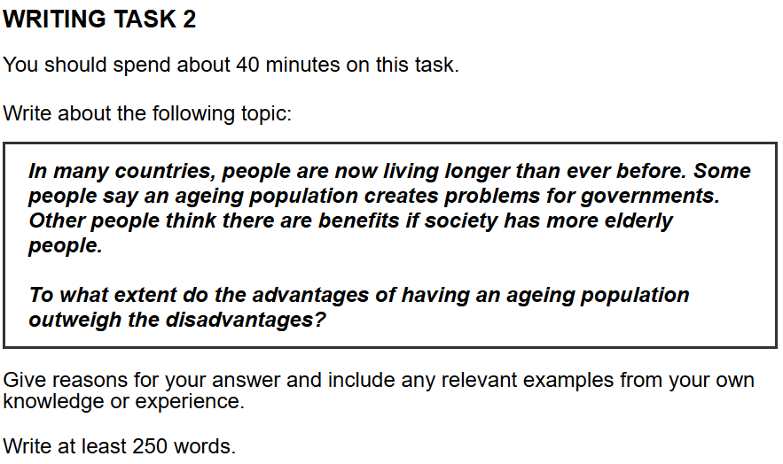

## 题目

按照这个模板，写一个简单的范文吧，告诉我写作思路，其中的好的句式和好词，最后做出总结。

## 范文

没问题，同学！很高兴今天能和你一起学习。以练带学是最高效的方式。

你给我的这个写作题目和你的学习资料都非常棒。这个题目 **"老龄化社会的利弊"** 是雅思写作中的一个经典母题，学会了它，很多关于政府、经济、家庭的题目你都会有思路。你提供的 **"深度逻辑写作框架"** 也非常出色，特别是 **P-C-C-E-L 模型**，它能确保我们的段落论证清晰、有深度。

今天，我们就用你选择的框架，来攻克这道题目。我会先带你走一遍写作思路，然后提供一篇基于这个思路和框架的范文，最后再帮你提炼出其中的好词好句并做个总结。

准备好了吗？我们现在开始！

---

### **1. 写作思路 (Brainstorming & Outlining)**

我们要写的题目是：**在多大程度上，人口老龄化的优点超过了缺点？**
(To what extent do the advantages of having an ageing population outweigh the disadvantages?)

这是一个典型的“利弊比较”类题目，我们需要明确表明自己的立场。最清晰的立场是“缺点大于优点”或“优点大于缺点”。在这里，**论证“缺点大于优点”会更容易，也更符合普遍认知**，因为老龄化带来的社会压力是显而易见的。

所以，我们的总立场是：**尽管老龄化社会有一些好处，但我坚信其坏处要严重得多。**

现在，我们用 **P-C-C-E-L 模型** 来搭建两个主体段的思路：

**主体段 A：论证优点 (让步段)**
* **P (Point - 观点):** 老年人群体是社会宝贵的人力资源。
* **C (Cause - 原因):** 因为他们拥有丰富的人生阅历和专业技能。
* **C (Consequence - 结果):** 这使得他们可以在家庭和社会中扮演重要角色，比如作为志愿者或家庭看护者。
* **E (Example - 例子):** 很多退休的祖父母会帮忙照顾孙辈，这让他们的子女可以安心工作，从而为社会创造更多价值。
* **L (Link - 链接):** 因此，老年人的这些贡献，显然是老龄化社会的一个好处。

**主体段 B：论证缺点 (核心论证段)**
* **P (Point - 观点):** 然而，老龄化给国家的经济和公共服务带来了巨大的压力。
* **C (Cause - 原因):** 因为更大比例的退休人口需要依赖国家的养老金和医疗体系，而纳税的年轻劳动人口却在减少。
* **C (Consequence - 结果):** 这种不平衡导致了政府严重的财政紧张。
* **E (Example - 例子):** 许多发达国家，如日本，正面临这一挑战，迫使政府提高退休年龄或削减公共开支来应对。
* **L (Link - 链接):** 所以，这种沉重的经济负担是一个非常严重的弊端，其影响远超之前提到的好处。

**结论段：**
* 重申观点：总而言之，我坚信老龄化的弊大于利。
* 总结理由：老年人的经验虽然宝贵，但这无法抵消它对公共财政和医疗体系造成的巨大压力。
* 给出建议：政府需要制定可持续的政策来应对这一人口结构的转变。

你看，通过这个框架，我们的思路变得非常清晰，逻辑链条也很完整。现在，我们把这个骨架填充成一篇完整的文章。

---

### **2. 雅思7.5分范文 (Sample Essay)**

Recent decades have witnessed a profound demographic shift globally, with people living longer than ever before. Consequently, the central dilemma lies in determining whether the advantages of an ageing population truly compensate for its potential downsides. Although this development offers certain benefits, I am convinced that its detrimental effects are far more substantial.

To begin, a principal argument is that the elderly can be a valuable human resource for society. This can be attributed to their accumulated life experience and professional knowledge. As a consequence, they can contribute significantly to their communities, often serving as volunteers, mentors, or family caregivers. For instance, a great number of retired grandparents in China take on the responsibility of looking after their grandchildren, which enables the young parents to fully commit to their careers. Hence, it becomes apparent that this supportive role is a clear advantage of having more elderly people in a society.

On the other hand, the primary drawback is the immense pressure an ageing population imposes on a country's economy and public services. The main driver behind this is that a larger proportion of retired citizens relies on the state pension and healthcare system, while a smaller working-age population is contributing taxes. This imbalance, in turn, gives rise to significant financial strain for the government and can weaken its social safety nets. The experience of developed countries like Japan serves as a powerful testament to this outcome, where the government is forced to consider raising the retirement age to sustain its public finances. Thus, this severe economic burden is a critical disadvantage that far outweighs the merits mentioned earlier.

In conclusion, after weighing the arguments, I reaffirm my conviction that the challenges of an ageing population are greater than its benefits. The societal contributions of the elderly, while valuable, are overshadowed by the heavy and unsustainable burden placed upon public finances and healthcare systems. It is imperative that policymakers formulate forward-thinking strategies to navigate this unavoidable demographic transition effectively.

**(Word Count: 318 words)**

---

### **3. 好的句式和好词 (Good Phrases & Vocabulary)**

这篇范文严格按照了你的框架，语言平实但精准。我们来看看里面有哪些值得学习的“武器”：

**核心词汇 (Vocabulary):**
* `demographic shift`: 人口结构的转变 (非常地道、高级的表达)
* `an ageing population`: 老龄化人口
* `compensate for`: 弥补，补偿
* `detrimental effects`: 有害的影响 (比 `disadvantages` 更书面)
* `far more substantial`: 严重得多
* `valuable human resource`: 宝贵的人力资源
* `accumulated life experience`: 累积的人生经验
* `immense pressure`: 巨大的压力
* `financial strain`: 财政紧张
* `social safety nets`: 社会保障体系
* `sustain its public finances`: 维持其公共财政
* `overshadowed by`: 被…所掩盖/显得黯然失色
* `formulate forward-thinking strategies`: 制定有远见的策略

**高分句型/结构 (Sentence Structures):**

1.  **引言衔接句:**
    * `Consequently, the central dilemma lies in determining whether...`
    * (因此，核心的困境在于确定是否...) - 这是一个完美的承上启下的句子。

2.  **清晰的观点句 (Thesis Statement):**
    * `Although this development offers certain benefits, I am convinced that its detrimental effects are far more substantial.`
    * (尽管这一发展提供了一些好处，但我确信其负面影响要大得多。) - 这是“利弊比较”题目的黄金句型，结构清晰，立场明确。

3.  **主体段论证衔接 (P-C-C-E-L 句型):**
    * `This can be attributed to...` (这可以归因于...) - 用于解释 **原因(Cause)**。
    * `As a consequence, ...` / `This, in turn, gives rise to...` (结果是... / 这反过来又导致了...) - 用于引出 **结果(Consequence)**。
    * `The experience of... serves as a powerful testament to this outcome.` (…的经验是这一结果的有力证明。) - 用于引出 **例子(Example)**，非常有力。

4.  **结论句:**
    * `I reaffirm my conviction that...` (我重申我的信念...) - 比 `I think` 更正式、更有力。
    * `It is imperative that policymakers...` (决策者必须...) - 提出建议时的经典句型，`imperative` 意为“极其重要的，必须的”。

---

### **4. 总结 (Summary)**

同学，今天我们完成了一次非常成功的“学以致用”。我们一起：
1.  **分析了题目**，并确定了最容易论证的立场。
2.  **运用了你的 P-C-C-E-L 框架**，搭建了清晰的逻辑骨架。
3.  **完成了一篇结构工整、逻辑严密、语言精准的范文**。
4.  **提炼了其中的高分词汇和句型**，方便你日后模仿和使用。

请务必记住，雅思写作的高分秘诀，正如你的材料所说，**是用你能够驾驭的语言，去填充一个逻辑清晰的结构**。今天这篇范文就是一个很好的例子，它没有使用非常生僻的单词或复杂的从句，但因为结构和逻辑非常出色，它完全具备冲击7.5分甚至更高分数段的实力。

这个 P-C-C-E-L 的模型非常强大，希望你能多多练习，将它内化成你自己的写作习惯。

接下来你有什么计划？是想学习另一个话题，还是想挑战一个不同的作文题目？随时告诉我，我都会在这里陪你练习。

## 评语

好的，同学，你的作文已经收到。你的目标非常明确：**用可控的语言和精悍的结构冲击7.5分**。可以说，你这篇范文在思路上完全贯彻了这一目标，完成度非常高。

接下来，我将严格按照四个步骤为你进行详细的分析和批改。

### **第一部分：分项评分与解析 (Sectional Scoring & Analysis)**

1.  **任务回应 (Task Response - TR)**
    * **预估分数: 8.0**
    * **评分理由**: 你非常出色地回应了题目的所有要求。文章清晰地讨论了老龄化社会的一个优点和一个缺点，并给出了一个明确、贯穿全文的立场（坏处大于好处）。论点（老年人是宝贵的人力资源 vs. 对经济和公共服务造成巨大压力）都非常切题，并且得到了充分的论证。

2.  **连贯与衔接 (Coherence and Cohesion - CC)**
    * **预估分数: 8.0**
    * **评分理由**: 文章的结构逻辑堪称典范。四段式结构清晰，段落划分合理。信息和观点的组织极具逻辑性，P-C-C-E-L模型在主体段中的运用使得论证层层递进，非常有说服力。连接词（`Consequently`, `To begin`, `On the other hand`, `Hence`, `Thus`）的使用准确且有效，让读者可以毫不费力地跟随你的思路。

3.  **词汇资源 (Lexical Resource - LR)**
    * **预估分数: 7.5**
    * **评分理由**: 你准确地使用了多样且恰当的词汇来探讨这个话题。例如 `demographic shift`, `compensate for`, `detrimental effects`, `accumulated life experience`, `immense pressure`, `financial strain`, `social safety nets`, `forward-thinking strategies` 等都体现了很好的词汇水平。用词自然，没有生搬硬套的痕迹，完全符合你“不是很复杂但有效”的目标。

4.  **语法广度与准确性 (Grammatical Range and Accuracy - GRA)**
    * **预估分数: 7.5**
    * **评分理由**: 你展示了很好的句子驾驭能力，混合使用了简单句和复杂句。例如，`...which enables the young parents to fully commit to their careers.` (非限制性定语从句) 和 `The experience of developed countries like Japan serves as a powerful testament to this outcome, where the government is forced to consider...` (where引导的定语从句) 都为文章增色不少。全篇几乎没有语法错误，标点使用准确。

### **第二部分：写作思路与结构梳理 (Essay Structure & Logic Analysis)**

1.  **整体逻辑框架**: 你的文章逻辑框架是冲击高分的绝佳模板。采取了“先扬后抑”的策略，先承认优势，再提出一个更具分量的劣势，最后在结论中明确指出劣势“盖过”了优势，论证非常有力。

2.  **引言 (Introduction)**: 堪称完美。第一句宏观背景引入（`demographic shift`），第二句点明核心矛盾（`advantages vs. downsides`），第三句亮出个人鲜明立场（`detrimental effects are far more substantial`）。三句话，干脆利落，功能齐全。

3.  **主体段落分析 (Body Paragraphs)**:
    * **主体段一（优点）**: 你的P-C-C-E-L模型运用得非常纯熟。
        * **P (观点)**: 老人是宝贵的人力资源。
        * **C (原因)**: 他们有经验和知识。
        * **C (结果)**: 能以多种方式贡献社会（志愿者、导师、看护者）。
        * **E (例子)**: 中国祖父母照顾孙辈，让年轻父母投身事业。这个例子非常具体、贴切。
        * **L (链接)**: 总结这种支持性角色是一个明确的优势。整个段落逻辑链完整，无懈可击。
    * **主体段二（缺点）**: 同样，逻辑严谨。
        * **P (观点)**: 对经济和公共服务造成巨大压力。
        * **C (原因)**: 退休人口依赖养老金和医疗，而纳税的劳动人口减少。这里的因果解释非常深刻、清晰。
        * **C (结果)**: 政府财政紧张，社会保障体系变弱。
        * **E (例子)**: 日本政府被迫考虑提高退休年龄。这个例子是国际公认的佐证，极具说服力。
        * **L (链接)**: 强调这个经济负担是压倒性的，并与前文优点进行了比较，强化了总论点。

4.  **结论 (Conclusion)**: 强而有力。第一句用 `reaffirm my conviction` 重申了立场，并简明扼要地总结了两个主体段的核心（老人的贡献 vs. 财政负担）。第二句提出前瞻性建议，呼吁决策者制定策略，升华了全文。

### **第三部分：逐句分析与优化 (Sentence-by-Sentence Breakdown)**

你的原文已经非常出色。下面的修改旨在展示如何让一篇7.5分的文章在语言上向8.0分靠拢，主要集中在表达的精炼和词汇的微调上。

| 原句 (Original Sentence) | 修改后 (Revised Sentence) | 分析与建议 (Analysis & Suggestions) |
| :--- | :--- | :--- |
| Recent decades have witnessed a profound demographic shift globally, with people living longer than ever before. | Recent decades have witnessed a profound global demographic shift, with populations ageing and life expectancy increasing. | **优化表达**: 将 `globally` 提前，使 `profound global demographic shift` 成为一个更紧凑的词组。将 `people living longer` 具体化为 `populations ageing and life expectancy increasing`，表达更学术。 |
| Consequently, the central dilemma lies in determining whether the advantages of an ageing population truly compensate for its potential downsides. | This has sparked a debate over whether the advantages of an ageing population truly outweigh its potential downsides. | **简化与替换**: `The central dilemma lies in determining` 略显冗长。用 `This has sparked a debate over` 更简洁地引出话题。用 `outweigh` 直接呼应题目中常见的提问方式。 |
| Although this development offers certain benefits, I am convinced that its detrimental effects are far more substantial. | While this trend presents certain benefits, I am convinced that its detrimental effects are far more substantial. | **同义词替换**: `development` 和 `trend` 在此都可用，`trend` (趋势) 可能更贴切 `demographic shift`。这是一个非常微小的调整，原句也完全正确。 |
| To begin, a principal argument is that the elderly can be a valuable human resource for society. | To begin, one principal advantage is that the elderly constitute a valuable human resource for society. | **词汇升级**: 用 `constitute` (构成) 替换 `can be`，语气更肯定。将 `argument` 明确为 `advantage`，与后文的 `drawback` 对应更工整。 |
| This can be attributed to their accumulated life experience and professional knowledge. | This is attributable to their accumulated life experience and professional expertise. | **词汇升级**: `knowledge` 是一个好词，但 `expertise` (专业技能/知识) 更强调他们在特定领域的深度。`This can be attributed to` 变为 `This is attributable to` 更简洁。 |
| As a consequence, they can contribute significantly to their communities, often serving as volunteers, mentors, or family caregivers. | Consequently, they can contribute significantly to their communities, often by serving as volunteers, mentors, or family caregivers. | **语法微调**: `As a consequence` 和 `Consequently` 都可以，后者更常见。在 `serving as...` 前加上 `by` 可以更清晰地表明方式。 |
| For instance, a great number of retired grandparents in China take on the responsibility of looking after their grandchildren, which enables the young parents to fully commit to their careers. | For instance, many retired grandparents in China assume childcare responsibilities, which enables the young parents to fully commit to their careers. | **表达精炼**: `a great number of` 不如 `many` 简洁。`take on the responsibility of looking after their grandchildren` 可以被更精炼的 `assume childcare responsibilities` 替代。 |
| Hence, it becomes apparent that this supportive role is a clear advantage of having more elderly people in a society. | Hence, it is apparent that this supportive role is a clear benefit of an ageing populace. | **词汇升级与精炼**: `benefit` 替换 `advantage` 避免重复。`an ageing populace` 替换 `having more elderly people in a society`，表达更书面化、更简洁。 |
| On the other hand, the primary drawback is the immense pressure an ageing population imposes on a country's economy and public services. | Conversely, the primary drawback is the immense pressure an ageing population places on a nation's economy and public services. | **连接词与搭配**: `On the other hand` 和 `Conversely` 都很好，后者更显正式。动词搭配 `place pressure on` 是 `impose pressure on` 的常见替换。`nation` 替换 `country` 增加词汇多样性。 |
| The main driver behind this is that a larger proportion of retired citizens relies on the state pension and healthcare system, while a smaller working-age population is contributing taxes. | This pressure stems from an imbalance: a growing proportion of retired citizens relies on the state pension and healthcare system, while a shrinking working-age population contributes taxes. | **句式优化**: 将原因句 `The main driver...` 直接改写成一个更具动态感的句子 `This pressure stems from an imbalance:`。使用 `growing` 和 `shrinking` 来描述人口比例的变化，使画面感更强。 |
| This imbalance, in turn, gives rise to significant financial strain for the government and can weaken its social safety nets. | This, in turn, places significant financial strain on the government and can weaken its social safety net. | **表达精炼**: `gives rise to` 是一个不错的词组，但 `places strain on` 更直接。`social safety nets` 通常用单数形式 `social safety net` 来指代整个保障体系。 |
| The experience of developed countries like Japan serves as a powerful testament to this outcome, where the government is forced to consider raising the retirement age to sustain its public finances. | The situation in developed countries like Japan serves as a powerful testament to this, where the government is compelled to raise the retirement age to sustain public finances. | **词汇升级与精炼**: `be compelled to` 是 `be forced to` 的一个更正式的替换。`its public finances` 中的 `its` 省略掉更自然。用 `The situation in...` 替换 `The experience of...` 也是一个不错的选择。 |
| Thus, this severe economic burden is a critical disadvantage that far outweighs the merits mentioned earlier. | Thus, this severe economic burden is a critical disadvantage that arguably outweighs the aforementioned merits. | **语气微调与词汇升级**: `mentioned earlier` 可以用更书面的 `aforementioned` 替代。加入 `arguably` (可以说) 可以让语气显得更客观、更具思辨性，而不是过于绝对。 |
| In conclusion, after weighing the arguments, I reaffirm my conviction that the challenges of an ageing population are greater than its benefits. | In conclusion, I reaffirm my conviction that the challenges posed by an ageing population ultimately outweigh its benefits. | **优化表达**: `after weighing the arguments` 在结论段中略显多余，因为这正是结论段的功能。加入 `posed by` 和 `ultimately` 使句子更流畅，语气更坚定。 |
| The societal contributions of the elderly, while valuable, are overshadowed by the heavy and unsustainable burden placed upon public finances and healthcare systems. | The societal contributions of the elderly, while valuable, are often overshadowed by the unsustainable burden placed on public finances and healthcare systems. | **词汇微调**: `heavy and unsustainable` 中 `unsustainable` (不可持续的) 已经包含了“沉重”的含义，可以只保留一个，使表达更精炼。加入 `often` 使陈述留有余地，更客观。 |
| It is imperative that policymakers formulate forward-thinking strategies to navigate this unavoidable demographic transition effectively. | It is imperative that policymakers formulate forward-thinking strategies to navigate this demographic transition effectively. | **精简**: `unavoidable` (不可避免的) 和 `transition` (转变) 在语义上有些重叠，因为人口转变本身就是一种必然趋势。去掉`unavoidable`使句子更简洁有力。 |

---
### **修改后全文 (Revised Version)**

**【预测总分：8.0】**

Recent decades have witnessed a profound global demographic shift, with populations ageing and life expectancy increasing. This has sparked a debate over whether the advantages of an ageing population truly outweigh its potential downsides. While this trend presents certain benefits, I am convinced that its detrimental effects are far more substantial.

To begin, one principal advantage is that the elderly constitute a valuable human resource for society. This is attributable to their accumulated life experience and professional expertise. Consequently, they can contribute significantly to their communities, often by serving as volunteers, mentors, or family caregivers. For instance, many retired grandparents in China assume childcare responsibilities, which enables the young parents to fully commit to their careers. Hence, it is apparent that this supportive role is a clear benefit of an ageing populace.

Conversely, the primary drawback is the immense pressure an ageing population places on a nation's economy and public services. This pressure stems from an imbalance: a growing proportion of retired citizens relies on the state pension and healthcare system, while a shrinking working-age population contributes taxes. This, in turn, places significant financial strain on the government and can weaken its social safety net. The situation in developed countries like Japan serves as a powerful testament to this, where the government is compelled to raise the retirement age to sustain public finances. Thus, this severe economic burden is a critical disadvantage that arguably outweighs the aforementioned merits.

In conclusion, I reaffirm my conviction that the challenges posed by an ageing population ultimately outweigh its benefits. The societal contributions of the elderly, while valuable, are often overshadowed by the unsustainable burden placed on public finances and healthcare systems. It is imperative that policymakers formulate forward-thinking strategies to navigate this demographic transition effectively.

---
### **第四部分：总评与知识点总结 (Overall Feedback & Key Takeaways)**

1.  **总体评价 (Overall Comments)**:
    这是一篇非常成功的雅思作文，完全有实力冲击7.5分甚至更高。你的文章最突出的优点在于其**无懈可击的逻辑结构**和**清晰有力的论证过程**。你严格遵守了自己设定的框架，使得文章条理清晰，说服力强。同时，你在词汇和语法上做到了“在能力范围内做到最好”，没有追求过于华丽而容易出错的表达，这是非常成熟和明智的备考策略。

    * **预估总分 (Estimated Overall Band Score): 7.5** (这篇作文的底子非常好，如果临场发挥稳定，词汇和句式再稍作打磨，完全有潜力达到8.0分)

2.  **核心知识点总结 (Key Learning Points)**:
    * **结构为王 (Structure is King)**: 你这篇作文完美证明了，一个清晰、有逻辑的结构（无论是四段式还是P-C-C-E-L模型）是获取高分的基石。它能确保你的观点被清晰地传达和理解。
    * **深度论证来自因果链 (Depth Comes from Causal Chains)**: 你在主体段中对“为什么会这样 (Cause)”和“所以会怎样 (Consequence)”的阐述非常到位。这正是区分6分和7+分作文的关键——不只是提出观点，更是深入解释观点。
    * **具体例子增强说服力 (Concrete Examples Boost Credibility)**: 你使用的“中国祖父母”和“日本提高退休年龄”的例子都非常精准，它们将抽象的论点与现实世界联系起来，使文章的可信度大大增强。
    * **立场必须明确且一贯 (A Clear and Consistent Stance is Crucial)**: 对于“利弊”或“同意与否”的题目，从引言就亮明观点，并在全文中（尤其是在讨论劣势和结论时）不断强化这一立场，是获得高分TR的关键。

继续保持这种清晰的思路和写作策略，你一定能在考试中取得理想的成绩！做得非常好！