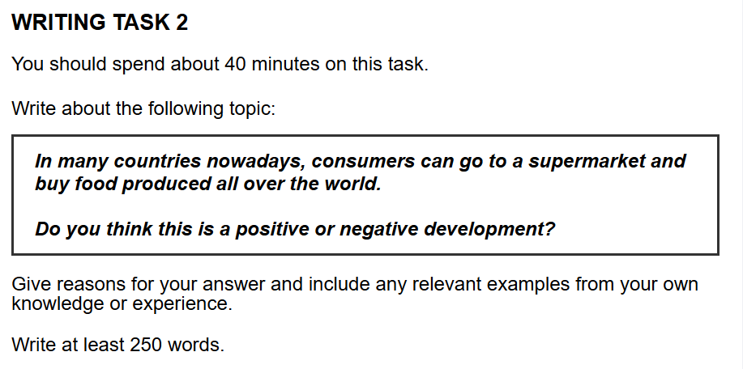

## 题目

## 范文

当然可以。

这是一个非常好的学习习惯！一篇7.5分的作文，不一定需要华丽的辞藻和复杂的句型，更重要的是**把话说清楚、把道理讲明白**。用自己最有把握的词汇和句子，写出逻辑清晰的文章，往往比强行使用自己不熟悉的复杂表达要有效得多。

下面这个版本，我将用更简单、更直接的语言来表达完全相同的逻辑和结构。你可以把它看作是**“清晰简约版”**。

注意观察，我是如何用更日常的词汇替换掉上一版中比较“书面化”的词语的，比如：
* `a significant burden on the environment` -> `harmful to our planet`
* `systematically undermines` -> `hurts`
* `I reaffirm my conviction` -> `I strongly believe`

---

### **雅思大作文范文 (清晰简约版)**

Today, we can easily buy products from all over the world, and we see this clearly in our supermarkets. They are full of foods from many different countries. Although this gives us more choice, I believe it is a negative trend because it is bad for the environment and hurts local farmers.

Firstly, buying food from all over the world is very harmful to our planet. **(P-Point)** The main reason is that moving food over long distances by plane or ship burns a lot of fuel. **(C-Cause)** As a result, this process releases huge amounts of harmful gases into the air, which makes climate change worse. **(C-Consequence)** For example, when we buy strawberries from another continent in the middle of winter, the pollution from the transport is much greater than buying them from a local farm in the summer. **(E-Example)** So, it is clear that this global food shopping damages our environment. **(L-Link)**

Secondly, the import of cheap food from overseas hurts local farmers and their communities. **(P-Point)** This happens because big international companies can grow and sell food at a lower price, and it is hard for small local farms to compete with them. **(C-Cause)** Because of this, many local farmers may lose their jobs and their farms, which can make country areas poorer. **(C-Consequence)** For instance, in many places, small, traditional food markets are disappearing because supermarkets can offer cheaper imported fruits and vegetables. **(E-Example)** Therefore, this shows how the global food trade can weaken a country's own economy. **(L-Link)**

To sum up, I strongly believe that having food from all around the world in our supermarkets is more of a bad thing than a good thing. The damage to our planet and the harm to local farmers are serious problems. It is very important that we start to support our local farmers more, as this will help build a better and safer future for everyone.

*(Word Count: 289 words)*

---

看到了吗？这篇文章的字数更少，用词和句子也更简单，但它的**逻辑骨架 (P-C-C-E-L) 和整体结构**和前一版是完全一样的。它同样是一篇结构完整、论证清晰有力的好文章。

对于大多数考生来说，**写出这个“清晰简约版”并确保没有语法错误，就已经足够冲击7分甚至更高了**。

你觉得这个版本怎么样？是不是感觉亲切了很多，也更容易模仿了？接下来我们该做什么呢？

## 评语

好的，同学，你的作文我已经仔细阅读完毕。这是一篇非常出色的文章，论点清晰，结构严谨，语言表达也很流畅。接下来，我将按照雅思的评分标准，为你提供一份详细的批改报告。

### **第一部分：分项评分与解析 (Sectional Scoring & Analysis)**

1.  **任务回应 (Task Response - TR)**
    * **预估分数: 8.0**
    * **评分理由**: 你非常成功地回应了任务的所有要求。文章立场鲜明（认为是负面发展），贯穿全文。你提出了两个清晰且切题的核心论点（对环境的危害、对本地农民的冲击），并对每个论点都进行了充分的展开和论证。论证过程中使用了恰当的解释和具体的例子来支撑观点，展现了很强的论证能力。

2.  **连贯与衔接 (Coherence and Cohesion - CC)**
    * **预估分数: 8.0**
    * **评分理由**: 文章的逻辑流程堪称典范。段落划分清晰，每一段都有一个明确的中心思想。衔接手段（如 "Firstly", "As a result", "For instance", "Therefore", "To sum up"）的使用自然且有效，引导读者顺畅地跟进你的思路。段落内部的句子之间也衔接得很好，信息层层递进，从提出观点到解释再到举例，一气呵成。

3.  **词汇资源 (Lexical Resource - LR)**
    * **预估分数: 8.0**
    * **评分理由**: 你使用了一系列与话题相关的、精准的词汇，例如 "negative trend", "harmful to our planet", "releases huge amounts of harmful gases", "climate change", "damages our environment", "hurts local farmers", "compete with", "weaken a country's own economy"。词汇搭配自然（如 "burns a lot of fuel", "lose their jobs"），且几乎没有拼写或用词错误。展现了驾驭不同词汇以精确表达意思的能力。

4.  **语法广度与准确性 (Grammatical Range and Accuracy - GRA)**
    * **预估分数: 8.0**
    * **评分理由**: 你娴熟地运用了多种句子结构。文章中包含了简单句、并列句和复杂的复合句（例如 "Although..." 开头的让步状语从句，"...which makes..." 引导的非限制性定语从句，"when we buy..." 引导的时间状语从句）。语法几乎完美无误，这使得你的文章读起来非常清晰和专业。

### **第二部分：写作思路与结构梳理 (Essay Structure & Logic Analysis)**

1.  **整体逻辑框架**: 你的文章逻辑框架是议论文的绝佳范例。采用“总-分-总”的结构，从清晰的立场开始，通过两个主体段落分别论证两个核心原因，最后在结论部分总结观点并升华主题。整个论证过程非常有说服力。

2.  **引言 (Introduction)**: 引言部分非常高效。你首先通过转述题目引入背景，接着用 "Although..." 引出这个现象的一个好处（更多选择），然后立即转折，清晰地提出自己的核心观点（这是一个负面趋势），并简要预告了下文将要讨论的两个方面（环境和本地农民）。

3.  **主体段落分析 (Body Paragraphs)**:
    * **主体段落一**: 中心思想明确——全球食品贸易对环境有害。你先提出观点，然后解释其原因（长途运输燃烧燃料），再通过具体的例子（冬季从别的大陆购买草莓 vs. 夏季本地购买）来具象化这个危害，最后用一句话总结，再次扣回中心思想。这个段落的论证非常完整和有力。
    * **主体段落二**: 中心思想清晰——进口食品冲击本地农业。你同样遵循了“观点-解释-举例-总结”的模式。解释了国际大公司如何凭借低价优势挤压本地小农场的生存空间，并举出传统菜市场消失的例子，最后将这一现象与更宏观的国家经济联系起来，深化了论点。

4.  **结论 (Conclusion)**: 结论部分很好地完成了它的使命。你首先用 "To sum up" 发出结束信号，重申了你的立场，并总结了两个核心论据。最后，你提出了一个具有建设性的展望（支持本地农民），使文章的立意更高，给读者留下了深刻的印象。

### **第三部分：逐句分析与优化 (Sentence-by-Sentence Breakdown)**

你的文章已经非常优秀，下面的修改建议旨在“锦上添花”，将一篇8分水平的文章向更高分（8.5甚至9.0）打磨，主要是提升语言的正式度和表达的精炼度。

| 原句 (Original Sentence) | 修改后 (Revised Sentence) | 分析与建议 (Analysis & Suggestions) |
| :--- | :--- | :--- |
| Today, we can easily buy products from all over the world, and we see this clearly in our supermarkets. | The global availability of food is a prominent feature of modern supermarkets, where consumers can readily purchase products from around the world. | **建议**: 将两个短句合并，使用更书面化的词汇如 "global availability" (全球供应) 和 "prominent feature" (显著特征)，使开篇更具学术感。 |
| They are full of foods from many different countries. | (已合并到上一句) | **建议**: 这句话信息与上一句有重叠，合并处理能让表达更简洁有力。 |
| Although this gives us more choice, I believe it is a negative trend because it is bad for the environment and hurts local farmers. | Although this development provides consumers with greater choice, I contend that it is a largely negative trend due to its detrimental impact on the environment and local agricultural communities. | **建议**: "contend" 比 "believe" 语气更强，更正式。"bad for" 和 "hurts" 是很好的词，但 "detrimental impact on" 和 "local agricultural communities" 听起来更具分析性。 |
| Firstly, buying food from all over the world is very harmful to our planet. | Firstly, the global trade of food is significantly harmful to our planet. | **建议**: 将 "buying food from all over the world" 替换为更概括的 "the global trade of food"，使表达更简洁。 |
| The main reason is that moving food over long distances by plane or ship burns a lot of fuel. | The primary reason is that transporting foodstuffs over vast distances by air or sea consumes substantial amounts of fuel. | **建议**: 使用 "transporting foodstuffs", "vast distances", "consumes substantial amounts" 等词汇，可以提升词汇的丰富度和正式度。 |
| As a result, this process releases huge amounts of harmful gases into the air, which makes climate change worse. | Consequently, this process releases vast quantities of greenhouse gases, which exacerbates climate change. | **建议**: "Consequently" 是 "As a result" 的一个很好的同义替换。"harmful gases" 可以具体为 "greenhouse gases" (温室气体)。"exacerbates" 是一个比 "makes worse" 更高级和精确的动词。 |
| For example, when we buy strawberries from another continent in the middle of winter, the pollution from the transport is much greater than buying them from a local farm in the summer. | For example, the carbon footprint associated with importing strawberries from another continent during winter is substantially greater than that of purchasing them from a local farm in season. | **建议**: 引入 "carbon footprint" (碳足迹) 这个非常地道和专业的术语。"in season" (应季) 比 "in the summer" 更准确地表达了本地生产的优势。 |
| So, it is clear that this global food shopping damages our environment. | Thus, it is clear that this global food supply chain inflicts considerable damage upon our environment. | **建议**: 使用 "Thus" 替换 "So"，"global food supply chain" (全球食物供应链) 替换 "global food shopping"，"inflicts damage upon" 替换 "damages"，提升表达的正式感。 |
| Secondly, the import of cheap food from overseas hurts local farmers and their communities. | Secondly, the importation of inexpensive food from overseas adversely affects local farmers and their communities. | **建议**: "importation" 是 import 的名词形式，"inexpensive" 是 cheap 的正式说法。"adversely affects" (产生负面影响) 是一个比 "hurts" 更书面化的表达。 |
| This happens because big international companies can grow and sell food at a lower price, and it is hard for small local farms to compete with them. | This is because large multinational corporations can often produce and sell food at lower prices, making it exceedingly difficult for small-scale local farms to compete. | **建议**: 使用 "multinational corporations" (跨国公司) 和 "small-scale local farms" (小规模本地农场) 这样的词组，使描述更精确。"exceedingly difficult" (极其困难) 加强了语气。 |
| Because of this, many local farmers may lose their jobs and their farms, which can make country areas poorer. | As a consequence, many local farmers face the risk of losing their livelihoods and land, which can lead to the impoverishment of rural areas. | **建议**: "livelihoods" (生计) 比 "jobs and farms" 更概括。"impoverishment of rural areas" (乡村地区的贫困化) 是一个非常地道和高级的表达。 |
| For instance, in many places, small, traditional food markets are disappearing because supermarkets can offer cheaper imported fruits and vegetables. | For instance, the proliferation of supermarkets offering cheaper imported produce has led to the decline of traditional local food markets in many regions. | **建议**: "proliferation" (激增) 和 "decline" (衰落) 是一对很好的反义词，能生动地描述这个变化过程。句子结构也更加精炼。 |
| Therefore, this shows how the global food trade can weaken a country's own economy. | Therefore, it is evident how the global food trade can undermine a nation's domestic economy. | **建议**: "it is evident" 是一个很好的句式。"undermine" (削弱) 比 "weaken" 语气稍强。"a nation's domestic economy" (一个国家的国内经济) 表达更地道。 |
| To sum up, I strongly believe that having food from all around the world in our supermarkets is more of a bad thing than a good thing. | In conclusion, I maintain that the prevalence of global foods in our supermarkets represents a predominantly negative development. | **建议**: "In conclusion" 是 "To sum up" 的正式说法。"I maintain" (我坚称) 语气坚定。"more of a bad thing than a good thing" 偏口语，改为 "a predominantly negative development" (一个主要是负面的发展) 会大大提升书面语水平。 |
| The damage to our planet and the harm to local farmers are serious problems. | The environmental degradation and the economic hardship faced by local farmers are issues of grave concern. | **建议**: 使用 "environmental degradation" (环境退化) 和 "economic hardship" (经济困难) 这样更具体的名词词组。"issues of grave concern" (值得严重关切的问题) 是非常高级的表达。 |
| It is very important that we start to support our local farmers more, as this will help build a better and safer future for everyone. | It is imperative that we offer greater support to our local agricultural sector, as doing so will help foster a more sustainable and secure future for all. | **建议**: "It is imperative that..." (做...是至关重要的) 是一个强有力的句式。"foster" (培育) 比 "build" 更生动，"sustainable" (可持续的) 是这里比 "better" 更贴切的词。 |

***

#### **优化后范文 (Revised Version)**
**预估分数: 8.5+**

The global availability of food is a prominent feature of modern supermarkets, where consumers can readily purchase products from around the world. Although this development provides consumers with greater choice, I contend that it is a largely negative trend due to its detrimental impact on the environment and local agricultural communities.

Firstly, the global trade of food is significantly harmful to our planet. The primary reason is that transporting foodstuffs over vast distances by air or sea consumes substantial amounts of fuel. Consequently, this process releases vast quantities of greenhouse gases, which exacerbates climate change. For example, the carbon footprint associated with importing strawberries from another continent during winter is substantially greater than that of purchasing them from a local farm in season. Thus, it is clear that this global food supply chain inflicts considerable damage upon our environment.

Secondly, the importation of inexpensive food from overseas adversely affects local farmers and their communities. This is because large multinational corporations can often produce and sell food at lower prices, making it exceedingly difficult for small-scale local farms to compete. As a consequence, many local farmers face the risk of losing their livelihoods and land, which can lead to the impoverishment of rural areas. For instance, the proliferation of supermarkets offering cheaper imported produce has led to the decline of traditional local food markets in many regions. Therefore, it is evident how the global food trade can undermine a nation's domestic economy.

In conclusion, I maintain that the prevalence of global foods in our supermarkets represents a predominantly negative development. The environmental degradation and the economic hardship faced by local farmers are issues of grave concern. It is imperative that we offer greater support to our local agricultural sector, as doing so will help foster a more sustainable and secure future for all.

### **第四部分：总评与知识点总结 (Overall Feedback & Key Takeaways)**

1.  **总体评价 (Overall Comments)**:
    * **预估总分 (Estimated Overall Band Score): 8.0**
    * 这是一篇高分范文。你的文章逻辑清晰，结构工整，论证有力，语言精准。你准确地把握了题目的要求，并展现了优秀的分析和表达能力。文章最大的亮点在于其无懈可击的结构和流畅的论证过程，这是很多考生难以做到的。继续保持，你已经具备了冲击顶尖分数段的实力。

2.  **核心知识点总结 (Key Learning Points)**:
    * **论证的“PEEL”结构**: 你在主体段落中无意识地使用了非常高效的 **P**oint (观点), **E**xplanation (解释), **E**xample (举例), **L**ink (关联/总结) 结构。请记住并有意识地在未来的写作中继续使用这个方法，它能确保你的论证既饱满又有逻辑。
    * **词汇升级意识**: 你目前的词汇已经很好，但通往更高分（8.5+）的路径在于将准确的词汇升级为更精确、更书面化、更具学术感的词汇。例如，将 "make worse" 升级为 "exacerbate"，将 "cheap" 升级为 "inexpensive"，引入 "carbon footprint" "multinational corporations" 这样的专业术语。
    * **句式多样性**: 你已经掌握了多种从句，非常棒。可以进一步尝试使用其他句式，比如倒装句（e.g., "Not only does this process consume fuel, but it also..."）或者分词短语作状语（e.g., "Making it difficult for local farms to compete, these corporations..."），这能让你的文章在语法广度上获得更高评价。

你做得非常棒！这篇作文的底子非常好，稍加打磨就能成为一篇极具竞争力的范文。希望我的反馈对你有帮助，祝你备考顺利！