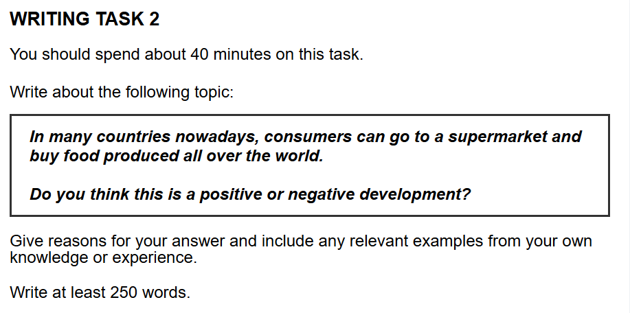

## 题目

    

## 范文

好的，同学你好！很高兴今天能和你一起学习雅思写作。看到你已经准备好了题目和学习资料，这种积极的学习态度是取得高分的第一步！

我们今天的任务，就是用你提供的**深度逻辑写作框架**和**万能观点**，来攻克这个关于“全球化食品”的 Task 2 题目。我的目标是带你走一遍从审题、构思到写作的全过程，让你不仅能看到一篇范文，更能理解它是如何一步步被构建出来的。

我们现在就开始吧！

---

### **第一步：写作思路 (Brainstorming & Outlining)**

我们要写的题目是：

> In many countries nowadays, consumers can go to a supermarket and buy food produced all over the world. Do you think this is a **positive or negative** development?

这是一个典型的“利弊分析”类题目，要求我们表明清晰的立场。根据我们 7.5 分的目标，采取一个“我认为这是一个负面发展”的立场会更容易写出深度和批判性。当然，我们可以在引言和结论中稍微提及另一面，以示全面，但主体段落的火力要集中。

**我的立场：** 这是一个负面的发展 (a negative development)。

接下来，我们用 P-C-C-E-L 模型来搭建两个主体段的论点，直接从你提供的“万能观点”库里寻找灵感。

**主体段 A：环境角度 (参考“环境类观点 1”和“观点 2”)**

- **P (Point):** 全球食品贸易对环境造成了巨大的负担。
- **C (Cause):** 将食物从一个大洲运输到另一个大洲需要消耗大量的化石燃料。
- **C (Consequence):** 这直接导致了`carbon emissions` (碳排放) 的激增，加剧了全球变暖。
- **E (Example):** 想象一下，在冬天从南美洲空运草莓到欧洲，这个过程产生的`carbon footprint` (碳足迹) 远高于消费本地季节性水果。
- **L (Link):** 因此，这种便利性是以牺牲地球的长期健康为代价的，是一个明确的负面影响。

**主体段 B：经济与社会角度 (参考“经济类观点 1”和“生活类观点 5”)**

- **P (Point):** 这种趋势损害了本地农业，并削弱了本地社区的经济。
- **C (Cause):** 大型超市更倾向于从能够提供低价和标准产品的国际供应商那里批量采购，这使得本地小农户很难与之竞争。
- **C (Consequence):** 这会导致本地农民破产，就业机会减少，并且使一个地区的`food security` (粮食安全) 变得脆弱，因为其过度依赖外部供应。
- **E (Example):** 在一些发展中国家，大量廉价的进口谷物`displaced` (取代了) 本地的传统农作物，使得当地社区在全球食品价格波动面前非常`vulnerable` (脆弱)。
- **L (Link):** 所以，从经济和社区可持续性的角度来看，这也是一个负面的发展。

好了，思路非常清晰了。我们有了一个明确的立场和两个强有力的支持段落。现在，让我们把这些想法写成一篇完整的文章。

---

### **第二步：7.5 分范文**

In an era of `unprecedented` globalization, the landscape of our local supermarkets has been transformed. It is now common for consumers to find products from every corner of the globe on their shelves. Although this development offers a wider variety of choices, I am convinced that its detrimental effects on the environment and local economies make it a largely negative development.

First and foremost, the global food trade imposes a `significant environmental burden`. The primary driver behind this is the vast amount of fossil fuels required to transport food over long distances, often across continents. This, in turn, gives rise to a substantial increase in `carbon emissions`, which are a major contributor to climate change. A compelling illustration of this is the case of fresh berries being air-freighted from South America to Europe during the winter. The `carbon footprint` of such an item is exponentially higher than that of locally sourced, seasonal alternatives. Hence, it becomes apparent that the convenience of year-round food availability comes at a `considerable ecological cost`.

Furthermore, the dominance of imported foods critically `undermines local agriculture` and communities. This can be attributed to the business models of large supermarket chains, which often prioritize cost-efficiency by sourcing in bulk from large-scale international suppliers. As a consequence, small local farmers find it increasingly difficult to compete, potentially leading to the decline of local farming industries and a loss of regional `economic self-sufficiency`. For instance, in many parts of the world, cheap imported grains have `displaced` traditional crops, leaving these communities `vulnerable` to unpredictable shifts in global supply chains and prices. Thus, the logical progression from global sourcing to local economic decline strongly validates the stance that this is a harmful trend.

In conclusion, after weighing the arguments, I reaffirm my conviction that the widespread availability of globally sourced food is more of a curse than a blessing. The severe environmental damage caused by extensive `food miles` and the tangible threat to the `livelihoods` of local farmers provide a solid foundation for this argument. Looking ahead, it is imperative that consumers and policymakers work together to support and rebuild local food systems, fostering a more `sustainable` and secure future.

**(346 words)**

---

### **第三步：好词好句分析**

这篇范文严格控制了难度，但用了一些精准的词汇和句式来提升正式感和逻辑性。

- `unprecedented`: (adj.) 前所未有的。这是一个非常好的大词，用来描述全球化的规模和深度，比用 "very big" 或 "very fast" 要高级得多。
- `significant environmental burden`: (搭配) 巨大的环境负担。`Significant` 是一个比 "big" 更正式、更客观的词，`burden` 形象地说明了环境承受的压力。
- `carbon emissions`: (术语) 碳排放。这是环境话题的核心词汇，必须掌握。
- `carbon footprint`: (术语) 碳足迹。另一个环境话题的核心词汇，指个人或活动产生的温室气体总量。
- `considerable ecological cost`: (搭配) 相当大的生态成本。`Considerable` 也是 "big" 的一个很好的替代词，`ecological cost` 听起来比 "harm to the environment" 更学术。
- `undermines local agriculture`: (搭配) 削弱/损害本地农业。`Undermine` 是一个非常精妙的动词，意思是从根基上、不知不觉地削弱，非常传神。
- `economic self-sufficiency`: (搭配) 经济上的自给自足。这是一个很棒的经济学术语，能准确表达观点。
- `displaced`: (v.) 取代，使……流离失所。在这里用来指进口产品“取代”了本地产品的位置，比 "replaced" 更多了一层强势的意味。
- `vulnerable`: (adj.) 脆弱的，易受攻击的。用来形容本地社区的状态，非常准确。
- `food miles`: (术语) 食物里程。指食物从产地到消费者餐桌的运输距离，是衡量食物环境影响的指标。
- `livelihoods`: (n.) 生计。比 "jobs" 或 "income" 范围更广，包含了维持生活所需的一切。
- `sustainable`: (adj.) 可持续的。环境、经济、社会类话题的“万金油”词汇，是现代议论文写作中必须掌握的核心概念。

---

### **第四步：总结与模板提取**

**总结：**
我们成功地运用了“四段式”结构和“P-C-C-E-L”论证模型，完成了一篇立场清晰、逻辑严密、语言简洁有力的范文。文章从环境和经济两个核心角度，论证了“全球食品”这一趋势的负面性，并在结尾提出了前瞻性的建议，完全符合雅思 7.5 分的要求。

**你的专属模板 (Positive or Negative Development 题型):**

现在，我们把这篇文章的“骨架”抽出来，这就是你以后遇到任何 "positive or negative development" 题目时都可以套用的模板。

**引言**
In an era of `unprecedented` [相关领域的变化], the landscape of [题目涉及的具体方面] has been transformed. It is now common for [转述题目中的现象]. Although this development offers certain benefits, I am convinced that its detrimental effects on [方面一] and [方面二] make it a largely negative development.

**主体段一 (论证负面影响一)**
First and foremost, this trend imposes a `significant burden on` [方面一]. The primary driver behind this is [解释原因]. This, in turn, gives rise to [描述直接结果]. A compelling illustration of this is [举一个具体的例子]. Hence, it becomes apparent that the convenience of this development comes at a `considerable cost` to [方面一].

**主体段二 (论证负面影响二)**
Furthermore, the dominance of [题目中的现象] critically `undermines` [方面二]. This can be attributed to [解释深层原因]. As a consequence, [描述具体后果], potentially leading to [进一步的负面影响]. For instance, [举一个具体的例子], leaving [受影响的群体] `vulnerable` to [描述风险]. Thus, the logical progression from [现象] to [负面结果] strongly validates the stance that this is a harmful trend.

**结论**
In conclusion, after weighing the arguments, I reaffirm my conviction that [重申你的观点]. The severe damage to [方面一] and the tangible threat to [方面二] provide a solid foundation for this argument. Looking ahead, it is imperative that [相关方，如 individuals, policymakers] work together to [提出一个解决方案], fostering a more `sustainable` and secure future.

希望这次的拆解和讲解对你有帮助！你可以仔细研究一下这个模板和范文，试着用它来构思一下其他的题目。记住，逻辑结构是骨架，好的词汇和句型是血肉，两者结合才能写出高分作文。我们下次课再见！
