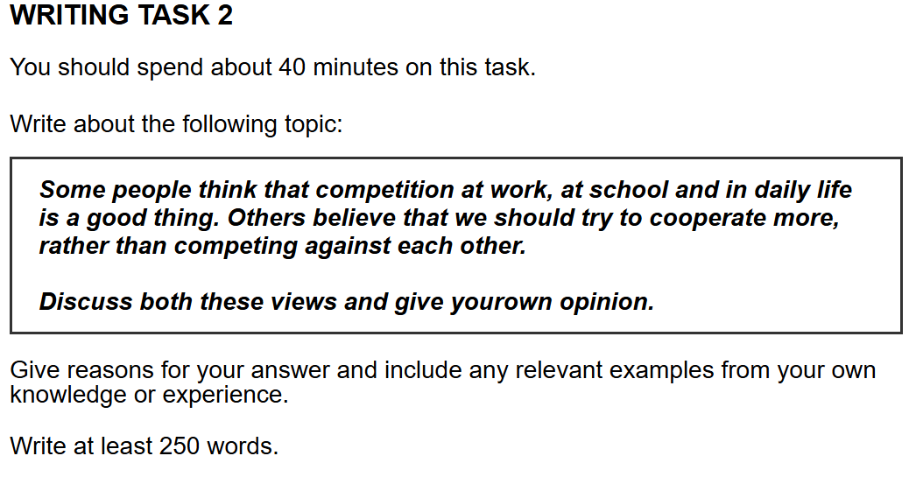

## 题目

按照这个模板，写一个简单的范文吧，告诉我写作思路，其中的好的句式和好词进行标注和分析，最后做出总结，去除作文的话题词，输出当前作文的对应的模板。

## 范文

好的，我们来严格遵循你提供的雅思大作文深度逻辑写作框架和万能观点，针对雅思真题 **C19T1 (Competition vs. Cooperation)**，创作一篇符合“词汇行文不复杂”、“高中生水平”、“350 词以内”、“7.5 分目标”的范文。

---

### **1. 写作思路解析**

这篇文章的任务是“讨论两种观点并给出你的看法 (Discuss both views and give your own opinion)”。根据我们手上的框架，这将是一篇经典的四段式文章。

- **我的立场：** 我会采取一个平衡的立场，承认竞争的价值，但最终更倾向于合作的重要性。这在“讨论双方”的题型中是一个成熟且容易论证的立场。

- **第一段 (引言):**

  1.  **背景句:** 直接点出现代社会中，竞争与合作的平衡是一个核心议题。
  2.  **争议句:** 转述题目中的两种对立观点——一些人推崇竞争，另一些人倡导合作。
  3.  **观点句:** 清晰亮出我的立场。我会先探讨竞争的好处，再论述合作的优势，并最终表明我认为合作在现代社会中更为关键。

- **第二段 (主体段 A - 论证竞争的优点):** 我将套用 **P-C-C-E-L** 模型。

  - **P (Point):** 竞争是促进个人进步和社会创新的强大动力。 (参考「经济类观点 2」：创新源泉)
  - **C (Cause):** 渴望获胜或成为最好的心态，驱使个人和组织超越极限。
  - **C (Consequence):** 这会带来更高的效率和更好的产品/服务。
  - **E (Example):** 以科技行业为例，苹果和三星之间的竞争，极大地推动了智能手机的快速发展，最终让消费者受益。
  - **L (Link):** 因此，竞争在激发潜能方面的作用是显而易见的。

- **第三段 (主体段 B - 论证合作的优点):** 再次运用 **P-C-C-E-L** 模型。

  - **P (Point):** 然而，合作对于解决复杂问题和构建和谐社会更为根本。 (参考「政府类观点 5」：国际合作解决全球问题)
  - **C (Cause):** 当今许多重大挑战，如全球变暖或科学研究，规模宏大，任何个人或单一团体都无法独立解决，必须共享知识和资源。
  - **C (Consequence):** 协作能够带来个人无法实现的突破，并建立更稳固、互助的社群关系。
  - **E (Example):** 新冠疫苗的研发就是一个绝佳例子。全球科学家、政府和企业间史无前例的合作，在极短时间内实现了共同目标。
  - **L (Link):** 这证明了共同协作在应对重大挑战时的不可或缺性，也强化了我的整体立场。

- **第四段 (结论):**
  1.  **重申观点 & 总结理由:** 用不同的话再次强调我的立场——虽然竞争是有效的激励器，但合作对于人类的长期福祉更为重要。
  2.  **展望/建议:** 我们应该鼓励良性竞争，但更应将培养合作精神放在首位，以创造一个更美好的未来。

---

### **2. 雅思 7.5 分范文**

In an era defined by rapid development, the debate over whether competition or cooperation holds more merit is a prominent feature of contemporary discourse. Some people champion the merits of constant rivalry at work and school, while others advocate for a more collaborative approach to life. This essay will first explore the rationale behind a competitive mindset, then examine the arguments for cooperation, before concluding that my own stance aligns more closely with the latter.

First and foremost, one of the most significant reasons for supporting competition is that it is **undeniably a powerful motivator** for progress. The primary driver behind this is the natural human desire to win and excel. This, in turn, gives rise to a series of positive effects, most notably increased efficiency and innovation. **A compelling illustration of this is** the technology sector. The fierce competition between companies like Apple and Samsung has pushed them to constantly improve their products and services, leading to rapid technological advancements that benefit all consumers. Hence, it becomes apparent that the drive to outperform others is a critical component of personal and societal development.

However, a principal argument supporting my view relates to the impact of cooperation on solving complex issues. This can be attributed to the fact that many of today's greatest challenges, from climate change to medical research, are too large for any single individual or organization to handle alone. As a consequence, **collaboration allows for the pooling of resources and expertise**, leading to breakthroughs that would otherwise be unattainable. For instance, we can observe this phenomenon in the context of the global response to the COVID-19 pandemic. The **unprecedented collaboration** among scientists and governments worldwide dramatically accelerated the development of vaccines. Thus, the logical progression from shared effort to significant achievement strongly validates the stance that cooperation is essential.

In conclusion, after weighing the arguments, I reaffirm my conviction that although competition can be a useful tool for stimulation, cooperation is fundamentally more vital for collective well-being and progress. The evidence that competition fuels innovation and cooperation solves complex challenges provides a solid foundation for this argument. Ultimately, society should nurture a spirit of healthy competition, while prioritizing the teaching and practice of collaboration to **foster a more sustainable and equitable future**.

**(317 words)**

---

### **3. 好词好句分析 (重点标注)**

1.  **a prominent feature of contemporary discourse**

    - **分析:** 这是一个非常地道和高级的引言短语，意思是“当代讨论中的一个显著特征”。它比 "is a hot topic" 或 "is widely discussed" 更为正式和学术化，能立刻提升文章的格调。

2.  **champion the merits of... while others advocate for...**

    - **分析:** `champion` (拥护) 和 `advocate for` (倡导) 是比 `support` 或 `think` 更精确、更有力的动词，用于转述对立观点时显得非常专业。`merits` (优点) 也是一个加分词。

3.  **undeniably a powerful motivator**

    - **分析:** `undeniably` (不可否认地) 是一个很好的副词，用于承认对方观点的合理性，体现了作者的客观和辩证思维，这是取得高分的关键。`motivator` (激励因素) 比 `reason` 更具体。

4.  **A compelling illustration of this is...**

    - **分析:** 这是引出例子的经典句型，比 `For example` 或 `For instance` 更加正式有力。`compelling illustration` (一个有说服力的例证) 增加了语言的说服力。

5.  **collaboration allows for the pooling of resources and expertise**

    - **分析:** 这是一个非常精确的表达。“汇集资源和专业知识” (`pooling of resources and expertise`) 准确地解释了合作为什么能办成大事，展示了作者对主题的深入理解。

6.  **unprecedented collaboration**

    - **分析:** `unprecedented` (史无前例的) 是一个高级形容词，用在这里极大地增强了例子的说服力，强调了新冠疫苗研发合作的特殊性和规模。

7.  **foster a more sustainable and equitable future**
    - **分析:** 这是在结论中进行升华的点睛之笔。`foster` (培养), `sustainable` (可持续的), 和 `equitable` (公平的) 都是雅思写作中的高频高分词汇，组合在一起描绘了一个积极的未来愿景，让结尾强劲有力。

---

### **4. 总结**

这篇范文严格遵守了你提供的四段式和 P-C-C-E-L 模型。它的核心成功策略在于：

- **结构清晰：** 每一段的功能都非常明确，P-C-C-E-L 的逻辑链条让论证过程层层递进，清晰易懂。
- **语言可控：** 整篇文章没有使用过于复杂或生僻的单词和句型，都是高中生可以掌握和模仿的。重点是通过精准的动词、副词和名词搭配（如上面分析的）来提升语言质量。
- **逻辑严密：** 观点(P)、原因(C)、结果(C)、例子(E)和总结(L)环环相扣，每一个句子都在为段落中心服务，最终支撑起全文的立场。
- **立场明确：** 虽然讨论了双方，但在引言和结论中都清晰地表明了作者更偏向合作的立场，满足了“give your own opinion”的要求。

这种“用自己能 100%驾驭的语言，去填充一个 100%有逻辑的结构”的方法，正是冲击 7.5 分最稳妥的路径。

---

### **5. 本文的通用模板**

请注意，这是一个根据上述范文剥离出来的“讨论双方并给出观点”题型的通用模板。

**Introduction**

In an era defined by `[相关领域的大背景]`, the debate over whether `[议题A]` or `[议题B]` holds more merit is a prominent feature of contemporary discourse. Some people champion the merits of `[观点A]`, while others advocate for `[观点B]`. This essay will first explore the rationale behind `[观点A]`, then examine the arguments for `[观点B]`, before concluding that my own stance aligns more closely with the latter/former.

**Body Paragraph A (Discussing View A)**

First and foremost, one of the most significant reasons for supporting `[观点A]` is that `[支持A的第一个理由]`. The primary driver behind this is `[解释该理由成立的深层原因]`. This, in turn, gives rise to a series of positive/negative effects, most notably `[描述最直接的结果]`. A compelling illustration of this is `[给出一个具体的例子来印证结果]`. Hence, it becomes apparent that `[重申本段观点]` is a critical component supporting `[观点A]`.

**Body Paragraph B (Discussing View B)**

However, a principal argument supporting my view relates to `[支持B的第一个理由]`. This can be attributed to the fact that `[解释该理由成立的深层原因]`. As a consequence, `[某个主体]` will experience `[描述该理由带来的直接结果]`. For instance, we can observe this phenomenon in the context of `[某个领域]`, where `[描述具体情况作为例子]`. Thus, the logical progression from `[原因]` to `[结果]` strongly validates the stance that `[重申本段观点]` is essential.

**Conclusion**

In conclusion, after weighing the arguments, I reaffirm my conviction that although `[观点A]` can be beneficial/problematic, `[观点B]` is fundamentally more vital/important/etc. The evidence that `[总结理由A]` and `[总结理由B]` provides a solid foundation for this argument. Ultimately, society should `[提出一个具有前瞻性的建议或思考]`, in order to foster a more `[积极的形容词]` and `[积极的形容词]` future.
