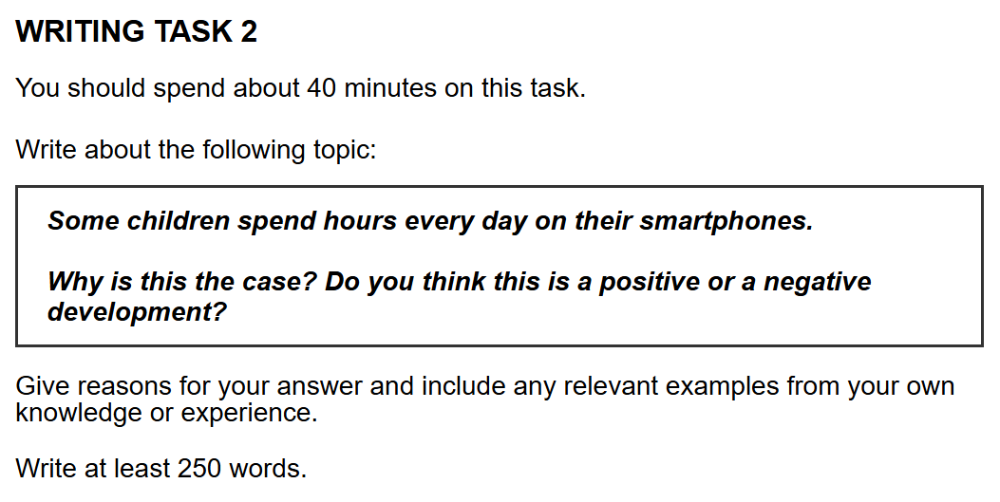

## 题目

按照这个模板，写一个简单的范文吧，告诉我写作思路，其中的好的句式和好词进行标注(用``进行标注)和分析，最后做出总结，去除作文的话题词，输出当前作文的对应的模板。

## 范文

好的，没问题。我们今天的目标非常明确：**用你提供的 P-C-C-E-L 框架，来攻克一道雅思真题**。

这道题（剑 17 Test 2）非常典型，它包含两个问题：“为什么会这样？”以及“你认为这是好事还是坏事？”。我们将采用一个清晰的立场（负面为主），并把“为什么”的原因自然地融合到论证中。

让我们一步一步来。

---

### **第一步：审题与写作思路 (Brainstorming)**

1.  **分析题目**:

    - **主题**: Some children spend hours every day on their smartphones. (一些孩子每天在手机上花好几个小时)
    - **问题 1**: Why is this the case? (为什么会这样？)
    - **问题 2**: Do you think this is a positive or a negative development? (你认为这是积极的还是消极的？)

2.  **确定立场**:

    - 为了让论证更集中有力，我建议我们采取明确的立场：**这是一个负面的发展 (a negative development)**。这样文章的逻辑会非常清晰。

3.  **构思大纲 (运用你的框架)**:
    - **引言**:
      - 背景句：科技时代，智能手机在年轻人中普及。
      - 点题句：转述孩子沉迷手机的现象。
      - 观点句：明确指出这是一个负面发展，并预告两个主要原因：1. 危害身心健康；2. 削弱社交能力。
    - **主体段 A (PCCEL - 论证对健康的危害)**:
      - **P (Point)**: 过度使用手机危害孩子的身心健康。
      - **C (Cause)**: 为什么会这样？因为手机上的内容（游戏、视频）设计得极具吸引力，导致孩子久坐不动。这是对题目中 "Why is this the case?" 的一个回应。
      - **C (Consequence)**: 结果是什么？导致视力下降、肥胖等身体问题，以及因社交攀比产生的心理焦虑。
      - **E (Example)**: 比如，现在很多孩子小小年纪就戴上了眼镜，同时，校园里因为社交媒体压力而产生的心理问题也越来越多。
      - **L (Link)**: 因此，对健康的威胁是这一趋势是负面的有力证明。
    - **主体段 B (PCCEL - 论证对社交能力的危害)**:
      - **P (Point)**: 沉迷手机还会阻碍孩子关键人际交往能力的正常发展。
      - **C (Cause)**: 为什么？因为虚拟交流取代了真实的面对面互动。这也是对 "Why is this the case?" 的另一个回应，即孩子们被虚拟世界吸引。
      - **C (Consequence)**: 结果是什么？孩子无法学会解读他人的肢体语言和语气，这在真实世界的沟通中至关重要。
      - **E (Example)**: 比如，我们经常看到一群青少年聚在一起，但他们却各自看手机，而不是互相交谈。
      - **L (Link)**: 所以，从削弱社交能力这一点来看，这个趋势显然是负面的。
    - **结论**:
      - 重申观点：再次强调儿童过度使用手机是负面的。
      - 总结理由：因为它既损害健康，又妨碍社交技能。
      - 提出建议：呼吁家长和教育者共同引导孩子健康地使用科技。

你看，通过这个框架，我们的思路变得非常清晰，逻辑链条也很完整。接下来，我们就把这些思路变成一篇完整的范文。

---

### **第二步：范文与解析**

In an era `defined by rapid technological advancement`, it is increasingly common to see children spending hours every day on their smartphones. Personally, I wholeheartedly believe this is a `negative development`, primarily because it poses significant risks to their health and `hinders` the development of their social skills.

First and foremost, one of the most significant reasons for my position is that excessive smartphone use is `detrimental` to a child's physical and mental well-being. The primary driver behind this is the fact that children are often exposed to highly engaging but passive content, such as games and videos, which leads to a `sedentary lifestyle`. As a consequence, they may suffer from health issues such as poor eyesight and obesity. Mentally, the constant need for online validation can lead to anxiety and low `self-esteem`. For instance, a recent study reveals a growing number of school-aged children now require glasses at a younger age, and psychologists report a rise in anxiety cases linked to `online social pressures`. Hence, it becomes apparent that the health `implications` of this trend are too serious to ignore.

Furthermore, a principal argument supporting my view relates to the impact of smartphone overuse on children's `interpersonal skills`. This can be attributed to the nature of `virtual communication`, which often replaces genuine, face-to-face interaction. This, in turn, gives rise to a situation where children are less capable of reading social cues, like body language and tone of voice, which are crucial for effective communication. A `compelling illustration` of this is observing a group of teenagers sitting together, each `engrossed in` their own phone instead of talking to one another. Thus, the logical progression from replacing real-world conversation with screen time to weakened social abilities `strongly validates` the stance that this is a negative development.

In conclusion, I reaffirm my conviction that children's prolonged daily use of smartphones is a harmful trend. It not only `jeopardizes` their health but also impairs their ability to `interact meaningfully` with others. Ultimately, it is `imperative` that parents and educators work together to guide children towards a more balanced and healthier relationship with technology.

_(Word Count: 318)_

---

### **第三步：好词好句解析**

- `defined by rapid technological advancement` (由技术快速发展所定义的): 一个很地道的开场白，用来描述我们所处的时代背景。
- `negative development` (负面的发展): 直接回答题目问题的核心词组。
- `hinders` (阻碍): 一个比 `stop` 或 `prevent` 更书面的动词，表示“妨碍，阻碍”。
- `detrimental` (有害的): 这是 `harmful` 或 `bad` 的高级同义词，非常适合用在学术写作中。
- `sedentary lifestyle` (久坐的生活方式): 描述现代生活健康问题时非常精准和常用的一个词组。
- `self-esteem` (自尊心): 心理健康方面的一个核心词汇。
- `online social pressures` (线上的社交压力): 非常具体地指出了问题的来源，比只说 `pressure` 要好。
- `implications` (潜在影响，后果): 一个比 `results` 或 `effects` 更正式的词，通常指不太明显的、深远的影响。
- `interpersonal skills` (人际交往能力): 教育和社交话题下的核心词汇。
- `virtual communication` (虚拟交流): 与 `face-to-face interaction`（面对面互动）形成鲜明对比，论证有力。
- `compelling illustration` (一个有说服力的例子): 用来引出例子的经典句式，比 `For example` 稍微正式一些。
- `engrossed in` (沉浸于...，全神贯注于...): 非常生动地描绘出孩子们专注于手机的状态。
- `strongly validates` (有力地证实): 一个强有力的动词短语，用在 L(Link)部分，自信地重申自己的观点。
- `jeopardizes` (危及，损害): `endanger` 或 `harm` 的高级同义词，非常有力。
- `interact meaningfully` (有意义地互动): 精准地描述了高质量社交的本质。
- `imperative` (极其重要的，必要的): 比 `important` 语气更强烈的词，适合在结论中提出建议时使用。

---

### **第四步：你的专属作文模板**

现在，我们把这篇范文的“血肉”（具体话题内容）剥离，只剩下“骨架”（逻辑和句型），你就得到了一个可以应用于许多“利弊/现象分析”类题目的模板。

**[你的专属 7.5 分 Task 2 模板]**

In an era `defined by [相关领域的宏观趋势]`, it is increasingly common to see `[重述题目中的现象]`. Personally, I wholeheartedly believe this is a `negative/positive development`, primarily because `[你的理由一]` and `[你的理由二]`.

First and foremost, one of the most significant reasons for my position is that `[阐述你的理由一]`. The primary driver behind this is the fact that `[解释该现象出现的具体原因]`. As a consequence, `[描述该原因会带来的直接结果]`. For instance, `[给出一个具体的例子来支撑你的结果，可以是数据、观察或普遍认知]`. Hence, it becomes apparent that the `implications` of this trend are too serious/significant to ignore.

Furthermore, a principal argument supporting my view relates to `[阐述你的理由二]`. This can be attributed to `[解释该现象出现的另一个具体原因]`. This, in turn, gives rise to a situation where `[描述这个原因会带来的另一个直接结果]`. A `compelling illustration` of this is `[给出一个具体的例子来支撑你的第二个结果]`. Thus, the logical progression from `[原因]` to `[结果]` `strongly validates` the stance that this is a `negative/positive` development.

In conclusion, I reaffirm my conviction that `[用不同的话重申你的核心观点]`. It not only `[总结理由一的负面/正面影响]` but also `[总结理由二的负面/正面影响]`. Ultimately, it is `imperative` that `[相关方，如 a government, individuals, society]` should `[提出一个简洁有力的建议或展望]`.

---

好了，今天的课程就到这里。我们从审题开始，搭建了清晰的逻辑框架，然后填充了内容，最后还为你提炼出了一个高度可复用的模板。你觉得这个过程清晰吗？有没有哪个环节你还想了解得更深入一些？随时都可以问我！
