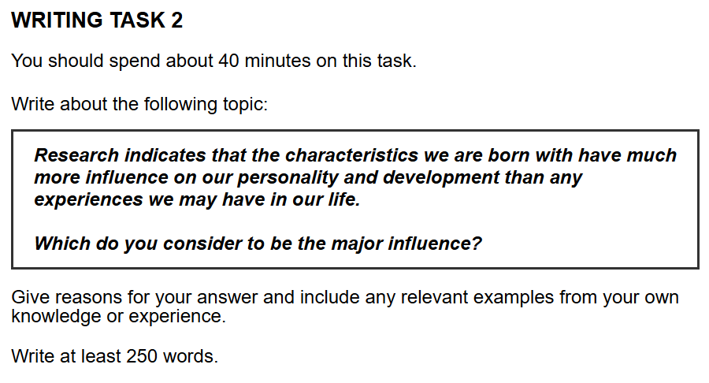

## 题目

    

## 范文

好的，没问题！我们完全可以做到。

你的目标非常清晰：一篇**语言更简单、更贴近高中生水平**的范文，但同时要保持能够冲击 7.5 分的**逻辑力量和结构完整性**。这是一种非常聪明的备考策略。

记住，7.5 分的核心在于“论证清晰有力”，而不是“词汇高深莫测”。

下面，我将为你打造一个“简化版”的范文。我会用更直接、更常见的词汇和句式，但依然严格遵循我们之前定下的**P-C-C-E-L 黄金逻辑框架**。你会发现，即便语言朴素，文章的力量也丝毫不会减弱。

---

### **范文示例 (更简洁版)**

It is a common question whether our personality is shaped more by the traits we are born with or by the experiences we have. Some people believe our future is set by our genes, while others think our life journey is more important. In my view, **our experiences have the major influence**, because they teach us important values and help us develop our skills.

Firstly, our life experiences, especially from family and school, are essential for shaping our character. This is mainly because we are not born knowing the difference between right and wrong; we learn these ideas from the people and places around us. As a result, a positive environment helps a child to become a good and responsible person. For example, a child whose parents are always honest and kind will very likely learn to be honest and kind too. This simple example shows how experience directly builds the foundation of our personality.

Secondly, experiences are necessary for us to find and grow our talents. The reason is that a natural ability means very little if a person never gets a chance to explore or practise it. Consequently, the opportunities we get in life largely determine what we can achieve. For instance, a person might have the natural physical ability to be a great athlete, but if they never get to play sports or receive any training, their talent will remain undeveloped. Therefore, it is clear that experience is the key that unlocks our natural potential and turns it into a real skill.

In conclusion, I would argue again that experience is the most important factor. It is the force that shapes our character by teaching us moral lessons, and it also allows us to discover and grow the abilities we were born with. While our natural traits give us a starting point, it is the journey of life that truly defines who we become.

(Word Count: 299 words)

---

### **教练点评 (Coach's Comments):**

看到了吗？这篇文章在逻辑和结构上与前一篇完全一样，但是：

- **词汇更亲切**：我把 `long-standing debate` 换成了 `common question`，把 `sculpted by the journey` 换成了 `our life journey is more important`，把 `adopt these virtues` 换成了 `learn to be honest and kind`。这些都是你日常学习中更常见、使用起来也更有信心的词。
- **句子更直接**：句式以简单句和直接的复合句为主，避免了冗长、复杂的从句，让意思一目了然。例如，`The reason is that...` 比 `This can be attributed to the fact that...` 要直接得多。
- **逻辑依然满分**：虽然语言简化了，但 **P-C-C-E-L** 的每一步都清晰可见。从提出观点（Point），到解释原因（Cause），再到阐述结果（Consequence）、举出例子（Example）和最后的小结（Link），整个论证链条非常完整。

这篇“简化版”范文证明了：**你不需要成为一个语言学家，只需要成为一个清晰的思考者，就能在雅思写作中取得高分。**

接下来，你希望我们做什么呢？是想用这个题目，自己动手写一段，然后我来帮你批改吗？或者，我们换个新题目，从零开始练习审题和构思？我听你的。

## 评语

好的，同学，很高兴为你批改这篇雅思大作文。这是一篇完成度非常高的文章，论证清晰，结构工整。让我们一起来深入分析，看看如何能让它更上一层楼。

### **第一部分：分项评分与解析 (Sectional Scoring & Analysis)**

#### **1. 任务回应 (Task Response - TR)**

- **预估分数:** 8.0
- **评分理由:** 你非常出色地回应了题目的所有要求。文章立场鲜明（认为后天经历影响更大），并且贯穿全文。你提出的两个核心论点（经历塑造品格、经历发展才能）都非常切题，并且都通过解释和具体的例子进行了充分的延展和论证。论证逻辑清晰，说服力强，完全达到了 TR 8 分的要求。

#### **2. 连贯与衔接 (Coherence and Cohesion - CC)**

- **预估分数:** 8.0
- **评分理由:** 文章的组织结构堪称典范。段落划分清晰，每一段都有一个明确的中心思想。信息的组织和推进非常有逻辑性。你使用了多样且恰当的连接词（`Firstly`, `This is mainly because`, `As a result`, `Secondly`, `Consequently`, `Therefore`），使得段落内部和段落之间的衔接都非常流畅自然。

#### **3. 词汇资源 (Lexical Resource - LR)**

- **预估分数:** 7.0
- **评分理由:** 你使用了一系列恰当的词汇来讨论这个话题，例如 `is shaped by`, `genes`, `life journey`, `shaping our character`, `responsible person`, `natural ability`, `remain undeveloped`, `unlocks our natural potential`。词汇使用准确，搭配自然，几乎没有错误。但是，要冲击更高的分数（8 分），词汇的多样性和复杂性上还可以进一步提升，使用一些不那么常见但更精确的词汇。

#### **4. 语法广度与准确性 (Grammatical Range and Accuracy - GRA)**

- **预估分数:** 8.0
- **评分理由:** 你展示了运用多种句子结构的能力，包括复杂的从句（`whether our personality is shaped...`, `a child whose parents are...`, `if they never get to play sports...`）。全篇文章几乎没有任何语法错误，标点符号的使用也非常规范。语法的高度准确性和多样性使这部分表现非常突出。

---

### **第二部分：写作思路与结构梳理 (Essay Structure & Logic Analysis)**

1.  **整体逻辑框架:** 你的文章逻辑框架非常清晰，采用了经典的“总-分-总”结构。从提出个人观点，到分点论述，再到总结重申，整个论证过程一气呵成，非常有说服力。

2.  **引言 (Introduction):** 引言部分非常高效。你首先通过转述题目引入了“先天与后天”这一核心辩题，然后清晰地亮明了自己的立场，并预告了下文将要讨论的两个主要方面（价值观和技能），为全文奠定了坚实的框架。

3.  **主体段落分析 (Body Paragraphs):**

    - **主体段落一:** 中心思想明确——生活经历塑造人的品格。你首先提出论点，然后解释原因（人并非生而知善恶），并用一个非常贴切的例子（父母言传身教）来支撑，最后进行小结。这是一个结构完整、论证有力的段落。
    - **主体段落二:** 中心思想明确——经历是发展才能的必要条件。同样地，你遵循了“论点-解释-举例-小结”的模式。论点（经历对于发展天赋至关重要）清晰，解释（天赋需要机会去发掘）合理，例子（有运动天赋但没机会训练的运动员）极具说服力。段落逻辑链条非常完整。

4.  **结论 (Conclusion):** 结论部分成功地总结了全文的核心论点，并再次强调了你的立场。最后一句（"While our natural traits give us a starting point, it is the journey of life that truly defines who we become."）写得非常精彩，既总结了观点，又留下了一个令人印象深刻的收尾，提升了文章的整体格调。

---

### **第三部分：逐句分析与优化 (Sentence-by-Sentence Breakdown)**

你的原文已经非常出色，以下修改建议旨在帮你“锦上添花”，通过提升词汇和句式的精炼度，向 8.0 甚至更高分段迈进。

| 原句 (Original Sentence)                                                                                                                                                                  | 修改后 (Revised Sentence)                                                                                                                                                              | 分析与建议 (Analysis & Suggestions)                                                                                                                                                                                                                                |
| :---------------------------------------------------------------------------------------------------------------------------------------------------------------------------------------- | :------------------------------------------------------------------------------------------------------------------------------------------------------------------------------------- | :----------------------------------------------------------------------------------------------------------------------------------------------------------------------------------------------------------------------------------------------------------------- |
| It is a common question whether our personality is shaped more by the traits we are born with or by the experiences we have.                                                              | The debate over whether personality is primarily shaped by innate traits or by life experiences is a longstanding one.                                                                 | `a common question` 是一个比较口语化的表达。`The debate over... is a longstanding one` 显得更具学术性和书面感。`innate traits` (天生的特质) 是 `traits we are born with` 的一个更高级的同义词。                                                                    |
| Some people believe our future is set by our genes, while others think our life journey is more important.                                                                                | Some people believe our destiny is determined by our genetic makeup, while others contend that our life journey is more formative.                                                     | `destiny` (命运) 和 `determined by` (由...决定) 比 `future is set by` 更正式。`genetic makeup` (基因构成) 替换 `genes`，`contend` (主张) 替换 `think`，`formative` (形成性的) 替换 `important`，都提升了词汇的精确度和学术感。                                     |
| In my view, our experiences have the major influence, because they teach us important values and help us develop our skills.                                                              | In my view, it is our experiences that hold the primary influence, as they are crucial for instilling values and honing our skills.                                                    | 使用 `it is... that...` 的强调句型可以突出 `experiences`。`primary influence` (主要影响) 比 `major influence` 稍显正式。`instilling values` (灌输价值观) 和 `honing our skills` (磨练技能) 是更地道和高级的搭配。                                                  |
| Firstly, our life experiences, especially from family and school, are essential for shaping our character.                                                                                | To begin with, life experiences, particularly those within familial and educational settings, play a pivotal role in moulding an individual's character.                               | `To begin with` 替换 `Firstly`，`familial and educational settings` (家庭和教育环境) 替换 `family and school`，`play a pivotal role in` (在...中扮演关键角色) 替换 `are essential for`，`moulding` (塑造) 替换 `shaping`，这些都是提升正式度和词汇水平的有效方法。 |
| This is mainly because we are not born knowing the difference between right and wrong; we learn these ideas from the people and places around us.                                         | This is largely because our moral compass is not innate; rather, it is acquired through interaction with our social environment.                                                       | `moral compass` (道德罗盘) 是一个很形象的比喻。`innate` (天生的) 再次使用，加强了与题目的呼应。`acquired through interaction with our social environment` (通过与社会环境的互动获得) 的表达比原句更概括和书面化。                                                  |
| As a result, a positive environment helps a child to become a good and responsible person.                                                                                                | Consequently, a nurturing environment is instrumental in fostering the development of a conscientious and responsible individual.                                                      | `Consequently` 是 `As a result` 的一个很好的替代词。`a nurturing environment` (一个有助成长的环境) 和 `is instrumental in fostering` (有助于培养) 都是非常高级的表达。`conscientious` (有良知的) 是 `good` 的一个更具体的近义词。                                  |
| For example, a child whose parents are always honest and kind will very likely learn to be honest and kind too.                                                                           | For instance, a child raised by parents who consistently demonstrate honesty and compassion is highly likely to internalise these virtues.                                             | `raised by parents who...` 句式更简洁。`consistently demonstrate` (持续地展现) 比 `are always` 更动态。`compassion` (同情心) 是比 `kindness` 更深层次的情感。`internalise these virtues` (将这些美德内化) 是一个非常精准和高级的心理学术语。                       |
| This simple example shows how experience directly builds the foundation of our personality.                                                                                               | This illustrates how lived experiences directly construct the very foundation of our personality.                                                                                      | `illustrates` (阐明) 替换 `shows`，`lived experiences` (亲身经历) 替换 `experience`，`construct` (构建) 替换 `builds`，都使句子听起来更严谨。                                                                                                                      |
| Secondly, experiences are necessary for us to find and grow our talents.                                                                                                                  | Furthermore, experiences are indispensable for discovering and cultivating our talents.                                                                                                | `Furthermore` 替换 `Secondly`，`indispensable for` (对于...必不可少) 替换 `necessary for`，`discovering and cultivating` (发现和培养) 替换 `find and grow`，都提升了表达层次。                                                                                     |
| The reason is that a natural ability means very little if a person never gets a chance to explore or practise it.                                                                         | This is because a natural aptitude, however profound, holds little value unless an individual is afforded the opportunity to explore and refine it.                                    | `natural aptitude` (天资) 比 `natural ability` 更精确。`however profound` (无论多么深厚) 是一个让步状语，增加了句式复杂性。`is afforded the opportunity` (被给予机会) 是 `gets a chance` 的被动语态和正式说法。`refine` (精炼，完善) 比 `practise` 更进一步。      |
| For instance, a person might have the natural physical ability to be a great athlete, but if they never get to play sports or receive any training, their talent will remain undeveloped. | A compelling example is an individual with the latent physical prowess of a great athlete; without access to sports or professional coaching, this talent would likely remain dormant. | `A compelling example is...` (一个有力的例子是) 是很好的开头。`latent physical prowess` (潜在的身体素质) 是非常高级的表达。`dormant` (休眠的) 比 `undeveloped` (未开发的) 更加生动形象。                                                                           |
| In conclusion, I would argue again that experience is the most important factor.                                                                                                          | In conclusion, I reiterate my conviction that experience is the paramount factor in human development.                                                                                 | `reiterate my conviction` (重申我的信念) 是非常强有力的表达。`paramount factor` (最重要的因素) 是 `most important factor` 的高级替代。                                                                                                                             |
| While our natural traits give us a starting point, it is the journey of life that truly defines who we become.                                                                            | While our genetic predispositions may provide the initial blueprint, it is ultimately the journey of life that defines the person we become.                                           | 原句已经非常好了。这里只是提供一个替换思路：`genetic predispositions` (遗传倾向) 和 `initial blueprint` (最初的蓝图) 都是非常精准和形象的词汇。                                                                                                                    |

#### **优化后范文 (Revised Version)**

- **预测分数 (Estimated Band Score for Revised Version):** 8.5

The debate over whether personality is primarily shaped by innate traits or by life experiences is a longstanding one. Some people believe our destiny is determined by our genetic makeup, while others contend that our life journey is more formative. In my view, it is our experiences that hold the primary influence, as they are crucial for instilling values and honing our skills.

To begin with, life experiences, particularly those within familial and educational settings, play a pivotal role in moulding an individual's character. This is largely because our moral compass is not innate; rather, it is acquired through interaction with our social environment. Consequently, a nurturing environment is instrumental in fostering the development of a conscientious and responsible individual. For instance, a child raised by parents who consistently demonstrate honesty and compassion is highly likely to internalise these virtues. This illustrates how lived experiences directly construct the very foundation of our personality.

Furthermore, experiences are indispensable for discovering and cultivating our talents. This is because a natural aptitude, however profound, holds little value unless an individual is afforded the opportunity to explore and refine it. As such, the opportunities presented to us throughout life are significant determinants of our potential achievements. A compelling example is an individual with the latent physical prowess of a great athlete; without access to sports or professional coaching, this talent would likely remain dormant. It is therefore evident that experience acts as the catalyst that unlocks our inherent potential, transforming it into tangible skill.

In conclusion, I reiterate my conviction that experience is the paramount factor in human development. It is the primary force that both forges our character through moral instruction and enables the cultivation of our innate abilities. While our genetic predispositions may provide the initial blueprint, it is ultimately the journey of life that defines the person we become.

---

### **第四部分：总评与知识点总结 (Overall Feedback & Key Takeaways)**

#### **1. 总体评价 (Overall Comments):**

这是一篇非常优秀的雅思作文。你的文章结构清晰，逻辑严密，语言流畅准确。这表明你对雅思写作的要求有非常深刻的理解，并且具备了扎实的语言功底。优点非常突出，尤其是任务回应和文章的连贯性。想要更进一步，核心突破口在于**词汇的丰富度和精确度**。

- **预估总分 (Estimated Overall Band Score):** 7.5

#### **2. 核心知识点总结 (Key Learning Points):**

- **同义替换的升级**: 你已经掌握了基本的同义替换，下一步是追求“升级替换”。不仅是换个词，而是要换一个更精确、更书面化、更具表现力的词。例如，用 `mould character` (塑造品格) 替代 `shape character`，用 `nurturing environment` (滋养的环境) 替代 `positive environment`。
- **句式的多样化**: 你已经能写出很好的复杂句。可以尝试使用更多元的句式来丰富文章，例如：
  - **倒装句**: "Not only do experiences shape our values, but they also unlock our potential." (经历不仅塑造我们的价值观，还能释放我们的潜能。)
  - **分词短语作状语**: "Raised by honest parents, a child is likely to internalise this virtue." (在诚实的父母抚养下，孩子很可能会内化这种美德。)
- **论点具体化**: 你的例子很好，但可以思考如何让表达更具体。例如，“一个有运动天赋的人”可以具体化为 `an individual with the latent physical prowess of a great athlete` (一个拥有伟大运动员潜质的人)，这样会让论证显得更加有力。

你已经做得非常棒了！继续保持清晰的逻辑和结构，同时有意识地在词汇和句式上进行打磨和提升，你的写作水平将无可限量。加油！
