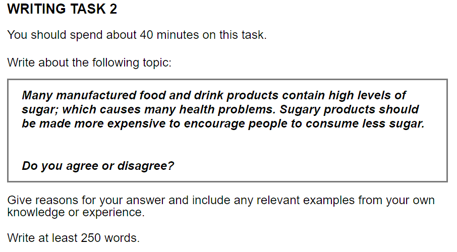

## 题目

    

按照这个模板，写一个只有简单词汇的范文吧，不超过300词，告诉我写作思路，其中的好的句式和好词进行标注(用``进行标注)和分析，最后做出总结，去除作文的话题词，输出当前作文的对应的模板。

### 我的作文
The quantity of sugar added to food has become a hot topic in society, as too much sugar can bring potential health problems. An effective way to optimize the current situation is to increase the price of high-sugar products, which encourages people to consume less sugar. Personally, I wholeheartedly agree with this view, because it offers significant benefits to keep healthy and gain nutritious knowledge unpromptedly.

First and foremost, less sugar is vital to maintain physical health. The primary driver behind this is the fact that surplus sugar may damage the blood sugar level. This, in turn, gives rise to a series of effects, most notably that people gain weight, their physical condition declines, and they are more likely to get sick. For example, the daily consumption of sugary drinks like soda is often linked to a higher risk of developing diseases such as diabetes. Hence, making these products more expensive is a direct way to safeguard public health.

Furthermore, this policy can serve as an important educational tool. This is because a price increase acts as a clear warning signal from health authorities about the dangers of excessive sugar. As a result, consumers are prompted to think about their choices and may start to pay more attention to nutrition labels on food packaging. For instance, when a parent sees that a sugary cereal costs much more, they might be encouraged to check the sugar content and choose a healthier alternative, like oatmeal. Thus, this pricing strategy not only discourages a purchase but also raises public awareness about healthy eating.

In conclusion, I reaffirm my conviction that increasing the price of sugary products is a wise and effective policy. Based on its clear ability to both protect people from diet-related illnesses and promote nutritional knowledge, it is a practical and necessary step towards building a healthier society.

### 优化方法

当然可以！你这篇作文写得非常棒！结构工整，逻辑清晰，完全遵循了我们之前讨论过的框架，这说明你已经掌握了雅思写作的核心方法。我的任务是在你这个坚实的基础上，帮你把语言打磨得更精致，让它从一篇7分水平的好作文，向7.5分甚至8分的优秀作文迈进。

我们还是老规矩，分三步走：

1.  **分析你的写作思路**
2.  **提供一个优化后的版本**
3.  **对优化版本进行逐句分析，让你明白“为什么这么改更好”**

---

### **1. 你的写作思路分析 (非常清晰！)**

* **审题与立场：** 你精准地抓住了题目的核心——“对高糖产品涨价以减少糖分摄入”，并迅速确立了“完全同意”的清晰立场。
* **立论（核心论点）：** 你找到了两个非常好的、且角度不同的分论点来支撑你的立场：
    1.  **直接影响：** 涨价能直接促进公众健康。这是一个从“结果”层面出发的论点。
    2.  **间接影响：** 涨价能间接地提升公众的营养知识。这是一个从“认知”层面出发的论点，非常有深度。
* **结构：** 你严格地使用了我们讨论过的“引言 + 主体段A + 主体段B + 结论”的四段式结构，并且在主体段内部完美地嵌入了 **P-C-C-E-L** 模型。这使得你的文章逻辑链条非常完整，论证有力。

总而言之，你的“蓝图”画得非常好，下面我们就在这幅蓝图上，用更漂亮的“材料”来建造这栋“房子”。

---

### **2. 优化后版本 (Polished Version)**

The amount of sugar in food products has become a **subject of widespread concern**, as excessive consumption can **pose significant health risks**. One effective strategy to **address this issue** is to increase the price of sugary products, thereby encouraging reduced consumption. Personally, I wholeheartedly endorse this policy, as it is beneficial for both **safeguarding public health** and **fostering greater nutritional awareness**.

First and foremost, reducing sugar intake is **vital for maintaining physical well-being**. The primary reason is that **excessive sugar intake can disrupt the body's metabolism**, particularly blood sugar regulation. This, in turn, can lead to a series of adverse effects, most notably **weight gain, a decline in physical fitness, and an increased susceptibility to illness**. For example, the routine consumption of sugary drinks like soda is strongly linked to a higher risk of developing chronic conditions such as type 2 diabetes. Therefore, making these products more expensive is a direct and pragmatic measure to **protect public health**.

Furthermore, this fiscal policy can **act as a powerful educational instrument**. This is because a price hike serves as **a clear fiscal signal** from authorities about the inherent health dangers of these items. Consequently, consumers are prompted to reconsider their purchasing habits and are more likely to **scrutinize nutrition labels** on packaging. A compelling illustration is a parent who, upon noticing the higher price of a sugary cereal, is motivated to assess its sugar content and opt for a healthier, more affordable alternative like oatmeal. Thus, this pricing strategy not only **deters impulsive purchases** but also effectively **raises public consciousness** regarding healthy eating.

In conclusion, I reaffirm my conviction that raising the price of high-sugar products is a prudent and effective policy. Based on its dual ability to **protect citizens from diet-related diseases** and **enhance their nutritional knowledge**, it stands as a practical and vital step towards building a healthier society.

---

### **3. 逐句分析与优化讲解 (Sentence-by-Sentence Analysis)**

我们一句一句来看，为什么优化后的版本在得分上会更有优势。

**第一段：引言 (Introduction)**

* **原文:** The quantity of sugar added to food has become a hot topic in society, as too much sugar can bring potential health problems.
* **优化:** The amount of sugar in food products has become a **subject of widespread concern**, as excessive consumption can **pose significant health risks**.
* **讲解:**
    * `hot topic` (热门话题) 是一个略显口语化的表达。`a subject of widespread concern` (一个广受关注的话题) 是更书面、更学术的说法。
    * `too much sugar` 不如 `excessive consumption` (过度摄入) 精准，后者强调了“行为”。
    * `bring health problems` (带来健康问题) 是正确的，但 `pose significant health risks` (构成重大健康风险) 表达的语气更强，更符合论述文的风格。`pose a risk/threat` 是非常地道的搭配。

* **原文:** An effective way to optimize the current situation is to increase the price of high-sugar products, which encourages people to consume less sugar.
* **优化:** One effective strategy to **address this issue** is to increase the price of sugary products, thereby encouraging reduced consumption.
* **讲解:**
    * `optimize the current situation` (优化当前状况) 的说法有点泛。`address this issue` (解决这个问题) 是更直接、更常用的学术表达。
    * 用 `thereby` (从而) 来连接主句和结果状语，比用 `which` 引导的非限制性定语从句在结构上更简洁、更高级。

* **原文:** Personally, I wholeheartedly agree with this view, because it offers significant benefits to keep healthy and gain nutritious knowledge unpromptedly.
* **优化:** Personally, I wholeheartedly endorse this policy, as it is beneficial for both **safeguarding public health** and **fostering greater nutritional awareness**.
* **讲解:**
    * `endorse` (赞同，支持) 是 `agree with` 的一个更强有力的同义词。
    * `keep healthy` (保持健康) 不如 `safeguarding public health` (捍卫公众健康) 的角度宏大和正式。
    * `gain nutritious knowledge unpromptedly` (不被提示地获得营养知识) 这个表达有些拗口。`fostering greater nutritional awareness` (培养更强的营养意识) 是更地道、更准确的说法。`foster` (培养) 是一个非常棒的动词。

**第二段：主体段 A (Body Paragraph A)**

* **原文:** First and foremost, less sugar is vital to maintain physical health.
* **优化:** First and foremost, reducing sugar intake is **vital for maintaining physical well-being**.
* **讲解:**
    * `less sugar` (更少的糖) 做主语，不如 `reducing sugar intake` (减少糖分摄入) 这个动名词短语更具动作感和准确性。
    * `physical health` (身体健康) 和 `physical well-being` (身体安康/福祉) 意思相近，但 `well-being` 涵盖的范围更广，是雅思写作中的高分词汇。

* **原文:** The primary driver behind this is the fact that surplus sugar may damage the blood sugar level.
* **优化:** The primary reason is that **excessive sugar intake can disrupt the body's metabolism**, particularly blood sugar regulation.
* **讲解:**
    * `surplus sugar` (多余的糖) 不如 `excessive sugar intake` (过量的糖分摄入) 精准。
    * `damage the blood sugar level` (损害血糖水平) 的表达不够科学。`disrupt the body's metabolism` (扰乱身体的新陈代谢) 是更专业和准确的说法，后面用 `particularly` (尤其是) 来具体点明血糖调节，更具说服力。

* **原文:** This, in turn, gives rise to a series of effects, most notably that people 体重越来越重，身体素质下降，容易生病。(people gain weight, their physical condition declines, and they are more likely to get sick.)
* **优化:** This, in turn, can lead to a series of adverse effects, most notably **weight gain, a decline in physical fitness, and an increased susceptibility to illness**.
* **讲解:**
    * `adverse effects` (负面影响) 比 `effects` 更明确。
    * `an increased susceptibility to illness` (对疾病的易感性增加) 是 “容易生病” 的一个非常高级和书面的表达方式。`susceptibility` (易感性) 是一个亮眼的加分词。

* **原文:** For example, the daily consumption of sugary drinks like soda is often linked to a higher risk of developing diseases such as diabetes.
* **优化:** For example, the routine consumption of sugary drinks like soda is strongly linked to a higher risk of developing chronic conditions such as type 2 diabetes.
* **讲解:**
    * `routine` (常规的) 比 `daily` (每天的) 适用范围更广。`chronic conditions` (慢性病) 比 `diseases` 更具体，因为糖尿病是一种典型的慢性病。`type 2 diabetes` (二型糖尿病) 比 `diabetes` 更精确。这些细节都体现了你知识的深度。

* **原文:** Hence, making these products more expensive is a direct way to safeguard public health.
* **优化:** Therefore, making these products more expensive is a direct and **pragmatic measure** to protect public health.
* **讲解:**
    * `pragmatic measure` (务实的措施) 增加了细节，强调了这项措施的可行性和现实意义，比 `way` (方式) 更具体。

**第三段：主体段 B (Body Paragraph B)**

* **原文:** Furthermore, this policy can serve as an important educational tool.
* **优化:** Furthermore, this fiscal policy can **act as a powerful educational instrument**.
* **讲解:**
    * `fiscal policy` (财政政策) 点明了“涨价”的本质，比 `policy` 更精确。
    * `act as` (担当，扮演...的角色) 与 `serve as` 类似，但 `powerful educational instrument` (强有力的教育工具) 比 `important educational tool` 语气更强。

* **原文:** This is because a price increase acts as a clear warning signal...
* **优化:** This is because a price hike serves as **a clear fiscal signal**...
* **讲解:**
    * `price hike` (价格上涨) 是 `price increase` 的一个生动替换。`fiscal signal` (财政信号) 再次与“财政政策”呼应，体现了用词的连贯性和专业性。

* **原文:** ...and may start to pay more attention to nutrition labels on food packaging.
* **优化:** ...and are more likely to **scrutinize nutrition labels** on packaging.
* **讲解:**
    * `scrutinize` (仔细检查) 是一个非常高级的动词，远比 `pay attention to` (注意) 或 `read carefully` (仔细阅读) 的程度要深，描绘的画面感更强。

* **原文:** ...they might be encouraged to check the sugar content and choose a healthier alternative...
* **优化:** ...is motivated to assess its sugar content and opt for a healthier, more affordable alternative...
* **讲解:**
    * `is motivated to` (被激励去做) 比 `is encouraged to` (被鼓励去做) 的内在驱动力更强。
    * `assess` (评估) 比 `check` (检查) 更正式。`opt for` (选择) 是 `choose` 的一个很好的书面语替换。

* **原文:** Thus, this pricing strategy not only discourages a purchase but also raises public awareness...
* **优化:** Thus, this pricing strategy not only **deters impulsive purchases** but also effectively **raises public consciousness** regarding healthy eating.
* **讲解:**
    * `deters impulsive purchases` (阻止冲动性购买) 比 `discourages a purchase` (不鼓励购买) 更具体，点出了消费行为的心理。
    * `public consciousness` (公众意识) 是 `public awareness` 的同义替换，可以在一篇文章中交替使用，避免重复。

**第四段：结论 (Conclusion)**

* **原文:** ...based on its clear ability to both protect people from diet-related illnesses and promote nutritional knowledge...
* **优化:** ...based on its dual ability to **protect citizens from diet-related diseases** and **enhance their nutritional knowledge**...
* **讲解:**
    * `enhance` (提升，增强) 是 `promote` (促进) 的一个很好的同义词。
    * `diet-related diseases` (与饮食相关的疾病) 比 `illnesses` 更具体，再次与主题挂钩。

* **原文:** ...it is a practical and necessary step towards building a healthier society.
* **优化:** ...it **stands as** a practical and vital step towards building a healthier society.
* **讲解:**
    * `stands as` (称得上是，作为) 是一种非常有力度的表达，比 `is` (是) 更能强调其重要地位。`vital` (至关重要的) 是 `necessary` (必要的) 的升级版。

希望这样详细的分析能帮助你理解每个修改背后的考量。你的基础已经非常好了，接下来要做的就是不断积累这些更地道、更精准的表达，你的作文水平一定会更上一层楼！

### 总结

好的，没问题！这个总结非常好，它能帮你把这次练习的精华“内化”成你自己的能力。

我们将从 **“词汇”** 和 **“句式”** 两个维度，来总结一下这次优化的核心要点，并解释为什么优化后能让你的文章在考官眼中显得更成熟、更有说服力。

-----

### **Part 1: 词汇升级 (Vocabulary Upgrades)**

雅思写作的词汇升级，关键不在于用生僻词，而在于用**更精准、更书面、更具说服力**的词。

| 普通表达 (Original) | 优化表达 (Optimized) | 例子与分析 |
| :--- | :--- | :--- |
| **hot topic** (热门话题) | **subject of widespread concern** (广受关注的话题) | **例子:** The problem has become a **subject of widespread concern**. \<br\> **为什么更好:** 这是从“口语化”到“学术化”的转变，`concern`比`topic`更能体现问题的严肃性。 |
| **bring problems** (带来问题) | **pose risks/threats** (构成风险/威胁) | **例子:** Excessive consumption can **pose significant health risks**. \<br\> **为什么更好:** `pose a risk` 是一个非常地道的学术搭配，比`bring`或`cause`更具“主动性”和“警示性”。 |
| **too much / surplus** (太多/多余) | **excessive / excessive intake** (过度的/过度摄入) | **例子:** This is caused by **excessive sugar intake**. \<br\> **为什么更好:** `excessive`是比`too much`更正式、更书面的同义词，而`intake`则精准地指向“摄入”这一医学概念。 |
| **get sick easily** (容易生病) | **increased susceptibility to illness** (对疾病的易感性增加) | **例子:** This leads to an **increased susceptibility to illness**. \<br\> **为什么更好:** 这是用一个名词词组来替代一个简单的句子，结构更紧凑、更高级。`susceptibility`是典型的C1级别（对应雅思7分以上）词汇。 |
| **check** (检查) | **scrutinize / assess** (仔细检查/评估) | **例子:** Consumers are more likely to **scrutinize** nutrition labels. / She is motivated to **assess** its sugar content. \<br\> **为什么更好:** `scrutinize`强调“非常仔细地检查”，`assess`强调“评估”，都比笼统的`check`在描绘动作时更精确，更能体现思考的深度。 |
| **choose** (选择) | **opt for** (选择) | **例子:** ...and **opt for** a healthier alternative. \<br\> **为什么更好:** `opt for`是`choose`的一个更书面化的替换，尤其用在经过一番权衡之后的选择，非常贴切。 |
| **necessary / important** (必要/重要) | **vital / pragmatic / powerful** (至关重要的/务实的/强有力的) | **例子:** It is a **vital** step. / It is a **pragmatic** measure. / It is a **powerful** instrument. \<br\> **为什么更好:** 这些词汇都带有更强的感情色彩或更具体的含义。`vital`比`important`紧急性更强；`pragmatic`强调“务实可行”；`powerful`强调“影响力大”。 |

-----

### **Part 2: 句式优化 (Sentence Structure Optimization)**

优化句式能让你的文章逻辑更流畅，结构更多样，读起来更有节奏感。

| 句式类型 | 原始句式例子 | 优化句式例子 | 为什么更好 |
| :--- | :--- | :--- | :--- |
| **结果状语**\<br\>(表达“从而导致”) | ...which encourages people to consume less sugar. | ...thereby encouraging reduced consumption. | 使用`thereby doing sth.`的结构比`which`引导的非限制性定语从句更简洁、正式，是雅思写作中非常亮眼的加分项，能清晰地展示出前后行为的因果关系。 |
| **主语形式**\<br\>(用动名词作主语) | Less sugar is vital... | Reducing sugar intake is vital... | 用动名词短语(`doing sth.`)作主语，强调的是“**这个行为**”本身，比用一个简单的名词作主语，在逻辑上更严谨，也显得更主动。 |
| **并列结构**\<br\>(介绍两个核心论点) | ...benefits to keep healthy and gain nutritious knowledge... | ...beneficial for both safeguarding public health and fostering greater nutritional awareness. | 优化后的句子使用了`both...and...`以及两个平行的动名词短语 (`safeguarding...` 和 `fostering...`)，结构工整对仗，读起来铿锵有力，也能让考官在文章开头就清晰地get到你的两个分论点。 |
| **强调句式**\<br\>(用于结论) | It is a practical and necessary step... | It stands as a practical and vital step... | `It stands as...` (它可以称得上是/作为...) 是一种非常有力的强调句式，比平淡的`It is...`更能凸显你结论的坚定和自信，为全文画上一个强有力的句号。 |

-----

### **总结：为什么优化后更好？**

总的来说，这次优化的核心思想是**从“写得对”向“写得好”迈进**。

1.  **提升了正式度 (Formality):** 将一些口语化的表达替换为书面语，使文章更符合学术写作的规范，这直接影响考官对你语言能力的第一印象。
2.  **增强了精确性 (Precision):** 无论是词汇还是句式，优化后的版本都更能精准地表达你的思想。例如，用`scrutinize`而不是`check`，就描绘出了一个更具体、更生动的画面。
3.  **加强了逻辑性 (Cohesion):** 像`thereby`这样的连接词，以及工整的并列结构，都让句子与句子、观点与观点之间的逻辑关系变得更清晰、更紧密。
4.  **展示了语言驾驭能力 (Lexical & Grammatical Range):** 通过使用更高级的词汇（如`susceptibility`）和更多样的句式（如动名词作主语），你向考官展示了你拥有一个更丰富的“语言工具箱”，而不仅仅是满足于基础的表达。

记住这些原则，并在你接下来的练习中尝试运用它们，你的写作水平一定能稳定地提升！