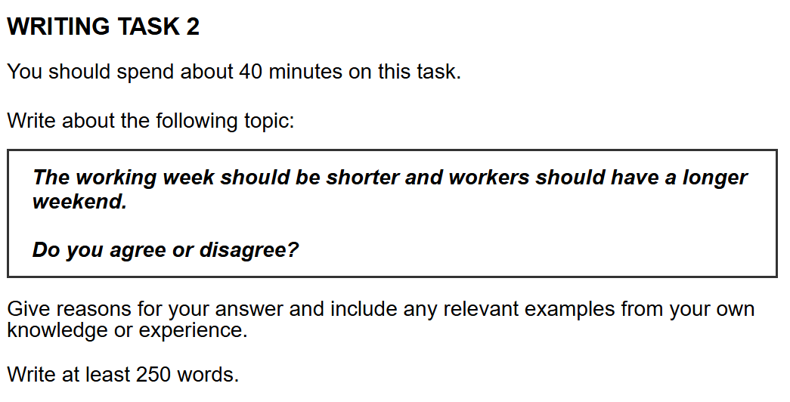

## 题目

按照这个模板，写一个简单的范文吧，告诉我写作思路，其中的好的句式和好词进行标注(用``进行标注)和分析，最后做出总结，去除作文的话题词，输出当前作文的对应的模板。

## 范文

好的，没问题！非常欣赏你提出的“用自己能 100%驾驭的语言，去填充一个 100%有逻辑的结构”这个理念，这正是通往写作高分的康庄大道。

今天我们就以这个“缩短工作周”的题目为例，用你提供的 **P-C-C-E-L 框架** 来写一篇简洁、清晰、高分的范文。

---

### **1. 写作思路（Brainstorming & Outlining）**

在动笔之前，我们先快速地规划一下。这就像建房子前先画好蓝图。

- **审题：**

  - **话题：** The working week should be shorter and workers should have a longer weekend. (工作周应该缩短，工人应该有更长的周末。)
  - **问题：** Do you agree or disagree? (你同意还是不同意？)
  - **我的立场：** 同意。这个立场更容易找到对个人和公司都有利的论点。

- **搭建大纲 (Outline):**
  - **引言：** 介绍背景（关于工作方式的讨论很普遍） -> 改写题目 -> 亮出我的观点（我同意），并预告两个理由：1. 对员工好；2. 对公司也好。
  - **主体段 A (P-C-C-E-L):**
    - **Point (观点):** 对员工好，可以改善他们的身心健康。 (观点来自**万能观点库 -> 生活类 -> 观点 4：人们越来越重视身心健康**)
    - **Cause (原因):** 因为传统的工作模式压力太大，休息时间不足。
    - **Consequence (结果):** 更长的周末能让他们充分休息、陪伴家人，从而提升生活质量。
    - **Example (例子):** 比如，可以利用多出来的一天去远足，或者看望父母。
    - **Link (链接):** 因此，这对提升员工幸福感至关重要。
  - **主体段 B (P-C-C-E-L):**
    - **Point (观点):** 对公司好，可以提升生产效率。
    - **Cause (原因):** 因为休息好的员工在工作时更专注、更有活力。
    - **Consequence (结果):** 这会让他们用更少的时间完成同样甚至更多的工作，减少错误。
    - **Example (例子):** 很多试行四天工作制的科技公司发现，员工的创造力和效率都提升了。
    - **Link (链接):** 所以，这对公司来说也是一个明智的商业决策。
  - **结论：** 再次声明我的观点 -> 总结两个主体段的理由 -> 提出一个简单的展望或建议。

你看，思路清晰了，接下来往框架里填内容就非常简单了。

---

### **2. 7.5 分范文（简洁版）**

The discussion about the ideal structure of a workweek `has become increasingly common` in modern society. The proposal that people should work fewer days and enjoy longer weekends is gaining support. Personally, I wholeheartedly agree with this view, because it offers significant benefits not only to employees but also to their employers.

First and foremost, a shorter working week is `crucial for improving` the well-being of workers. The main reason for this is that the traditional five-day schedule can `impose considerable pressure` on individuals, leaving them with insufficient time for rest and personal life. As a consequence, a three-day weekend would allow people to `fully recharge`, spend quality time with their families, and pursue their hobbies. For instance, an office worker could use the extra day to go hiking or visit relatives, activities that help `alleviate stress`. `Hence, it is clear that` this change can significantly enhance an employee's quality of life.

Furthermore, this policy can, perhaps surprisingly, `boost a company's productivity`. This can be attributed to the fact that well-rested employees are generally more focused and motivated during their working hours. As a result, they can complete their tasks more efficiently, often producing the same or even better outcomes in less time. A compelling illustration of this is the growing number of companies that have trialed a four-day workweek and reported `a noticeable increase in` staff creativity and a reduction in errors. Thus, this evidence suggests that a shorter workweek is also a `sensible business strategy`.

In conclusion, I reaffirm my conviction that shortening the workweek is a positive step forward. Based on the clear advantages for both `employee wellness and corporate efficiency`, it is a change that deserves serious consideration from policymakers and business leaders alike.

_(Word Count: 288 words)_

---

### **3. 好词好句分析**

这篇范文没有使用任何生僻词，而是用简单、准确的词组来表达清晰的逻辑。

1.  **`has become increasingly common`**

    - **分析：** 这是一个非常地道且万能的背景句开头，意为“变得越来越普遍”。它比 "is very common" 更有动态感和学术感。

2.  **`crucial for improving`**

    - **分析：** "Crucial for" (对...至关重要) 是一个比 "very important for" 更高级的表达，能有效强调你观点的重要性。

3.  **`impose considerable pressure`**

    - **分析：** “施加巨大的压力”。"Impose" 是一个非常书面化的动词，"considerable" (相当大的) 比 "great" 或 "a lot of" 更显正式。这是简单词汇的漂亮升级。

4.  **`fully recharge`**

    - **分析：** “满血复活”、“充分充电”。这是一个很形象的词组，用来描述休息带来的效果，生动而不口语化。

5.  **`alleviate stress`**

    - **分析：** “缓解压力”。"Alleviate" 是 "reduce" 或 "relieve" 的一个更正式、更精确的同义词，是 7 分作文的标志性词汇之一。

6.  **`Hence, it is clear that...`**

    - **分析：** 这是 P-C-C-E-L 模型中 **L (Link)** 环节的经典句型。用 "Hence" (因此) 来引出小结，比用 "So" 要正式得多。

7.  **`boost a company's productivity`**

    - **分析：** “提升公司的生产力”。"Boost" (促进，提升) 是一个非常有力且简洁的动词，比 "increase" 或 "improve" 更具冲击力。

8.  **`a noticeable increase in`**

    - **分析：** “一个显著的增长”。"Noticeable" (显著的，显而易见的) 准确地描述了变化是可见的，比 "big" 更具体。

9.  **`sensible business strategy`**

    - **分析：** “明智的商业策略”。"Sensible" (明智的，合理的) 体现了你的判断，说明这个策略是经过理性思考的，比 "good" 更具说服力。

10. **`employee wellness and corporate efficiency`**
    - **分析：** “员工福祉和公司效率”。这是对两个主体段核心观点的精准概括。"Wellness" 和 "efficiency" 都是非常书面化的名词。

---

### **4. 本文对应的“万能写作模板”**

现在，我们把这篇文章里的“话题词”都抽掉，剩下的就是你可以直接套用到其他“同意/不同意”类型文章的模板了。

**引言 (Introduction)**

The discussion about `[宏观话题]` has become increasingly common in modern society. The proposal that `[转述题目中的观点]` is gaining support. Personally, I wholeheartedly agree with this view, because it offers significant benefits not only to `[受益方A]` but also to `[受益方B]`.

**主体段 A (Body Paragraph A)**

First and foremost, `[分论点一]`. The main reason for this is that `[解释原因]`. As a consequence, `[阐述带来的直接结果]`. For instance, `[举一个具体的例子来支撑结果]`. Hence, it is clear that `[重申分论点一的重要性]`.

**主体段 B (Body Paragraph B)**

Furthermore, `[分论点二]`. This can be attributed to the fact that `[解释原因]`. As a result, `[阐述带来的直接结果]`. A compelling illustration of this is `[举一个具体的例子来支撑结果]`. Thus, this evidence suggests that `[重申分论点二的合理性]`.

**结论 (Conclusion)**

In conclusion, I reaffirm my conviction that `[重申你的总观点]`. Based on the clear advantages for both `[总结理由一]` and `[总结理由二]`, it is a change that deserves serious consideration from `[相关决策者，如policymakers/individuals/society]`.

希望这次的拆解和范文对你有帮助！你可以试着用这个模板去思考其他的作文题目，看看是否能快速地理清思路。我们下次再见！
