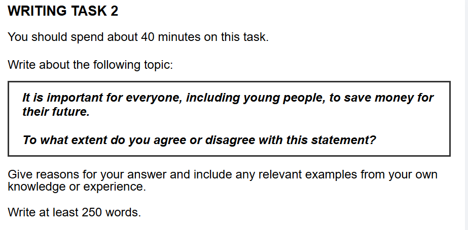

## 题目

    

## 范文

好的，没问题！我们马上开始。面对一个全新的雅思写作题目，最可靠的方法就是运用一个清晰、有逻辑的框架来组织思路和语言。

今天我们就以你提供的这个关于“存钱”的题目为例，严格按照你给我的**P-C-C-E-L 深度逻辑写作框架**，来完成一篇符合 7.5 分标准、语言简洁、逻辑清晰的范文。

---

### **第一步：写作思路 (Brainstorming & Outlining)**

在我动笔之前，我的大脑会像这样快速运转，用 1-2 分钟确定文章的核心骨架：

1.  **审题：**

    - **话题：** 为未来存钱的重要性 (saving money for the future)。
    - **对象：** 每一个人，特别提到了年轻人 (everyone, including young people)。
    - **问题：** To what extent do you agree or disagree? (多大程度上同意或不同意？)
    - **我的立场：** 毫无疑问，**完全同意 (Strongly Agree)**。这是一个非常主流且容易论证的观点。

2.  **构建大纲 (根据 P-C-C-E-L 模型):**
    - **引言：** 背景（理财很重要） -> 改写题目 -> 亮明观点（我完全同意），并预告两个理由。
    - **主体段 A (理由一)：为了应对未来的不确定性。**
      - **P (Point):** 存钱是建立经济保障、抵御未知风险的关键。
      - **C (Cause):** 为什么需要保障？因为未来的就业市场因科技发展而`充满变数 (increasingly unpredictable)`。
      - **C (Consequence):** 结果是什么？人们可能面临`失业 (job displacement)`，需要钱来过渡或`提升技能 (reskilling and upskilling)`。
      - **E (Example):** 比如，一个工厂工人被自动化设备取代后，需要一笔存款来支撑他学习新技能（如编程）期间的生活。
      - **L (Link):** 因此，储蓄是适应未来变化的重要工具。
    - **主体段 B (理由二)：为了实现个人长期目标。**
      - **P (Point):** 储蓄是实现重大人生目标的基石。
      - **C (Cause):** 为什么？因为像买房、接受高等教育或组建家庭这些`人生里程碑 (major life milestones)`都需要大笔资金。
      - **C (Consequence):** 结果是什么？有储蓄的人可以主动追求这些目标，而没有储蓄的人则可能`陷入债务 (fall into debt)`或错失机会。
      - **E (Example):** 一个典型的例子就是，年轻人为了支付`房产首付 (a down payment on a property)`而进行储蓄。
      - **L (Link):** 所以，存钱是主动规划理想人生的实际行动。
    - **结论：** 重申观点（存钱至关重要） -> 总结两个理由（应对风险+实现目标）-> 提出一个有力的收尾（从小培养储蓄习惯是通往财务独立的基石）。

思路清晰了，现在我们就可以把这些想法填充成一篇完整的文章。

---

### **第二步：雅思 7.5 分范文**

In today's world, the ability to manage personal finances is becoming an essential life skill. The question of whether saving money for the future is a vital habit for everyone, particularly for young people, has sparked considerable discussion. Personally, I wholeheartedly endorse this view, primarily because it provides `financial security` against future uncertainties and enables the achievement of long-term personal goals.

First and foremost, establishing a savings habit is crucial for building a `financial safety net` to handle unforeseen challenges. The main reason for this is that the future job market is `increasingly unpredictable`, largely due to rapid technological advancements like automation and artificial intelligence. As a consequence, individuals may face unexpected `job displacement` or the need to transition to new careers, which often requires both time and money for `reskilling and upskilling`. A compelling illustration is a factory worker whose job is automated; a savings fund would provide the necessary support for them to enroll in a coding bootcamp and re-enter the workforce. Hence, it becomes apparent that having a financial cushion is a vital tool for navigating an ever-changing world.

Furthermore, saving money is fundamental to achieving `major life milestones`. This can be attributed to the fact that significant life events, such as purchasing a home, pursuing higher education, or starting a family, are capital-intensive. This, in turn, allows individuals to proactively work towards their aspirations without the burden of `falling into debt`. A clear illustration is the common practice among young professionals of saving diligently for several years to afford `a down payment on a property`. Thus, the act of saving is not merely about accumulating wealth, but about empowering oneself to build a desired future and maintain financial independence.

In conclusion, I reaffirm my conviction that the practice of saving money is indispensable for people of all ages. Based on the reasoning that it offers a buffer against economic shifts and provides the financial means to realize personal ambitions, the importance of this habit cannot be overstated. Ultimately, cultivating the discipline of saving from a young age is one of the most reliable paths toward `financial well-being` and a secure future.

**(Word Count: 338 words)**

---

### **第三步：好词好句分析 (Language Analysis)**

这篇范文使用了简洁而精准的词汇和句型，我们来分析一下：

- `financial security` / `financial safety net` (经济保障 / 经济安全网): 这是非常地道的搭配，准确表达了存钱的首要目的。比只说 "have money" 要高级得多。
- `increasingly unpredictable` (越来越不可预测): 这个副词+形容词的组合，精准地描述了就业市场的动态变化。
- `job displacement` (工作岗位流失): 这是一个非常专业的术语，特指因为技术或经济结构变化导致的失业，比 "losing jobs" 更学术。
- `reskilling and upskilling` (再培训和技能提升): 这是目前教育和就业领域的热门词汇，表明你对现代社会趋势的了解。
- `major life milestones` (重大人事里程碑): 这是一个非常形象的表达，概括了如结婚、买房、生子等人生大事。
- `falling into debt` (陷入债务): 地道的动词搭配，准确表达了没有储蓄可能导致的负面后果。
- `a down payment on a property` (房产首付): 非常具体且贴切的例子，让论证更有说服力。
- `financial well-being` (财务健康/幸福): 这是一个更全面的概念，不仅指有钱，更指一种健康的财务状态和心态，用在结尾处可以提升文章的立意。

---

### **第四步：总结与模板提炼 (Template Generation)**

现在，我们把这篇范文的“血肉”（具体话题内容）剥离，只留下它的“骨架”（逻辑和结构），你就得到了一个可以应用于任何“同意/不同意”类题目的高分模板：

**引言段 (Introduction)**

In today's world, `[宏观背景介绍]`. The question of whether `[转述题目中的观点]` has sparked considerable discussion. Personally, I wholeheartedly endorse this view, primarily because `[你的理由一]` and `[你的理由二]`.

**主体段 A (Body Paragraph A)**

First and foremost, `[陈述理由一的分论点]`. The main reason for this is that `[解释观点成立的深层原因]`. As a consequence, `[阐述该原因会带来的直接结果]`. A compelling illustration is `[给出一个具体的例子来支撑结果]`. Hence, it becomes apparent that `[重申分论点一与全文观点的联系]`.

**主体段 B (Body Paragraph B)**

Furthermore, `[陈述理由二的分论点]`. This can be attributed to the fact that `[解释观点成立的深层原因]`. This, in turn, allows/leads to `[阐述该原因会带来的直接结果]`. A clear illustration is `[给出一个具体的例子来支撑结果]`. Thus, `[重申分论点二与全文观点的联系]`.

**结论段 (Conclusion)**

In conclusion, I reaffirm my conviction that `[用不同的话重申你的核心立场]`. Based on the reasoning that `[总结理由一]` and `[总结理由二]`, the importance of this cannot be overstated. Ultimately, `[提出一个具有前瞻性的思考或建议，升华全文]`.

希望这次的拆解和讲解对你有帮助！你可以随时用任何一个新的题目来套用这个思路和框架进行练习。我们今天想学习下一个知识点，还是解答一些你自己的疑问呢？
