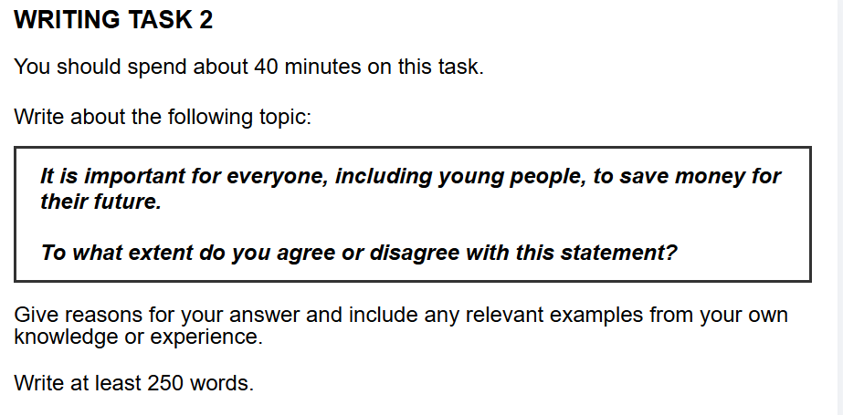

## 题目

## 范文
In today's world, knowing how to manage money is a very important skill. I completely agree with the idea that everyone, including young people, should save money for their future. My view is based on two main reasons: saving provides essential financial security for emergencies and helps people achieve their major life goals.

Firstly, saving money is necessary for dealing with unexpected problems in life. This is because no one knows what will happen in the future, and problems like losing a job or getting sick can appear suddenly. As a result, if people do not have savings, they might have to borrow money at high interest rates. This can lead to serious stress and bigger financial troubles later on. For example, if a young person suddenly loses their job, their savings can help them pay for rent and food while they look for a new one. This financial safety net stops them from falling into a crisis. This clearly shows why saving is a key part of being financially secure.

Secondly, saving money also helps people to achieve their long-term goals. This is because big goals in life, like buying a house or getting a better education, cost a lot of money that needs to be collected over time. Consequently, people who save regularly can take advantage of opportunities when they appear, giving them more control over their future. For instance, a student who saves money from a part-time job can use it to help pay for a master's degree or to start their own small business after graduating. Therefore, it is clear that saving is a practical step towards turning personal dreams into reality.

In conclusion, I strongly believe that saving money is extremely important. It not only protects us from life's surprises but also opens doors to future success. For this reason, it would be wise for schools to teach young people the basics of managing money, which would prepare them for a more secure and successful future.

## 评语
同学，你好！我是你的雅思作文批改老师。很高兴批改你的这篇作文。你的文章整体写得非常出色，论证清晰，结构完整。接下来，我将为你提供一份详细的分析和反馈，希望能帮助你在现有基础上更上一层楼。

***

### **第一部分：分项评分与解析 (Sectional Scoring & Analysis)**

**1. 任务回应 (Task Response - TR)**
* **预估分数:** 8.0
* **评分理由:** 你非常出色地回应了题目中的所有要求。你的立场（“I completely agree”）非常鲜明，并且在全文中都得到了持续有力的支撑。文章紧扣“为未来储蓄的重要性”，并为“每个人，包括年轻人”这个对象提供了有说服力的论点（应对紧急情况、实现人生目标）。论证充分，例子恰当，完全达到了任务要求。

**2. 连贯与衔接 (Coherence and Cohesion - CC)**
* **预估分数:** 8.0
* **评分理由:** 文章的逻辑流程清晰，组织结构堪称典范。段落划分非常合理，从引言到两个主体段落，再到结论，过渡自然顺畅。你使用了多样且恰当的连接词和短语（如 `Firstly`, `Secondly`, `This is because`, `As a result`, `For instance`, `Therefore`），使得段落内部和段落之间的逻辑关系一目了然。

**3. 词汇资源 (Lexical Resource - LR)**
* **预估分数:** 7.0
* **评分理由:** 你使用了一些不错的词汇和搭配，例如 `financial security`, `unexpected problems`, `high interest rates`, `financial safety net`, `long-term goals`, `turning personal dreams into reality`。词汇使用准确，几乎没有错误。但是，为了冲击更高的分数，词汇的多样性和复杂度可以进一步提升。部分常用词（如 `important`, `money`, `save`）在文中重复出现，可以尝试使用更多同义词替换。

**4. 语法广度与准确性 (Grammatical Range and Accuracy - GRA)**
* **预估分数:** 8.0
* **评分理由:** 你的语法功底非常扎实。句子结构富于变化，能够娴熟地运用简单句和复杂的复合句（例如使用了 `which` 引导的定语从句）。全文几乎没有语法错误，这使得你的观点表达非常清晰、流畅。

---

### **第二部分：写作思路与结构梳理 (Essay Structure & Logic Analysis)**

1.  **整体逻辑框架:** 你的文章逻辑框架非常清晰，采用了经典的“总-分-总”结构。从提出明确观点，到分点论述，最后总结重申，整个论证过程层层递进，非常有说服力。

2.  **引言 (Introduction):** 引言部分非常高效。第一句有效地引入了“理财”这一宏观背景。第二句直接、清晰地表达了你的立场。第三句则巧妙地预告了下文将要讨论的两个核心论点，为读者提供了清晰的路线图。

3.  **主体段落分析 (Body Paragraphs):**
    * **主体段一（应对突发问题）:** 中心句（Topic Sentence）“saving money is necessary for dealing with unexpected problems in life”开门见山。你通过“This is because...”进行了解释，用“As a result...”引出不储蓄的后果，再通过“For example...”给出了一个非常贴切的年轻人失业的例子。最后用“This clearly shows...”总结本段观点。整个段落的论证链条非常完整、严密。
    * **主体段二（实现长期目标）:** 同样地，本段的结构也非常出色。中心句清晰地引出了“实现长期目标”这一论点。随后的解释、结果阐述和具体例子（学生为读研或创业储蓄）都极具说服力，有力地支撑了段落中心思想。

4.  **结论 (Conclusion):** 结论部分有效地总结了全文。你首先重申了核心立场，并概括了两个主体段落的主要论点。最后，你提出了一个具有建设性的建议（学校应开展理财教育），这不仅升华了文章主旨，也让结尾显得更加有力、完整。

---

### **第三部分：逐句分析与优化 (Sentence-by-Sentence Breakdown)**

你的原文已经非常优秀。下面的修改建议旨在帮你“锦上添花”，通过提升词汇和句式的复杂性，向更高分段（8.5+）迈进。

| 原句 (Original Sentence) | 修改后 (Revised Sentence) | 分析与建议 (Analysis & Suggestions) |
| :--- | :--- | :--- |
| In today's world, knowing how to manage money is a very important skill. | In the contemporary world, financial literacy is an indispensable skill. | **词汇升级**: `contemporary world`比`today's world`更书面化；`financial literacy`（理财能力）是比`knowing how to manage money`更精确、更高级的表达；`indispensable`（不可或缺的）是比`very important`更有力的词汇。 |
| I completely agree with the idea that everyone, including young people, should save money for their future. | I wholeheartedly concur with the notion that setting aside funds for the future is a crucial practice for all individuals, particularly the youth. | **同义替换与句式变化**: `wholeheartedly concur`比`completely agree`更显正式和强调；`notion`替换`idea`；`setting aside funds`是`save money`的绝佳替代；`crucial practice`替换`should save`，使表达更多样；`all individuals, particularly the youth`替换`everyone, including young people`。 |
| My view is based on two main reasons: saving provides essential financial security for emergencies and helps people achieve their major life goals. | This perspective is primarily rooted in two arguments: the provision of a financial safety net for unforeseen circumstances and the facilitation of major life aspirations. | **表达方式升级**: `This perspective is rooted in...`比`My view is based on...`更具学术感。将动词短语（`provides...`和`helps achieve...`）名词化（`the provision of...`和`the facilitation of...`）可以显著增加句子的复杂度和正式度。`unforeseen circumstances`是`emergencies`的优质替换，`life aspirations`比`life goals`更显文采。 |
| Firstly, saving money is necessary for dealing with unexpected problems in life. | Primarily, building a reserve of funds is essential for navigating life's unforeseen adversities. | **词汇升级**: `Primarily`替换`Firstly`。`building a reserve of funds`（建立资金储备）比`saving money`更具体。`navigating`（应对，处理）比`dealing with`更生动。`unforeseen adversities`（未曾预料的困境）比`unexpected problems`更书面化。 |
| This is because no one knows what will happen in the future, and problems like losing a job or getting sick can appear suddenly. | The rationale behind this is the inherent unpredictability of the future, where challenges such as job loss or illness can arise without warning. | **句式与词汇优化**: `The rationale behind this is...`是`This is because...`的更高级表达。`inherent unpredictability of the future`（未来内在的不可预测性）使表达更简洁有力。`arise without warning`是`appear suddenly`的不错替换。 |
| As a result, if people do not have savings, they might have to borrow money at high interest rates. | Consequently, individuals lacking savings may find themselves compelled to borrow money, often at exorbitant interest rates. | **词汇升级**: `Consequently`替换`As a result`。`individuals lacking savings`替换`if people do not have savings`，使句子更紧凑。`compelled to`（被迫）比`have to`语气更强。`exorbitant`（过高的）是`high`的有力升级。 |
| This can lead to serious stress and bigger financial troubles later on. | This situation can precipitate significant mental distress and exacerbate financial difficulties down the line. | **动词与词汇升级**: 使用更精确的动词，`precipitate`（促成，导致）和`exacerbate`（使恶化），可以展示更强的词汇能力。`mental distress`比`stress`更具体。`down the line`是`later on`的一个更地道的表达。 |
| For example, if a young person suddenly loses their job, their savings can help them pay for rent and food while they look for a new one. | For instance, a young professional facing sudden unemployment can rely on their savings to cover living expenses while seeking new employment. | **使表达更具体**: `young professional`比`young person`更具体。`facing sudden unemployment`是`suddenly loses their job`更正式的说法。`cover living expenses`比`pay for rent and food`更概括、更书面化。`seeking new employment`替换`look for a new one`。 |
| This financial safety net stops them from falling into a crisis. | Such a financial buffer is crucial in preventing a temporary setback from escalating into a full-blown crisis. | **表达深化**: `financial buffer`（财务缓冲）是`financial safety net`的同义词。这个修改后的句子逻辑更递进：它不仅是“阻止陷入危机”，而是“防止一个暂时的挫折升级为一个全面危机”，表达更精确。 |
| This clearly shows why saving is a key part of being financially secure. | This exemplifies why saving is a cornerstone of financial security. | **词汇升级**: `exemplifies`（是...的典范）比`shows`更正式。`cornerstone`（基石）是一个非常形象且高级的比喻，用以替换`a key part`。 |
| Secondly, saving money also helps people to achieve their long-term goals. | Secondly, accumulating wealth is instrumental in the pursuit of long-term ambitions. | **词汇与表达升级**: `accumulating wealth`（积累财富）是`saving money`的另一种说法。`be instrumental in`（对...起重要作用）是`helps`的高级替换。`the pursuit of long-term ambitions`（对长期抱负的追求）比`to achieve their long-term goals`更具文采。 |
| This is because big goals in life, like buying a house or getting a better education, cost a lot of money that needs to be collected over time. | This is attributable to the fact that significant life milestones, such as purchasing property or pursuing higher education, demand substantial capital accumulated over time. | **词汇升级**: `This is attributable to the fact that...`是`This is because...`的正式说法。`significant life milestones`替换`big goals in life`。`purchasing property`替换`buying a house`。`demand substantial capital`替换`cost a lot of money`。 |
| Consequently, people who save regularly can take advantage of opportunities when they appear, giving them more control over their future. | As a result, consistent savers are better positioned to seize opportunities as they arise, affording them greater autonomy over their life's trajectory. | **词汇升级与表达深化**: `consistent savers`（持续储蓄者）更简洁。`be better positioned to seize opportunities`（处在更有利的位置去抓住机会）表达更生动。`affording them greater autonomy`（给予他们更大的自主权）替换`giving them more control`。`life's trajectory`（人生轨迹）是`their future`一个非常高级和形象的说法。 |
| For instance, a student who saves money from a part-time job can use it to help pay for a master's degree or to start their own small business after graduating. | For example, a student diligently setting aside earnings from part-time employment could later allocate these funds towards a master's degree or seed capital for a startup venture post-graduation. | **词汇具体化与升级**: `diligently setting aside earnings`（勤奋地存下收入）更生动。`allocate these funds towards`（将这些资金分配给...）更正式。`seed capital for a startup venture`（初创企业的种子资金）是`to start their own small business`一个非常专业和高级的表达。 |
| Therefore, it is clear that saving is a practical step towards turning personal dreams into reality. | Thus, it is evident that saving is a pragmatic strategy for transforming personal aspirations into tangible realities. | **词汇升级**: `Thus`替换`Therefore`。`evident`替换`clear`。`pragmatic strategy`（务实的策略）替换`practical step`。`transforming... into tangible realities`（将...转变为可触及的现实）比`turning... into reality`表达更强烈。 |
| In conclusion, I strongly believe that saving money is extremely important. | In conclusion, I am firmly convinced that the habit of saving is of paramount importance. | **同义替换与强调**: `I am firmly convinced that...`是`I strongly believe that...`的有力替换。`the habit of saving`（储蓄的习惯）比`saving money`更有深度。`paramount importance`是`extremely important`的最高级表达。 |
| It not only protects us from life's surprises but also opens doors to future success. | It not only shields individuals from life's volatilities but also paves the way for future accomplishments. | **使用更生动的动词和名词**: `shields from`（庇护...免受）比`protects from`更形象。`life's volatilities`（生活中的变数）比`life's surprises`更正式。`paves the way for`（为...铺平道路）比`opens doors to`更具文学性。`accomplishments`是`success`的同义替换。 |
| For this reason, it would be wise for schools to teach young people the basics of managing money, which would prepare them for a more secure and successful future. | Therefore, it is advisable that educational institutions incorporate basic financial management into their curriculum, thereby better equipping the younger generation for a future of stability and prosperity. | **句式和词汇优化**: `it is advisable that...`更正式。`incorporate... into their curriculum`（将...纳入课程）是专业表达。`thereby better equipping...`使用现在分词作结果状语，使句子结构更高级。`a future of stability and prosperity`（一个稳定和繁荣的未来）比`a more secure and successful future`用词更佳。 |

#### **修改后范文 (Revised Version)**
> **预估分数: 8.5**

In the contemporary world, financial literacy is an indispensable skill. I wholeheartedly concur with the notion that setting aside funds for the future is a crucial practice for all individuals, particularly the youth. This perspective is primarily rooted in two arguments: the provision of a financial safety net for unforeseen circumstances and the facilitation of major life aspirations.

Primarily, building a reserve of funds is essential for navigating life's unforeseen adversities. The rationale behind this is the inherent unpredictability of the future, where challenges such as job loss or illness can arise without warning. Consequently, individuals lacking savings may find themselves compelled to borrow money, often at exorbitant interest rates. This situation can precipitate significant mental distress and exacerbate financial difficulties down the line. For instance, a young professional facing sudden unemployment can rely on their savings to cover living expenses while seeking new employment. Such a financial buffer is crucial in preventing a temporary setback from escalating into a full-blown crisis. This exemplifies why saving is a cornerstone of financial security.

Secondly, accumulating wealth is instrumental in the pursuit of long-term ambitions. This is attributable to the fact that significant life milestones, such as purchasing property or pursuing higher education, demand substantial capital accumulated over time. As a result, consistent savers are better positioned to seize opportunities as they arise, affording them greater autonomy over their life's trajectory. For example, a student diligently setting aside earnings from part-time employment could later allocate these funds towards a master's degree or seed capital for a startup venture post-graduation. Thus, it is evident that saving is a pragmatic strategy for transforming personal aspirations into tangible realities.

In conclusion, I am firmly convinced that the habit of saving is of paramount importance. It not only shields individuals from life's volatilities but also paves the way for future accomplishments. Therefore, it is advisable that educational institutions incorporate basic financial management into their curriculum, thereby better equipping the younger generation for a future of stability and prosperity.

---

### **第四部分：总评与知识点总结 (Overall Feedback & Key Takeaways)**

**1. 总体评价 (Overall Comments):**
这是一篇非常优秀的雅思作文。你的文章结构清晰、逻辑严密、论证有力，并且语法准确无误。这充分展示了你扎实的英语写作功底。你已经完全掌握了雅思大作文的核心写作要求。目前，你的作文距离顶尖分数（8.0+）的差距主要在于词汇的丰富度和句式变化的灵活性上。通过有意识地学习和使用更高级、更精确的词汇和句型，你的分数将有显著的提升空间。

* **预估总分 (Estimated Overall Band Score): 7.5**

**2. 核心知识点总结 (Key Learning Points):**

* **词汇升级（From Good to Great）:** 你当前的词汇是准确的（Good），但可以追求更精确、更书面化、更有力的表达（Great）。例如，下次写作时，可以有意识地将 `important` 替换为 `essential`, `crucial`, `vital`, `indispensable`, `paramount`；将 `save money` 替换为 `set aside funds`, `build a reserve`, `accumulate wealth` 等。
* **句式名词化 (Nominalization):** 学习将动词或形容词结构转换为名词结构，这是提升学术写作风格的有效技巧。例如，将 `It is important to save money` 转换为 `The importance of saving money cannot be overstated`，或者像修改建议中那样，将 `saving provides security` 转换为 `the provision of a financial safety net`。
* **使用更生动的动词 (Vivid Verbs):** 强有力的动词能让你的文章“活”起来。避免过多使用 `be`, `have`, `do`, `get` 等基础动词，尝试使用如 `Maps adversities` (应对困境), `precipitate stress` (引发压力), `pave the way for success` (为成功铺路) 等更精确、生动的动词。
* **结论段的升华:** 你在结论中提出建议的做法非常棒。这被称为“A final thought/recommendation”，能让文章在总结之外更有深度和远见，给考官留下深刻印象，是冲击高分作文的一个常用技巧。

你已经做得非常出色了，请继续保持！希望这份反馈能对你有所启发。祝你备考顺利！