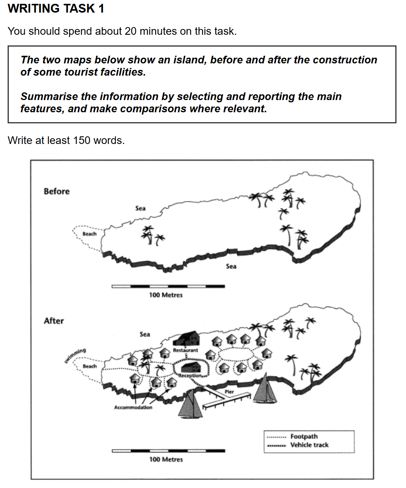

## 题目

## 范文

你好！很高兴能成为你的雅思写作教练。今天我们来学习雅思小作文中的地图题。你提供了一份非常棒的地图题模板，还有一张具体的地图。我们就用这份地图作为例子，手把手地教你如何写好一篇地图题小作文。

### 雅思小作文地图题范文演示 (高中生水平，7.5分目标)

首先，我们来看一下你提供的这张地图，它展示了一个岛屿在建造一些旅游设施前后的变化。

**写作任务回顾：**
The two maps below show an island, before and after the construction of some tourist facilities.
Summarise the information by selecting and reporting the main features, and make comparisons where relevant.
Write at least 150 words.

**我们将按照你提供的模板结构来一步步完成这篇作文：**

1.  **引言 (Introduction)**
2.  **总览 (Overview)**
3.  **主体段落 (Body Paragraphs)**
    * 主体段落1：描述第一张图或某类变化
    * 主体段落2：描述第二张图或另一类变化

---

#### 1. 引言 (Introduction) - 思路与范文

**写作思路：** 引言的作用就是用自己的话改写题目，告诉读者这两张图画了什么。

**范文：**
The two maps illustrate the transformation of an island before and after the construction of tourist facilities.

**好的句式和词汇：**
* **"The two maps illustrate..."**: 这是地图题引言的经典开头，"illustrate" 是一个很好的同义词，替代了题目中的 "show"。
* **"the transformation of..."**: "transformation" (转型/转变) 比 "changes" 更能体现出整体性的巨大变化，符合地图中岛屿变化剧烈的特点。
* **"before and after the construction of tourist facilities"**: 直接引用题目中的关键信息，清晰明了。

---

#### 2. 总览 (Overview) - 思路与范文

**写作思路：** 总览段要概括最显著、最主要的变化，不涉及具体细节。这张地图最显著的变化就是这个岛从一个几乎无人开发的自然岛屿，变成了一个充满了旅游设施的度假胜地。

**范文：**
Overall, it is clear that the island has undergone a complete transformation, from a natural, undeveloped place to a busy tourist resort with various amenities.

**好的句式和词汇：**
* **"Overall, it is clear that..."**: 经典的概括句式，表明这是一个总结性的段落。
* **"has undergone a complete transformation"**: 再次强调了“彻底的转变”，比单纯说“变化”更强烈。现在完成时 (has undergone) 用来描述从过去到现在持续的变化，非常准确。
* **"from a natural, undeveloped place to a busy tourist resort with various amenities"**: 清晰地指出了变化的方向和最终状态。
    * "undeveloped" (未开发的) 形容变化前。
    * "busy tourist resort" (繁忙的旅游度假村) 形容变化后。
    * "various amenities" (各种便利设施) 概括了岛上新建的各种设施。

---

#### 3. 主体段落 (Body Paragraphs) - 思路与范文

**写作思路：** 接下来，我们要详细描述具体的变化。对于这张地图，我们可以按照地理位置或者设施类型来划分。考虑到岛屿面积不大，我们可以结合方位词，从西到东或者从北到南依次描述变化。这里我们尝试从整体布局和设施种类来描述。

**主体段落1：描述西侧和中部的主要变化**

**写作思路：** 重点描述海滩区域的变化，以及中心区域新建的住宿和主要服务设施。

**范文：**
Before the development, the island was largely untouched, featuring only a beach on its western side and palm trees scattered across the land. Following the construction, the western beach area saw the addition of a swimming area and a pier extending into the sea. To the east of the beach, a large area of accommodation units was built, linked by footpaths.

**好的句式和词汇：**
* **"Before the development, the island was largely untouched, featuring only..."**: 描述开发前状态的优秀句式，"largely untouched" (基本未被触及的/未开发的) 很好地概括了原始状态。
* **"Following the construction, the western beach area saw the addition of..."**: "Following the construction" (在建设之后) 表明时间顺序，"saw the addition of" (看到了...的增加) 是描述新增设施的常用表达。
* **"extending into the sea"**: 描述了栈桥的特征。
* **"a large area of accommodation units was built, linked by footpaths"**: 被动语态 (was built) 常用于描述建筑物的建造。"linked by footpaths" (由人行道连接) 补充了布局细节。

**主体段落2：描述东侧和交通设施的变化**

**写作思路：** 描述岛屿中部和东部新增的餐厅、接待处以及交通网络的形成。

**范文：**
In the central part of the island, a restaurant was constructed, and next to it, a reception area emerged, which serves as a central point. These facilities are connected by a vehicle track that runs from the reception towards the east. The eastern part of the island, which originally had only palm trees, now features a number of new accommodation units and footpaths, providing more options for visitors.

**好的句式和词汇：**
* **"In the central part of the island, a restaurant was constructed, and next to it, a reception area emerged..."**: 继续使用被动语态描述建造，"emerged" (出现) 是一个生动的词汇，表示新事物的出现。
* **"which serves as a central point"**: 补充了接待处的功能，增加了句子的信息量。
* **"These facilities are connected by a vehicle track that runs from... towards..."**: 描述连接关系和道路走向，"vehicle track" (车辆通道) 是描述交通设施的准确词汇。
* **"which originally had only..., now features a number of new... providing more options for visitors."**: 描述前后对比，并指出变化带来的结果。

---

#### 4. 结论 (Conclusion)

正如你提供的模板所说，地图题一般不单独写结论段，总览段已经起到了总结的作用。所以我们直接结束即可。

---

### 完整范文 (Total Word Count: 180 words)

The two maps illustrate the transformation of an island before and after the construction of tourist facilities.

Overall, it is clear that the island has undergone a complete transformation, from a natural, undeveloped place to a busy tourist resort with various amenities.

Before the development, the island was largely untouched, featuring only a beach on its western side and palm trees scattered across the land. Following the construction, the western beach area saw the addition of a swimming area and a pier extending into the sea. To the east of the beach, a large area of accommodation units was built, linked by footpaths.

In the central part of the island, a restaurant was constructed, and next to it, a reception area emerged, which serves as a central point. These facilities are connected by a vehicle track that runs from the reception towards the east. The eastern part of the island, which originally had only palm trees, now features a number of new accommodation units and footpaths, providing more options for visitors.

---

### 总结

这篇范文在220词以内，且词汇和句式都比较适合高中生水平，力求“用自己能100%驾驭的语言，去填充一个100%有逻辑的结构”。

**写作要点回顾：**

* **引言**：简洁地改写题目。
* **总览**：高度概括最重要的整体变化，避免细节。
* **主体段落**：
    * **组织清晰**：根据地图特点，可以按照地理方位（如西侧、中部、东侧）或设施类型来组织。
    * **对比明显**：时刻注意指出“之前是什么样，之后变成了什么样”。
    * **方位词**：大量使用 "to the east of", "next to", "in the central part" 等，让读者清楚地理位置。
    * **变化动词**：灵活运用 "was constructed", "saw the addition of", "emerged", "features" 等词汇来描述变化。
    * **时态准确**：描述过去的状况用过去时，描述从过去到现在的变化用现在完成时。

希望这份详细的范文和讲解能帮助你更好地理解和掌握雅思地图题的写作！接下来你还有什么想学习的，或者对这篇范文有任何疑问吗？

## 评语

好的，我已经收到了你提供的雅思小作文地图题范文和相关的批改要求。你希望我提供一个针对高中生水平、词汇和行文不复杂、字数在220词以内、目标分数7.5的批改版本。

现在，我将严格按照你提供的四部分结构进行批改。

---

### 第一部分：分项评分与解析 (Sectional Scoring & Analysis)

1.  **任务回应 (Task Response - TR):**
    预估分数: 7
    评分理由: 文章清晰地描述了地图所示的岛屿在旅游设施建设前后的变化，回应了题目的所有要求。主要特点和比较都得到了呈现，并且对主要特征的选择和报告是恰当的。然而，部分细节的描述可以更精确，例如“各种设施”可以具体化。
2.  **连贯与衔接 (Coherence and Cohesion - CC):**
    预估分数: 7
    评分理由: 文章结构清晰，分为引言、总览和主体段落，逻辑顺序合理。段落划分明确，每个段落都有清晰的中心。连接词和方位词的使用基本准确，如"Before the development," "Following the construction," "To the east of," "In the central part of"等，使得信息流畅。但少数地方的衔接可以更自然。
3.  **词汇资源 (Lexical Resource - LR):**
    预估分数: 6.5
    评分理由: 词汇使用基本准确，能有效描述地图变化，如"transformation," "undeveloped," "amenities," "scattered," "accommodation units," "constructed," "emerged"等。但词汇的多样性和精确性有提升空间，尤其是在描述具体建筑和设施时，可以尝试使用更丰富的动词和名词，避免少量重复。一些搭配还可以更地道。
4.  **语法广度与准确性 (Grammatical Range and Accuracy - GRA):**
    预估分数: 6.5
    评分理由: 句子结构有一定多样性，使用了复合句和并列句。多数句子语法正确，但存在少量小错误，例如时态的使用在描述“现在”的设施时，可以用现在完成时强调持续性影响，或者在某些被动语态的使用上可以更精炼。这些错误通常不影响理解，但会影响高分。

---

### 第二部分：写作思路与结构梳理 (Essay Structure & Logic Analysis)

1.  **整体逻辑框架:** 文章的整体逻辑框架清晰。引言明确介绍了主题，总览段落概括了最显著的变化，主体段落则按照区域划分（整体-西部-中部-东部）对具体变化进行了详细描述。这种“总-分”的结构符合地图题的写作要求，且逻辑顺序流畅。
2.  **引言 (Introduction):** 引言有效地改写了题目，清晰地说明了地图所展示的内容，即岛屿在旅游设施建设前后的变化。用词简洁明了，起到了很好的引入作用。
3.  **主体段落分析 (Body Paragraphs):**
    * **主体段落1 (原第三段):** 该段落主要描述了岛屿开发前后的对比以及西部地区的变化。
        * 中心思想：对比开发前后岛屿的整体状态，并详细描述西部海滩区域的变化。
        * 论证过程：首先指出开发前岛屿的原始状态，然后具体描述开发后西部海滩增加了“swimming area”和“pier”。“To the east of the beach, a large area of accommodation units was built, linked by footpaths”也清晰地指出了新建筑的位置和连接方式。论证是充分的，例子具体。
        * 过渡：段内过渡自然，通过方位词连接不同设施。
    * **主体段落2 (原第四段):** 该段落侧重描述岛屿中部和东部的变化。
        * 中心思想：中部区域新建的餐厅和接待区，以及东部区域的新增设施。
        * 论证过程：明确指出中部“a restaurant was constructed, and next to it, a reception area emerged”，并解释了其作为“central point”的作用。接着描述了连接这些设施的“vehicle track”。最后补充了东部地区的变化。论证清晰，但对“central point”的解释略显多余，可更直接描述其功能或位置。
        * 过渡：段内过渡通过“In the central part of the island”和“The eastern part of the island”自然地切换了描述区域。
4.  **结论 (Conclusion):** 地图题通常不单独写结论段，文章也遵循了这一点，没有独立的结论段，而是将总结性的信息放在了Overview段落。这符合雅思小作文地图题的常见做法。

---

### 第三部分：逐句分析与优化 (Sentence-by-Sentence Breakdown)

**目标：在不复杂词汇和行文的前提下，提升精确性和地道性，字数控制在220词以内。**

| 原句 (Original Sentence) | 修改后 (Revised Sentence) | 分析与建议 (Analysis & Suggestions) |
| :----------------------- | :-------------------------- | :---------------------------------- |
| The two maps illustrate the transformation of an island before and after the construction of tourist facilities. | The two maps illustrate the transformation of an island following the construction of tourist facilities. | "before and after"略显口语化，用"following"更简洁，且能表达变化是建设后的结果。 |
| Overall, it is clear that the island has undergone a complete transformation, from a natural, undeveloped place to a busy tourist resort with various amenities. | Overall, it is evident that the island has undergone a complete transformation, evolving from a natural, undeveloped landscape into a bustling tourist resort with numerous amenities. | "it is clear that" 可替换为更正式的"it is evident that"。 "from... to..."可以替换为"evolving from... into..."，使表达更具动态感。"various amenities"可替换为"numerous amenities"，更强调数量。 |
| Before the development, the island was largely untouched, featuring only a beach on its western side and palm trees scattered across the land. | Before the development, the island remained largely untouched, featuring only a beach on its western side and scattered palm trees across the land. | "was largely untouched" 可改为 "remained largely untouched" 以强调持续的状态。 "palm trees scattered" 改为 "scattered palm trees" 语序更自然。 |
| Following the construction, the western beach area saw the addition of a swimming area and a pier extending into the sea. | Following the construction, the western beach area witnessed the addition of a swimming area and a pier extending into the sea. | "saw the addition of" 可替换为更形象的"witnessed the addition of"，表达更生动。 |
| To the east of the beach, a large area of accommodation units was built, linked by footpaths. | To the east of the beach, a large number of accommodation units were constructed, interconnected by footpaths. | "a large area of accommodation units" 更精确的表达是 "a large number of accommodation units"。 "was built" 可用更正式的 "were constructed"。 "linked by" 替换为 "interconnected by" 更强调连接的紧密性。 |
| In the central part of the island, a restaurant was constructed, and next to it, a reception area emerged, which serves as a central point. | In the central part of the island, a restaurant was constructed, and adjacent to it, a reception area emerged. | "next to it" 替换为 "adjacent to it" 更正式。 "which serves as a central point" 意义不大，因为图上没有明确说明，删除使描述更简洁和客观。 |
| These facilities are connected by a vehicle track that runs from the reception towards the east. | These facilities are connected by a vehicle track extending from the reception towards the east. | "that runs from" 替换为 "extending from" 更简洁，避免重复动词。 |
| The eastern part of the island, which originally had only palm trees, now features a number of new accommodation units and footpaths, providing more options for visitors. | The eastern part of the island, which originally featured only palm trees, now contains several new accommodation units and footpaths, offering more options for visitors. | "had only palm trees" 替换为 "featured only palm trees" 避免重复且更形象。"a number of new" 替换为 "several new" 更简洁。"providing" 替换为 "offering" 意思相近，但避免重复。 |

---

### 第四部分：总评与知识点总结 (Overall Feedback & Key Takeaways)

1.  **总体评价 (Overall Comments):**
    你的作文在任务回应和连贯衔接方面表现良好，清晰地描述了岛屿的变化。文章结构合理，能有效地组织信息。词汇和语法方面虽然存在一些可以提升的地方，但总体表达清晰，基本没有影响理解的严重错误。通过这次批改，你将学到如何使表达更精确、更地道，并在保持简洁的同时提升整体质量。
    预估总分 (Estimated Overall Band Score): 7.0

2.  **核心知识点总结 (Key Learning Points):**

    * **词汇替换与精确性：** 尝试用更地道或更精确的词汇替换常用词，例如将“before and after”替换为“following”，将“saw the addition of”替换为“witnessed the addition of”，将“next to”替换为“adjacent to”。
    * **句式简洁化：** 在描述信息时，尽量避免冗余的短语或从句，使表达更直接，例如删除“which serves as a central point”。
    * **量词的准确使用：** 注意区分“a large area of”和“a large number of”的区别，前者通常指面积，后者指数量，根据语境选择正确的量词。
    * **主动与被动语态的灵活运用：** 在描述变化时，主动语态和被动语态都可以使用，但要确保选择最简洁、最自然的表达方式。例如，"accommodation units were constructed" 比 "were built" 更正式。

---