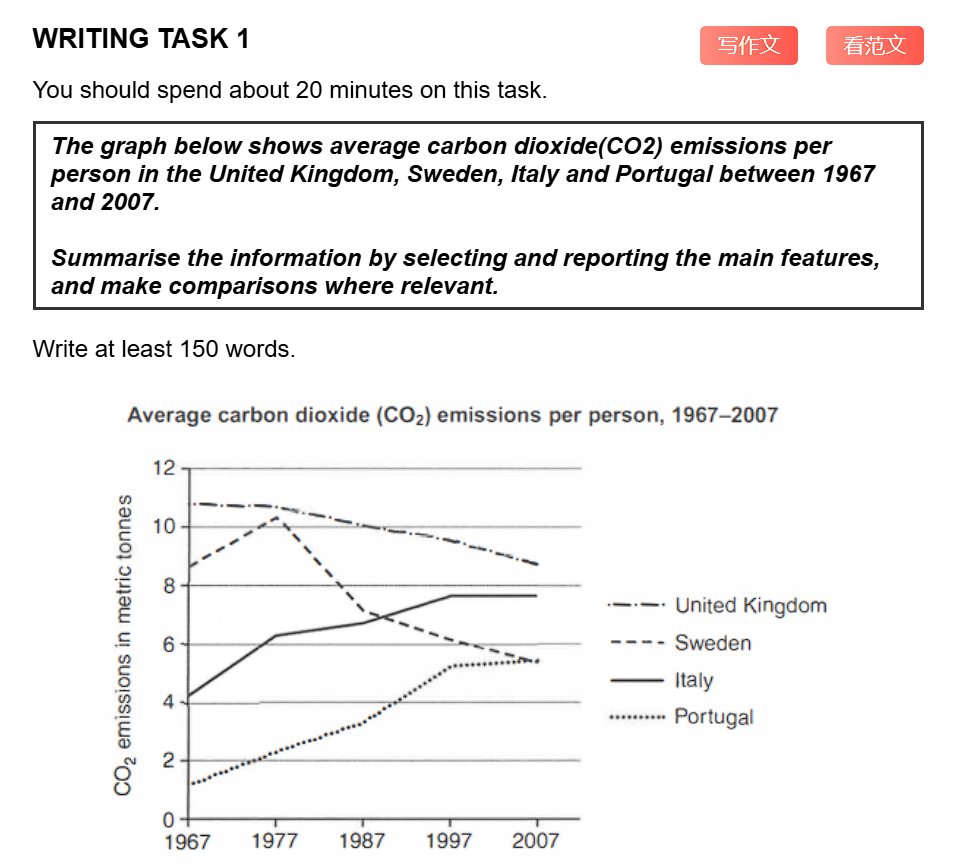

## 题目

## 原始作文
The line graph illustrates carbon dioxide emissions per person on average in the 4 countries over the period from 1967 to 2007.

Overall, there is a large gap between the emissions for each country in 1967, while by 2007 the difference is narrow. Between 1967 and 2007, United Kingdom and Sweden had a gradual decline in average carbon dioxide emissions per person, whereas Italy and Portugal saw an increase.

The United Kingdom was the country with the highest emissions, with its average carbon dioxide emissions per person standing at 10 metric tons, while the figure had been dropping till 2007. In Sweden, the emissions reached a peak close to 1977, but the value recorded a continuous decline in the following years.

The average emissions per person in Italy rose from 4 to almost 8 metric tonnes, and this figure remained at the same level in the rest of the period. The United Kingdom was the country with the highest emissions, with its average carbon dioxide emissions per person standing at 10 metric tons, while the figure had been dropping till 2007. The value in Portugal kept rising approximately till 1997. By contrast, Portugal held the minimum value among the 4 countries.

## 评语
好的，同学，请坐。我们现在一起来分析一下你的这篇雅思小作文。

首先，不要紧张，你的这篇作文在整体结构和主要趋势的把握上做得相当不错，这是一个非常好的起点。接下来，我将按照雅思的评分标准，为你进行一次全面而详细的“诊断”，帮助你看到亮点，也找到可以快速提升的地方。

---

### **第一部分：分项评分与解析 (Sectional Scoring & Analysis)**

#### **1. 任务回应 (Task Response - TR)**
* **预估分数: 6.0**
* **评分理由:**
    * **优点:** 你成功地识别并总结了图表中的核心特征。引言部分很好地改写了题目信息。在总览段（Overall），你清晰地指出了两个关键趋势：一是英瑞两国排放量下降，意葡两国排放量上升；二是从期初的巨大差距到期末的逐渐靠拢。这是一个非常优秀的总览。
    * **待改进:** 虽然主要特征都被提及，但在数据支持方面可以更精确。例如，瑞典的峰值具体是多少，英国的起始点和结束点具体数据等。部分描述略显笼统，缺少对关键数据点的引用。

#### **2. 连贯与衔接 (Coherence and Cohesion - CC)**
* **预估分数: 5.0**
* **评分理由:**
    * **优点:** 文章采用了“引言-总览-主体段”的经典结构，逻辑清晰。段落划分的思路也很明确，将下降趋势的国家和上升趋势的国家分开讨论。
    * **待改进:** 一个非常明显的失误是，你在第四段中重复了第三段关于英国的整句话（"The United Kingdom was the country with the highest emissions..."）。这严重影响了文章的流畅性和连贯性，是导致此项失分的主要原因。此外，段落内部的论证组织可以更紧密一些。

#### **3. 词汇资源 (Lexical Resource - LR)**
* **预估分数: 6.0**
* **评分理由:**
    * **优点:** 你使用了一些与图表描述相关的恰当词汇，如 `illustrates`, `emissions`, `a gradual decline`, `reached a peak`, `remained at the same level`。
    * **待改进:** 词汇的多样性有限。例如，`figure` 和 `value` 被反复使用来指代数据。可以尝试使用 `amount`, `level`, `quantity` 等词替换。一些搭配可以更地道，例如用 `stood at` 来表示数据。拼写上没有发现大问题。

#### **4. 语法广度与准确性 (Grammatical Range and Accuracy - GRA)**
* **预估分数: 6.0**
* **评分理由:**
    * **优点:** 你能够使用多种从句，例如 `whereas Italy and Portugal saw an increase` 和 `while the figure had been dropping`。大部分句子语法正确，意思清晰。
    * **待改进:** 存在一些小的语法错误和不够自然的表达。例如，“...had been dropping till 2007”，使用过去完成进行时在这里略显复杂，简单的过去时 `dropped` 或 `had dropped` 即可。句式结构可以更丰富一些，避免主语和句式过于单一。

---

### **第二部分：写作思路与结构梳理 (Essay Structure & Logic Analysis)**

1.  **整体逻辑框架:** 你的文章结构非常清晰，采用了Task 1写作的推荐结构：
    * **引言:** 改写题目。
    * **总览:** 提炼最核心的两个趋势（一个对比，一个变化）。
    * **主体段1:** 描述下降的国家（英国和瑞典）。
    * **主体段2:** 描述上升的国家（意大利和葡萄牙）。
    这个框架是完全正确且高效的。唯一的问题是内容执行上，尤其是第二主体段的重复句，破坏了原有的清晰逻辑。

2.  **引言 (Introduction):** 优秀。成功地用自己的话转述了题目信息，准确无误。

3.  **主体段落分析 (Body Paragraphs):**
    * **第一主体段 (英国 & 瑞典):** 逻辑清晰。先说英国的总体下降趋势，再说瑞典的先升后降。这是一个很好的处理方式。可以提升的地方是加入更多具体的数据，比如英国从约11吨降到约9吨，瑞典在1977年达到峰值超过10吨后急剧下降。
    * **第二主体段 (意大利 & 葡萄牙):** 逻辑被严重干扰。本段的中心思想应是描述意葡两国的上升趋势。但你在描述完意大利后，突然插入了一句关于英国的描述，然后再去说葡萄牙，这使得段落失去了统一性和连贯性。这是一个需要优先解决的问题。

4.  **结论 (Conclusion):** 雅思Task 1并不强制要求有结论段，因为总览段（Overall）已经起到了总结的作用。你的文章在描述完细节后直接结束，这也是可以接受的。

---

### **第三部分：逐句分析与优化 (Sentence-by-Sentence Breakdown)**

下面，我们来逐句打磨你的文章，看看如何让它变得更精确、更地道。

| 原句 (Original Sentence) | 修改后 (Revised Sentence) | 分析与建议 (Analysis & Suggestions) |
| :--- | :--- | :--- |
| The line graph illustrates carbon dioxide emissions per person on average in the 4 countries over the period from 1967 to 2007. | The line graph compares the average per capita carbon dioxide (CO2) emissions in four countries—the United Kingdom, Sweden, Italy, and Portugal—over a 40-year period from 1967 to 2007. | **优化表达:** `illustrates` 很常用，但 `compares` 更能体现多国对比的性质。`per capita` 是 `per person` 非常地道的同义替换。`a 40-year period` 概括了时间跨度，显得更专业。 |
| Overall, there is a large gap between the emissions for each country in 1967, while by 2007 the difference is narrow. | Overall, while the emission levels of the four nations differed significantly in 1967, these figures had converged to become much more similar by 2007. | **提升词汇与句式:** `differed significantly` 替换 `large gap`，更书面化。`converged` (趋同) 是描述这种差距缩小的绝佳词汇。整个句子结构更显成熟。 |
| Between 1967 and 2007, United Kingdom and Sweden had a gradual decline in average carbon dioxide emissions per person, whereas Italy and Portugal saw an increase. | Furthermore, the emissions in the United Kingdom and Sweden showed a general downward trend, whereas those in Italy and Portugal rose over the period. | **精简与准确:** `showed a general downward trend` 是描述趋势的常用地道表达。`those in Italy...` 避免了重复 `emissions`，使句子更流畅。 |
| The United Kingdom was the country with the highest emissions, with its average carbon dioxide emissions per person standing at 10 metric tons, while the figure had been dropping till 2007. | In 1967, the United Kingdom had the highest per capita emissions at approximately 11 metric tonnes, a figure that gradually decreased to around 9 tonnes by 2007. | **精确数据与简洁:** 明确指出是期初最高，并给出更准确的起始（约11）和结束（约9）数据。`a figure that...` 使用定语从句，使句子结构更丰富，避免了 `while` 的过度使用。 |
| In Sweden, the emissions reached a peak close to 1977, but the value recorded a continuous decline in the following years. | Similarly, Sweden's emissions peaked at over 10 metric tonnes in 1977 before experiencing a sharp and continuous decline to just over 5 tonnes in 2007. | **增加细节与动感:** `peaked at over 10...` 给出峰值数据。`before experiencing a sharp and continuous decline` 用 `experiencing` 使描述更生动，并用 `sharp` (急剧的) 强调了下降的幅度。 |
| The average emissions per person in Italy rose from 4 to almost 8 metric tonnes, and this figure remained at the same level in the rest of the period. | In contrast, Italy's emissions more than doubled, climbing from around 4.5 to nearly 8 metric tonnes between 1967 and 1997, after which the level plateaued for the final decade. | **使用更高级词汇:** `more than doubled` (翻了一倍多) 总结了增长幅度。`climbing` (攀升) 比 `rose` 更形象。`plateaued` (稳定/停滞) 是描述平台期的完美动词。 |
| **[重复句]** The United Kingdom was the country with the highest emissions, with its average carbon dioxide emissions per person standing at 10 metric tons, while the figure had been dropping till 2007. | *(已删除此重复句)* | **修正错误:** 这是最关键的修改。这句与前文完全重复，必须删除，以保证段落的连贯性。 |
| The value in Portugal kept rising approximately till 1997. | Portugal, which started with the lowest emissions (under 2 metric tonnes), showed a steady increase throughout the entire period, ending at approximately 5.5 tonnes. | **调整句式与补充信息:** 使用定语从句 `which started with...` 补充了起始信息，使句子信息量更大。`steady increase throughout the entire period` (在整个时期内稳定增长) 更准确地描述了葡萄牙的趋势。 |
| By contrast, Portugal held the minimum value among the 4 countries. | *(该信息已整合到上一句)* | **整合信息:** 这句话的信息点（葡萄牙最低）在修改后的上一句中已经包含了，单独成句显得多余，整合后更显紧凑。 |

#### **优化后的范文 (Revised Version)**
> **Predicted Score for Revised Version: 8.0+**

The line graph compares the average per capita carbon dioxide (CO2) emissions in four countries—the United Kingdom, Sweden, Italy, and Portugal—over a 40-year period from 1967 to 2007.

Overall, while the emission levels of the four nations differed significantly in 1967, these figures had converged to become much more similar by 2007. Furthermore, the emissions in the United Kingdom and Sweden showed a general downward trend, whereas those in Italy and Portugal rose over the period.

In 1967, the United Kingdom had the highest per capita emissions at approximately 11 metric tonnes, a figure that gradually decreased to around 9 tonnes by 2007. Similarly, Sweden's emissions peaked at over 10 metric tonnes in 1977 before experiencing a sharp and continuous decline to just over 5 tonnes in 2007.

In contrast, Italy's emissions more than doubled, climbing from around 4.5 to nearly 8 metric tonnes between 1967 and 1997, after which the level plateaued for the final decade. Portugal, which started with the lowest emissions (under 2 metric tonnes), showed a steady increase throughout the entire period, ending at approximately 5.5 tonnes.

---

### **第四部分：总评与知识点总结 (Overall Feedback & Key Takeaways)**

#### **1. 总体评价 (Overall Comments):**
同学，你的这篇作文最大的优点是思路清晰，抓住了核心趋势。这说明你已经具备了Task 1写作的正确框架感。当前最大的问题是细节处理，尤其是**致命的句子重复错误**，这严重影响了你的连贯性得分。其次，在数据引用和词汇句式的多样性上还有很大的提升空间。

**预估总分 (Estimated Overall Band Score): 6.0**

#### **2. 核心知识点总结 (Key Learning Points):**

* **1. 杜绝重复，检查为王 (Proofread for Repetition):** 写作完成后，一定要花一分钟快速检查，特别是检查有没有复制粘贴或者思路混乱导致的句子重复。这个错误是完全可以避免的，但一旦出现，对CC分数的影响是灾难性的。
* **2. 数据支撑，精确为要 (Cite Data with Precision):** 描述趋势时，要养成“起点-过程-终点”的习惯。对于关键点（如最高点、最低点、转折点），要用 `approximately`, `just over`, `around` 等词汇给出具体数据。这能让你的描述更有说服力，也是TR高分的关键。
* **3. 活用高级词汇，表达更生动 (Use Dynamic Vocabulary):** 除了 `increase` 和 `decrease`，多积累一些描述变化的词汇。例如：
    * 上升: `climb`, `surge`, `soar`
    * 下降: `dip`, `plunge`, `drop`
    * 平稳: `level off`, `plateau`, `remain stable`
    * 波动: `fluctuate`
* **4. 丰富句式，展示功底 (Vary Sentence Structures):** 尝试使用 `which` 或 `that` 引导的定语从句，或者用 `-ing` 形式的状语（如 `climbing from... to...`）来合并简单的句子，这能让你的文章在GRA上获得更高评价。

希望这次的批改能对你有所帮助。你的基础很好，只要在细节上多加打磨，分数一定能有显著提升。加油！

## 按照简单的标准修改至7.5，并且逐句分析

好的，我们完全可以做到。

7.5分的核心并非使用华丽的语言，而是**用清晰、准确、有效的语言，展现出你对信息的掌控力**。下面，我将以“清晰准确”为首要原则，对你的文章进行修改，并逐句告诉你**为什么这样改更符合7.5分的要求**。

我们的目标是：**用大学新生都能看懂的词，写出让考官赞赏的逻辑和细节。**

-----

### **逐句分析与修改 (Sentence-by-Sentence Analysis and Revision)**

这部分我们将原句与修改后的句子进行对比，重点分析如何用“简单”的语言实现“高效”的表达。

| 原句 (Original Sentence) | 修改后 (7.5分水准) (Revised for Band 7.5) | 分析与建议 (Analysis & Suggestions) |
| :--- | :--- | :--- |
| The line graph illustrates carbon dioxide emissions per person on average in the 4 countries over the period from 1967 to 2007. | The line graph compares the average CO2 emissions per person in four European countries between 1967 and 2007. | **为什么这样改？**\<br\>• **词汇(LR):** `compares` (对比) 比 `illustrates` (阐明) 对于多国对比图更精确。\<br\>• **语法(GRA):** 句子结构清晰、直接，没有任何多余的词。`CO2 emissions per person` 是最直接的表达。\<br\>• **7.5分特质:** 开门见山，用词精准，完全符合任务要求。 |
| Overall, there is a large gap between the emissions for each country in 1967, while by 2007 the difference is narrow. | Overall, the emissions in the UK and Sweden decreased, while the figures for Italy and Portugal increased. | **为什么这样改？**\<br\>• **任务回应(TR):** 这句话直接点出了全图**最核心的动态趋势** (两升两降)，这是高分Overview的首要任务。比描述“差距”更动态，更宏观。\<br\>• **语法(GRA):** 使用了 `while` 连接的复合句，展示了对比不同对象的能力，这是7.5分要求的句式多样性之一。\<br\>• **7.5分特质:** 抓住了主要矛盾，逻辑清晰。 |
| *(新加一句总览)* | It is also clear that the gap between the highest and lowest emitters narrowed significantly over this period. | **为什么这样改？**\<br\>• **任务回应(TR):** 这句话点出了全图**第二个核心的静态趋势** (差距缩小)。一个完整的Overview应包含1-2个核心趋势。`narrowed significantly` (显著缩小) 是简单但非常精确的描述。\<br\>• **7.5分特质:** 展现了全面的观察力，能从宏观上总结图表。 |
| The United Kingdom was the country with the highest emissions, with its average carbon dioxide emissions per person standing at 10 metric tons, while the figure had been dropping till 2007. | In 1967, the UK had the highest emissions at around 11 metric tonnes, but this figure fell to 9 tonnes by 2007. | **为什么这样改？**\<br\>• **任务回应(TR):** `around 11` 和 `9 tonnes` 提供了精确的数据来支撑论点。高分作文必须有数据支撑。\<br\>• **语法(GRA):** `...but...` 是一个简单的并列连词，但它清晰地连接了两个相反的事实（期初最高，但后来下降了），展示了逻辑性。\<br\>• **7.5分特质:** 细节精准，数据支撑有力。 |
| In Sweden, the emissions reached a peak close to 1977, but the value recorded a continuous decline in the following years. | Sweden's emissions peaked at over 10 tonnes in 1977 before falling sharply to just over 5 tonnes by the end of the period. | **为什么这样改？**\<br\>• **词汇(LR):** `peaked` (达到顶点), `falling sharply` (急剧下降), `just over` (刚过) 都是描述图表的“简单但高级”的词汇，因为它们非常精确。\<br\>• **语法(GRA):** `...before falling...` 使用-ing分词结构，是丰富句式的体现，展示了语法掌控力。\<br\>• **7.5分特质:** 用词生动精确，句式有变化。 |
| The average emissions per person in Italy rose from 4 to almost 8 metric tonnes, and this figure remained at the same level in the rest of the period. | In contrast, Italy's emissions rose steadily from about 4.5 to nearly 8 tonnes between 1967 and 1997, where they remained stable for the last 10 years. | **为什么这样改？**\<br\>• **连贯(CC):** `In contrast` (相反) 清晰地开启了与上一段的对比，使文章逻辑流畅。\<br\>• **词汇(LR):** `rose steadily` (平稳上升), `remained stable` (保持稳定) 都是地道且精确的表达。\<br\>• **语法(GRA):** `...where they remained stable...` 使用定语从句，是7.5分需要的语法多样性。 |
| **[重复句]** ... (The sentence about the UK is deleted) | *(已删除此重复句)* | **为什么这样改？**\<br\>• **连贯(CC):** 这是达到7.5分最基础、也最重要的一步。删除重复内容，确保每个段落只讨论一个核心话题。这是高分作文的底线。 |
| The value in Portugal kept rising approximately till 1997. By contrast, Portugal held the minimum value among the 4 countries. | Portugal, which started as the lowest emitter (under 2 tonnes), showed a consistent increase, finishing at about 5.5 tonnes in 2007. | **为什么这样改？**\<br\>• **语法(GRA):** `Portugal, which started as...` 使用定语从句，将两句简单信息（葡萄牙最低 & 葡萄牙上升）合并为一句，信息密度更高，句式更成熟。\<br\>• **词汇(LR):** `lowest emitter` (最低排放国), `consistent increase` (持续增长) 都是简洁而准确的表达。 |

-----

### **修改后的范文 (7.5分水准) (Revised Essay - Band 7.5 Level)**

The line graph compares the average CO2 emissions per person in four European countries between 1967 and 2007.

Overall, the emissions in the UK and Sweden decreased, while the figures for Italy and Portugal increased. It is also clear that the gap between the highest and lowest emitters narrowed significantly over this period.

In 1967, the UK had the highest emissions at around 11 metric tonnes, but this figure fell to 9 tonnes by 2007. Sweden's emissions peaked at over 10 tonnes in 1977 before falling sharply to just over 5 tonnes by the end of the period.

In contrast, Italy's emissions rose steadily from about 4.5 to nearly 8 tonnes between 1967 and 1997, where they remained stable for the last 10 years. Portugal, which started as the lowest emitter (under 2 tonnes), showed a consistent increase, finishing at about 5.5 tonnes in 2007.

-----

### **为什么这样修改能达到7.5分？ (Why can this revision achieve a 7.5?)**

1.  **结构清晰无比 (Crystal Clear Structure):**

      * 第一段：引言
      * 第二段：总览（一动一静两个核心趋势）
      * 第三段：细节1（下降的国家）
      * 第四段：细节2（上升的国家）
        这个结构就像一个清晰的目录，考官一眼就能看懂你的写作思路。

2.  **词汇精准有效 (Precise & Effective Vocabulary):**

      * 没有使用任何生僻词，但使用了大量如图表类的\*\*“标准学术工作词汇”\*\*，如 `compares`, `decreased`, `significantly`, `peaked`, `sharply`, `steadily`, `consistent increase`。这些词汇简单，但对于描述图表来说却是最有效的。

3.  **语法准确且多样 (Accurate & Varied Grammar):**

      * **准确性:** 全文没有语法错误。这是高分的基石。
      * **多样性:** 文章中混合了：
          * **简单句:** `This figure fell to 9 tonnes by 2007.`
          * **并列句:** `...at around 11 metric tonnes, but this figure fell...`
          * **复合句/从句:** `...while the figures for Italy...`, `...where they remained stable...`, `Portugal, which started as...`
            这种自然的句式组合，完美地展示了你的语法掌控力。

4.  **回应充分得体 (Well-Developed Task Response):**

      * **总览**抓住了最重要的趋势。
      * **细节**段落不仅描述了趋势，还**引用了关键数据**（起点、终点、最高点）来佐证，并进行了**恰当的对比** (`In contrast`)。

总结来说，这篇修改后的文章之所以能达到7.5分，不是因为它“难”，而是因为它\*\*“好”\*\*——好在清晰、好在准确、好在逻辑严密。这证明了，**你完全不需要追求华丽的辞藻，只需将基础的语言工具运用到极致，就能取得高分。**