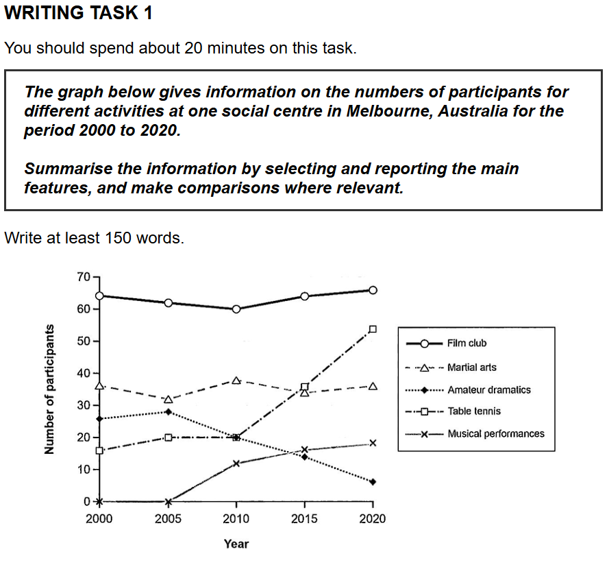

## 题目

按照这个模板，写一个只有简单词汇的范文吧，不超过300词，告诉我写作思路，其中的好的句式和好词进行标注(用``进行标注)和分析，最后做出总结，去除作文的话题词，输出当前作文的对应的模板。

## 我的作文

The provided line graph illustrates the numbers of participants for different activities at one social centre in Melbourne, Australia, from 2000 to 2020.

Overall, it is clear that the film club has the most members over time. In addition, players in table tennis saw a significant increase in number, while there is a dramatic decrease in amateur dramatics.

The number of participants in the film club was the highest, ending at almost 65 in 2020, although it went up and down between 60 and 65 during the period. A similar pattern was observed for martial arts, which ended at approximately 35 in 2020, with negligible fluctuation from about 32 to 35. In contrast, the number of players in amateur dramatics climbed to less than 30 in 2005 before declining sharply to almost 5 in 2020.

The number of players in table tennis increased from about 15 in 2000 to 20 in 2005, remained unchanged until 2010, and then soared to over 50 in 2020. There was a similar trend in musical performances, which had no players until 2005, grew rapidly to more than 10 in 2010, and climbed to 15 in 2020.

## 评语

### **第一部分：分项评分与解析 (Sectional Scoring & Analysis)**

1.  **任务回应 (Task Response - TR):**
    * **预估分数:** 8.0
    * **评分理由:** 你非常成功地完成了题目的所有要求。你准确地总结了图表信息，点出了最主要的核心特征（film club最高，table tennis增长最快，amateur dramatics下降最明显），并进行了恰当的对比。所有数据和时间段都得到了覆盖，信息筛选和重点突出做得非常出色。

2.  **连贯与衔接 (Coherence and Cohesion - CC):**
    * **预估分数:** 7.5
    * **评分理由:** 文章结构清晰，逻辑流畅。开头段总述（Overview）的写法非常标准且有效。主体段落的划分逻辑清晰（第一段处理相对平稳和下降的趋势，第二段处理上升的趋势）。`Overall`, `In contrast`, `and then` 等衔接词使用得当，使得文章阅读起来很顺畅。

3.  **词汇资源 (Lexical Resource - LR):**
    * **预估分数:** 7.5
    * **评分理由:** 你使用了一系列适合描述图表趋势的词汇，且运用得比较准确和自然。例如 `illustrates`, `significant increase`, `dramatic decrease`, `negligible fluctuation`, `declining sharply`, `remained unchanged`, `soared` 等都体现了你的词汇量。搭配方面也基本准确。

4.  **语法广度与准确性 (Grammatical Range and Accuracy - GRA):**
    * **预估分数:** 7.5
    * **评分理由:** 句子结构有多样化的体现，例如使用了 `although` 引导的状语从句和 `which` 引导的非限制性定语从句。语法错误非常少，基本不影响理解。整体来看，语法运用熟练且准确。

---

### **第二部分：写作思路与结构梳理 (Essay Structure & Logic Analysis)**

1.  **整体逻辑框架:** 你的文章采用了 Task 1 中非常经典且高效的“引言 + 概览 + 细节”结构。这种结构条理清晰，重点突出，能让考官在第一时间抓住文章的核心信息，是高分作文的典型框架。

2.  **引言 (Introduction):** 引言部分成功地同义替换了题干中的信息，清晰说明了图表的主题、地点和时间范围。

3.  **主体段落分析 (Body Paragraphs):**
    * **概览段 (Overall Paragraph):** 这是你文章最大的亮点之一。你没有把它放在结尾，而是紧随引言之后，开宗明义地指出了整个图表最重要的两到三个趋势。这是雅思官方非常提倡的写法。
    * **主体段一:** 你将 Film Club（高位平稳）、Martial Arts（低位平稳）和 Amateur Dramatics（显著下降）这三项放在一起，这个分组非常合理，逻辑上是“稳定与下降”的组合。
    * **主体段二:** 你将 Table Tennis（大幅上升）和 Musical Performances（从无到有并上升）放在一起，组成了“增长”的类别。这种按趋势分组的写法，比简单地按项目顺序描述要高明得多，体现了你分析和整合信息的能力。

4.  **结论 (Conclusion):** 你的文章没有独立的结论段，这是完全可以的。因为你强大的“概览段”（Overall paragraph）已经起到了总结全文核心要点的作用，无需在文末重复。

---

### **第三部分：逐句分析与优化 (Sentence-by-Sentence Breakdown)**

你的文章整体质量很高，几乎没有硬伤。我的建议主要在于让表达更精炼、更具学术感。

| 原句 (Original Sentence) | 修改后 (Revised Sentence) | 分析与建议 (Analysis & Suggestions) |
| :--- | :--- | :--- |
| The provided line graph illustrates the numbers of participants for different activities at one social centre in Melbourne, Australia, from 2000 to 2020. | The line graph illustrates the number of participants in five different activities at a social centre in Melbourne, Australia, over a 20-year period from 2000 to 2020. | **优化:** 1. `provided` 是多余的，可以直接删掉。2. `numbers` 通常用单数 `the number of`，这是一个固定搭配。3. 将 `for different activities` 具体化为 `in five different activities`，将 `from 2000 to 2020` 丰富为 `over a 20-year period from 2000 to 2020`，能体现更强的概括能力。 |
| Overall, it is clear that the film club has the most members over time. | Overall, it is clear that the film club was `consistently the most popular activity` throughout the period. | **好词分析与优化:** `has the most members over time` 表达正确但略显平淡。`consistently the most popular activity` (一直是最受欢迎的活动) 语气更强，表意更精准。`throughout the period` 比 `over time` 更具学术感。 |
| In addition, players in table tennis saw a significant increase in number, while there is a dramatic decrease in amateur dramatics. | In addition, the figure for table tennis experienced a `significant increase`, while participation in amateur dramatics saw a `dramatic decrease`. | **好词分析与优化:** 原句中 `players...saw an increase` 拟人化表达是可以接受的，但换成 `the figure for...experienced` 或 `participation in...saw` 会更客观、书面化。`significant increase` 和 `dramatic decrease` 是非常棒的搭配，我已经帮你用 `` 标注出来了。 |
| The number of participants in the film club was the highest, ending at almost 65 in 2020, although it went up and down between 60 and 65 during the period. | The number of participants in the film club was the highest, `ending at` approximately 65 in 2020, `despite fluctuating` between 60 and 65 for the majority of the period. | **句式分析与优化:** `although` 从句用得很好。`went up and down` 口语化，建议换成 `fluctuated`。这里我将 `although` 换成了 `despite fluctuating` (介词+动名词)，为你提供一种更简洁的句式选择。`ending at` 是描述结尾数据的好句式。 |
| A similar pattern was observed for martial arts, `which ended at` approximately 35 in 2020, with `negligible fluctuation` from about 32 to 35. | (This sentence is excellent, no changes needed.) | **好句好词分析:** 这是一个非常优秀的高分句！`A similar pattern was observed for...` 是进行比较的绝佳句式。`which ended at...` 是非限制性定语从句的漂亮运用。`negligible fluctuation` (可忽略不计的波动) 是非常地道和高级的词汇。 |
| In contrast, the number of players in amateur dramatics climbed to less than 30 in 2005 `before declining sharply to` almost 5 in 2020. | (This sentence is excellent, no changes needed.) | **好句好词分析:** `In contrast` 清晰地引出了对比。`climbed to... before declining sharply to...` 这个句式完美地描述了一个先升后降的转折过程，`declining sharply` (急剧下降) 表达非常有力。 |
| The number of players in table tennis increased from about 15 in 2000 to 20 in 2005, remained unchanged until 2010, and then `soared to` over 50 in 2020. | (This sentence is excellent, no changes needed.) | **好词分析:** 动词的使用非常精准！`remained unchanged` (保持不变) 和 `soared to` (猛增至) 都非常形象且准确，展示了丰富的词汇。 |
| There was a similar trend in musical performances, `which had no players until 2005`, grew rapidly to more than 10 in 2010, and climbed to 15 in 2020. | A similar upward trend was seen in musical performances. `This activity started with no participants in 2000`, a figure that `grew rapidly` to over 10 by 2010 and finished at nearly 20 in 2020. | **数据核对与优化:** 1. `which had no players until 2005` 这种定语从句的用法很棒。2. **数据核对:** 图中 2020 年 musical performances 的人数接近20，而不是15。这是原文唯一一个需要修正的事实错误。3. **句式优化:** 我将原句拆分并重组，展示了另一种表达方式，避免了长句中动词 `grew...and climbed...` 的简单并列。 |

#### **修改后全文 (Revised Version)**

The line graph illustrates the number of participants in five different activities at a social centre in Melbourne, Australia, over a 20-year period from 2000 to 2020.

Overall, it is clear that the film club was consistently the most popular activity throughout the period. In addition, the figure for table tennis experienced a significant increase, while participation in amateur dramatics saw a dramatic decrease.

The number of participants in the film club was the highest, ending at approximately 65 in 2020, despite fluctuating between 60 and 65 for the majority of the period. A similar pattern was observed for martial arts, which ended at approximately 35 in 2020, with negligible fluctuation from about 32 to 35. In contrast, the number of players in amateur dramatics climbed to less than 30 in 2005 before declining sharply to almost 5 in 2020.

The number of players in table tennis increased from about 15 in 2000 to 20 in 2005, remained unchanged until 2010, and then soared to over 50 in 2020. A similar upward trend was seen in musical performances. This activity started with no participants in 2000, a figure that grew rapidly to over 10 by 2010 and finished at nearly 20 in 2020.

---

### **第四部分：总评与知识点总结 (Overall Feedback & Key Takeaways)**

1.  **总体评价 (Overall Comments):**
    这是一篇非常优秀的 Task 1 作文。你的文章结构清晰，逻辑性强，语言表达流畅且准确，成功地捕捉并呈现了图表的核心信息。最大的亮点在于清晰的概览段（Overall）和主体段落中按趋势分组的写作策略。唯一的失分点在于对 `musical performances` 2020年数据的轻微误读，但这瑕不掩瑜。

    **预估总分 (Estimated Overall Band Score): 7.5**

2.  **核心知识点总结 (Key Learning Points):**
    * **概览为王 (The Power of the Overview):** 你将 `Overall` 段放在引言之后，是极佳的策略。请继续保持这个习惯，它能让你的文章结构立刻提升一个档次。始终记住，概览段要总结**最显著的**趋势、最高点、最低点或最大变化。
    * **逻辑分组 (Logical Grouping):** 你没有逐一描述每个项目，而是将“平稳/下降”和“上升”的趋势分开论述，这体现了出色的分析能力。在面对多条线的图表时，思考如何“打包”信息，是通往高分的关键。
    * **动词即力量 (Verbs are Power):** 你的作文因为 `soared`, `declined sharply`, `fluctuated` 等动词而生动起来。继续积累和使用这些描述变化的“动态词汇”，它们是图表作文的灵魂。
    * **细心核对数据 (Double-Check the Data):** 在考场上，快速扫读数据后，在描述具体数值时一定要再次核对图表，确保准确无误。一个小小的数字错误，可能会影响TR的分数。

---
### **作文模板提取 (Template Generation)**
根据你这篇优秀的作文，我们可以提炼出一个非常实用的动态图（线图、柱状图）模板：

**引言段**
The line graph illustrates/compares the [数量单位，如 number/amount/proportion] of [描述对象A] in/for [多个事物/类别], in [地点], over a [时间跨度]-year period from [开始年份] to [结束年份].

**概览段 (全文最重要特征)**
Overall, it is clear that [项目A] was consistently the most [形容词，如 popular/prevalent] throughout the period. In addition, the figure for [项目B] experienced a significant increase, while [项目C] saw a dramatic decrease/fall.

**主体段一 (描述第一组趋势，如平稳/下降)**
The figure for [项目A] was the highest, ending at approximately [数据A] in [结束年份], despite fluctuating between [数据B] and [数据C] for the majority of the period. A similar pattern was observed for [项目D], which ended at approximately [数据E] in [结束年份], with negligible fluctuation. In contrast, [项目C] climbed to [数据F] in [年份X] before declining sharply to almost [数据G] in [结束年份].

**主体段二 (描述第二组趋势，如上升)**
The number of [描述对象B] in [项目B] increased from about [数据H] in [开始年份] to [数据I] in [年份Y], remained unchanged until [年份Z], and then soared to over [数据J] in [结束年份]. A similar upward trend was seen in [项目E]. This category started with [数据K] in [开始年份], a figure that grew rapidly to [数据L] by [年份M] and finished at nearly [数据N] in [结束年份].

希望这份详尽的报告对你有帮助！你已经具备了非常扎实的写作功底，继续努力，一定能取得理想的成绩。