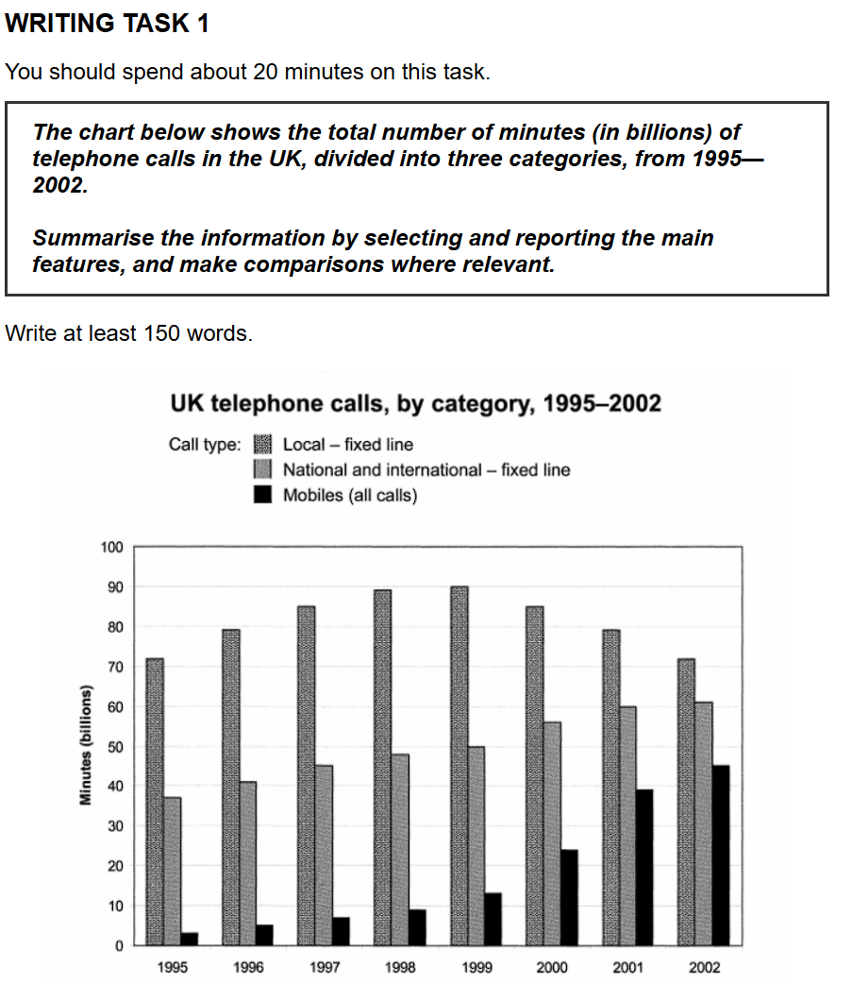

## 题目

## 原始作文
The provided bar chart illustrates the total minutes (in billions) of telephone calls in the UK, divided into three categories, between 1995 and 2002.

Overall, it is clear that while the figure for local fixed-line calls remained the highest throughout the period despite some fluctuations, both national/international calls and mobile calls experienced a significant upward trend.

Regarding fixed-line calls, the number of minutes for national and international services rose steadily from approximately 38 billion in 1995 to just over 60 billion in 2002. Local fixed-line calls, however, accounted for the largest proportion of total call time. This category peaked at 90 billion minutes in 1999 before declining to approximately 72 billion minutes by the end of the period.

Turning to mobile calls, the most dramatic change was observed in this category. Starting at just under 5 billion minutes in 1995, this figure increased gradually to around 13 billion minutes by 1999, before growing exponentially to finish at over 45 billion minutes in 2002.

## 评语

好的，同学，我们一起来分析一下你写的这篇雅思小作文。你的文章已经能够抓住图表的主要特征，并且结构比较清晰，这是一个很好的起点。接下来，我将严格按照雅思的评分标准，为你提供一份详细的批改报告，帮助你发现问题并实现提升。

---

### **第一部分：分项评分与解析 (Sectional Scoring & Analysis)**

#### **1. 任务回应 (Task Response - TR)**
* **预估分数: 6.5**
* **评分理由:** 你成功地回应了题目要求，对图表信息进行了总结。文章包含了一个清晰的总览（Overall），并且提及了图表中的所有三个类别。你正确地识别出了主要趋势：本地通话的起伏和主导地位、国内/国际通话的稳定增长，以及手机通话的急剧攀升。数据的使用也基本得当，支撑了你的描述。但是，在描述国内/国际通话数据时，表达有些模糊（"rose from nearly 38 billion minutes, whereas in 2002, there was an increase of about 20 billion minutes"），这轻微影响了信息的清晰度。

#### **2. 连贯与衔接 (Coherence and Cohesion - CC)**
* **预估分数: 6.5**
* **评分理由:** 文章的整体结构非常清晰，采用了“引言-总览-主体段1-主体段2”的经典结构，逻辑性强。段落划分合理，第一段主体段集中讨论固定电话，第二段讨论移动电话，思路很清楚。衔接词的使用基本恰当（"Overall", "Regarding fixed line", "Turning to mobile calls"），有效地引导了读者。但个别衔接词使用不当，例如 "Meanwhile"，在这里使用略显生硬，因为它通常用于连接两个同时发生的、不相关的事件。

#### **3. 词汇资源 (Lexical Resource - LR)**
* **预估分数: 6.0**
* **评分理由:** 你使用了一些描述趋势的有效词汇，如 "increasing trend"、"fluctuations"、"rose from"、"reached the peak of"、"declined gradually"、"increased gradually" 和 "grow dramatically"。但是，存在一些用词不当和搭配错误。最明显的是用 "value" 来指代通话分钟数，更准确的词应该是 "figure for" 或 "the number of minutes"。此外，"located in" 的用法不自然，"clined" 是 "declined" 的拼写错误。词汇的多样性还有提升空间。

#### **4. 语法广度与准确性 (Grammatical Range and Accuracy - GRA)**
* **预估分数: 6.0**
* **评分理由:** 你尝试使用了复合句，例如 "Overall, it is clear that..., whereas..."，这体现了一定的语法能力。然而，文章中存在一些影响理解的语法错误。例如，动词时态错误（"then grow dramatically" 应为 "grew"），句子结构笨拙（"the most significant change located in the rise of mobiles calls"），以及连接词误用导致的句子逻辑混乱。这些错误虽然没有完全阻碍理解，但出现的频率足以将分数限制在6.0分。

---

### **第二部分：写作思路与结构梳理 (Essay Structure & Logic Analysis)**

1.  **整体逻辑框架:** 你的文章逻辑框架非常出色。先总后分的结构让文章一目了然。总览段准确地概括了三大主要趋势，为后续的具体分析奠定了坚实的基础。
2.  **引言 (Introduction):** 引言部分成功地改写了题目，清晰地说明了图表的主题、地点和时间范围，做得很好。
3.  **主体段落分析 (Body Paragraphs):**
    * **总览段 (Overall):** 这是你文章的亮点。它清晰地抓住了最重要的信息：一个下降（尽管有波动），两个上升。这正是Task 1所要求的高度概括能力。
    * **主体段一 (Fixed Line):** 你将两个固定电话类别放在一起分析，这是一个很好的分组策略。你先描述了国内/国际长途的增长，然后描述了本地通话的波动和峰值，逻辑清晰。美中不足的是对国内/国际长途的数据描述不够精确。
    * **主体段二 (Mobile Calls):** 这个段落的中心思想非常明确——手机通话的急剧增长。你通过分阶段描述（1995年起点，1999年缓增，2000年后猛增）很好地展现了这一“戏剧性”的变化，并引用了关键数据点来支持论证。
4.  **结论 (Conclusion):** Task 1 的报告不需要独立的结论段，将总览（Overall）放在引言之后是非常标准且高效的写法，你这一点做得很好。

---

### **第三部分：逐句分析与优化 (Sentence-by-Sentence Breakdown)**

下面，我们将逐句分析你的作文，并提供修改建议，以提升表达的准确性和地道性。

| 原句 (Original Sentence) | 修改后 (Revised Sentence) | 分析与建议 (Analysis & Suggestions) |
| :--- | :--- | :--- |
| The provided bar chart compares the total number of minutes of telephone calls for different categories in the UK from 1995 to 2002. | The provided bar chart illustrates the total minutes (in billions) of telephone calls in the UK, divided into three categories, between 1995 and 2002. | **优化表达**: "illustrates" 或 "shows" 比 "compares" 更中性、更常用。补充 "in billions" 和 "between...and..." 使表达更完整、精确。 |
| Overall, it is clear that the value of national and international fixed lines and mobiles saw an increasing trend, whereas the local lines remained in the number one rank with fluctuations. | Overall, it is clear that while the figure for local fixed-line calls remained the highest throughout the period despite some fluctuations, both national/international calls and mobile calls experienced a significant upward trend. | **词汇与结构**: 1. 用 "figure for" 替换 "value of"，这是描述图表数据的标准词汇。 2. 用 "remained the highest" 替换 "remained in the number one rank"，表达更书面化。 3. 使用 "while" 连接两个分句，可以更好地展示对比关系，句式也更高级。 |
| Regarding fixed line, the number of calls from the national and international lines rose from nearly 38 billion minutes, whereas in 2002, there was an increase of about 20 billion minutes. | Regarding fixed-line calls, the number of minutes for national and international services rose steadily from approximately 38 billion in 1995 to just over 60 billion in 2002. | **清晰度与准确性**: 原句的后半部分 "whereas..." 逻辑不清晰。修改后的句子直接给出了起点和终点的数据，清晰地展示了增长过程。"steadily"（稳定地）准确描述了其增长形态。 |
| Meanwhile, the local fixed line calls made up the largest proportion in 7 years. | Local fixed-line calls, however, accounted for the largest proportion of total call time throughout the entire period. | **衔接与词汇**: 1. "Meanwhile" 在此不适用，"However" 能更好地表达转折对比。 2. "made up" 不如 "accounted for" 书面化。3. "in 7 years" 不如 "throughout the entire period" 表达得更准确流畅。 |
| The value of fixed line reached the peak of 90 billion minutes, and clined gradually to approximately 70 billion minutes in 2002. | This category peaked at 90 billion minutes in 1999 before declining to approximately 72 billion minutes by the end of the period. | **拼写与细节**: 1. 修正拼写错误 "clined" -> "declining"。 2. 用 "This category" 来指代，避免重复。 3. 补充关键年份 "in 1999" 让信息更完整。 4. 图表数据显示2002年是72bn左右，非70bn，注意数据准确性。 |
| Turning to mobile calls, the most significant change located in the rise of mobiles calls. | Turning to mobile calls, the most dramatic change was observed in this category. | **语法与简洁性**: "located in" 的用法是错误的（中式英语）。修改后的句子 "the most dramatic change was observed in this category" 更简洁、地道，语法也正确。 |
| It started with less than 5 billion minutes in 1995, increased gradually to around 15 billion minutes in 1999, then grow dramatically to 25 billion minutes in 2000. | Starting at just under 5 billion minutes in 1995, this figure increased gradually to around 13 billion minutes by 1999, before growing dramatically to over 45 billion minutes in 2002. | **语法与数据**: 1. 修正时态错误 "grow" -> "grew" 或 "growing"。 2. 使用现在分词 "Starting at..." 让句式更多样。 3. 整合了信息，直接给出最终数据点，使描述更连贯。同时，修正了数据（1999年约13bn，2000年约23bn）。这里可以直接描述最终点来体现其巨大增长。 |
| It almost doubled its amount in the year after and reached over 45 billion minutes in 2002. | (该句信息已合并到上一句中) | **合并优化**: Task 1 写作追求简洁高效，可以将紧密相关的信息点合并，避免短句过多。上一个修改建议已经包含了这里的核心信息。 |

#### **修改后范文 (Revised Version)**
The provided bar chart illustrates the total minutes (in billions) of telephone calls in the UK, divided into three categories, between 1995 and 2002.

Overall, it is clear that while the figure for local fixed-line calls remained the highest throughout the period despite some fluctuations, both national/international calls and mobile calls experienced a significant upward trend.

Regarding fixed-line calls, the number of minutes for national and international services rose steadily from approximately 38 billion in 1995 to just over 60 billion in 2002. Local fixed-line calls, however, accounted for the largest proportion of total call time. This category peaked at 90 billion minutes in 1999 before declining to approximately 72 billion minutes by the end of the period.

Turning to mobile calls, the most dramatic change was observed in this category. Starting at just under 5 billion minutes in 1995, this figure increased gradually to around 13 billion minutes by 1999, before growing exponentially to finish at over 45 billion minutes in 2002.

* **修改后预测总分 (Estimated Overall Band Score after Revision): 7.5+**

---

### **第四部分：总评与知识点总结 (Overall Feedback & Key Takeaways)**

#### **1. 总体评价 (Overall Comments)**
* **预估总分 (Estimated Overall Band Score): 6.0**

同学，你的这篇作文最大的优点是结构清晰，逻辑性强，并且成功抓住了图表的核心趋势。这是一个非常好的基础。目前的主要问题集中在**词汇的准确性**和**语法的精确性**上。一些用词（如 value）和句子结构（如 located in）显得有些生硬，并且存在一些小的语法和拼写错误。这些问题共同影响了你表达的清晰度和自然度，从而限制了分数。只要针对性地改进这些方面，你的分数会有显著提升。

#### **2. 核心知识点总结 (Key Learning Points)**
* **图表词汇的准确使用:** 在描述数据时，避免使用 "value"。请记忆并使用更专业的词汇，如 **the figure for...**, **the number of...**, **the amount of...**, 或直接说 **X stood at...**。
* **动词时态的一致性:** 描述过去时间段的图表，全文应统一使用**一般过去时**。特别注意动词的不规则变化，例如 **grow -> grew**。在提交前一定要检查一遍动词时态。
* **提升句子结构的自然度:** 避免生硬的中式英语表达。例如，"最显著的变化是..."，可以说 **"The most significant change was..."** 或 **"A notable trend was observed in..."**，而不是 "...located in..."。多读一些范文，模仿地道的表达方式。
* **精准使用连接词:** 了解常用连接词的准确含义和用法。例如，用 **"however"** 或 **"in contrast"** 来表示对比，而不是 "meanwhile"。用 **"while"** 或 **"whereas"** 在一个句子中连接两个对比鲜明的信息点。

希望这份详细的报告对你有帮助！继续练习，针对性地攻克这些知识点，你的写作水平一定能更上一层楼。加油！