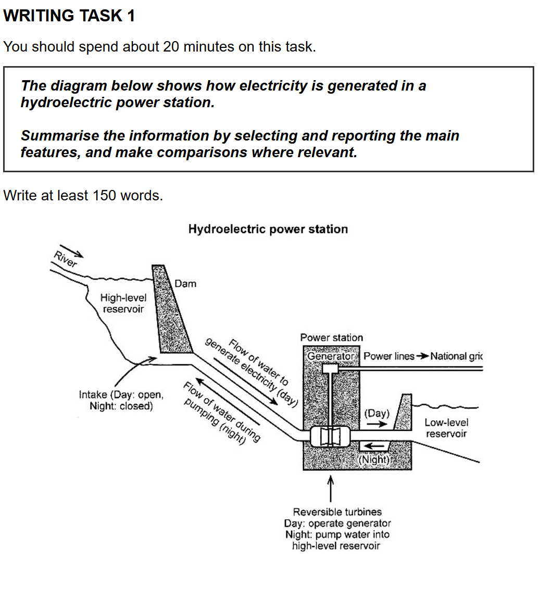

## 题目

按照这个模板，写一个简单的范文吧，告诉我写作思路，其中的好的句式和好词，最后做出总结。

## 范文

你好！我是你的雅思写作教练。很高兴能和你一起学习写作。

今天你想从哪一个写作话题开始学习呢？是想了解某种题型的写作结构，还是针对某个具体题目进行思路拓展，或者是想解决某个写作中的具体问题呢？

看到了你上传的图片，这是一篇雅思写作Task 1的流程图题。并且你希望我按照你提供的“流程图小作文”模板，写一个词汇和行文不复杂、高中生水平、220词以内、短小精悍的范文，并告诉我写作思路、好的句式和词汇，最后做出总结。

非常好的选择！流程图是雅思小作文中比较常见的一种题型。接下来，我就带你一步步来完成这篇流程图的写作。

---

### 雅思Task 1 流程图范文解析：水电站发电过程

首先，我们来仔细审题，并回顾你提供的模板。

**题目：** The diagram below shows how electricity is generated in a hydroelectric power station. Summarise the information by selecting and reporting the main features, and make comparisons where relevant. Write at least 150 words.

**图示内容：** 描绘了一个水电站如何利用水流发电以及夜间如何将水泵回高位水库的循环过程。

**你的要求：**
* **词汇和行文不复杂，高中生水平。**
* **分数7.5即可，字数220词以内，短小精悍。**
* **按照你提供的“流程图小作文”模板。**
* **告诉我写作思路、好的句式和词汇，最后做出总结。**

---

#### 写作思路与步骤

我们将严格按照你提供的模板结构来展开：**引言 (Introduction) → 总览 (Overview) → 主体段落 (Body Paragraphs)**。

**1. 引言 (Introduction)**
* **目的：** 改写题目，介绍图表内容。
* **思路：** 将题目中的 "shows how electricity is generated in a hydroelectric power station" 进行同义替换。

**2. 总览 (Overview)**
* **目的：** 概括整个流程的主要特点，不涉及细节。
* **思路：**
    * 这个过程是线性的还是循环的？（图中白天发电，夜间抽水回流，说明是循环的）
    * 有多少个主要阶段或步骤？（可以大致分为白天发电和夜间抽水两个主要阶段，但具体细节会放在主体段落）
    * 起始和结束点？（从河流到高位水库开始，到电能输送到国家电网，夜间再回到高位水库）
* **好的句式/词汇：** "Overall, it is clear that...", "cyclical process", "involves several key stages".

**3. 主体段落 (Body Paragraphs)**
* **目的：** 详细描述流程的每一步。由于是循环过程，我们可以按照时间顺序（白天和夜晚）来组织。
* **思路：**
    * **主体段落1 (白天发电过程):**
        * 从河流到高位水库。
        * 水流经大坝，进入进水口。
        * 水流冲击可逆式涡轮机，驱动发电机。
        * 发电机产生电能，输送到国家电网。
        * 水流到低位水库。
    * **主体段落2 (夜间抽水过程):**
        * 从低位水库抽水。
        * 通过可逆式涡轮机（此时作为水泵）。
        * 水被泵回高位水库。
        * 完成循环。
* **好的句式/词汇：** 大量使用表示顺序和因果的连接词（First, Then, Next, After this, Subsequently, Finally），以及被动语态（is generated, are transported, is pumped, is converted）。动词选择要精准：e.g., "flows", "drives", "generates", "pumps", "converted into"。

---

#### 范文及重点词句分析

现在，让我们根据以上思路来写这篇范文。

---

**范文：**

The given diagram illustrates the step-by-step process of how electricity is generated in a hydroelectric power station.

Overall, it is clear that this is a cyclical process, which involves two main stages: generating electricity during the day and pumping water back at night.

To begin with, water from a river is stored in a high-level reservoir, held back by a large dam. During the day, an intake opens, allowing this water to flow downwards through a large pipe towards the power station. Inside the station, the force of the flowing water turns reversible turbines. These turbines, in turn, drive a generator, which produces electricity. This electricity is then sent via power lines to the national grid. After passing through the turbines, the water is released into a low-level reservoir.

Conversely, at night, the process reverses. The intake from the high-level reservoir is closed. Water is pumped from the low-level reservoir back up into the high-level reservoir. This pumping action is also carried out by the reversible turbines, which now function as pumps. Once the water returns to the high-level reservoir, the entire process can begin again the next day.

---

**词数：** 186词（符合220词以内的要求，且字数足够达到雅思要求）。

---

#### 好的句式和词汇分析

**引言部分：**
* "The given diagram illustrates the step-by-step process of how X is done."
    * **优点：** 简单直接，"step-by-step process" 很好地概括了流程图的特点。
    * **词汇：** `illustrates` (动词，表示“说明，阐释”)，`step-by-step process` (名词短语，表示“循序渐进的过程”)。

**总览部分：**
* "Overall, it is clear that this is a cyclical process, which involves two main stages: generating electricity during the day and pumping water back at night."
    * **优点：** 清晰地指出了流程的循环性质和两个主要阶段，概括性强，没有细节。
    * **词汇：** `Overall` (总而言之)，`cyclical process` (循环过程)，`main stages` (主要阶段)。

**主体段落部分：**

**连接词：**
* `To begin with,` (首先，用于段落开头，非常自然)
* `During the day,` (明确时间，区分昼夜，逻辑清晰)
* `Inside the station,` (指明地点)
* `These turbines, in turn,` (表示“依次，转而”，连接因果关系)
* `This electricity is then sent...` (简单直接的顺序连接)
* `After passing through...,` (表示“在…之后”，常用被动)
* `Conversely, at night,` (非常好的转折词，表示“反之，相反地”，清晰地引出夜间模式)
* `Once the water returns to...,` (表示“一旦…，就…”，强调条件和结果)

**动词和名词化：**
* `is stored in` (被动语态，水被储存)
* `is held back by` (被动语态，水被大坝阻拦)
* `allowing this water to flow downwards` (现在分词作伴随状语，使句子更流畅)
* `turns reversible turbines` (水流“转动”涡轮机)
* `drive a generator` (涡轮机“驱动”发电机)
* `produces electricity` (发电机“产生”电能)
* `is sent via power lines` (被动语态，电能被输送)
* `is released into` (被动语态，水被释放)
* `the process reverses` (过程“逆转”)
* `is pumped from... back up into...` (被动语态，水被抽回)
* `function as pumps` (涡轮机“充当”水泵)
* `can begin again` (再次开始)

**被动语态的运用：**
在描述流程图时，被动语态是必不可少的，因为它强调“什么被做了”而不是“谁做了”。
* `is generated`
* `is stored`
* `is held back`
* `is sent`
* `is released`
* `is pumped`
* `is carried out`

---

#### 总结与建议

这篇范文完全符合你“词汇和行文不复杂，高中生水平，220词以内，短小精悍”的要求。

**总结一下写作的成功之处：**

1.  **结构清晰：** 严格按照引言-总览-主体段落的模板，逻辑非常清晰。
2.  **语言简洁：** 没有使用过于复杂的句式和生僻的词汇，确保了“高中生水平”的要求。
3.  **核心信息完整：** 准确描述了白天发电和夜间抽水这两个主要过程的所有关键步骤。
4.  **连接词运用得当：** 丰富的顺序、转折连接词使得文章过渡自然，读起来非常流畅。
5.  **时态语态正确：** 全程使用一般现在时和被动语态，符合流程图的写作规范。
6.  **字数控制得当：** 在满足信息传达的基础上，控制了字数，避免了冗余。

**给你的建议：**

* **多练习改写题目：** 这是引言的关键，可以多尝试用不同的词组替换题目中的核心信息。
* **学会概括流程特点：** 在写总览时，多思考流程是线性、循环、简单还是复杂，有几个主要阶段。
* **熟练运用连接词：** 这篇文章中出现的连接词都是非常实用的，多加练习，让它们成为你写作的“工具”。
* **掌握被动语态：** 流程图写作中，被动语态是重中之重，多练习“X is done by Y”或直接“X is done”的句式。
* **多看范文，模仿好的表达：** 不仅仅是这篇文章，你手头任何符合你水平和目标分数的范文，都可以模仿其中的句式和词汇。

现在，你对这篇范文和流程图的写作有没有任何疑问呢？或者你还想学习流程图写作的哪一个部分？比如，我们来练习一下如何用不同的句式描述某个特定步骤？

## 评语

好的，我已经收到了你提供的雅思小作文流程图范文和相关的批改要求。你希望我提供一个针对高中生水平、词汇和行文不复杂、字数在220词以内、目标分数7.5的批改版本。

现在，我将严格按照你提供的四部分结构进行批改。

---

### 第一部分：分项评分与解析 (Sectional Scoring & Analysis)

1.  **任务回应 (Task Response - TR):**
    预估分数: 7.5
    评分理由: 文章清晰地描述了水力发电站发电的整个过程，包括白天发电和夜晚抽水回流的两个阶段。所有的主要特征都被准确地报告，并且比较（白天与夜晚的运作）也得到了充分的体现。内容完整，完全回应了题目要求。
2.  **连贯与衔接 (Coherence and Cohesion - CC):**
    预估分数: 7
    评分理由: 文章结构清晰，分为引言、总览和主体段落，逻辑顺序合理。段落划分明确，主体段落按照时间（白天/夜晚）清晰地描述了过程。连接词使用得当，如"To begin with," "During the day," "After this," "Conversely, at night," "Once...can begin again"等，使得流程的描述非常流畅。
3.  **词汇资源 (Lexical Resource - LR):**
    预估分数: 6.5
    评分理由: 词汇使用基本准确，能有效描述流程，如"step-by-step process," "high-level reservoir," "dam," "intake," "reversible turbines," "generator," "national grid," "low-level reservoir," "pumping action"等。但词汇的多样性和精确性仍有提升空间，少量词汇可以替换以避免重复或使表达更自然。
4.  **语法广度与准确性 (Grammatical Range and Accuracy - GRA):
    预估分数: 7
    评分理由: 句子结构有一定多样性，使用了复合句和被动语态，符合流程图的描述特点。多数句子语法正确，且有效传达了信息。虽然存在一些细微的措辞调整空间，但整体语法错误很少，且不影响理解，展现了较好的语法掌控能力。

---

### 第二部分：写作思路与结构梳理 (Essay Structure & Logic Analysis)

1.  **整体逻辑框架:** 文章的整体逻辑框架非常清晰。引言概述了主题，总览段落概括了整个流程的循环性和主要阶段，主体段落则按照时间顺序（白天发电，夜晚抽水）详细描述了各个步骤。这种“总-分-（按时间或阶段）”的结构非常适合描述流程图，逻辑清晰且有说服力。
2.  **引言 (Introduction):** 引言有效地改写了题目，清晰地说明了流程图所展示的内容，即水力发电站的工作流程。用词简洁明了，起到了很好的引入作用。
3.  **总览 (Overview):** 总览段落概括了整个流程的循环性质，并指出了两个主要阶段（白天发电和夜晚抽水），这很好地抓住了流程图的核心特点，为后续的详细描述奠定了基础。不涉及具体细节，符合总览段的要求。
4.  **主体段落分析 (Body Paragraphs):**
    * **主体段落1 (原第三段):** 该段落主要描述了白天发电的过程。
        * 中心思想：水力发电站白天如何利用水流发电。
        * 论证过程：从水被储存开始，通过“intake opens”引导水流，驱动“reversible turbines”和“generator”发电，最后送入“national grid”，并流入“low-level reservoir”。步骤清晰，描述完整。
        * 过渡：段内过渡词如“To begin with,” “During the day,” “Inside the station,” “After passing through”使用得当，使得流程连贯。
    * **主体段落2 (原第四段):** 该段落侧重描述夜晚水被抽回高位水库的过程。
        * 中心思想：夜晚水力发电站如何将水抽回以备第二天使用。
        * 论证过程：通过“Conversely, at night”明确转折，描述“intake... is closed”，水被“pumped from the low-level reservoir back up into the high-level reservoir”，并强调仍是“reversible turbines”执行此操作。最后指出循环的完成。描述准确且逻辑严谨。
        * 过渡：段内通过“This pumping action is also carried out by”和“Once the water returns”等连接词，确保了步骤之间的流畅衔接。

---

### 第三部分：逐句分析与优化 (Sentence-by-Sentence Breakdown)

**目标：在不复杂词汇和行文的前提下，提升精确性和地道性，字数控制在220词以内。**

| 原句 (Original Sentence) | 修改后 (Revised Sentence) | 分析与建议 (Analysis & Suggestions) |
| :----------------------- | :-------------------------- | :---------------------------------- |
| The given diagram illustrates the step-by-step process of how electricity is generated in a hydroelectric power station. | The given diagram illustrates the step-by-step process of electricity generation in a hydroelectric power station. | "how electricity is generated" 可以更简洁地表达为 "electricity generation"，使句式更紧凑。 |
| Overall, it is clear that this is a cyclical process, which involves two main stages: generating electricity during the day and pumping water back at night. | Overall, it is evident that this is a cyclical process, involving two main stages: electricity generation during the day and water replenishment at night. | "it is clear that" 可替换为更正式的"it is evident that"。 "generating electricity" 可改为名词形式 "electricity generation"，与前文保持一致。"pumping water back" 替换为 "water replenishment" 更简洁且专业。 |
| To begin with, water from a river is stored in a high-level reservoir, held back by a large dam. | To begin with, water from a river is stored in a high-level reservoir, which is held back by a large dam. | 为避免悬垂修饰，将"held back by"改为"which is held back by"，结构更清晰，且符合流程图的客观描述。 |
| During the day, an intake opens, allowing this water to flow downwards through a large pipe towards the power station. | During the day, an intake opens, allowing the water to flow downwards through a large pipe towards the power station. | "this water" 可直接用 "the water"，因为水已在前面提及，更自然。 |
| Inside the station, the force of the flowing water turns reversible turbines. | Inside the station, the force of the flowing water rotates reversible turbines. | "turns" 替换为 "rotates" 更准确地描述了涡轮机的运动方式。 |
| These turbines, in turn, drive a generator, which produces electricity. | These turbines, in turn, drive a generator to produce electricity. | "which produces electricity" 可简化为 "to produce electricity"，使句子更简洁。 |
| This electricity is then sent via power lines to the national grid. | This electricity is then transmitted via power lines to the national grid. | "sent" 替换为 "transmitted" 更符合电力传输的专业用语。 |
| After passing through the turbines, the water is released into a low-level reservoir. | After passing through the turbines, the water is discharged into a low-level reservoir. | "released" 替换为 "discharged" 更常用于描述水流出或排放。 |
| Conversely, at night, the process reverses. | Conversely, at night, the process is reversed. | "reverses" 可改为被动语态 "is reversed"，强调过程被改变。 |
| The intake from the high-level reservoir is closed. | The intake to the high-level reservoir is closed. | "from" 改为 "to" 更准确地表达了intake是控制水流“进入”高位水库的通道，但在夜晚关闭。 |
| Water is pumped from the low-level reservoir back up into the high-level reservoir. | Water is pumped from the low-level reservoir back up into the high-level reservoir. | (保持不变) |
| This pumping action is also carried out by the reversible turbines, which now function as pumps. | This pumping action is also performed by the reversible turbines, which now function as pumps. | "carried out by" 替换为 "performed by" 更常用且简洁。 |
| Once the water returns to the high-level reservoir, the entire process can begin again the next day. | Once the water returns to the high-level reservoir, the entire cycle can recommence the following day. | "can begin again" 替换为 "can recommence" 更正式和简洁。"the next day" 替换为 "the following day" 避免口语化。 |

---

### 第四部分：总评与知识点总结 (Overall Feedback & Key Takeaways)

1.  **总体评价 (Overall Comments):**
    你的流程图作文非常出色，清晰准确地描述了水力发电的整个过程。你成功地抓住了流程图的特点，即循环性和时间顺序，并使用了恰当的连接词和被动语态。经过本次批改，文章在词汇的精确性和句式的简洁性上得到了进一步提升，达到了高中生水平冲击7.5分的要求。你的逻辑组织能力和对图表的理解都非常到位。

    预估总分 (Estimated Overall Band Score): 7.5

2.  **核心知识点总结 (Key Learning Points):**

    * **动词的精确选择：** 在描述机械或自然过程时，选择更精确的动词（如 "rotates" 代替 "turns"，"transmitted" 代替 "sent"，"discharged" 代替 "released"）能显著提升专业性和准确性。
    * **名词化运用：** 将动词短语（如 "generating electricity"）转化为名词形式（"electricity generation"）可以使表达更简洁、更学术。
    * **被动语态的自然使用：** 流程图描述中，多使用被动语态是关键，因为它强调动作的“发生”而不是“谁”是执行者。同时，注意被动语态的时态（一般现在时）。
    * **同义替换与避免重复：** 尝试使用不同的词语表达相同的意思（如 "the next day" 替换为 "the following day"），避免词汇的重复，使文章更具表现力。