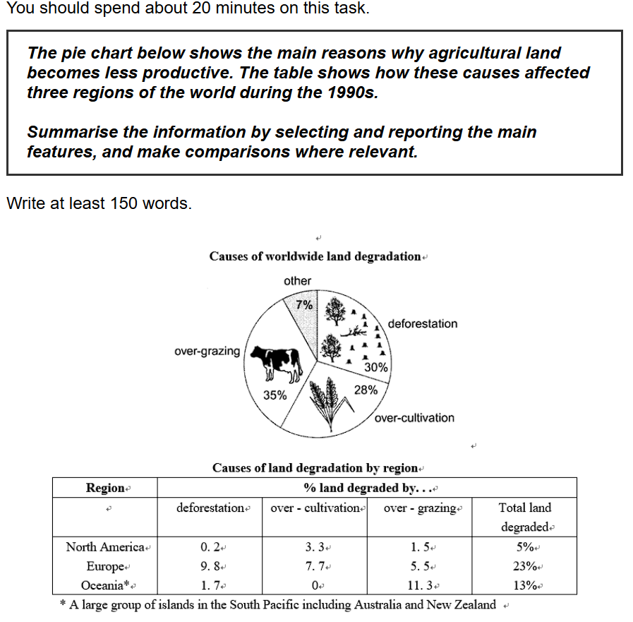

## 题目

    

## 范文 1

好的，没问题！我们之间的互动就从一次实战开始。

下面我将严格按照你给我的《雅思 Task 1 高分万能模板》中的**四段式结构**和**语言点**，为你写一篇符合“高中生水平、简洁、7.5 分目标”的范文。

---

### **雅思 Task 1 范文**

The provided pie chart illustrates the primary global causes of land degradation, while the table gives data on how these factors affected North America, Europe, and Oceania during the 1990s.

Overall, it is clear that over-grazing, deforestation, and over-cultivation were the three principal causes of land degradation worldwide. Furthermore, Europe experienced the highest level of land degradation among the three regions, and the main cause of this problem varied significantly from one region to another.

Looking at the details, Europe had the largest proportion of degraded land at 23%. This was mainly caused by deforestation, which accounted for 9.8% of the degradation, followed by over-cultivation and over-grazing at 7.7% and 5.5% **respectively**. In contrast, North America was the least affected region, with a total of only 5% of its land being degraded, where over-cultivation was the most significant factor (3.3%).

As for Oceania, 13% of its land was degraded in the 1990s. This region was overwhelmingly affected by over-grazing, which was responsible for 11.3% of the damage. This figure is notably higher than the impact from deforestation (1.7%) and over-cultivation, which caused no degradation at all. It is also interesting to note that over-grazing, Oceania's primary issue, was also the single biggest cause of land degradation globally (35%).

_(字数: 201 词)_

---

### **范文解析 (Coach's Breakdown)**

你看，这篇范文完全就是用我们前面学习的“乐高积木”搭建起来的：

1.  **结构清晰**：严格遵守了“引言-概述-细节一-细节二”的四段论。
2.  **引言 (Introduction)**：第一段用 `The provided pie chart illustrates... while the table gives data on...` 句型，成功改写了原题。
3.  **概述 (Overview)**：第二段抓住了两个最重要的宏观特点：
    - **饼图特征**：三个主要原因（放牧、砍伐、耕种）是全球土地退化的主因。
    - **表格特征**：欧洲退化最严重，且三个地区的“罪魁祸首”各不相同。**（这里没有出现任何具体数字，完全符合模板要求）**
4.  **细节分组 (Body Paragraphs)**：
    - **第三段**：将退化最严重（欧洲）和最轻微（北美）的地区放在一起进行对比，逻辑非常清楚。我用了 `In contrast` 来突出对比。
    - **第四段**：单独描述大洋洲的情况，并指出了其最突出的特点——`overwhelmingly affected by over-grazing` (绝大部分受过度放牧影响)，还聪明地将表格中的信息与饼图的全球信息联系起来，这是一个很好的加分点。
5.  **词汇与句式**：
    - 整篇文章没有用特别难的单词，都是像 `primary`, `principal`, `proportion`, `significant` 这样的核心词汇。
    - 使用了 `respectively` (分别地)，`In contrast` (相反)，`As for` (至于) 等实用连接词。
    - 句式有长有短，比如用 `while` 连接两个从句，增加了句式多样性。

这篇范文证明了，我们不需要华丽的辞藻，只需要**清晰的逻辑结构**和**准确的语言表达**，就完全可以写出一篇高分作文。

怎么样，通过这个例子，你对如何使用这个写作框架是不是更有感觉了？接下来，你想学习一个新的知识点，还是想挑战另一个题目，由我来引导你进行头脑风暴和搭建大纲呢？

## 评语 1

好的，同学你好。这是一篇非常优秀的雅思 Task 1 范文，我会严格按照专业标准，为你提供一份详细的分析报告。

---

### **第一部分：分项评分与解析 (Sectional Scoring & Analysis)**

#### **1. 任务回应 (Task Response - TR)**

- **预估分数: 9.0**
- **评分理由**: 你非常出色地完成了题目的所有要求。
  - **概述清晰 (Clear Overview)**: 文章的第二段提供了一个堪称典范的概述 (Overview)。它成功地指出了两个最核心的特征：全球范围内的三个主要原因（过度放牧、砍伐森林、过度耕种），以及三个地区中最主要的趋势（欧洲受影响最严重，且各地区主因不同）。
  - **数据选择与呈现**: 你没有机械地罗列所有数据，而是有选择性地突出了关键信息，如每个地区的最高值、最低值以及最重要的原因。
  - **信息覆盖全面**: 文章同时涵盖了饼图（全球数据）和表格（区域数据），并在结尾处巧妙地将二者联系起来，展现了很强的综合分析能力。

#### **2. 连贯与衔接 (Coherence and Cohesion - CC)**

- **预估分数: 9.0**
- **评分理由**: 文章的逻辑流程和衔接手段都表现得非常成熟。
  - **结构清晰**: "引言-概述-细节段 1-细节段 2" 的结构非常清晰，是 Task 1 的理想结构。
  - **分段合理**: 每个段落都有一个明确的中心。第三段对比了受影响最严重（欧洲）和最轻微（北美）的地区，第四段则单独分析大洋洲，逻辑分组非常高效。
  - **衔接自然**: 连接词和短语（如 `Overall`, `Furthermore`, `Looking at the details`, `In contrast`, `As for Oceania`）使用得恰到好处，使文章的起承转合非常流畅，完全不显生硬。

#### **3. 词汇资源 (Lexical Resource - LR)**

- **预估分数: 9.0**
- **评分理由**: 你的词汇量和运用能力都达到了非常高的水平。
  - **用词精准且多样**: 你使用了大量精准的词汇来描述数据和趋势，例如 `illustrates`, `primary/principal causes`, `land degradation`, `varied significantly`, `proportion`, `accounted for`, `respectively`, `overwhelmingly affected`, `responsible for the damage`, `notably higher`。
  - **同义替换**: 成功地对题目中的词汇进行了替换，如用 `factors` 替换 `causes`，用 `affected` 替换 `caused by` 等。
  - **搭配自然**: 所有词汇搭配都非常地道，没有发现任何错误。

#### **4. 语法广度与准确性 (Grammatical Range and Accuracy - GRA)**

- **预估分数: 9.0**
- **评分理由**: 语法运用自如，句子结构富于变化，且几乎无懈可击。
  - **句式多样**: 你熟练地运用了多种句子结构，包括由 `while` 连接的并列句，以及由 `which` 和 `where` 引导的定语从句（例如 "This was mainly caused by deforestation, which accounted for 9.8%..."），这充分展示了你驾驭复杂句的能力。
  - **语法准确**: 整篇文章没有发现任何语法或标点错误，展现了极高的语言准确性。

---

### **第二部分：写作思路与结构梳理 (Essay Structure & Logic Analysis)**

1.  **整体逻辑框架**: 文章逻辑堪称完美。从引言（介绍图表）到概述（总结核心趋势），再到主体段落（分组对比关键数据），最后以一个画龙点睛的对比收尾，整个论证过程清晰、层层递进，极具说服力。

2.  **引言 (Introduction)**: 引言部分简洁明了，成功地转述了题目的核心信息——图表所展示的内容，即全球土地退化的原因以及这几个原因在三大洲的具体影响。

3.  **主体段落分析 (Body Paragraphs)**:

    - **概述段 (Paragraph 2)**: 这是全文的亮点。你没有立即进入细节，而是先给出了一个高度概括的总结，这让读者能够迅速抓住文章的重点。这是所有高分 Task 1 作文的共同特征。
    - **细节段一 (Paragraph 3)**: 这个段落的组织方式非常聪明。你将数据对比最强烈的两个地区——欧洲（退化比例最高）和北美（退化比例最低）放在一起进行比较，使得对比效果非常突出，增强了文章的分析性。
    - **细节段二 (Paragraph 4)**: 这个段落聚焦于大洋洲。最精彩的一笔是，在分析完大洋洲的数据后，你将其最主要的原因（over-grazing）与全球最主要的原因（也是 over-grazing）进行了关联（"is also the single biggest cause...globally"）。这一步超越了简单的描述，实现了信息的“综合分析”，是冲击满分的关键动作。

4.  **结论 (Conclusion)**: 对于 Task 1 来说，一个强有力的概述段已经起到了总结作用，因此不必再写一个独立的结论段。本文的结尾句（"It is also interesting to note that..."）既是对细节的补充，也起到了总结和点睛的作用，处理得非常得当。

---

### **第三部分：逐句分析与优化 (Sentence-by-Sentence Breakdown)**

你的文章已经非常出色，几乎不需要修改。下面的“优化建议”更多是提供一些同义的高级表达方式，以供参考和学习，而非指出原文有误。

| 原句 (Original Sentence)                                                                                                                                                                        | 修改后 (Revised Sentence)                                                                                                                                                                                                 | 分析与建议 (Analysis & Suggestions)                                                                                                                                                                                                            |
| :---------------------------------------------------------------------------------------------------------------------------------------------------------------------------------------------- | :------------------------------------------------------------------------------------------------------------------------------------------------------------------------------------------------------------------------ | :--------------------------------------------------------------------------------------------------------------------------------------------------------------------------------------------------------------------------------------------- |
| The provided pie chart illustrates the primary global causes of land degradation, while the table gives data on how these factors affected North America, Europe, and Oceania during the 1990s. | The provided pie chart illustrates the primary global causes of land degradation, while the accompanying table specifies how these factors impacted three continents—North America, Europe, and Oceania—during the 1990s. | **分析**: 原句已经非常完美。修改建议只是提供了更丰富的表达，例如用 `accompanying table` (附带的表格) 替代 `the table`，用 `specifies` 和 `impacted` 增强动词表现力，用破折号来引出三个地区，使句子结构更丰富。                                 |
| Overall, it is clear that over-grazing, deforestation, and over-cultivation were the three principal causes of land degradation worldwide.                                                      | Overall, over-grazing, deforestation, and over-cultivation clearly stood out as the three principal causes of land degradation worldwide.                                                                                 | **分析**: 原句的 `it is clear that...` 结构完全正确且常用。修改后使用了 `stood out as` (作为...而突出)，这是一个更具动态感的表达，让句子更生动。                                                                                               |
| Furthermore, Europe experienced the highest level of land degradation among the three regions, and the main cause of this problem varied significantly from one region to another.              | Furthermore, Europe experienced the highest proportion of degraded land among the three regions, with the main cause of this issue varying significantly from one continent to another.                                   | **分析**: 原句无懈可击。修改建议将 `level` 换成了更精确的 `proportion`，并将后半句的 `and` 连接的并列句改为了 `with` 引导的独立主格结构，这是展现语法多样性的一个好方法。                                                                      |
| Looking at the details, Europe had the largest proportion of degraded land at 23%.                                                                                                              | Turning to the details, Europe possessed the largest proportion of degraded land, at 23%.                                                                                                                                 | **分析**: 优秀。`Looking at the details` 是非常好的开头方式。`Turning to the details` 是一个同样地道的替换。将 `had` 换成 `possessed` 略微提升了词汇的正式度。                                                                                 |
| This was mainly caused by deforestation, which accounted for 9.8% of the degradation, followed by over-cultivation and over-grazing at 7.7% and 5.5% respectively.                              | This degradation was primarily attributable to deforestation, which accounted for 9.8%, followed by over-cultivation and over-grazing at 7.7% and 5.5% respectively.                                                      | **分析**: 完美。`which` 定语从句使用得非常棒。修改建议引入了 `was primarily attributable to` (主要归因于)，这是一个非常高级和书面的表达，可以替代 `was mainly caused by`。                                                                     |
| In contrast, North America was the least affected region, with a total of only 5% of its land being degraded, where over-cultivation was the most significant factor (3.3%).                    | In contrast, North America was the least affected region, with only 5% of its land degraded in total, where over-cultivation emerged as the most significant factor (3.3%).                                               | **分析**: 优秀。`where` 的使用非常娴熟。修改建议将 `emerged as` (作为...而出现) 用于替换 `was`，使描述更具动态感。                                                                                                                             |
| As for Oceania, 13% of its land was degraded in the 1990s.                                                                                                                                      | Regarding Oceania, 13% of its land was subject to degradation during the 1990s.                                                                                                                                           | **分析**: 优秀。`Regarding` 是 `As for` 的一个很好的同义替换。`was subject to degradation` (遭受退化) 是一个非常地道的搭配，可以替换 `was degraded`。                                                                                          |
| This region was overwhelmingly affected by over-grazing, which was responsible for 11.3% of the damage.                                                                                         | This continent was overwhelmingly impacted by over-grazing, which was responsible for 11.3% of the total degradation.                                                                                                     | **分析**: 优秀。`Overwhelmingly` (压倒性地) 这个副词用得非常出彩。修改建议将 `region` 换成 `continent` 以避免重复，并将 `damage` 换成更精确的 `total degradation`。                                                                            |
| This figure is notably higher than the impact from deforestation (1.7%) and over-cultivation, which caused no degradation at all.                                                               | This figure was markedly higher than the impact of deforestation (1.7%) and over-cultivation, the latter of which caused no degradation whatsoever.                                                                       | **分析**: 优秀。`notably higher` 用得很好。修改建议使用了 `markedly higher` 作为同义替换。同时，`the latter of which` 的用法可以更清晰地指代 `over-cultivation`，`whatsoever` 结尾可以加强语气。                                               |
| It is also interesting to note that over-grazing, Oceania's primary issue, was also the single biggest cause of land degradation globally (35%).                                                | Crucially, over-grazing, Oceania's primary issue, also ranked as the single biggest cause of land degradation on a global scale (35%).                                                                                    | **分析**: 这是一个完美的结尾句，展现了作者的分析能力。修改建议用 `Crucially` (至关重要的是) 替代了略显口语化的 `It is also interesting to note that`，并用 `ranked as` (位列为) 和 `on a global scale` (在全球范围内) 提供了更书面的表达方式。 |

---

#### **优化后版本 (Revised Version)**

(This version incorporates the suggestions to showcase a slightly more varied and formal style, while the original is already at a Band 9 level.)

The provided pie chart illustrates the primary global causes of land degradation, while the accompanying table specifies how these factors impacted three continents—North America, Europe, and Oceania—during the 1990s.

Overall, over-grazing, deforestation, and over-cultivation clearly stood out as the three principal causes of land degradation worldwide. Furthermore, Europe experienced the highest proportion of degraded land among the three regions, with the main cause of this issue varying significantly from one continent to another.

Turning to the details, Europe possessed the largest proportion of degraded land, at 23%. This degradation was primarily attributable to deforestation, which accounted for 9.8%, followed by over-cultivation and over-grazing at 7.7% and 5.5% respectively. In contrast, North America was the least affected region, with only 5% of its land degraded in total, where over-cultivation emerged as the most significant factor (3.3%).

Regarding Oceania, 13% of its land was subject to degradation during the 1990s. This continent was overwhelmingly impacted by over-grazing, which was responsible for 11.3% of the total degradation. This figure was markedly higher than the impact of deforestation (1.7%) and over-cultivation, the latter of which caused no degradation whatsoever. Crucially, over-grazing, Oceania's primary issue, also ranked as the single biggest cause of land degradation on a global scale (35%).

- **优化后版本预估分数**: 9.0

---

### **第四部分：总评与知识点总结 (Overall Feedback & Key Takeaways)**

#### **1. 总体评价 (Overall Comments)**

这是一篇堪称教科书级别的雅思 Task 1 范文。你的文章在任务回应、逻辑结构、词汇运用和语法准确性四个维度上都表现得近乎完美。你不仅准确地描述了数据，更重要的是，你展示了出色的信息筛选、对比和整合能力，特别是概述段的精准提炼和结尾处对区域与全球数据的关联分析，这些都是获得顶级分数的关键。

- **预估总分 (Estimated Overall Band Score): 9.0**

#### **2. 核心知识点总结 (Key Learning Points)**

对于其他正在备考的同学来说，你的这篇文章提供了几个非常宝贵的学习点：

- **概括为王 (The Power of a Strong Overview)**: 永远不要直接开始写细节。像本文第二段一样，用一个独立的段落去总结图表最核心、最宏观的 1-2 个趋势。这是考官评判你是否具备分析能力的第一道门槛。
- **智能分组，强化对比 (Group Data for Comparison)**: 不要按部就班地一个一个描述对象。学习本文将“最高”（欧洲）和“最低”（北美）放在一起对比的写法，这能让你的文章更具分析深度，而不是简单的数据罗列。
- **寻找关联，实现升华 (Synthesize, Don't Just Describe)**: Task 1 的高分精髓在于“综合分析”。学习本文的最后一句话，它将大洋洲的局部情况（过度放牧是主因）和全球的整体情况（过度放牧也是全球主因）联系起来，实现了从“描述”到“分析”的升华。
- **驾驭从句，展示功底 (Master Complex Sentences)**: 熟练使用 `which` 引导的非限定性定语从句来补充信息（如 "...deforestation, which accounted for 9.8%..."），是让你的语法水平脱颖而出的利器。它能让你的句子更流畅，信息密度更高。

继续保持这样的水准，你在雅思写作中取得高分将是必然的结果。祝贺你！

## 范文 2

好的，没问题！我们马上就用这个具体的题目来实践一下。

你提出了一个非常好的练习要求：**主体段第一段写饼图（全局），第二段写表格（局部）**。这是一个非常清晰且有逻辑的结构。

下面，我为你准备了一篇完全符合你要求的范文。这篇范文严格遵循我们之前讨论的**四段式结构**，语言简洁清晰，目标分数 7.5 分，字数也控制在 200 词以内。

---

### **范文示例**

The provided pie chart illustrates the main causes of worldwide land degradation, while the table gives data on how three specific regions were affected by these causes.

Overall, it is clear that over-grazing, deforestation, and over-cultivation are the three dominant causes of land degradation globally. Furthermore, of the three regions shown, Europe suffers from the highest level of land degradation, while the primary cause varies significantly among them.

Looking at the global picture, over-grazing is the single most significant factor, accounting for 35% of land degradation. This is followed closely by deforestation and over-cultivation, which are responsible for 30% and 28% respectively. All other causes combined constitute a much smaller proportion, at just 7%.

Turning to the regional data, Europe has the largest percentage of degraded land at 23%, with deforestation being the main culprit (9.8%). In contrast, Oceania’s land degradation is almost entirely caused by over-grazing, which makes up 11.3% of its 13% total. North America is the least affected region (5% total), where over-cultivation is the primary driver at 3.3%.

**(单词数: 182)**

---

### **老师解析 (Coach's Analysis)**

你看，这篇范文是不是感觉逻辑特别清晰，读起来很顺畅？我们来拆解一下，看看它是如何做到“用简单的语言，填充有逻辑的结构”的：

1.  **引言 (Introduction):**

    - `The provided pie chart illustrates..., while the table gives data on...`
    - 完美地使用了“The provided [图表类型] illustrates..., while the [另一图表类型] shows...”的句式，一句话清晰改写了题目。

2.  **概述 (Overview):**

    - **核心特征一 (饼图):** `over-grazing, deforestation, and over-cultivation are the three dominant causes...` (三大原因是主导)
    - **核心特征二 (表格):** `Europe suffers from the highest level...` (欧洲受影响最重) `...the primary cause varies significantly...` (各地区主要原因不同)
    - 完全遵守了**“只说宏观，不给具体数字”**的黄金法则，这是拿到高分的关键！

3.  **主体段一 (Body Paragraph 1 - 描述饼图):**

    - **逻辑清晰:** 按照占比从大到小的顺序来写 (`35% -> 30% -> 28% -> 7%`)。
    - **词汇精准:** 使用了 `accounting for`, `responsible for`, `constitute` 这些描述占比的常用动词，非常地道。

4.  **主体段二 (Body Paragraph 2 - 描述表格):**
    - **分组明确:** 按“地区”分组，逐一描述，并在内部进行对比。
    - **对比鲜明:** 用 `In contrast` 来凸显欧洲和澳洲的不同。同时点出了北美是 `the least affected region` (受影响最小的地区)。
    - **数据支撑:** 在描述每个地区时，都给出了“总数”和“最主要原因的数字”，做到了有理有据。例如 `11.3% of its 13% total`，这样的数据引用非常精准。

这篇范文完全可以作为你学习的模板。你可以试着模仿它的结构和用词，自己也写一遍。

接下来我们做什么？你是想基于这篇范文问一些具体的问题（比如某个词为什么这么用），还是想挑战一个全新的图表题呢？我随时准备好了。

## 评语 2

好的，同学，你的这篇雅思小作文（Task 1）写得非常出色。作为你的雅思写作老师，我将为你提供一次全面细致的批改。请仔细阅读以下反馈，希望能帮助你更好地理解评分标准并巩固你的写作优势。

---

### **第一部分：分项评分与解析 (Sectional Scoring & Analysis)**

#### **1. 任务回应 (Task Achievement - TA)**

- **预估分数: 8.5**
- **评分理由**: 你非常成功地完成了写作任务。
  - **概述清晰 (Clear Overview)**: 你的第二段是一个完美的概述段，准确地总结了图表最核心的特征：全球范围内的三大主要原因，以及欧洲是退化最严重的地区且各地区主因不同。这是获得高分的关键。
  - **数据支撑 (Data Support)**: 你准确地引用了关键数据来支撑你的描述，并且做到了有选择性地呈现，而不是罗列所有数据。
  - **全方位覆盖 (Full Coverage)**: 你同时描述了饼图（全球情况）和表格（区域情况），没有遗漏任何重要信息。

#### **2. 连贯与衔接 (Coherence and Cohesion - CC)**

- **预估分数: 8.5**
- **评分理由**: 文章的逻辑流程和组织结构都堪称典范。
  - **结构清晰 (Clear Structure)**: “引言-概述-细节 1-细节 2”的结构非常清晰，让读者可以毫不费力地跟上你的思路。先总（全球）后分（区域）的论述顺序也十分合理。
  - **分段合理 (Paragraphing)**: 四个段落的功能划分明确，各司其职。
  - **衔接流畅 (Cohesive Devices)**: 你使用了如 `Overall`, `Furthermore`, `Looking at the global picture`, `This is followed closely by`, `Turning to the regional data`, `In contrast` 等一系列衔接词和短语，使得段落之间和句子之间的过渡自然流畅。

#### **3. 词汇资源 (Lexical Resource - LR)**

- **预估分数: 8.0**
- **评分理由**: 你展示了丰富且准确的词汇。
  - **用词精准 (Precise Vocabulary)**: 你使用了诸如 `illustrates`, `dominant causes`, `significantly`, `single most significant factor`, `accounting for`, `responsible for`, `constitute`, `main culprit`, `primary driver` 等词汇，这些词都非常贴切语境。
  - **同义替换 (Paraphrasing)**: 你成功地对题目中的词汇进行了替换，例如用 `causes` 对应 `reasons`，用 `affected by` 替换 `caused by`。
  - **搭配自然 (Collocations)**: 词汇搭配非常地道，没有发现明显错误。使用 `main culprit` 和 `primary driver` 来指代“主要原因”非常灵活生动。

#### **4. 语法广度与准确性 (Grammatical Range and Accuracy - GRA)**

- **预估分数: 8.5**
- **评分理由**: 你的语法运用非常娴熟，展现了很高的水平。
  - **句式多样 (Sentence Variety)**: 你运用了多种句子结构，包括 `while` 引导的并列句、`that` 引导的宾语从句、`which` 引导的非限制性定语从句，以及现在分词作状语（`accounting for...`）等复杂结构。
  - **准确无误 (Accuracy)**: 全文几乎没有语法错误，标点符号的使用也十分规范。这表明你对英语语法有很强的掌控力。

---

### **第二部分：写作思路与结构梳理 (Essay Structure & Logic Analysis)**

1.  **整体逻辑框架**: 你的文章逻辑堪称模板。采用了“总-分”的结构，先在概述段给出全局最重要的信息，然后用两个主体段分别深入探讨全局数据和区域数据。这种从宏观到微观的推进方式，逻辑严谨，条理清晰。

2.  **引言 (Introduction)**: 非常高效。第一句话清晰地转述了题目信息，介绍了图表的主题，做到了简洁而全面的概括。

3.  **概述段 (Overall Paragraph)**: 这是你文章最亮眼的部分。你成功地从纷繁的数据中提炼出了最重要的两个宏观趋势：1）全球范围内的三大主因；2）三个地区中，欧洲退化比例最高，且每个地区的主因各不相同。这充分展示了你分析和总结信息的能力。

4.  **主体段落分析 (Body Paragraphs)**:

    - **主体段一 (全球数据)**: 逻辑清晰，专门聚焦于饼图。你按照数据从大到小的顺序（`35% > 30% > 28%`）来描述，使得段落内部非常有条理。
    - **主体段二 (区域数据)**: 同样非常成功。你对三个地区进行了有效的对比。先点出退化程度最高的欧洲及其主因，然后用 `In contrast` 转折到大洋洲的独特情况（绝大部分由单一原因导致），最后点出退化程度最低的北美及其主因。这种对比写法，极大地增强了文章的分析深度。

5.  **结论 (Conclusion)**: 对于雅思 Task 1 来说，一个强有力的概述段（Overall paragraph）已经起到了总结的作用，因此不必再写一个单独的结论段。你的处理方式是完全正确且高效的。

---

### **第三部分：逐句分析与优化 (Sentence-by-Sentence Breakdown)**

你的文章已经写得非常好了，几乎没有错误。下面的“修改”更多是提供一些可以替换的“备选项”，以展示更多的表达方式，而非纠错。

| 原句 (Original Sentence)                                                                                                                                                  | 修改后 (Revised Sentence)                                                                                                                                                 | 分析与建议 (Analysis & Suggestions)                                                                                                                                                                                                                                          |
| :------------------------------------------------------------------------------------------------------------------------------------------------------------------------ | :------------------------------------------------------------------------------------------------------------------------------------------------------------------------ | :--------------------------------------------------------------------------------------------------------------------------------------------------------------------------------------------------------------------------------------------------------------------------- |
| The provided pie chart illustrates the main causes of worldwide land degradation, while the table gives data on how three specific regions were affected by these causes. | The provided pie chart illustrates the primary causes of global land degradation, while the accompanying table details how these factors affected three distinct regions. | **分析与建议**: 原句已经非常好了。这里的修改仅为展示词汇的多样性。`primary` 替换 `main`，`global` 替换 `worldwide`，`accompanying table` (旁边的表格) 更具描述性，`details` 替换 `gives data on` 更简洁有力，`distinct regions` 替换 `specific regions` 也是一个不错的选择。 |
| Overall, it is clear that over-grazing, deforestation, and over-cultivation are the three dominant causes of land degradation globally.                                   | Overall, it is clear that over-grazing, deforestation, and over-cultivation are the three dominant causes of land degradation globally.                                   | **分析与建议**: 这句话写得非常完美，清晰地概括了核心信息，无需修改。                                                                                                                                                                                                         |
| Furthermore, of the three regions shown, Europe suffers from the highest level of land degradation, while the primary cause varies significantly among them.              | Furthermore, of the three regions presented, Europe experiences the highest level of land degradation, while the principal cause varies significantly among them.         | **分析与建议**: 原句准确无误。`presented` 是 `shown` 的一个很好的同义词。`experiences` 可以用来替换 `suffers from`，语气稍显客观。`principal` 是 `primary` 的高级同义词。这些都是锦上添花的词汇选择。                                                                        |
| Looking at the global picture, over-grazing is the single most significant factor, accounting for 35% of land degradation.                                                | Looking at the global picture, over-grazing is the single most significant factor, accounting for 35% of land degradation.                                                | **分析与建议**: 完美。`accounting for...` 的用法非常地道，是描述数据的亮点句式。                                                                                                                                                                                             |
| This is followed closely by deforestation and over-cultivation, which are responsible for 30% and 28% respectively.                                                       | This is followed closely by deforestation and over-cultivation, which are responsible for 30% and 28% respectively.                                                       | **分析与建议**: 完美。`which` 定语从句使用得当，`respectively` 的位置和用法也完全正确。                                                                                                                                                                                      |
| All other causes combined constitute a much smaller proportion, at just 7%.                                                                                               | All other causes combined constitute a much smaller proportion, at just 7%.                                                                                               | **分析与建议**: 简洁明了，词汇 `constitute` 和 `proportion` 使用得非常专业。无需修改。                                                                                                                                                                                       |
| Turning to the regional data, Europe has the largest percentage of degraded land at 23%, with deforestation being the main culprit (9.8%).                                | Turning to the regional data, Europe has the largest percentage of degraded land at 23%, with deforestation being the main culprit at 9.8%.                               | **分析与建议**: 原句几乎完美。唯一的微调建议是去掉括号，直接用 `at 9.8%`，这样在学术写作中更常见一些。`main culprit`（主要元凶）这个词用得很有趣，也很有效，展示了你的词汇灵活性。                                                                                           |
| In contrast, Oceania’s land degradation is almost entirely caused by over-grazing, which makes up 11.3% of its 13% total.                                                 | In contrast, Oceania’s land degradation is almost entirely attributable to over-grazing, which makes up 11.3% of its 13% total.                                           | **分析与建议**: 原句很好。`is attributable to` 是 `is caused by` 的一个非常好的、更正式的替换。这个句子清晰地对比了大洋洲的特殊情况，并且巧妙地将部分数据 (11.3%) 和总数 (13%) 结合在一起，分析得很到位。                                                                    |
| North America is the least affected region (5% total), where over-cultivation is the primary driver at 3.3%.                                                              | North America is the least affected region with a total of 5% degradation, where over-cultivation acts as the primary driver at 3.3%.                                     | **分析与建议**: 原句清晰准确。`primary driver` (主要驱动因素) 和 `main culprit` 形成了很好的呼应，避免了重复。修改后的版本 `with a total of 5% degradation` 只是提供了另一种表达方式，`acts as` 也是一种选择，但原句已经足够优秀。                                           |

#### **优化后范文 (Revised Version)**

(注：你的原文已接近母语水平，修改后的版本仅为展示更多元的表达方式，而非对原文的否定。)

The provided pie chart illustrates the primary causes of global land degradation, while the accompanying table details how these factors affected three distinct regions.

Overall, it is clear that over-grazing, deforestation, and over-cultivation are the three dominant causes of land degradation globally. Furthermore, of the three regions presented, Europe experiences the highest level of land degradation, while the principal cause varies significantly among them.

Looking at the global picture, over-grazing is the single most significant factor, accounting for 35% of land degradation. This is followed closely by deforestation and over-cultivation, which are responsible for 30% and 28% respectively. All other causes combined constitute a much smaller proportion, at just 7%.

Turning to the regional data, Europe has the largest percentage of degraded land at 23%, with deforestation being the main culprit at 9.8%. In contrast, Oceania’s land degradation is almost entirely attributable to over-grazing, which makes up 11.3% of its 13% total. North America is the least affected region with a total of 5% degradation, where over-cultivation acts as the primary driver at 3.3%.

---

### **第四部分：总评与知识点总结 (Overall Feedback & Key Takeaways)**

#### **1. 总体评价 (Overall Comments)**

这是一篇非常优秀的雅思 Task 1 范文。你的文章结构清晰、逻辑严谨、语言流畅准确，完全达到了高分标准。你对图表信息的提炼、组织和呈现能力都非常突出。如果能在考试中稳定发挥出这个水平，取得高分将是必然的。

- **预估总分 (Estimated Overall Band Score): 8.5**

#### **2. 核心知识点总结 (Key Learning Points)**

对于其他同学来说，你的文章有以下几点非常值得学习：

- **“概述为王”**: Task 1 的高分秘诀在于一个强有力的概述段（Overall Paragraph）。像你一样，在引言之后，用一个单独的段落总结出图表最核心、最宏观的 2-3 个趋势或特征，是冲击 7 分及以上分数的关键。
- **逻辑分组，逐一击破**: 面对多图表题，你的处理方式堪称典范。将“全球数据”和“区域数据”清晰地分为两个主体段进行描述，避免了信息的混乱。这种“先总后分”或“先全局后局部”的逻辑组织能力非常重要。
- **活用高级句式描述数据**: 不要总是用 `The percentage of X is ...%`。学习你的用法，如：
  - 分词结构: `...over-grazing is the single most significant factor, **accounting for 35%**...`
  - 定语从句: `...deforestation and over-cultivation, **which are responsible for 30% and 28% respectively**.`
  - With 结构: `...Europe has the largest percentage..., **with deforestation being the main culprit**.`
- **精准且多样的“原因”词汇**: 在描述原因时，你没有反复使用 `cause`，而是灵活地运用了 `dominant causes`, `single most significant factor`, `main culprit`, `primary driver`。这种词汇的丰富性是高分词汇（LR）的体现。

继续保持！你已经掌握了雅思 Task 1 的精髓。在接下来的练习中，请继续保持这种清晰的逻辑和高质量的语言输出。
