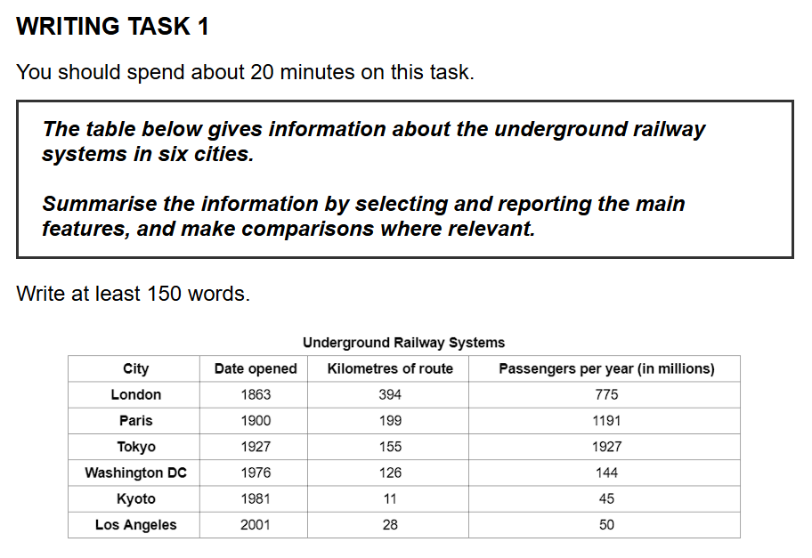

## 题目

    

## 原始作文

The provided table illustrates information of six cities about the underground railway systems.

Overall, the older railway systems in the city have more kilometers of route in the city, and also have more passengers per year.

Regarding the systems opened before 1976, London's system is the oldest, opened in 1863, and it also owns the largest railway system with 394 kilometers of route. By contrast, the Tokyo system, which is opened in 1927, serves the highest number of passengers at 1927 million per year. The Pairs system, opened in 1900, has the second-highest passenger numbers, whereas its route is much shorter than London's.

Turning to the modern systems, the network in Washington DC, Kyoto and Los Angeles are smaller than the old. Washington DC's system, opened in 976, is the largest one in the group, with 126 kilometers of route and 144 million annually. The other two systems are much smaller in scale. Kyoto has the shortest route at just 11 kilometers and the lowest number of passengers at 45 million, while the newest system, Los Angeles, established in 2001, transports a similar amount of passengers at 50 million on 28 kilometers route.

---

好的，同学，你的雅思小作文已经批改完成。总的来说，你对图表信息的把握和文章结构的组织都相当不错，展现了良好的基本功。接下来，我们将来对你的作文进行详细的分析和优化，希望能帮助你在此基础上更进一步。

### **第一部分：分项评分与解析 (Sectional Scoring & Analysis)**

1.  **任务完成情况 (Task Achievement - TA)**

    - **预估分数: 7.0**
    - **评分理由**: 你成功地完成了写作任务。文章准确地转述了图表中的关键信息，包括所有六个城市的三个数据维度（开通年份、线路长度、年客流量）。你清晰地提炼出了一个有效的总体趋势（旧系统规模更大，客流更多），并且对数据进行了有效的分组对比（旧系统 vs. 新系统）。有一个明显的笔误（Washington DC 的年份 "976"），以及一些数据呈现上的小瑕疵，但整体上对信息的覆盖和总结是到位的。

2.  **连贯与衔接 (Coherence and Cohesion - CC)**

    - **预估分数: 7.0**
    - **评分理由**: 文章的结构非常清晰，采用了“引言 + 概述 + 主体段 1 + 主体段 2”的经典结构，逻辑流畅。段落划分合理，每个段落都有明确的中心。衔接词的使用也比较得当，如 "Overall", "Regarding", "By contrast", "Turning to", "whereas" 等，有效地引导读者跟上你的思路。

3.  **词汇资源 (Lexical Resource - LR)**

    - **预估分数: 6.5**
    - **评分理由**: 你使用了一些与图表描述相关的词汇，例如 "illustrates", "passengers", "route", "established"。但是，词汇的多样性有待提高，一些词汇被重复使用（如 "system", "opened"）。此外，存在一些用词不当或搭配不自然的地方（如 "owns the largest railway system"），以及拼写错误（"Pairs"）。

4.  **语法广度与准确性 (Grammatical Range and Accuracy - GRA)**
    - **预估分数: 6.0**
    - **评分理由**: 你能够使用包括定语从句（...which is opened...）和并列句在内的不同句式。但文章中存在一些较为明显的语法错误，比如主谓不一致（the network... are...）、冠词和介词的遗漏（on 28 kilometers route）、以及表达上的重复（in the city... in the city），这些错误虽然不至于影响理解，但确实拉低了语法的准确性分数。

---

### **第二部分：写作思路与结构梳理 (Essay Structure & Logic Analysis)**

1.  **整体逻辑框架**: 你的文章逻辑框架非常出色。采用了总分结构，先给出全局性的总结，然后分点展开细节，这是雅思小作文的理想结构。将六个城市按“旧”和“新”分为两组进行论述，使得对比非常清晰，逻辑性强。

2.  **引言 (Introduction)**: 引言部分简洁明了，直接点明了图表的主题，有效地改写了题目信息。

3.  **概述 (Overall)**: 这是你文章的一大亮点。你准确地捕捉到了图表最核心的规律——老系统在路线长度和客流量上普遍优于新系统。这个概括性的陈述为后续的细节描述提供了清晰的指引。

4.  **主体段落分析 (Body Paragraphs)**:

    - **主体段一**: 集中讨论了三个较早的系统。你正确地指出了伦敦系统“最老、最长”，东京系统“客流量最大”，并用 "By contrast" 和 "whereas" 对比了这几个城市的数据，论述层次分明。
    - **主体段二**: 转向了三个较新的系统。你先给出了一个总括句（这些系统比旧的要小），然后分别描述了华盛顿、京都和洛杉矶的数据，并准确地指出了其中的极值（京都线路最短、客流最少）。逻辑清晰，信息完整。

5.  **结论 (Conclusion)**: 对于雅思 Task 1 来说，通常不需要单独的结论段，将总结放在引言之后的概述段是更高效和常见的做法，你这一点做得很好。

---

### **第三部分：逐句分析与优化 (Sentence-by-Sentence Breakdown)**

下面，我们将逐句分析你的作文，并提供优化建议。

| 原句 (Original Sentence)                                                                                                                                                                                                                         | 修改后 (Revised Sentence)                                                                                                                                                                                                                        | 分析与建议 (Analysis & Suggestions)                                                                                                                                                                                                                                                                                                                                                                                   |
| :----------------------------------------------------------------------------------------------------------------------------------------------------------------------------------------------------------------------------------------------- | :----------------------------------------------------------------------------------------------------------------------------------------------------------------------------------------------------------------------------------------------- | :-------------------------------------------------------------------------------------------------------------------------------------------------------------------------------------------------------------------------------------------------------------------------------------------------------------------------------------------------------------------------------------------------------------------- |
| The provided table illustrates information of six cities about the underground railway systems.                                                                                                                                                  | The provided table compares the underground railway systems across six different cities.                                                                                                                                                         | **分析与建议**: 1. `illustrates information of` 改为 `compares` 更为简洁、有力。2. `information... about` 显得有些啰嗦，直接说 `compares the systems` 即可。3. `across six different cities` 表达更地道。                                                                                                                                                                                                             |
| Overall, the older railway systems in the city have more kilometers of route in the city, and also have more passengers per year.                                                                                                                | Overall, the underground railway systems established earlier tend to be more extensive and serve a greater number of passengers annually.                                                                                                        | **分析与建议**: 1. `older` 改为 `established earlier` (更早建立的) 更多样化。2. `have more kilometers of route` 改为 `be more extensive` (更广阔的)，用词更高级。3. `have more passengers` 改为 `serve a greater number of passengers`，动词使用更精确。4. 避免了 `in the city` 的重复。                                                                                                                              |
| Regarding the systems opened before 1976, London's system is the oldest, opened in 1863, and it also owns the largest railway system with 394 kilometers of route.                                                                               | Regarding the three older networks, London's system is the most historic, having opened in 1863, and it also boasts the longest route at 394 kilometers.                                                                                         | **分析与建议**: 1. `opened before 1976` 直接说 `the three older networks` 更简洁。2. `oldest` 改为 `most historic` (最悠久的) 避免重复。3. `opened in 1863` 用现在分词作状语 `having opened in 1863`，句式更高级。4. `owns the largest...system` 改为 `boasts the longest route` (拥有最长的线路)，`boast` 在这里表示“以...为傲，拥有”，是非常地道的用法。                                                            |
| By contrast, the Tokyo system, which is opened in 1927, serves the highest number of passengers at 1927 million per year.                                                                                                                        | In contrast, the Tokyo system, which commenced operation in 1927, serves the highest volume of passengers, at 1,927 million per year.                                                                                                            | **分析与建议**: 1. `By contrast` 多用于对比完全相反的事物，这里用 `In contrast` 更合适。2. `which is opened` 时态不准确，系统早已开通，应用 `which opened` 或更正式的 `which commenced operation` (开始运营)。3. `highest number of passengers` 可替换为 `highest volume of passengers` (最高的客运量)。4. 数字超过三位数时，建议使用逗号 `1,927`，更清晰。                                                           |
| The Pairs system, opened in 1900, has the second-highest passenger numbers, whereas its route is much shorter than London's.                                                                                                                     | The Paris system, established in 1900, accommodates the second-highest number of passengers, whereas its route is considerably shorter than London's.                                                                                            | **分析与建议**: 1. **拼写错误**: `Pairs` 应为 `Paris`。2. `has` 改为 `accommodates` (容纳，承载)，词汇更生动。3. `much shorter` 可以用 `considerably shorter` 或 `significantly shorter` 来替换，丰富词汇。                                                                                                                                                                                                           |
| Turning to the modern systems, the network in Washington DC, Kyoto and Los Angeles are smaller than the old.                                                                                                                                     | Turning to the more modern systems, the networks in Washington DC, Kyoto, and Los Angeles are smaller in scale than their older counterparts.                                                                                                    | **分析与建议**: 1. **主谓一致错误**: 主语是 `the network` (单数)，谓语动词应为 `is`。如果想用 `are`，主语应为 `the networks`。2. `than the old` 的表达不够清晰，改为 `than their older counterparts` (相比于那些更早的对应系统) 更加准确和正式。                                                                                                                                                                      |
| Washington DC's system, opened in 976, is the largest one in the group, with 126 kilometers of route and 144 million annually.                                                                                                                   | Washington DC's system, opened in 1976, is the largest of this group, with a route of 126 kilometers and an annual ridership of 144 million.                                                                                                     | **分析与建议**: 1. **笔误**: `976` 应为 `1976`，这是需要极力避免的硬伤。2. `in the group` 改为 `of this group` 更地道。3. `144 million annually` 表达不完整，应说清楚是 144 百万什么，改为 `an annual ridership of 144 million` (年客流量为 1.44 亿) 更专业。                                                                                                                                                         |
| The other two systems are much smaller in scale.                                                                                                                                                                                                 | The other two systems are considerably smaller in scale.                                                                                                                                                                                         | **分析与建议**: 这句话本身没问题，但可以替换一下副词，`much` 换成 `considerably` 或 `significantly`。                                                                                                                                                                                                                                                                                                                 |
| Kyoto has the shortest route at just 11 kilometers and the lowest number of passengers at 45 million, while the newest system, Los Angeles, established in 2001, transports a similar amount of passengers at 50 million on 28 kilometers route. | Kyoto features the shortest route at just 11 kilometers and the lowest passenger count at 45 million. Meanwhile, the newest system in Los Angeles, established in 2001, transports a comparable 50 million passengers on its 28-kilometer route. | **分析与建议**: 1. `has` 改为 `features` (以...为特色)。2. `while` 在此表示对比，用 `Meanwhile` (与此同时) 也可以，使连接词更多样。3. `a similar amount of passengers` 改为 `a comparable 50 million passengers` (一个与之相当的 5000 万客流)，`comparable` 是 `similar` 的一个很好的同义替换。4. **冠词和介词**: `on 28 kilometers route` 应改为 `on its 28-kilometer route`。注意形容词 `28-kilometer` 是单数形式。 |

#### **优化后范文 (Revised Version)**

The provided table compares the underground railway systems across six different cities.

Overall, the underground railway systems established earlier tend to be more extensive and serve a greater number of passengers annually.

Regarding the three older networks, London's system is the most historic, having opened in 1863, and it also boasts the longest route at 394 kilometers. In contrast, the Tokyo system, which commenced operation in 1927, serves the highest volume of passengers, at 1,927 million per year. The Paris system, established in 1900, accommodates the second-highest number of passengers, whereas its route is considerably shorter than London's.

Turning to the more modern systems, the networks in Washington DC, Kyoto, and Los Angeles are smaller in scale than their older counterparts. Washington DC's system, opened in 1976, is the largest of this group, with a route of 126 kilometers and an annual ridership of 144 million. The other two systems are considerably smaller in scale. Kyoto features the shortest route at just 11 kilometers and the lowest passenger count at 45 million. Meanwhile, the newest system in Los Angeles, established in 2001, transports a comparable 50 million passengers on its 28-kilometer route.

---

### **第四部分：总评与知识点总结 (Overall Feedback & Key Takeaways)**

1.  **总体评价 (Overall Comments)**:
    你的作文结构清晰，逻辑性强，对图表信息的把握也很到位，这些都是非常值得肯定的优点。你的主要提升空间在于语言的**精确性**和**多样性**。通过打磨词汇和句法，你的文章可以轻松地从一个“合格”的水平提升到“优秀”的水平。

    - **修改后预测总分 (Estimated Overall Band Score After Revision): 7.0-7.5**

2.  **核心知识点总结 (Key Learning Points)**:
    - **注意校对细节**: 本次作文出现了两个比较关键的笔误（`Pairs` 和 `976`）。在考试的最后几分钟，一定要快速检查拼写和数字，避免这种不必要的失分。
    - **提升词汇多样性**: 准备一些描述数据和趋势的同义词。例如，描述“拥有”，除了 `have/own`，还可以用 `boast/feature`；描述“客流量”，可以用 `number of passengers`, `passenger volume`, `ridership`；描述“大的/长的”，可以用 `large/long`, `extensive`, `significant`, `considerable`。
    - **警惕主谓一致**: 当主语比较长或者结构比较复杂时（如 a network in A, B, and C），要特别注意主语的核心词是单数还是复数，并确保谓语动词形式正确。
    - **复合形容词的用法**: 当数字和单位一起作形容词修饰名词时，单位要用单数形式，中间用连字符连接。例如：`a 28-kilometer route`，而不是 `a 28 kilometers route`。

希望这次的精批对你有帮助！继续练习，注意积累和运用这些知识点，你的写作水平一定能稳步提升。加油！

## 范文

没问题，你做得非常好！开头段和概述段的思路都完全正确，特别是你发现的**“年代越早，规模和客流越大”**这个核心特征，这正是考官想看到的。这个分组思路也非常清晰。

我帮你把后面的细节段落补全了，严格按照你定下的“旧系统 vs. 新系统”的分组逻辑来写。同时，我也帮你微调了一下开头和概述的句子，让它读起来更地道、更流畅一些。

---

### **完整范文 (Complete Sample Essay)**

The provided table compares the underground railway systems in six major cities, focusing on their opening date, route length, and annual passenger numbers.

Overall, it is clear that the oldest railway systems are generally the most extensive and busiest. Furthermore, there is a significant gap in both route length and passenger volume between the three oldest systems and the three most recent ones.

Regarding the systems opened before the 1980s, London's system is the oldest, having opened in 1863, and it also boasts the largest network with 394 kilometres of route. In contrast, the Tokyo system, which opened in 1927, serves by far the highest number of passengers at 1927 million per year. The Paris system, established in 1900, has the second-highest passenger volume (1191 million) despite its route (199 km) being much shorter than London's.

Turning to the more modern systems, the networks in Washington DC, Kyoto, and Los Angeles are considerably smaller. Washington DC's system, opened in 1976, is the largest of this group, with 126 km of route and 144 million annual passengers. The other two systems are much smaller in scale. Kyoto has the shortest route at just 11 km and the lowest ridership at 45 million, while the newest system, Los Angeles (opened in 2001), serves a similar number of 50 million passengers on its 28 km of routes.

**(字数: 218)**

---

### **老师点评 (Coach's Comments)**

你看，这篇范文完全遵循了我们之前学习的框架，而且用词和句式都是你完全可以掌握的：

1.  **结构清晰 (Clear Structure):** 严格的四段论。第一段改写题目，第二段宏观总结，第三、四段分组详述。
2.  **概述精准 (Precise Overview):** 第二段准确地抓住了两个最核心的特点：1. 旧的更大更繁忙；2. 两组之间差距明显。完全没有涉及任何具体数字，这是拿高分的关键。
3.  **分组明确 (Clear Grouping):** 你自己定下的分组非常好！第三段专门写三个“元老级”地铁，第四段写三个“新生代”地铁。这样对比非常鲜明，逻辑链很清楚。
4.  **语言精练 (Concise Language):**
    - 我们用了一些简单的对比词，比如 `In contrast,` 和 `while`，让句子之间的关系更清楚。
    - 引用数据时，我们用了 `at just 11 km` 这样简单的表达来突出数据的小。
    - 句式上，比如 `London's system is the oldest, having opened in 1863...` 这种现在分词做伴随状语的用法，是加分项，但也很容易学习。

你对这篇范文和我的点评有什么问题吗？或者想不想马上用这个思路再练习一个别的题目？别担心，一步一步来，你已经走在正确的路上了！

## 评语

好的，同学，你的这篇雅思小作文写得非常出色。可以看出你对图表信息的把握和语言的运用能力都很强。现在，我将作为你的雅思作文批改老师，为你提供一份详细的分析和反馈。

### **第一部分：分项评分与解析 (Sectional Scoring & Analysis)**

1.  **任务完成情况 (Task Achievement - TA)**

    - **预估分数:** 8.5
    - **评分理由:** 你非常成功地完成了写作任务。报告中包含了清晰的概述（Overall），准确地指出了图表中最核心的两个趋势：1）老旧的系统通常规模更大、客流量更多；2）三组新旧系统之间存在明显差距。你选择了所有关键数据（开通日期、线路长度、年客流量）并进行了有效的对比，没有遗漏任何一个城市。所有数据都转述准确。

2.  **连贯与衔接 (Coherence and Cohesion - CC)**

    - **预估分数:** 8.5
    - **评分理由:** 文章的逻辑结构堪称典范。信息组织得非常有条理：引言句 -> 总体概述 -> 按“老系统”和“新系统”进行分组的两个主体段落。这种分组方式非常清晰，便于读者理解。段落划分合理，并且使用了“Overall, it is clear that...”, “Regarding...”, “Turning to...”等衔接词语，使得段落之间的过渡十分流畅自然。

3.  **词汇资源 (Lexical Resource - LR)**

    - **预估分数:** 8.0
    - **评分理由:** 你使用了一系列恰当且丰富的词汇来描述数据。例如，“extensive”（广泛的）、“busiest”（最繁忙的）、“significant gap”（显著差距）、“boasts the largest network”（拥有最大的网络）、“serves by far the highest number of passengers”（乘客数量遥遥领先）、“considerably smaller”（小得多）和“ridership”（乘客量）。用词准确，搭配自然，几乎没有错误。

4.  **语法广度与准确性 (Grammatical Range and Accuracy - GRA)**
    - **预估分数:** 8.0
    - **评分理由:** 你展示了运用多种句子结构的能力。文章中包含了现在分词作伴随状语（"...having opened in 1863..."）、过去分词作定语（"...established in 1900..."）、`despite`引导的让步状语以及`while`引导的对比从句。句子基本没有语法错误，表意清晰准确。

---

### **第二部分：写作思路与结构梳理 (Essay Structure & Logic Analysis)**

1.  **整体逻辑框架:** 你的文章逻辑框架非常清晰。采用了“概述先行，分组详述”的策略，这是雅思 Task 1 数据类图表写作的理想模式。先给出全局性的观察，然后深入细节，这种由宏观到微观的论证方式极具说服力。

2.  **引言与概述 (Introduction & Overview):** 开头第一句简洁地介绍了图表内容。随后的“Overall”段落是本文的亮点，它没有罗列数据，而是精准地提炼了图表最核心的规律，为后续的细节描述设定了清晰的方向。

3.  **主体段落分析 (Body Paragraphs):**

    - **主体段一:** 该段落聚焦于三个年代较早的系统（伦敦、巴黎、东京）。段落中心思想明确，即分析这三个“巨头”系统。你巧妙地进行了对比：伦敦最老、最长；东京客流量最大；巴黎则在客流量和线路长度之间呈现出有趣的对比。论据充分，数据引用准确。
    - **主体段二:** 该段落自然地过渡到三个较新的系统。同样，中心思想清晰，即这三个系统规模“小得多”。你首先点出华盛顿特区是三者中最大的，然后对比了京都和洛杉矶这两个规模更小的系统，逻辑层次分明。

4.  **结论 (Conclusion):** 本文没有独立的结论段。在雅思 Task 1 中，如果开头已经有了非常全面和清晰的“Overall”概述段，那么结尾不再写总结是完全可以接受的，甚至是被推荐的。你的文章在呈现完所有细节后自然结束，结构完整。

---

### **第三部分：逐句分析与优化 (Sentence-by-Sentence Breakdown)**

你的原文已经非常优秀，我的修改主要是为了展示一些可以使表达更加精炼或多样的可能性，帮你冲击更高的分数。

| 原句 (Original Sentence)                                                                                                                                                                                           | 修改后 (Revised Sentence)                                                                                                                                                                                                    | 分析与建议 (Analysis & Suggestions)                                                                                                                                                                                                        |
| :----------------------------------------------------------------------------------------------------------------------------------------------------------------------------------------------------------------- | :--------------------------------------------------------------------------------------------------------------------------------------------------------------------------------------------------------------------------- | :----------------------------------------------------------------------------------------------------------------------------------------------------------------------------------------------------------------------------------------- |
| The provided table compares the underground railway systems in six major cities, focusing on their opening date, route length, and annual passenger numbers.                                                       | The table illustrates key statistics for the underground railway systems of six major cities, namely their inauguration date, total route length, and annual passenger volume.                                               | **分析与建议:** "Compares" 很好，"illustrates" 或 "presents" 是同样好的选择。"Key statistics" 比 "focusing on..." 更简洁。用 "inauguration date" 替换 "opening date"，"passenger volume" 替换 "passenger numbers" 可以展示更丰富的词汇。   |
| Overall, it is clear that the oldest railway systems are generally the most extensive and busiest.                                                                                                                 | Overall, a clear trend is that the oldest railway systems are generally the most extensive and carry the highest number of passengers.                                                                                       | **分析与建议:** 原句很好。修改后的句子提供了一种替代的表达方式。"Busiest" 是一个很好的词，"carry the highest number of passengers" 则是一种更正式和具体的说法。                                                                            |
| Furthermore, there is a significant gap in both route length and passenger volume between the three oldest systems and the three most recent ones.                                                                 | Furthermore, a significant disparity exists in both route length and passenger volume between the three oldest systems and their three more recent counterparts.                                                             | **分析与建议:** "Gap" 很清晰，"disparity" (差异) 是一个更高级的同义词。"Most recent ones" 没有错，"more recent counterparts" (更近期的对应物) 听起来更具学术性。                                                                           |
| Regarding the systems opened before the 1980s, London's system is the oldest, having opened in 1863, and it also boasts the largest network with 394 kilometres of route.                                          | Regarding the systems established before 1980, London's is the most historic, inaugurated in 1863, and it also boasts the most extensive network at 394 kilometres.                                                          | **分析与建议:** "Opened" 重复了，可以替换为 "established" 和 "inaugurated"。用 "most historic" 替换 "oldest" 以避免重复，"most extensive" 替换 "largest" 也是同理。用 "at 394 km" 替换 "with 394 km of route" 更简洁。                     |
| In contrast, the Tokyo system, which opened in 1927, serves by far the highest number of passengers at 1927 million per year.                                                                                      | In contrast, the Tokyo system, which opened in 1927, serves by far the largest number of passengers, at 1,927 million annually.                                                                                              | **分析与建议:** "By far the highest number" 很棒。"Largest number" 同样适用。"at 1927 million per year" 可以简化为 "at 1,927 million annually"，用副词 "annually" 使其更精炼。数字中加入逗号是标准写法。                                   |
| The Paris system, established in 1900, has the second-highest passenger volume (1191 million) despite its route (199 km) being much shorter than London's.                                                         | The Paris system, established in 1900, accommodates the second-highest passenger volume (1,191 million) despite its route of 199 km being considerably shorter than London's.                                                | **分析与建议:** "Has" 是正确的，但 "accommodates" (容纳) 在这里是一个更生动的动词。"Much shorter" 很好，"considerably shorter" 听起来更正式。                                                                                              |
| Turning to the more modern systems, the networks in Washington DC, Kyoto, and Los Angeles are considerably smaller.                                                                                                | Turning to the more modern systems, the networks in Washington DC, Kyoto, and Los Angeles are on a considerably smaller scale.                                                                                               | **分析与建议:** 原句完全正确。加上 "on a ... scale" 是一个地道的表达方式，可以增加表达的多样性。                                                                                                                                           |
| Washington DC's system, opened in 1976, is the largest of this group, with 126 km of route and 144 million annual passengers.                                                                                      | Washington DC's system, opened in 1976, is the most substantial of this group, with a route length of 126 km and an annual ridership of 144 million.                                                                         | **分析与建议:** 用 "most substantial" (规模最大的) 替换 "largest" 来展示词汇量。"With 126 km of route" 可以写成 "with a route length of 126 km"，"annual passengers" 替换为之前用过的 "annual ridership"，这些都是增加表达丰富度的好方法。 |
| The other two systems are much smaller in scale.                                                                                                                                                                   | The remaining two systems are significantly smaller in scale.                                                                                                                                                                | **分析与建议:** "Other" 很好，"remaining" (剩余的) 同样精确。"Much smaller" 是口语化的表达，"significantly smaller" 更加书面化。                                                                                                           |
| Kyoto has the shortest route at just 11 km and the lowest ridership at 45 million, while the newest system, Los Angeles (opened in 2001), serves a similar number of 50 million passengers on its 28 km of routes. | Kyoto features the shortest route at just 11 km and the lowest ridership with 45 million passengers, while the newest system, Los Angeles (opened in 2001), serves a comparable 50 million passengers on its 28 km of track. | **分析与建议:** "Has" 可以替换为更生动的 "features" (以...为特色)。"Similar number" 很好，"comparable" (可相比的，差不多的) 是一个很好的同义词。"Routes" 在这里可以替换为 "track"，意思相同，但避免了重复。                                |

---

**优化后范文 (Revised Version)**

The table illustrates key statistics for the underground railway systems of six major cities, namely their inauguration date, total route length, and annual passenger volume.

Overall, a clear trend is that the oldest railway systems are generally the most extensive and carry the highest number of passengers. Furthermore, a significant disparity exists in both route length and passenger volume between the three oldest systems and their three more recent counterparts.

Regarding the systems established before 1980, London's is the most historic, inaugurated in 1863, and it also boasts the most extensive network at 394 kilometres. In contrast, the Tokyo system, which opened in 1927, serves by far the largest number of passengers, at 1,927 million annually. The Paris system, established in 1900, accommodates the second-highest passenger volume (1,191 million) despite its route of 199 km being considerably shorter than London's.

Turning to the more modern systems, the networks in Washington DC, Kyoto, and Los Angeles are on a considerably smaller scale. Washington DC's system, opened in 1976, is the most substantial of this group, with a route length of 126 km and an annual ridership of 144 million. The remaining two systems are significantly smaller in scale. Kyoto features the shortest route at just 11 km and the lowest ridership with 45 million passengers, while the newest system, Los Angeles (opened in 2001), serves a comparable 50 million passengers on its 28 km of track.

**修改后预测评分 (Estimated Score for Revised Version):** 9.0

---

### **第四部分：总评与知识点总结 (Overall Feedback & Key Takeaways)**

1.  **总体评价 (Overall Comments):**
    同学，这是一篇非常优秀的雅思 Task 1 作文。你的文章结构清晰，逻辑性强，语言表达准确流畅。最大的优点在于你能够迅速识别出图表的核心规律，并以此为基础构建全文，这是取得高分的关键。你对数据的比较和对比做得非常到位。目前这篇文章已经达到了很高的水准，稍加打磨词汇和句式的多样性，便能冲击满分。

    - **预估总分 (Estimated Overall Band Score): 8.5**

2.  **核心知识点总结 (Key Learning Points):**
    - **概述为王 (The Power of Overview):** 你的文章完美地展示了“Overall”段落的重要性。请继续保持这个习惯：在深入细节之前，用一到两句话总结图表最核心、最明显的趋势。这会给考官留下极佳的第一印象。
    - **逻辑分组 (Logical Grouping):** 你将六个城市按“新旧”分为两组进行描述，这是一个非常高效的策略。在面对含有多个项目的数据图表时，思考如何将它们进行有意义的分组（如：按时间、按数值高低、按地理位置等），能让你的文章结构更有条理。
    - **活用对比与比较级 (Effective Comparison):** 你熟练地使用了“oldest”, “largest”, “shorter than”, “considerably smaller” 等比较结构。在 Task 1 中，数据本身没有意义，有意义的是数据之间的关系。因此，要时刻想着去“比较”而不是简单地“陈列”数据。
    - **同义替换显功底 (Paraphrasing for Variety):** 虽然你已经做得不错，但可以像我们在逐句分析中做的那样，在不影响准确性的前提下，有意识地替换一些高频词（如 `open` -> `establish`/`inaugurate`；`passengers` -> `ridership`/`passenger volume`；`large` -> `extensive`/`substantial`）。这能有力地证明你拥有丰富的词汇量。

继续努力，你已经非常接近雅思写作的顶尖水平了！
