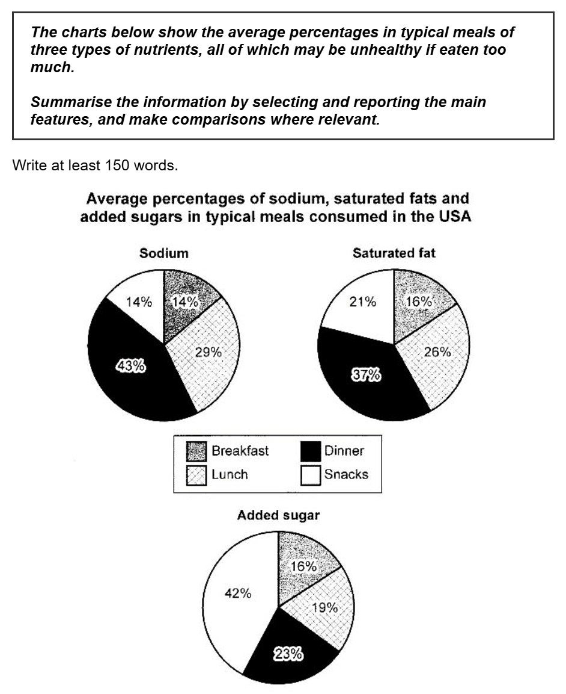

## 题目

    

按照这个模板，写一个简单的范文吧，告诉我写作思路，其中的好的句式和好词，最后做出总结。

## 范文

好的，没问题！很高兴看到你已经准备好开始实践了。使用模板来拆解和练习，是掌握雅思写作最高效的方法。

你提供的这份模板非常好，它精准地抓住了雅思小作文的得分精髓：**逻辑结构永远是第一位的**。

现在，我们就用你给的这张图表和这个“四段式”模板，一步一步地写一篇符合你要求的、简洁清晰的 7.5 分水平范文。

---

### **第一步：我的写作思路 (My Writing Process)**

在动笔之前，我的大脑会像这样快速运转 4 步，这大概需要 2 分钟：

1.  **审题 (Analyze the prompt):** 我会看懂图表。这是三张饼图，展示了美国人在四种餐（早、午、晚、零食）中，三种不健康营养素（钠、饱和脂肪、添加糖）的摄入百分比。

2.  **构思——引言 (Plan the Introduction):** 我要做的就是一件事：**改写题目**。用不同的词和句式，但意思不变。

    - `The charts show` -> `The pie charts illustrate`
    - `average percentages of...nutrients` -> `the proportion of...nutrients`
    - `typical meals` -> `four different meals`

3.  **构思——概述 (Plan the Overview):** 这是全文最关键的一步，我要找出**最宏观、最明显的 2 个特征**，绝对不提任何具体数字。

    - **特征一：** 我快速扫一眼三张图，发现“晚餐(Dinner)”在“钠”和“饱和脂肪”这两张图里都是最大的一块。
    - **特征二：** 我再看“添加糖”这张图，发现“零食(Snacks)”是最大的一块，这和前两个不一样。
    - 好了，这就是我的概述段的全部内容，简单直接。

4.  **构思——细节分组 (Plan the Body Paragraphs):** 现在我要把数据分组，让文章有逻辑。
    - **分组逻辑：** 我发现“钠”和“饱和脂肪”的规律很像（都是晚餐最多，午餐其次），所以可以把它们放在**细节段一**。
    - “添加糖”的规律很独特（零食最多），所以单独放在**细节段二**。
    - 这样分组，对比和逻辑就都非常清晰了。

思路规划完毕，现在可以动笔了！

---

### **第二步：范文示例 (Sample Essay)**

The provided pie charts illustrate the percentage of sodium, saturated fat, and added sugar consumed during four different meals (breakfast, lunch, dinner, and snacks) in the USA.

Overall, it is clear that dinner accounts for the largest proportion of sodium and saturated fat intake. In contrast, snacks are the primary source of added sugar for the average American.

Regarding sodium and saturated fat, their consumption patterns are quite similar. Dinner constitutes the main source of sodium at 43%, followed by lunch at 29%. Breakfast and snacks contribute equally, with 14% each. A similar pattern is seen in saturated fat intake, where dinner again makes up the highest percentage (37%), while lunch and snacks account for 26% and 21% respectively. Breakfast is the meal with the least saturated fat, at 16%.

Turning to added sugar, the distribution is noticeably different. Snacks are responsible for the vast majority of sugar intake, at 42%. This is significantly higher than any other meal. Dinner is the second-largest source, contributing 23%, whereas lunch and breakfast make up smaller portions, at 19% and 16% respectively.

_(Words: 184)_

---

### **第三步：亮点解析 (Analysis of Good Language)**

这篇范文没有用任何生僻词，但它通过**结构和句式的变化**拿分。

**1. 高分词汇和短语 (Good Vocabulary & Phrases):**

- `illustrate`: 比 `show` 更正式。
- `consumed`: “被消耗”，比 `eaten` 更书面化。
- `Overall, it is clear that...`: 概述段的黄金开头，清晰地告诉考官“总而言之”。
- `accounts for / makes up / constitutes`: 这三个词组都是“占据，构成”的意思，用来替换 `is`，展示了词汇的多样性。例如，`Dinner is 43%` 就不如 `Dinner constitutes 43%` 得分高。
- `intake / consumption`: “摄入量”，比 `amount` 更精确。
- `primary source`: “主要来源”，表达很地道。
- `Regarding... / Turning to...`: 这是开启细节段的经典方式，让段落之间的过渡非常自然。
- `A similar pattern is seen...`: 用于比较两个相似的数据趋势，是比较类图表的必备句型。
- `respectively`: “分别地”，在列举两个或以上数据时非常有用，能让句子更简洁。
- `noticeably different`: “明显不同”，用于引出对比。
- `the vast majority of`: “绝大部分”，比 `most of` 语气更强。

**2. 实用高分句式 (Useful Sentence Structures):**

- **概述段对比句:**
  `Overall, [特征一], **in contrast,** [特征二].`
  这个 `in contrast` (相比之下)用的非常巧妙，一句话就写出了两个核心发现，并且点明了它们之间的差异。

- **细节段比较句:**
  `A similar pattern is seen in... , **where** dinner again makes up the highest percentage...`
  使用 `where` 引导的定语从句来补充说明细节，而不是用一个简单的短句，这展示了更复杂的语法能力。

- **数据排序句:**
  `Dinner constitutes the main source..., **followed by** lunch at 29%.`
  用 `followed by` (其次是) 来连接第一名和第二名的数据，是描述数据顺序的绝佳方式，避免了句式的单调。

---

### **第四步：我的总结 (My Final Advice)**

你看，我们完全遵循了“四段式”的框架，使用了你 100%可以掌握的“乐高积木”，就构建出了一篇逻辑满分、语言精准且完全不复杂的范文。

请记住这个核心理念：**清晰的结构 + 准确的语言 > 华丽的辞藻 + 混乱的逻辑**。这篇 184 词的短文，因为它在“任务完成度(TA)”和“连贯与衔接(CC)”上表现出色，获得 7.5 分是完全现实的。

这次的讲解和练习你感觉怎么样？接下来，你是想学习其他类型的图表（比如线图、柱状图），还是想深入聊聊今天范文里的某个语法点呢？随时告诉我，我们继续！
