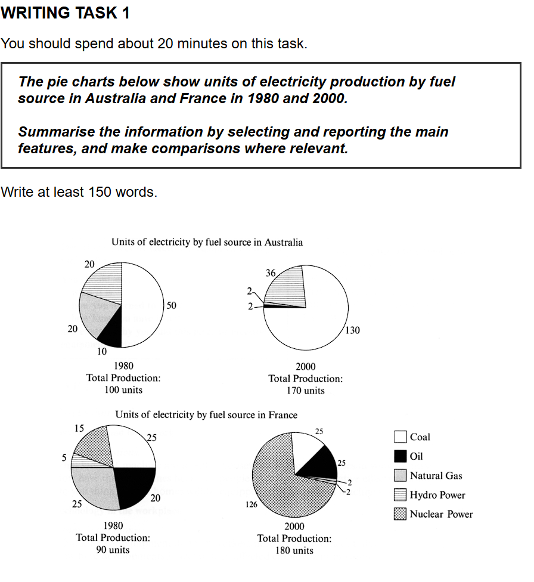

## 题目

## 原始作文

A comparison of units of electricity production by fuel source in Australia and France for two different years, 1980 and 2000, is presented in the provided pie charts.

Coal was the main source of Australia in both 1980 and 2000, instead of the major source nuclear power in France. In 1980, each source was roughly evenly distributed, and only hydro power had a small proportion.

In Australia, the percentage of coal increased a lot in 2000 where coal taken up about 75% of all electricity production. Electricity produced by oil and natural gas dramatically declined to only 2 units. The percentage of hydro power increased a little on 16%, from 20 units in 1980 to 36% units in 2000.

In France, the percentage of nuclear rocketed from 5 units in 1980 to 126 units that the rank inversed from last one to number one. Electricity produced by oil and coal levelled off that kept almost 15%. The proportions of hydro power and natural gas both shrank to only 2 units. 

## 评语

### **第一部分：分项评分与解析 (Sectional Scoring & Analysis)**

1.  **任务回应 (Task Response - TR)**
    * **预估分数: 5.0**
    * **评分理由**: 文章成功地描述了图表的主题，并尝试对两个国家和两个年份进行了比较。主要问题在于对数据的解读和呈现存在多处严重错误。例如，混淆了“单位(units)”和“百分比(percentage)”，错误地引用了数据（法国1980年核能是15个单位，而非5个），并且对趋势的描述不准确（例如，法国的煤炭和石油产量占比实际是大幅下降，而非“levelled off”）。此外，文章缺少一个清晰的结尾段来总结最重要的特征。

2.  **连贯与衔接 (Coherence and Cohesion - CC)**
    * **预估分数: 5.5**
    * **评分理由**: 文章的整体结构是清晰的：引言、对主要特征的初步描述、澳大利亚段落、法国段落。段落划分基本合理。但是，句子之间的衔接有时略显生硬或不合逻辑，例如 "levelled off that kept almost 15%" 这样的句子结构使得逻辑关系不清晰。信息的分组（按国家分）是合理的。

3.  **词汇资源 (Lexical Resource - LR)**
    * **预估分数: 5.5**
    * **评分理由**: 词汇使用上有不错的尝试，例如 "dramatically declined", "rocketed", "shrank"，这些都是描述变化的有效词汇。然而，也存在一些用词不当或搭配错误的情况，如 "inversed" (应为 reversed), "taken up" (应为 took up 或 making up), 以及对 "levelled off" 的错误使用。词汇的多样性有限。

4.  **语法广度与准确性 (Grammatical Range and Accuracy - GRA)**
    * **预估分数: 5.0**
    * **评分理由**: 句子结构以简单句为主，缺少复杂句式（如从句、分词结构）的有效运用。语法错误较为频繁，影响了内容的清晰表达。例如，“main source of Australia” (应为 in Australia)，时态错误 "coal taken up"，以及多个句子中关系代词 'that' 的错误使用。

---

### **第二部分：写作思路与结构梳理 (Essay Structure & Logic Analysis)**

1.  **整体逻辑框架**: 你采用了“引言 + 概述 + 国别分析”的结构，这在逻辑上是可行的。先介绍图表，然后分别深入两个国家的情况。但问题在于，第二段的“概述”部分写得更像是一些零散的观察，而不是一个高度概括性的总结。同时，文章缺少了结尾段，无法给读者一个完整的印象。

2.  **引言 (Introduction)**: 引言部分做得很好。你成功地用自己的话转述了题目的要求，清晰地说明了图表的内容、涉及的国家和年份。

3.  **主体段落分析 (Body Paragraphs)**:
    * **第二段 (Overview)**: 这一段的意图是好的，点出了澳大利亚以煤炭为主和法国以核能为主的核心对比。这是一个关键的“main feature”。但后面关于1980年“roughly evenly distributed”的描述不够精确，且指代不明，容易让读者混淆是哪个国家。
    * **第三段 (Australia)**: 这一段的中心思想是描述澳大利亚能源结构在20年间的变化。你正确地指出了煤炭的主导地位及其增长，以及石油和天然气的下降。但对水力发电的描述出现了严重的数据解读错误，将单位和百分比混为一谈，导致信息完全失真。
    * **第四段 (France)**: 这一段聚焦于法国的变化。你抓住了核能“rocketed”（飞速增长）这一最显著的特点，但数据引用有误（15 units not 5）。对煤炭和石油的描述“levelled off”（保持平稳）是完全错误的，因为它们的产量单位变化不大，但总产量翻倍，所以其占比是急剧下降的。这个逻辑错误严重影响了本段的质量。

4.  **结论 (Conclusion)**: **缺失**。一篇完整的Task 1作文需要一个结论段来总结最重要的趋势和特征。例如，可以重申澳大利亚对煤炭的依赖加深，而法国则成功转型为以核能为主导，同时两国的总发电量都有显著增长。

---

### **第三部分：逐句分析与优化 (Sentence-by-Sentence Breakdown)**

| 原句 (Original Sentence) | 修改后 (Revised Sentence) | 分析与建议 (Analysis & Suggestions) |
| :--- | :--- | :--- |
| A comparison of units of electricity production by fuel source in Australia and France for two different years, 1980 and 2000, is presented in the provided pie charts. | The provided pie charts illustrate the units of electricity generated from various fuel sources in Australia and France in 1980 and 2000. | **分析与建议**: 原句语法正确，但略显冗长。修改后的句子更简洁、更主动。"illustrate" 是图表题的常用高分动词。"generated from" 比 "production by" 更地道。 |
| Coal was the main source of Australia in both 1980 and 2000, instead of the major source nuclear power in France. | Overall, coal was the predominant source of electricity in Australia across both years, whereas France relied heavily on nuclear power by the year 2000. | **分析与建议**: 1. 建议用 "Overall" 开始概述段，明确其功能。2. "of Australia" -> "in Australia"。3. "instead of" 用在此处对比两个独立事实，显得生硬。用 "whereas" (然而) 能更好地进行对比。4. 原句只说了法国的核能是主要来源，但没有点出这是2000年的情况，修改后更清晰。 |
| In 1980, each source was roughly evenly distributed, and only hydro power had a small proportion. | In France in 1980, the proportions of coal, oil, natural gas, and nuclear power were relatively balanced, while hydro power constituted the smallest share. | **分析与建议**: 原句的 "each source" 指代不清，让读者不知道说的是哪个国家。修改后明确了是 "In France in 1980"。用 "proportions" 和 "constituted the smallest share" 更具学术性和书面化。 |
| In Australia, the percentage of coal increased a lot in 2000 where coal taken up about 75% of all electricity production. | Regarding Australia, the amount of electricity from coal surged from 50 to 130 units, making up approximately 76% of the total production in 2000. | **分析与建议**: 1. "taken up" -> "took up" 或 "making up"。2. "increased a lot" 不如 "surged" (激增) 生动。3. 将绝对数字（50 to 130 units）和百分比结合起来，能提供更全面的信息。130/170 ≈ 76.5%，所以76%更精确。 |
| Electricity produced by oil and natural gas dramatically declined to only 2 units. | Concurrently, the outputs from both oil and natural gas saw a dramatic decline, falling to just 2 units each. | **分析与建议**: 原句正确，但可以优化。 "Concurrently" (同时地) 增强了句子间的联系。"Outputs" 是 "production" 的一个很好的同义替换。 |
| The percentage of hydro power increased a little on 16%, from 20 units in 1980 to 36% units in 2000. | Meanwhile, electricity from hydro power rose from 20 to 36 units, although its share of the total remained relatively stable at around 21%. | **分析与建议**: **这是最严重的错误之一**。你混淆了单位和百分比。产量从20单位增加到36单位，这是绝对值的增加。但占比是从 20/100=20% 变为 36/170≈21%，只是略微增加。原句的 "increased a little on 16%" 和 "36% units" 都是错误的表达。 |
| In France, the percentage of nuclear rocketed from 5 units in 1980 to 126 units that the rank inversed from last one to number one. | Turning to France, the most significant change was the rocketing use of nuclear power, which soared from 15 units in 1980 to 126 units in 2000, becoming the primary source. | **分析与建议**: 1. **数据错误**: 核能是15个单位，不是5个。2. "rocketed" 是好词，但句子结构有问题。"that the rank inversed" 是中式英语的表达。修改后使用了 'which' 引导的非限定性定语从句，句式更高级，逻辑也更清晰。 |
| Electricity produced by oil and coal levelled off that kept almost 15%. | In stark contrast, the proportions of electricity generated by oil and coal plummeted, despite their production figures in units remaining relatively constant. | **分析与建议**: **这是另一个严重的逻辑错误**。"levelled off" (保持平稳) 是错误的。虽然产量单位(units)变化不大（煤炭25->25, 石油20->25），但总产量翻倍了，所以它们的**占比 (proportion)** 大幅下降了。修改后的句子准确地描述了这一反差。 |
| The proportions of hydro power and natural gas both shrank to only 2 units. | Similarly, the contributions of hydro power and natural gas diminished significantly, each dropping to only 2 units. | **分析与建议**: 原句的 "shrank to only 2 units" 有点问题，因为 "proportions" (比例) 应该对应一个百分比，而 "units" 是绝对值。修改后用 "contributions" (贡献量) 来指代发电量，用 "diminished" (减少) 来描述变化，更加准确。 |

---

### **第四部分：总评与知识点总结 (Overall Feedback & Key Takeaways)**

**总体评价 (Overall Comments)**:
你的作文结构清晰，并尝试使用了一些不错的描述变化的词汇，这是一个很好的起点。然而，这篇作文最大的问题在于对数据的解读和呈现上出现了多处、且较为严重的失误，这直接影响了Task Response（任务回应）的得分。此外，语法准确性和句子结构的多样性也有待提高。最关键的是，你需要确保你所写下的每一个数据和趋势都与图表完全一致。

**预估总分 (Estimated Overall Band Score): 5.0**

**核心知识点总结 (Key Learning Points)**:

* **1. 精准区分“单位”与“占比”**: 这是Task 1的生命线。**Units** (单位) 是绝对数值，而 **Percentage/Proportion/Share** (百分比/比例/份额) 是相对值。在描述时一定要分清。例如，可以说 "Production from coal increased from 50 to 130 units"，或者 "The proportion of coal grew from 50% to 76%"。切勿将两者混淆。

* **2. 务必准确引用数据**: 在动笔前，花30秒仔细核对图表上的每一个数字。比如本文中将法国核能的15个单位误读为5个，这是一个本可以避免的失分点。准确性是第一位的。

* **3. 完整文章结构：别忘记结论**: Task 1 需要一个总结段 (Conclusion) 或在引言后的概述段 (Overview) 来概括最重要的信息。你的第二段有这个意图，但不够清晰，并且文章缺少了结尾。一个好的结尾能极大地提升文章的完整性。

* **4. 学习使用高级句式进行对比和连接**: 避免过多使用 "and", "but", "so"。可以多练习使用 "whereas", "while" 来进行直接对比；使用 "which" 引导的定语从句来补充信息；使用 "making up...", "accounting for..." 这样的分词结构来连接数据，这会让你的句子更连贯、更地道。

## 修改后的全文

The provided pie charts illustrate the units of electricity generated from various fuel sources in Australia and France in 1980 and 2000.

Overall, coal was the predominant source of electricity in Australia across both years, whereas France relied heavily on nuclear power by the year 2000. In France in 1980, the proportions of coal, oil, natural gas, and nuclear power were relatively balanced, while hydro power constituted the smallest share.

Regarding Australia, the amount of electricity from coal surged from 50 to 130 units, making up approximately 76% of the total production in 2000. Concurrently, the outputs from both oil and natural gas saw a dramatic decline, falling to just 2 units each. Meanwhile, electricity from hydro power rose from 20 to 36 units, although its share of the total remained relatively stable at around 21%.

Turning to France, the most significant change was the rocketing use of nuclear power, which soared from 15 units in 1980 to 126 units in 2000, becoming the primary source. In stark contrast, the proportions of electricity generated by oil and coal plummeted, despite their production figures in units remaining relatively constant. Similarly, the contributions of hydro power and natural gas diminished significantly, each dropping to only 2 units.